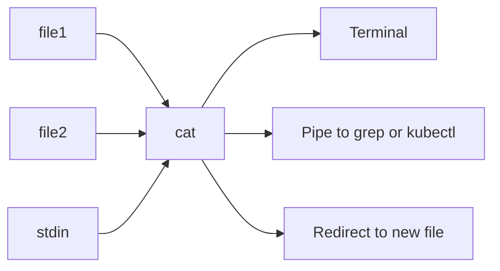

# cat

## What is it?
`cat` (concatenate) reads files and prints their content to standard output. It is used to view small files, join several files together and create files from the terminal.

## Syntax
```bash
cat [OPTIONS] [FILE]...
```

## Visual Overview
> `cat` reads one or more files in order and writes them to stdout, which you can show on screen, pipe to another command or redirect into a file.



## Options/Flags
| Flag | Description |
|------|-------------|
| `-n` | Number all output lines |
| `-b` | Number only non-empty lines |
| `-s` | Squeeze repeated empty lines into one |
| `-E` | Show `$` at the end of each line |
| `-A` | Show all hidden characters (tabs as `^I`, line ends as `$`) |

## Usage Examples

Let's say we have this file `app.log`:

**Input file** (`app.log`):
```text
2026-10-06 10:00:01 INFO Service started
2026-10-06 10:00:05 WARN Disk usage at 82%
2026-10-06 10:00:09 ERROR Connection refused
```

Let's say we have this file `config.txt` (two empty lines between the entries):

**Input file** (`config.txt`):
```text
host=web01


port=8080
```

Let's say we have this file `tabbed.txt` (a TAB character between `name:` and `web01`):

**Input file** (`tabbed.txt`):
```text
name:	web01
```

### Example 1: Display a file
**Command:**
```bash
cat app.log
```
**Sample Output:**
```text
2026-10-06 10:00:01 INFO Service started
2026-10-06 10:00:05 WARN Disk usage at 82%
2026-10-06 10:00:09 ERROR Connection refused
```

### Example 2: Join multiple files
**Command:**
```bash
cat app.log tabbed.txt
```
**Sample Output:**
```text
2026-10-06 10:00:01 INFO Service started
2026-10-06 10:00:05 WARN Disk usage at 82%
2026-10-06 10:00:09 ERROR Connection refused
name:	web01
```

### Example 3: Number all lines (`-n`)
**Command:**
```bash
cat -n config.txt
```
**Sample Output:**
```text
     1	host=web01
     2	
     3	
     4	port=8080
```

### Example 4: Number only non-empty lines (`-b`)
**Command:**
```bash
cat -b config.txt
```
**Sample Output:**
```text
     1	host=web01


     2	port=8080
```

### Example 5: Squeeze empty lines (`-s`)
**Command:**
```bash
cat -s config.txt
```
**Sample Output:**
```text
host=web01

port=8080
```

### Example 6: Mark line ends (`-E`)
**Command:**
```bash
cat -E config.txt
```
**Sample Output:**
```text
host=web01$
$
$
port=8080$
```

### Example 7: Show all hidden characters (`-A`)
**Command:**
```bash
cat -A tabbed.txt
```
**Sample Output:**
```text
name:^Iweb01$
```

### Example 8: Create a file from the terminal
**Command:**
```bash
cat > notes.txt << 'EOF'
deploy at 18:00
EOF
cat notes.txt
```
**Sample Output:**
```text
deploy at 18:00
```

## Pitfalls / Gotchas
- `cat > file` overwrites the file without asking. Use `>>` to append.
- Never `cat` a huge or binary file in the terminal. Use `less`, `head` or `tail`.
- `cat file | grep x` is a "useless use of cat". Prefer `grep x file`.
- Redirecting a file into itself (`cat a.txt > a.txt`) empties the file.

## DevOps Use Cases

### Use Case 1: Review a Kubernetes manifest before applying it
**Situation:** You want to check the manifest before running `kubectl apply`.

**Input file** (`deployment.yaml`):
```yaml
apiVersion: apps/v1
kind: Deployment
metadata:
  name: web
spec:
  replicas: 2
```
**Command:**
```bash
cat deployment.yaml
```
**Output:**
```text
apiVersion: apps/v1
kind: Deployment
metadata:
  name: web
spec:
  replicas: 2
```

### Use Case 2: Apply a manifest by piping it to kubectl
**Situation:** Feed a file to `kubectl` through stdin in a pipeline.

**Input file** (`deployment.yaml`): same file as in Use Case 1.

**Command:**
```bash
cat deployment.yaml | kubectl apply -f -
```
**Output:**
```text
deployment.apps/web created
```

### Use Case 3: Generate a config file in a CI job
**Situation:** A pipeline step writes an nginx config using an environment variable. Let's say `APP_PORT=8080` is set.

**Command:**
```bash
cat > nginx.conf << EOF
server {
    listen ${APP_PORT};
}
EOF
cat nginx.conf
```
**Output:**
```text
server {
    listen 8080;
}
```

### Use Case 4: Search across rotated logs
**Situation:** Find errors in the current and the rotated log together.

**Input file** (`app.log.1`):
```text
2026-10-05 23:59:58 ERROR Timeout calling payment-api
```
**Input file** (`app.log`):
```text
2026-10-06 10:00:09 ERROR Connection refused
2026-10-06 10:00:12 INFO Retry succeeded
```
**Command:**
```bash
cat app.log.1 app.log | grep ERROR
```
**Output:**
```text
2026-10-05 23:59:58 ERROR Timeout calling payment-api
2026-10-06 10:00:09 ERROR Connection refused
```

### Use Case 5: Read a secret from a mounted file
**Situation:** Kubernetes and Docker mount secrets as files. Read one into a variable without printing it.

**Input file** (`/run/secrets/api_token`):
```text
abc123xyz
```
**Command:**
```bash
TOKEN=$(cat /run/secrets/api_token)
echo "Token length: ${#TOKEN}"
```
**Output:**
```text
Token length: 9
```

### Use Case 6: Merge environment files
**Situation:** Combine a base `.env` with production overrides. Later values win in most loaders.

**Input file** (`base.env`):
```text
LOG_LEVEL=info
DB_HOST=localhost
```
**Input file** (`prod.env`):
```text
DB_HOST=db.prod.internal
```
**Command:**
```bash
cat base.env prod.env > .env
cat .env
```
**Output:**
```text
LOG_LEVEL=info
DB_HOST=localhost
DB_HOST=db.prod.internal
```

### Use Case 7: Identify the OS inside a container
**Situation:** You exec into an unknown container and need to know the distro.

**Command:**
```bash
cat /etc/os-release | head -3
```
**Output:**
```text
PRETTY_NAME="Ubuntu 22.04.4 LTS"
NAME="Ubuntu"
VERSION_ID="22.04"
```

### Use Case 8: Find Windows line endings that break a script
**Situation:** `./deploy.sh` fails with `bad interpreter: /bin/bash^M`. Check for CRLF.

**Input file** (`deploy.sh`, saved with Windows line endings):
```text
#!/bin/bash
echo "deploying"
```
**Command:**
```bash
cat -A deploy.sh
```
**Output:**
```text
#!/bin/bash^M$
echo "deploying"^M$
```

## Related Commands
- [`touch`](touch.md) - create an empty file
- [`cp`](cp.md) - copy files
- `less` - page through a long file
- `head` / `tail` - show the start or end of a file
- `grep` - search text
