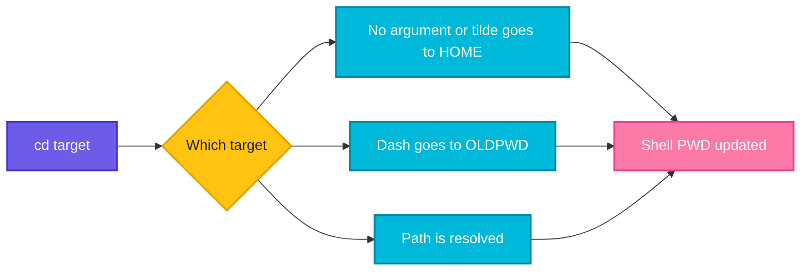

# cd

## What is it?
`cd` (change directory) moves your shell into another directory. It is a shell built-in, not a separate program.

## Syntax
```bash
cd [DIRECTORY]
cd -
cd ~
cd ..
```

## Visual Overview
> `cd` resolves the target path and updates the shell's current directory (`PWD`) and the previous directory (`OLDPWD`).



## Options/Flags
| Argument / Flag | Description |
|-----------------|-------------|
| `DIRECTORY` | Absolute or relative path to move into |
| `..` | Go up one level to the parent directory |
| `~` or no argument | Go to your home directory |
| `-` | Go back to the previous directory |
| `-P` | Resolve symbolic links to the physical path |

## Usage Examples

Let's say we have this directory layout:

**Input file** (directory tree):
```text
/home/devops/
├── project/
│   └── logs/
└── releases -> /opt/releases/v2   (symbolic link)
```

### Example 1: Move into a directory
**Command:**
```bash
cd /home/devops/project
pwd
```
**Sample Output:**
```text
/home/devops/project
```

### Example 2: Relative path
**Command:**
```bash
cd logs
pwd
```
**Sample Output:**
```text
/home/devops/project/logs
```

### Example 3: Go up one level (`..`)
**Command:**
```bash
cd ..
pwd
```
**Sample Output:**
```text
/home/devops/project
```

### Example 4: Go home (`~`)
**Command:**
```bash
cd ~
pwd
```
**Sample Output:**
```text
/home/devops
```

### Example 5: Go back to the previous directory (`-`)
**Command:**
```bash
cd project
cd -
```
**Sample Output:**
```text
/home/devops
```

### Example 6: Resolve symlinks (`-P`)
**Command:**
```bash
cd -P /home/devops/releases
pwd
```
**Sample Output:**
```text
/opt/releases/v2
```

## Pitfalls / Gotchas
- `cd` is a shell built-in, so it cannot change the directory of the parent shell from a script. A script that runs `cd` only changes its own working directory.
- Paths with spaces need quotes: `cd "My Folder"`.
- `cd -` prints the directory it moves to.
- A failed `cd` in a script keeps running the next lines in the wrong directory. Use `cd /path || exit 1`.

## Related Commands
- [`pwd`](pwd.md) - print the current directory
- [`ls`](ls.md) - list directory contents
- `pushd` / `popd` - directory stack
