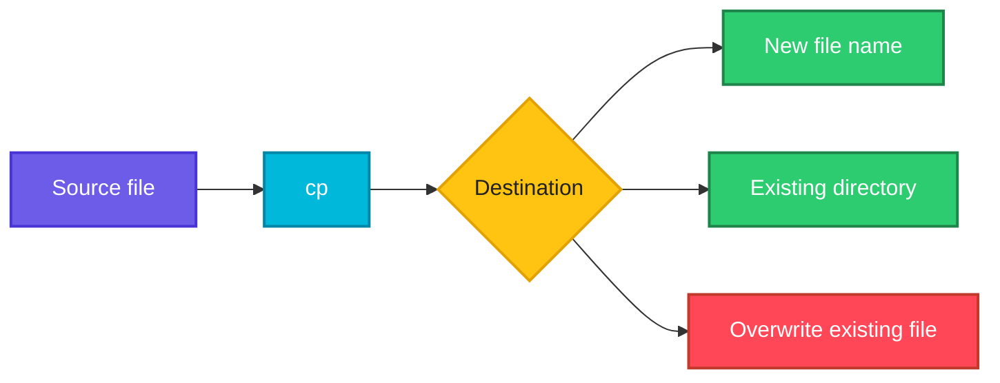

# cp

## What is it?
`cp` (copy) copies files and directories from one place to another, leaving the original untouched.

## Syntax
```bash
cp [OPTIONS] SOURCE DEST
cp [OPTIONS] SOURCE... DIRECTORY
```

## Visual Overview
> `cp` reads the source and writes a new file at the destination. The source stays as it is.



## Options/Flags
| Flag | Description |
|------|-------------|
| `-r` | Copy directories recursively |
| `-i` | Ask before overwriting |
| `-n` | Never overwrite an existing file |
| `-v` | Verbose, show each copy |
| `-u` | Copy only when the source is newer than the destination |
| `-p` | Preserve mode, ownership and timestamps |
| `-a` | Archive: recursive and preserve everything (same as `-dR --preserve=all`) |
| `-b` | Make a backup of each existing destination file |

## Usage Examples

Let's say we have this file `app.conf`:

**Input file** (`app.conf`):
```text
port=8080
mode=prod
```

Let's say we also have a directory `configs/` that holds one file, `db.conf`:

**Input file** (`configs/db.conf`):
```text
host=db01
```

### Example 1: Copy a file
**Command:**
```bash
cp app.conf app.conf.bak
cat app.conf.bak
```
**Sample Output:**
```text
port=8080
mode=prod
```

### Example 2: Copy into a directory
**Command:**
```bash
mkdir backup
cp app.conf backup/
ls backup
```
**Sample Output:**
```text
app.conf
```

### Example 3: Copy a directory (`-r`)
**Command:**
```bash
cp -r configs configs-copy
ls configs-copy
```
**Sample Output:**
```text
db.conf
```

### Example 4: Ask before overwrite (`-i`)
**Command:**
```bash
cp -i app.conf backup/app.conf
```
**Sample Output:**
```text
cp: overwrite 'backup/app.conf'? n
```

### Example 5: Never overwrite (`-n`)
**Command:**
```bash
cp -n app.conf backup/app.conf
echo "done"
```
**Sample Output:**
```text
done
```
(The existing `backup/app.conf` is not changed and no error is printed.)

### Example 6: Verbose (`-v`)
**Command:**
```bash
cp -v app.conf /tmp/app.conf
```
**Sample Output:**
```text
'app.conf' -> '/tmp/app.conf'
```

### Example 7: Copy only newer files (`-u`)
Let's say `backup/app.conf` is already as new as `app.conf`.

**Command:**
```bash
cp -uv app.conf backup/
```
**Sample Output:**
```text
```
(Nothing is printed, because nothing needed to be copied.)

### Example 8: Preserve attributes (`-p`)
Let's say `app.conf` is owned by `devops` and was modified on Oct 1 09:00.

**Command:**
```bash
cp -p app.conf keep.conf
ls -l app.conf keep.conf
```
**Sample Output:**
```text
-rw-r--r-- 1 devops devops 20 Oct  1 09:00 app.conf
-rw-r--r-- 1 devops devops 20 Oct  1 09:00 keep.conf
```

### Example 9: Archive copy (`-a`)
**Command:**
```bash
cp -a configs configs-archive
ls -l configs-archive
```
**Sample Output:**
```text
total 4
-rw-r--r-- 1 devops devops 10 Oct  2 14:30 db.conf
```

### Example 10: Backup the existing destination (`-b`)
**Command:**
```bash
cp -b app.conf backup/app.conf
ls backup
```
**Sample Output:**
```text
app.conf  app.conf~
```

## Pitfalls / Gotchas
- `cp` overwrites the destination silently unless you use `-i` or `-n`.
- Copying a directory without `-r` fails: `cp: -r not specified; omitting directory 'configs'`.
- Without `-p` or `-a`, the copy gets a new timestamp and your ownership.
- `cp -r dir/ dest` and `cp -r dir dest` behave the same in GNU `cp`, but `rsync` treats a trailing slash differently.
- For big or remote copies prefer `rsync`, which can resume and skip unchanged files.

## DevOps Use Cases

### Use Case 1: Back up a config before changing it
**Situation:** Before editing `nginx.conf`, keep a dated copy so you can roll back.

**Input file** (`nginx.conf`):
```text
worker_processes 2;
```
**Command:**
```bash
cp -p nginx.conf nginx.conf.2026-10-06
ls nginx.conf*
```
**Output:**
```text
nginx.conf  nginx.conf.2026-10-06
```

### Use Case 2: Deploy a build artifact into a release directory
**Situation:** A CI job copies the built jar into the release folder.

**Input file** (`target/app.jar`):
```text
(binary file, 4.2 MB)
```
**Command:**
```bash
cp -v target/app.jar /opt/releases/v2/app.jar
```
**Output:**
```text
'target/app.jar' -> '/opt/releases/v2/app.jar'
```

### Use Case 3: Snapshot a whole directory tree with permissions
**Situation:** Archive `/etc/myapp` before an upgrade, keeping owners and modes.

**Command:**
```bash
sudo cp -a /etc/myapp /backup/myapp-pre-upgrade
ls -l /backup
```
**Output:**
```text
total 4
drwxr-xr-x 2 root root 4096 Oct  6 09:00 myapp-pre-upgrade
```

### Use Case 4: Copy a file into a running container
**Situation:** Push a config file into a Docker container (the `docker cp` command follows `cp` syntax).

**Input file** (`app.conf`):
```text
port=8080
mode=prod
```
**Command:**
```bash
docker cp app.conf web:/etc/app/app.conf
docker exec web cat /etc/app/app.conf
```
**Output:**
```text
Successfully copied 2.05kB to web:/etc/app/app.conf
port=8080
mode=prod
```

### Use Case 5: Copy kubeconfig from a remote node
**Situation:** Pull a cluster config to your workstation using `scp`, which has the same source/destination idea as `cp`.

**Command:**
```bash
scp admin@master01:/etc/kubernetes/admin.conf ~/.kube/config
```
**Output:**
```text
admin.conf                                    100% 5636     1.2MB/s   00:00
```

### Use Case 6: Create a config from a template without overwriting
**Situation:** An installer script should create `app.conf` from a template only on the first run, so user edits survive reruns.

**Input file** (`app.conf.template`):
```text
port=8080
```
**Command:**
```bash
cp -n app.conf.template app.conf
cat app.conf
```
**Output:**
```text
port=8080
```

### Use Case 7: Copy only changed files into a deploy folder
**Situation:** Re-deploy static files and copy only those updated since the last run.

**Command:**
```bash
cp -ruv site/ /var/www/html/
```
**Output:**
```text
'site/index.html' -> '/var/www/html/site/index.html'
```

### Use Case 8: Keep a rollback copy while deploying a new binary
**Situation:** Overwrite the running binary but keep the previous version as `myapp~`.

**Command:**
```bash
cp -b myapp-new /usr/local/bin/myapp
ls /usr/local/bin | grep myapp
```
**Output:**
```text
myapp
myapp~
```

## Related Commands
- [`mv`](mv.md) - move or rename files
- [`rm`](rm.md) - delete files
- `rsync` - efficient copy and sync, local or remote
- `scp` - copy files over SSH
- `dd` - low-level block copy
