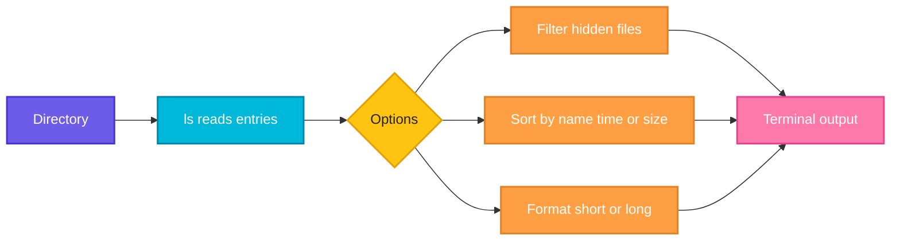

# ls

## What is it?
`ls` lists the files and directories inside a directory. It is the first command you use to see what is in a folder, check permissions, sizes and modification times.

## Syntax
```bash
ls [OPTIONS] [FILE or DIRECTORY]...
```

## Visual Overview
> `ls` reads a directory, applies the options you pass, sorts the entries and prints them.



## Options/Flags
| Flag | Description |
|------|-------------|
| `-l` | Long format: permissions, owner, size, modification time |
| `-a` | Show all entries including hidden files (names starting with `.`) |
| `-h` | Human readable sizes (use with `-l`) |
| `-t` | Sort by modification time, newest first |
| `-r` | Reverse the sort order |
| `-S` | Sort by file size, largest first |
| `-R` | List sub-directories recursively |
| `-d` | List the directory itself, not its contents |
| `-1` | One entry per line |

## Usage Examples

Let's say we have a directory `project/` with this content (name, size, last modified):

**Input file** (`project/` directory):
```text
.env          24 bytes     Oct  3 12:00   (hidden file)
app.py        2048 bytes   Oct  6 09:15
logs/         4096 bytes   Oct  6 11:40   (directory, contains app.log)
notes.txt     12 bytes     Oct  5 18:20
readme.md     1536 bytes   Oct  1 08:00
```

All examples below are run from inside `project/`, and the output assumes an `en_US.UTF-8` locale (case-insensitive sorting).

### Example 1: Basic listing
**Command:**
```bash
ls
```
**Sample Output:**
```text
app.py  logs  notes.txt  readme.md
```

### Example 2: Long format (`-l`)
**Command:**
```bash
ls -l
```
**Sample Output:**
```text
total 16
-rw-r--r-- 1 devops devops 2048 Oct  6 09:15 app.py
drwxr-xr-x 2 devops devops 4096 Oct  6 11:40 logs
-rw-r--r-- 1 devops devops   12 Oct  5 18:20 notes.txt
-rw-r--r-- 1 devops devops 1536 Oct  1 08:00 readme.md
```

### Example 3: Show hidden files (`-a`)
**Command:**
```bash
ls -a
```
**Sample Output:**
```text
.  ..  .env  app.py  logs  notes.txt  readme.md
```

### Example 4: Human readable sizes (`-h`)
**Command:**
```bash
ls -lh
```
**Sample Output:**
```text
total 16K
-rw-r--r-- 1 devops devops 2.0K Oct  6 09:15 app.py
drwxr-xr-x 2 devops devops 4.0K Oct  6 11:40 logs
-rw-r--r-- 1 devops devops   12 Oct  5 18:20 notes.txt
-rw-r--r-- 1 devops devops 1.5K Oct  1 08:00 readme.md
```

### Example 5: Newest first (`-t`)
**Command:**
```bash
ls -t
```
**Sample Output:**
```text
logs  app.py  notes.txt  readme.md
```

### Example 6: Reverse order (`-r`)
**Command:**
```bash
ls -rt
```
**Sample Output:**
```text
readme.md  notes.txt  app.py  logs
```

### Example 7: Largest first (`-S`)
**Command:**
```bash
ls -S
```
**Sample Output:**
```text
logs  app.py  readme.md  notes.txt
```

### Example 8: Recursive (`-R`)
Inside `logs/` there is one file, `app.log`.

**Command:**
```bash
ls -R
```
**Sample Output:**
```text
.:
app.py  logs  notes.txt  readme.md

./logs:
app.log
```

### Example 9: Directory itself (`-d`)
**Command:**
```bash
ls -ld logs
```
**Sample Output:**
```text
drwxr-xr-x 2 devops devops 4096 Oct  6 11:40 logs
```

### Example 10: One per line (`-1`)
**Command:**
```bash
ls -1
```
**Sample Output:**
```text
app.py
logs
notes.txt
readme.md
```

## Pitfalls / Gotchas
- Hidden files (starting with `.`) are not shown unless you use `-a`.
- `ls -l` on a directory name lists its contents; use `-d` to see the directory itself.
- Sorting depends on the locale. In the `C` locale uppercase names sort before lowercase names.
- Do not parse `ls` output in scripts, because file names with spaces or newlines break it. Use globs or `find` instead.
- Many distros alias `ls` to `ls --color=auto`. Colors disappear when output is piped.

## Related Commands
- [`cd`](cd.md) - change directory
- [`pwd`](pwd.md) - print the current directory
- [`mkdir`](mkdir.md) - create directories
- `find` - search files with conditions
- `tree` - show a directory as a tree
