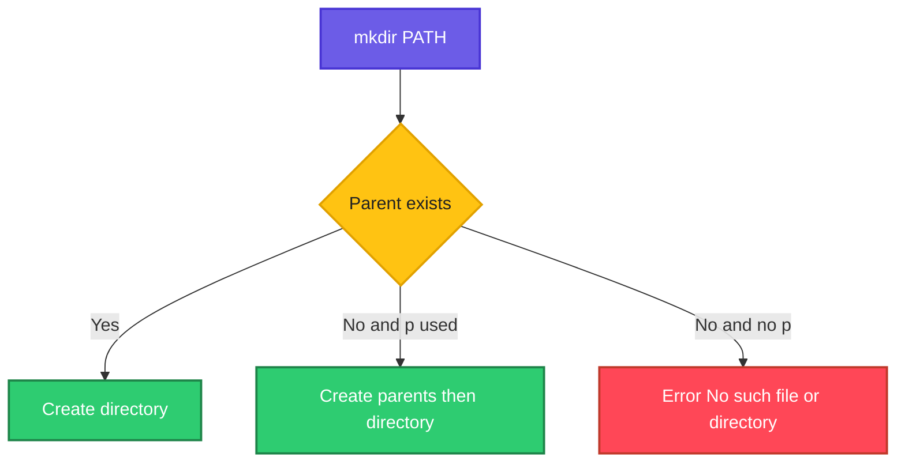

# mkdir

## What is it?
`mkdir` (make directory) creates one or more new directories.

## Syntax
```bash
mkdir [OPTIONS] DIRECTORY...
```

## Visual Overview
> `mkdir` creates the directory if the parent exists. With `-p` it also creates every missing parent.



## Options/Flags
| Flag | Description |
|------|-------------|
| `-p` | Create parent directories as needed; no error if the directory already exists |
| `-v` | Print a message for each created directory |
| `-m MODE` | Set permissions (like `chmod`) on the new directory |

## Usage Examples

Let's say we are in an empty directory `/home/devops/work`:

**Input file** (`/home/devops/work`):
```text
(empty directory)
```

### Example 1: Create a directory
**Command:**
```bash
mkdir backups
ls
```
**Sample Output:**
```text
backups
```

### Example 2: Create several directories
**Command:**
```bash
mkdir dev staging prod
ls
```
**Sample Output:**
```text
backups  dev  prod  staging
```

### Example 3: Create nested directories (`-p`)
**Command:**
```bash
mkdir -p app/config/env
ls -R app
```
**Sample Output:**
```text
app:
config

app/config:
env

app/config/env:
```

### Example 4: Show what is created (`-v`)
**Command:**
```bash
mkdir -v logs
```
**Sample Output:**
```text
mkdir: created directory 'logs'
```

### Example 5: Set permissions (`-m`)
**Command:**
```bash
mkdir -m 700 private
ls -ld private
```
**Sample Output:**
```text
drwx------ 2 devops devops 4096 Oct  6 10:00 private
```

### Example 6: Error without `-p`
**Command:**
```bash
mkdir x/y/z
```
**Sample Output:**
```text
mkdir: cannot create directory 'x/y/z': No such file or directory
```

## Pitfalls / Gotchas
- Without `-p`, `mkdir` fails if the parent is missing or the directory already exists.
- `-p` hides errors for existing directories, which is useful in scripts because it makes them re-runnable.
- Quote names with spaces: `mkdir "my folder"`.
- Use brace expansion for many folders: `mkdir -p project/{src,test,docs}`.

## Related Commands
- [`rmdir`](rmdir.md) - remove empty directories
- [`rm`](rm.md) - remove files and directories
- [`touch`](touch.md) - create files
- [`ls`](ls.md) - list directories
