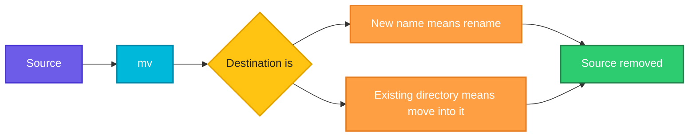

# mv

## What is it?
`mv` (move) moves files and directories to a new location, or renames them. Within the same filesystem it is instant because only the directory entry changes.

## Syntax
```bash
mv [OPTIONS] SOURCE DEST
mv [OPTIONS] SOURCE... DIRECTORY
```

## Visual Overview
> `mv` either renames the entry in place or moves it into another directory. The source no longer exists afterwards.



## Options/Flags
| Flag | Description |
|------|-------------|
| `-i` | Ask before overwriting |
| `-n` | Never overwrite an existing file |
| `-v` | Verbose, show each move |
| `-u` | Move only when the source is newer than the destination |
| `-b` | Make a backup of each existing destination file |
| `-t DIR` | Move all sources into the target directory `DIR` |

## Usage Examples

Let's say we have this file `report.txt`:

**Input file** (`report.txt`):
```text
Q3 report draft
```

Let's say we also have a file `old.txt` and an empty directory `archive/`:

**Input file** (`old.txt`):
```text
old data
```

### Example 1: Rename a file
**Command:**
```bash
mv report.txt report-final.txt
ls
```
**Sample Output:**
```text
archive  old.txt  report-final.txt
```

### Example 2: Move a file into a directory
**Command:**
```bash
mv old.txt archive/
ls archive
```
**Sample Output:**
```text
old.txt
```

### Example 3: Ask before overwrite (`-i`)
Let's say `copy.txt` also exists in the current directory.

**Command:**
```bash
mv -i report-final.txt copy.txt
```
**Sample Output:**
```text
mv: overwrite 'copy.txt'? n
```

### Example 4: Never overwrite (`-n`)
**Command:**
```bash
mv -n report-final.txt copy.txt
ls
```
**Sample Output:**
```text
archive  copy.txt  report-final.txt
```
(Nothing was moved because `copy.txt` already exists.)

### Example 5: Verbose (`-v`)
**Command:**
```bash
mv -v report-final.txt archive/
```
**Sample Output:**
```text
renamed 'report-final.txt' -> 'archive/report-final.txt'
```

### Example 6: Move only if newer (`-u`)
Let's say `archive/copy.txt` is newer than `copy.txt`.

**Command:**
```bash
mv -uv copy.txt archive/
```
**Sample Output:**
```text
```
(Nothing is printed and `copy.txt` stays where it is.)

### Example 7: Backup the destination (`-b`)
Let's say `archive/copy.txt` already exists.

**Command:**
```bash
mv -b copy.txt archive/
ls archive
```
**Sample Output:**
```text
copy.txt  copy.txt~  old.txt  report-final.txt
```

### Example 8: Target directory first (`-t`)
Let's say we have `a.log` and `b.log` in the current directory.

**Command:**
```bash
mv -t archive a.log b.log
ls archive
```
**Sample Output:**
```text
a.log  b.log  copy.txt  copy.txt~  old.txt  report-final.txt
```

## Pitfalls / Gotchas
- `mv` overwrites the destination silently unless you use `-i` or `-n`.
- `mv file dir` moves into the directory only if `dir` exists. If it does not exist, the file is renamed to `dir`.
- Moving across filesystems copies and then deletes, which is slow for big data and not atomic.
- Wildcards expand before `mv` runs; `mv * dest/` with many files can hit "Argument list too long".

## DevOps Use Cases

### Use Case 1: Rotate a log file by hand
**Situation:** Rename a large log so the app can start a fresh one.

**Input file** (`app.log`):
```text
2026-10-06 10:00:01 INFO Service started
```
**Command:**
```bash
mv app.log app.log.1
ls app.log*
```
**Output:**
```text
app.log.1
```

### Use Case 2: Atomic config update
**Situation:** Write the new config to a temp file and `mv` it into place so readers never see a half-written file.

**Input file** (`nginx.conf.new`):
```text
worker_processes 4;
```
**Command:**
```bash
mv nginx.conf.new nginx.conf
cat nginx.conf
```
**Output:**
```text
worker_processes 4;
```

### Use Case 3: Switch a release symlink atomically
**Situation:** Zero-downtime deploy: create a new link and rename it over the live `current` link.

**Command:**
```bash
ln -s /opt/releases/v3 current.tmp
mv -T current.tmp current
ls -l current
```
**Output:**
```text
lrwxrwxrwx 1 devops devops 16 Oct  6 10:00 current -> /opt/releases/v3
```

### Use Case 4: Bulk rename files with a loop
**Situation:** Rename every `.yml` manifest to `.yaml`.

**Input file** (directory listing):
```text
deploy.yml  service.yml
```
**Command:**
```bash
for f in *.yml; do mv -v "$f" "${f%.yml}.yaml"; done
```
**Output:**
```text
renamed 'deploy.yml' -> 'deploy.yaml'
renamed 'service.yml' -> 'service.yaml'
```

### Use Case 5: Archive old logs
**Situation:** Move logs into an archive folder in one command.

**Input file** (directory listing):
```text
a.log  b.log  archive
```
**Command:**
```bash
mv -v -t archive a.log b.log
```
**Output:**
```text
renamed 'a.log' -> 'archive/a.log'
renamed 'b.log' -> 'archive/b.log'
```

### Use Case 6: Quarantine a suspicious file
**Situation:** During an incident, move a file out of the web root without deleting evidence.

**Command:**
```bash
sudo mv -v /var/www/html/shell.php /root/quarantine/
```
**Output:**
```text
renamed '/var/www/html/shell.php' -> '/root/quarantine/shell.php'
```

### Use Case 7: Add a timestamp to a build artifact
**Situation:** Give each CI artifact a unique name.

**Input file** (`app.jar`):
```text
(binary file)
```
**Command:**
```bash
mv app.jar "app-$(date +%Y%m%d).jar"
ls *.jar
```
**Output:**
```text
app-20261006.jar
```

### Use Case 8: Keep the previous version when updating a binary
**Situation:** Replace a deployed binary but keep the old one as a rollback copy.

**Command:**
```bash
mv -b myapp-new /usr/local/bin/myapp
ls /usr/local/bin | grep myapp
```
**Output:**
```text
myapp
myapp~
```

## Related Commands
- [`cp`](cp.md) - copy files
- [`rm`](rm.md) - delete files
- `rename` - bulk rename with patterns
- `ln` - create links
