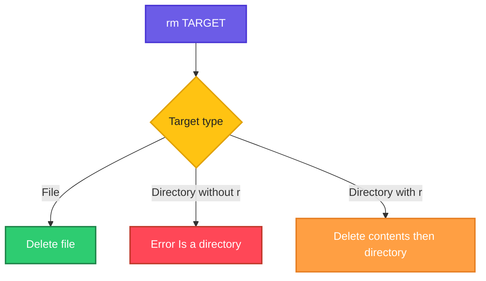

# rm

## What is it?
`rm` (remove) deletes files and, with `-r`, directories. There is no recycle bin: deleted data is gone.

## Syntax
```bash
rm [OPTIONS] FILE...
```

## Visual Overview
> `rm` removes the directory entry. Files are removed directly; directories need `-r` so their contents are removed first.



## Options/Flags
| Flag | Description |
|------|-------------|
| `-i` | Ask before every removal |
| `-f` | Force: ignore missing files and never prompt |
| `-r` | Remove directories and their contents recursively |
| `-v` | Verbose, show each removed item |
| `-d` | Remove empty directories (like `rmdir`) |
| `-I` | Ask once before removing more than 3 files or when recursive |

## Usage Examples

Let's say we have this directory `work/`:

**Input file** (directory tree):
```text
work/
├── a.txt
├── b.txt
├── c.txt
├── d.txt
├── empty/
└── project/
    └── main.py
```

All commands run from inside `work/`.

### Example 1: Remove a file
**Command:**
```bash
rm a.txt
ls
```
**Sample Output:**
```text
b.txt  c.txt  d.txt  empty  project
```

### Example 2: Ask before removing (`-i`)
**Command:**
```bash
rm -i b.txt
```
**Sample Output:**
```text
rm: remove regular empty file 'b.txt'? y
```

### Example 3: Force, ignore missing files (`-f`)
**Command:**
```bash
rm -f nothere.txt
echo "exit code: $?"
```
**Sample Output:**
```text
exit code: 0
```

### Example 4: Remove a directory (`-r`)
**Command:**
```bash
rm project
rm -r project
ls
```
**Sample Output:**
```text
rm: cannot remove 'project': Is a directory
c.txt  d.txt  empty
```
(The first command fails and prints the error; after `rm -r` the `ls` shows the rest.)

### Example 5: Verbose (`-v`)
**Command:**
```bash
rm -v c.txt
```
**Sample Output:**
```text
removed 'c.txt'
```

### Example 6: Remove an empty directory (`-d`)
**Command:**
```bash
rm -d empty
ls
```
**Sample Output:**
```text
d.txt
```

### Example 7: Ask once for bulk removal (`-I`)
Let's say we now have `x1.tmp x2.tmp x3.tmp x4.tmp` in the directory.

**Command:**
```bash
rm -I x*.tmp
```
**Sample Output:**
```text
rm: remove 4 arguments? y
```

## Pitfalls / Gotchas
- There is no undo. Deleted files do not go to a trash.
- `rm -rf /` or `rm -rf $VAR/` with an empty variable can wipe the system. Use `set -u` in scripts and check variables first.
- Always `ls` a wildcard before you `rm` it, e.g. run `ls *.log` first.
- `rm` only removes the link; a file stays on disk while a process still has it open (disk space is not freed until the process exits).
- Files starting with `-` need `rm -- -file` or `rm ./-file`.

## DevOps Use Cases

### Use Case 1: Clean old temp files
**Situation:** Delete build leftovers in a CI workspace.

**Input file** (directory listing):
```text
build.tmp  cache.tmp  src
```
**Command:**
```bash
rm -v *.tmp
```
**Output:**
```text
removed 'build.tmp'
removed 'cache.tmp'
```

### Use Case 2: Delete logs older than 7 days
**Situation:** Free disk space by removing old rotated logs.

**Command:**
```bash
find /var/log/myapp -name "*.log.*" -mtime +7 -exec rm -v {} \;
```
**Output:**
```text
removed '/var/log/myapp/app.log.8'
removed '/var/log/myapp/app.log.9'
```

### Use Case 3: Clean a build directory safely in a script
**Situation:** Guard against an empty variable so you never run `rm -rf /`.

**Command:**
```bash
BUILD_DIR=""
rm -rf "${BUILD_DIR:?BUILD_DIR is not set}/output"
```
**Output:**
```text
bash: BUILD_DIR: BUILD_DIR is not set
```

### Use Case 4: Remove a stale lock or PID file
**Situation:** A service crashed and left a PID file that blocks restart.

**Input file** (`/var/run/myapp.pid`):
```text
4821
```
**Command:**
```bash
sudo rm -f /var/run/myapp.pid
ls /var/run/myapp.pid
```
**Output:**
```text
ls: cannot access '/var/run/myapp.pid': No such file or directory
```

### Use Case 5: Free disk space held by a deleted log
**Situation:** `df` shows the disk full after deleting a log, because a process still has it open. Find it with `lsof`, then restart or truncate.

**Command:**
```bash
lsof +L1 | grep deleted
```
**Output:**
```text
java  3120 app  4w  REG  8,1  2147483648  0  131074 /var/log/app.log (deleted)
```

### Use Case 6: Truncate instead of delete
**Situation:** Empty a log that a running process holds open, without breaking its file handle.

**Input file** (`app.log`):
```text
2026-10-06 10:00:01 INFO Service started
```
**Command:**
```bash
: > app.log
ls -l app.log
```
**Output:**
```text
-rw-r--r-- 1 devops devops 0 Oct  6 10:30 app.log
```

### Use Case 7: Clean build output before a CI build
**Situation:** Delete the build output folder before each CI build.

**Command:**
```bash
rm -rf dist node_modules/.cache
ls
```
**Output:**
```text
package.json  src
```

### Use Case 8: Remove files with special names
**Situation:** A stray file named `-rf` breaks wildcard deletes.

**Input file** (directory listing):
```text
-rf  data.txt
```
**Command:**
```bash
rm -- -rf
ls
```
**Output:**
```text
data.txt
```

## Related Commands
- [`rmdir`](rmdir.md) - remove empty directories
- [`mv`](mv.md) - move files (use instead of deleting when unsure)
- `find` - select files to delete by age, name or size
- `shred` - overwrite a file before deleting it
- `trash-cli` - move files to the trash instead of deleting
