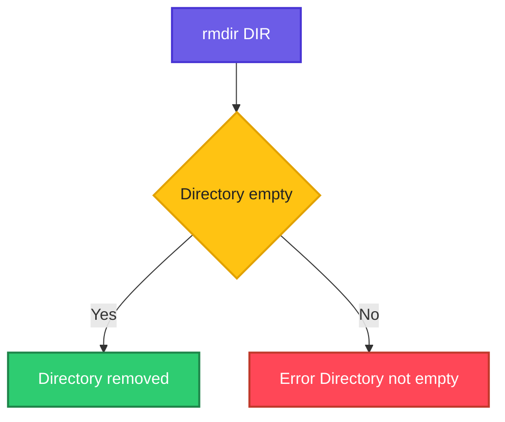

# rmdir

## What is it?
`rmdir` (remove directory) deletes empty directories. It refuses to delete a directory that still contains files, which makes it a safe way to clean up.

## Syntax
```bash
rmdir [OPTIONS] DIRECTORY...
```

## Visual Overview
> `rmdir` checks that the directory is empty before removing it.



## Options/Flags
| Flag | Description |
|------|-------------|
| `-p` | Remove the directory and its empty parent directories |
| `-v` | Print a message for each removed directory |
| `--ignore-fail-on-non-empty` | Do not report an error when a directory is not empty |

## Usage Examples

Let's say we have this directory layout:

**Input file** (directory tree):
```text
work/
├── empty1/
├── empty2/
├── full/
│   └── data.txt
└── a/
    └── b/
        └── c/
```

All commands run from inside `work/`.

### Example 1: Remove an empty directory
**Command:**
```bash
rmdir empty1
ls
```
**Sample Output:**
```text
a  empty2  full
```

### Example 2: Try to remove a non-empty directory
**Command:**
```bash
rmdir full
```
**Sample Output:**
```text
rmdir: failed to remove 'full': Directory not empty
```

### Example 3: Verbose (`-v`)
**Command:**
```bash
rmdir -v empty2
```
**Sample Output:**
```text
rmdir: removing directory, 'empty2'
```

### Example 4: Remove a chain of empty parents (`-p`)
**Command:**
```bash
rmdir -p a/b/c
ls
```
**Sample Output:**
```text
full
```

### Example 5: Ignore non-empty errors (`--ignore-fail-on-non-empty`)
**Command:**
```bash
rmdir --ignore-fail-on-non-empty full
echo "exit code: $?"
```
**Sample Output:**
```text
exit code: 0
```

## Pitfalls / Gotchas
- `rmdir` cannot delete directories with files. Use `rm -r` for that, carefully.
- Hidden files count as content, so a directory with only `.gitkeep` is not empty.
- `-p` stops at the first parent that is not empty.

## Related Commands
- [`mkdir`](mkdir.md) - create directories
- [`rm`](rm.md) - remove files and non-empty directories
- [`ls`](ls.md) - check directory contents
