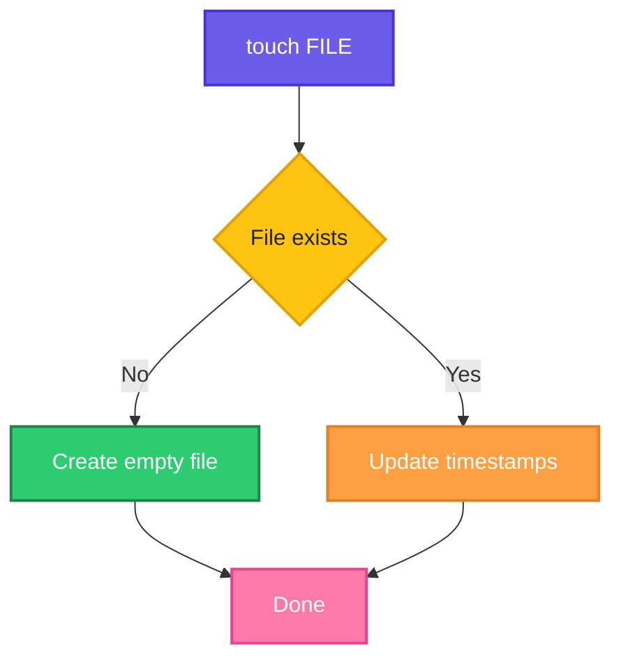

# touch

## What is it?
`touch` creates an empty file if it does not exist, or updates the access and modification timestamps of an existing file.

## Syntax
```bash
touch [OPTIONS] FILE...
```

## Visual Overview
> `touch` checks whether the file exists. If not, it creates an empty one; if yes, it only updates the timestamps.



## Options/Flags
| Flag | Description |
|------|-------------|
| `-c` | Do not create the file if it does not exist |
| `-a` | Change only the access time |
| `-m` | Change only the modification time |
| `-t STAMP` | Use the given time `[[CC]YY]MMDDhhmm[.ss]` instead of now |
| `-d STRING` | Use the given date string instead of now |
| `-r FILE` | Use the timestamps of another file |

## Usage Examples

Let's say we have this existing file `old.txt` that was last modified on Jan 1 2025:

**Input file** (`old.txt`):
```text
-rw-r--r-- 1 devops devops 5 Jan  1  2025 old.txt
```
(The file contains the text `hello`.)

### Example 1: Create an empty file
**Command:**
```bash
touch new.txt
ls -l new.txt
```
**Sample Output:**
```text
-rw-r--r-- 1 devops devops 0 Oct  6 10:00 new.txt
```

### Example 2: Create several files
**Command:**
```bash
touch a.txt b.txt c.txt
ls
```
**Sample Output:**
```text
a.txt  b.txt  c.txt  new.txt  old.txt
```

### Example 3: Update the timestamp of an existing file
The content stays `hello`; only the time changes.

**Command:**
```bash
touch old.txt
ls -l old.txt
```
**Sample Output:**
```text
-rw-r--r-- 1 devops devops 5 Oct  6 10:05 old.txt
```

### Example 4: Do not create a missing file (`-c`)
**Command:**
```bash
touch -c missing.txt
ls missing.txt
```
**Sample Output:**
```text
ls: cannot access 'missing.txt': No such file or directory
```

### Example 5: Change only the access time (`-a`)
**Command:**
```bash
touch -a old.txt
ls -lu old.txt
```
**Sample Output:**
```text
-rw-r--r-- 1 devops devops 5 Oct  6 10:10 old.txt
```
(`ls -lu` shows the access time. The modification time stays unchanged.)

### Example 6: Change only the modification time (`-m`)
**Command:**
```bash
touch -m old.txt
ls -l old.txt
```
**Sample Output:**
```text
-rw-r--r-- 1 devops devops 5 Oct  6 10:12 old.txt
```

### Example 7: Set an exact time (`-t`)
**Command:**
```bash
touch -t 202601150930 old.txt
ls -l old.txt
```
**Sample Output:**
```text
-rw-r--r-- 1 devops devops 5 Jan 15  2026 old.txt
```

### Example 8: Set a time from a date string (`-d`)
**Command:**
```bash
touch -d "2026-03-10 08:00" old.txt
ls -l old.txt
```
**Sample Output:**
```text
-rw-r--r-- 1 devops devops 5 Mar 10 08:00 old.txt
```

### Example 9: Copy the timestamp of another file (`-r`)
Using `old.txt` from Example 8 (modified Mar 10 08:00).

**Command:**
```bash
touch -r old.txt new.txt
ls -l new.txt
```
**Sample Output:**
```text
-rw-r--r-- 1 devops devops 0 Mar 10 08:00 new.txt
```

## Pitfalls / Gotchas
- `touch` never changes file content; an existing file keeps its data.
- Without `-c`, a typo in the file name silently creates a new empty file.
- Build tools such as `make` use timestamps, so touching a file can trigger a rebuild.
- `touch` needs write permission on the file, or on the directory when creating a file.

## Related Commands
- [`mkdir`](mkdir.md) - create directories
- [`cat`](cat.md) - create or view file content
- [`ls`](ls.md) - view timestamps
- `stat` - show detailed file timestamps
