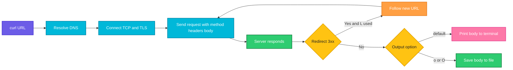

# curl

## What is it?
`curl` (client URL) transfers data to or from a server using protocols such as HTTP, HTTPS, FTP and SFTP. DevOps engineers use it to call REST APIs, test endpoints, download files and check the health of services.

## Syntax
```bash
curl [OPTIONS] URL
```

## Visual Overview
> `curl` builds a request from the URL and options, sends it to the server, and writes the response body to the terminal or a file. Options control the method, headers, body, redirects and what extra details are printed.



## Options/Flags
| Flag | Description |
|------|-------------|
| `-X METHOD` | Set the HTTP method (GET, POST, PUT, DELETE) |
| `-H "Header: value"` | Add a request header |
| `-d DATA` | Send data in the request body (use `@file` to read it from a file) |
| `--data-urlencode` | Send data and URL encode it |
| `-F name=value` | Send a multipart form (use `name=@file` to upload a file) |
| `-o FILE` | Save the output to `FILE` |
| `-O` | Save the output using the remote file name |
| `-L` | Follow redirects |
| `-I` | Fetch only the response headers (HEAD request) |
| `-i` | Include response headers in the output |
| `-s` | Silent: hide the progress meter and errors |
| `-S` | With `-s`, still show errors |
| `-v` | Verbose: show the full request and response exchange |
| `-k` | Skip TLS certificate verification (insecure) |
| `-u USER:PASS` | Send basic authentication credentials |
| `-w FORMAT` | Print extra information after the transfer (status code, timing) |
| `-f` | Fail silently on HTTP errors (exit code 22 for 400 and above) |
| `-m SECONDS` | Maximum total time for the transfer |
| `--connect-timeout SECONDS` | Maximum time to wait for the connection |
| `--retry N` | Retry up to `N` times on transient errors |
| `-A AGENT` | Set the User-Agent header |
| `-b` / `-c FILE` | Send cookies from, or save cookies to, a file |
| `-x PROXY` | Use a proxy server |
| `-r RANGE` | Request only a byte range |
| `-T FILE` | Upload a file with PUT |
| `--resolve HOST:PORT:IP` | Force a host name to resolve to a given IP |

## Usage Examples

Let's say we have this file `payload.json`:

**Input file** (`payload.json`):
```json
{"name": "web01", "env": "prod"}
```

Let's say we have this file `report.txt`:

**Input file** (`report.txt`):
```text
deploy ok
```

### Example 1: Simple GET request
**Command:**
```bash
curl https://api.example.com/health
```
**Sample Output:**
```text
{"status":"ok"}
```

### Example 2: Set the method (`-X`)
**Command:**
```bash
curl -X DELETE https://api.example.com/servers/7
```
**Sample Output:**
```text
{"deleted":true}
```

### Example 3: Add a header (`-H`)
**Command:**
```bash
curl -H "Authorization: Bearer abc123" https://api.example.com/me
```
**Sample Output:**
```text
{"user":"admin"}
```

### Example 4: Send data from a file (`-d`)
**Command:**
```bash
curl -X POST -H "Content-Type: application/json" -d @payload.json https://api.example.com/servers
```
**Sample Output:**
```text
{"id":8,"name":"web01","env":"prod"}
```

### Example 5: URL encode data (`--data-urlencode`)
**Command:**
```bash
curl -G --data-urlencode "q=disk usage" https://api.example.com/search
```
**Sample Output:**
```text
{"query":"disk usage","results":3}
```
`-G` puts the encoded data in the URL (`?q=disk%20usage`).

### Example 6: Upload a file as a form (`-F`)
**Command:**
```bash
curl -F "file=@report.txt" https://api.example.com/upload
```
**Sample Output:**
```text
{"filename":"report.txt","size":10}
```

### Example 7: Save to a named file (`-o`)
**Command:**
```bash
curl -o page.html https://example.com
ls -l page.html
```
**Sample Output:**
```text
  % Total    % Received % Xferd  Average Speed   Time    Time     Time  Current
                                 Dload  Upload   Total   Spent    Left  Speed
100  1256  100  1256    0     0   8210      0 --:--:-- --:--:-- --:--:--  8210
-rw-r--r-- 1 user user 1256 Oct  7 10:20 page.html
```

### Example 8: Save with the remote name (`-O`)
**Command:**
```bash
curl -O https://downloads.example.com/tool-1.2.tar.gz
ls tool-1.2.tar.gz
```
**Sample Output:**
```text
  % Total    % Received % Xferd  Average Speed   Time    Time     Time  Current
                                 Dload  Upload   Total   Spent    Left  Speed
100 2048k  100 2048k    0     0  5120k      0 --:--:-- --:--:-- --:--:-- 5120k
tool-1.2.tar.gz
```

### Example 9: Follow redirects (`-L`)
**Command:**
```bash
curl -L http://example.com/old
```
**Sample Output:**
```text
This is the new page.
```
Without `-L` the output would be empty because the server only returns a `301` redirect.

### Example 10: Headers only (`-I`)
**Command:**
```bash
curl -I https://example.com
```
**Sample Output:**
```text
HTTP/2 200
content-type: text/html; charset=UTF-8
content-length: 1256
cache-control: max-age=604800
```

### Example 11: Headers and body (`-i`)
**Command:**
```bash
curl -i https://api.example.com/health
```
**Sample Output:**
```text
HTTP/2 200
content-type: application/json
content-length: 15

{"status":"ok"}
```

### Example 12: Silent mode and silent with errors (`-s`, `-S`)
**Command:**
```bash
curl -s https://api.example.com/health
curl -sS https://does-not-exist.example.com
```
**Sample Output:**
```text
{"status":"ok"}
curl: (6) Could not resolve host: does-not-exist.example.com
```
`-s` alone would hide the error message too.

### Example 13: Verbose output (`-v`)
**Command:**
```bash
curl -v https://api.example.com/health
```
**Sample Output:**
```text
*   Trying 203.0.113.10:443...
* Connected to api.example.com (203.0.113.10) port 443
* TLSv1.3 (OUT), TLS handshake, Client hello (1):
> GET /health HTTP/2
> Host: api.example.com
> User-Agent: curl/8.5.0
> Accept: */*
>
< HTTP/2 200
< content-type: application/json
<
{"status":"ok"}
```

### Example 14: Skip certificate checks (`-k`)
**Command:**
```bash
curl https://self-signed.internal/health
curl -k https://self-signed.internal/health
```
**Sample Output:**
```text
curl: (60) SSL certificate problem: self-signed certificate
More details here: https://curl.se/docs/sslcerts.html
{"status":"ok"}
```

### Example 15: Basic authentication (`-u`)
**Command:**
```bash
curl -u admin:secret https://api.example.com/admin
```
**Sample Output:**
```text
{"role":"admin"}
```

### Example 16: Print only the status code (`-w`)
**Command:**
```bash
curl -s -o /dev/null -w "%{http_code}\n" https://api.example.com/health
```
**Sample Output:**
```text
200
```

### Example 17: Fail on HTTP errors (`-f`)
**Command:**
```bash
curl -f https://api.example.com/missing
echo "exit code: $?"
```
**Sample Output:**
```text
curl: (22) The requested URL returned error: 404
exit code: 22
```

### Example 18: Limit the total time (`-m`)
**Command:**
```bash
curl -m 5 https://slow.example.com
```
**Sample Output:**
```text
curl: (28) Operation timed out after 5001 milliseconds with 0 bytes received
```

### Example 19: Limit the connection time (`--connect-timeout`)
**Command:**
```bash
curl --connect-timeout 3 https://203.0.113.99
```
**Sample Output:**
```text
curl: (28) Failed to connect to 203.0.113.99 port 443 after 3001 ms: Timeout was reached
```

### Example 20: Retry on failure (`--retry`)
**Command:**
```bash
curl --retry 3 -s https://api.example.com/health
```
**Sample Output:**
```text
{"status":"ok"}
```
If the first attempts hit a timeout or a 5xx error, `curl` retries up to 3 times before it gives up.

### Example 21: Set the User-Agent (`-A`)
**Command:**
```bash
curl -A "monitoring-bot/1.0" https://api.example.com/whoami
```
**Sample Output:**
```text
{"user_agent":"monitoring-bot/1.0"}
```

### Example 22: Save and send cookies (`-c`, `-b`)
**Command:**
```bash
curl -c cookies.txt https://api.example.com/login
curl -b cookies.txt https://api.example.com/dashboard
```
**Sample Output:**
```text
{"logged_in":true}
{"welcome":"admin"}
```

### Example 23: Use a proxy (`-x`)
**Command:**
```bash
curl -x http://proxy.internal:3128 https://api.example.com/health
```
**Sample Output:**
```text
{"status":"ok"}
```

### Example 24: Download a byte range (`-r`)
**Command:**
```bash
curl -r 0-9 https://downloads.example.com/readme.txt
```
**Sample Output:**
```text
Welcome to
```

### Example 25: Upload a file with PUT (`-T`)
**Command:**
```bash
curl -T report.txt https://files.example.com/reports/
```
**Sample Output:**
```text
Uploaded: reports/report.txt
```

### Example 26: Force a host to an IP (`--resolve`)
**Command:**
```bash
curl --resolve api.example.com:443:203.0.113.50 https://api.example.com/health
```
**Sample Output:**
```text
{"status":"ok","server":"new-node-50"}
```

## Pitfalls / Gotchas
- Always quote URLs that contain `&` or `?`, otherwise the shell breaks the command: `curl "https://api.example.com/items?a=1&b=2"`.
- `-d` sends a POST by default. You do not need `-X POST` with `-d`.
- `-d` with data sent as `application/x-www-form-urlencoded` is the default. Add `-H "Content-Type: application/json"` for JSON.
- `-k` disables security checks. Do not use it in production scripts.
- A 404 or 500 response is still a "successful" transfer for `curl` (exit code 0). Use `-f` or `-w "%{http_code}"` to detect HTTP errors.
- Passwords in `-u` are saved in the shell history and visible in `ps`. Use environment variables or a `.netrc` file.
- Without `-L`, redirects are not followed.

## DevOps Use Cases

### Use Case 1: Health check in a CI/CD pipeline
**Situation:** After a deploy, fail the pipeline if the health endpoint does not return 200.

Let's say we have this file `healthcheck.sh`:

**Input file** (`healthcheck.sh`):
```bash
#!/bin/bash
CODE=$(curl -s -o /dev/null -w "%{http_code}" https://api.example.com/health)
if [ "$CODE" -eq 200 ]; then
    echo "Health check passed ($CODE)"
else
    echo "Health check failed ($CODE)"
    exit 1
fi
```
**Command:**
```bash
bash healthcheck.sh
```
**Output:**
```text
Health check passed (200)
```

### Use Case 2: Wait until a service is ready
**Situation:** A pipeline starts a container and must wait for it to answer before running tests.

**Command:**
```bash
until curl -sf http://localhost:8080/health > /dev/null; do echo "waiting..."; sleep 2; done; echo "service is ready"
```
**Output:**
```text
waiting...
waiting...
service is ready
```

### Use Case 3: Call a REST API and parse the JSON with jq
**Situation:** List the names of all running servers from an API.

**Command:**
```bash
curl -s -H "Authorization: Bearer abc123" https://api.example.com/servers | jq -r '.[].name'
```
**Output:**
```text
web01
web02
db01
```

### Use Case 4: Measure response time of an endpoint
**Situation:** A page feels slow. Break the time down into DNS, connect and total.

**Command:**
```bash
curl -s -o /dev/null -w "dns: %{time_namelookup}s\nconnect: %{time_connect}s\nttfb: %{time_starttransfer}s\ntotal: %{time_total}s\n" https://api.example.com/health
```
**Output:**
```text
dns: 0.012s
connect: 0.034s
ttfb: 0.210s
total: 0.215s
```

### Use Case 5: Post a notification to a Slack webhook
**Situation:** The pipeline sends a message when a deploy finishes.

Let's say we have this file `message.json`:

**Input file** (`message.json`):
```json
{"text": "Deploy of web v1.4.2 finished"}
```
**Command:**
```bash
curl -s -X POST -H "Content-Type: application/json" -d @message.json https://hooks.slack.com/services/T000/B000/XXXX
```
**Output:**
```text
ok
```

### Use Case 6: Trigger a Jenkins build with a token
**Situation:** Start a Jenkins job remotely.

**Command:**
```bash
curl -s -o /dev/null -w "%{http_code}\n" -X POST -u admin:API_TOKEN "https://jenkins.example.com/job/build-web/build"
```
**Output:**
```text
201
```

### Use Case 7: Test a new server before switching DNS
**Situation:** A new server at `203.0.113.50` is ready. Test it with the real host name before changing DNS.

**Command:**
```bash
curl -s --resolve shop.example.com:443:203.0.113.50 https://shop.example.com/version
```
**Output:**
```text
{"version":"1.4.2","host":"new-node-50"}
```

### Use Case 8: Check TLS certificate and redirect chain
**Situation:** Confirm that HTTP redirects to HTTPS and see the final status.

**Command:**
```bash
curl -sIL http://example.com | grep -E "^(HTTP|location)"
```
**Output:**
```text
HTTP/1.1 301 Moved Permanently
location: https://example.com/
HTTP/2 200
```

### Use Case 9: Download a release and verify it in a pipeline
**Situation:** Download a binary and its checksum, then verify.

**Command:**
```bash
curl -fsSLO https://downloads.example.com/tool-1.2.tar.gz
curl -fsSLO https://downloads.example.com/tool-1.2.tar.gz.sha256
sha256sum -c tool-1.2.tar.gz.sha256
```
**Output:**
```text
tool-1.2.tar.gz: OK
```

### Use Case 10: Query the Kubernetes API from inside a pod
**Situation:** A pod reads its own namespace pods using the service account token.

**Command:**
```bash
TOKEN=$(cat /var/run/secrets/kubernetes.io/serviceaccount/token)
curl -s --cacert /var/run/secrets/kubernetes.io/serviceaccount/ca.crt -H "Authorization: Bearer $TOKEN" https://kubernetes.default.svc/api/v1/namespaces/default/pods | jq -r '.items[].metadata.name'
```
**Output:**
```text
web-7d9f
db-0
```

### Use Case 11: Monitor an endpoint and alert on failure
**Situation:** A cron job checks an endpoint every minute and logs failures.

Let's say we have this file `monitor.sh`:

**Input file** (`monitor.sh`):
```bash
#!/bin/bash
URL=https://api.example.com/health
if ! curl -sf -m 5 "$URL" > /dev/null; then
    echo "$(date '+%F %T') ALERT: $URL is not healthy" >> /var/log/monitor.log
fi
```
**Command:**
```bash
bash monitor.sh
tail -n 1 /var/log/monitor.log
```
**Output:**
```text
2026-10-07 10:31:02 ALERT: https://api.example.com/health is not healthy
```

## Related Commands
- [`wget`](wget.md) - download files, recursive downloads
- [`ping`](ping.md) - test reachability
- [`dig`](dig.md) - check DNS
- [`ssh`](ssh.md) - remote login
- `jq` - parse JSON output
