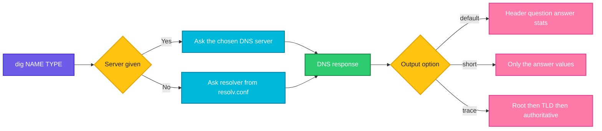

# dig

## What is it?
`dig` (domain information groper) queries DNS servers and prints the full answer. It is the main tool to troubleshoot DNS: you can ask for any record type, choose which DNS server to ask and trace the whole resolution path.

## Syntax
```bash
dig [@SERVER] [NAME] [TYPE] [OPTIONS]
```

## Visual Overview
> `dig` sends a DNS query to a resolver (from `/etc/resolv.conf` or the `@server` you choose) and prints the header, the question, the answer and statistics. With `+trace` it walks from the root servers down to the authoritative server.



## Options/Flags
| Flag | Description |
|------|-------------|
| `@SERVER` | Send the query to this DNS server instead of the default |
| `TYPE` / `-t TYPE` | Record type: `A`, `AAAA`, `MX`, `NS`, `TXT`, `CNAME`, `SOA`, `ANY` |
| `+short` | Print only the answer values |
| `-x IP` | Reverse lookup: find the name for an IP address |
| `+trace` | Trace the delegation from the root servers down |
| `+noall +answer` | Show only the answer section |
| `+nocmd` | Do not print the `dig` version and command line |
| `+tcp` | Use TCP instead of UDP |
| `+time=N` | Query timeout in seconds |
| `+tries=N` | Number of tries |
| `-p PORT` | Use a non standard DNS port |
| `-4` / `-6` | Use IPv4 or IPv6 to talk to the DNS server |
| `-f FILE` | Run the queries listed in `FILE` (batch mode) |

## Usage Examples

Let's say we have this file `domains.txt`:

**Input file** (`domains.txt`):
```text
example.com A
example.org MX
```

### Example 1: Basic query
**Command:**
```bash
dig example.com
```
**Sample Output:**
```text
; <<>> DiG 9.18.18 <<>> example.com
;; global options: +cmd
;; Got answer:
;; ->>HEADER<<- opcode: QUERY, status: NOERROR, id: 41022
;; flags: qr rd ra; QUERY: 1, ANSWER: 1, AUTHORITY: 0, ADDITIONAL: 1

;; QUESTION SECTION:
;example.com.			IN	A

;; ANSWER SECTION:
example.com.		3600	IN	A	93.184.216.34

;; Query time: 18 msec
;; SERVER: 192.168.1.1#53(192.168.1.1) (UDP)
;; WHEN: Wed Oct 07 10:55:00 UTC 2026
;; MSG SIZE  rcvd: 55
```

### Example 2: Short answer (`+short`)
**Command:**
```bash
dig +short example.com
```
**Sample Output:**
```text
93.184.216.34
```

### Example 3: Ask a specific DNS server (`@SERVER`)
**Command:**
```bash
dig @8.8.8.8 +short example.com
```
**Sample Output:**
```text
93.184.216.34
```

### Example 4: Choose the record type (`TYPE`, `-t`)
**Command:**
```bash
dig +short example.org MX
dig +short -t TXT example.org
dig +short example.org NS
dig +short example.org AAAA
```
**Sample Output:**
```text
10 mail.example.org.
"v=spf1 include:_spf.example.org ~all"
ns1.example.org.
ns2.example.org.
2001:db8::10
```

### Example 5: Reverse lookup (`-x`)
**Command:**
```bash
dig -x 8.8.8.8 +short
```
**Sample Output:**
```text
dns.google.
```

### Example 6: Trace the resolution path (`+trace`)
**Command:**
```bash
dig +trace +short example.com
```
**Sample Output:**
```text
NS a.root-servers.net. from server 192.168.1.1 in 12 ms.
NS com. from server a.root-servers.net in 20 ms.
A 93.184.216.34 from server ns1.example.com in 31 ms.
```
The exact trace lines depend on your `dig` version. The idea is the same: root, then TLD, then the authoritative server.

### Example 7: Only the answer section (`+noall +answer`)
**Command:**
```bash
dig +noall +answer example.com
```
**Sample Output:**
```text
example.com.		3600	IN	A	93.184.216.34
```

### Example 8: Hide the command header (`+nocmd`)
**Command:**
```bash
dig +nocmd +noall +answer +stats example.com
```
**Sample Output:**
```text
example.com.		3600	IN	A	93.184.216.34
;; Query time: 18 msec
;; SERVER: 192.168.1.1#53(192.168.1.1) (UDP)
;; WHEN: Wed Oct 07 10:56:00 UTC 2026
;; MSG SIZE  rcvd: 55
```

### Example 9: Use TCP (`+tcp`)
**Command:**
```bash
dig +tcp +short example.com
```
**Sample Output:**
```text
93.184.216.34
```

### Example 10: Set timeout and tries (`+time`, `+tries`)
**Command:**
```bash
dig +time=2 +tries=1 @203.0.113.99 example.com
```
**Sample Output:**
```text
;; communications error to 203.0.113.99#53: timed out

; <<>> DiG 9.18.18 <<>> +time=2 +tries=1 @203.0.113.99 example.com
; (1 server found)
;; global options: +cmd
;; no servers could be reached
```

### Example 11: Use a different port (`-p`)
**Command:**
```bash
dig -p 5353 @127.0.0.1 +short app.local
```
**Sample Output:**
```text
10.0.1.15
```

### Example 12: Force IPv4 or IPv6 transport (`-4`, `-6`)
**Command:**
```bash
dig -4 +short @dns.google example.com
dig -6 +short @dns.google example.com
```
**Sample Output:**
```text
93.184.216.34
93.184.216.34
```

### Example 13: Batch queries from a file (`-f`)
**Command:**
```bash
dig -f domains.txt +short
```
**Sample Output:**
```text
93.184.216.34
10 mail.example.org.
```

## Pitfalls / Gotchas
- `dig` ignores `/etc/hosts`. A name that works in `ping` can fail in `dig` because the answer came from the hosts file. Use `getent hosts NAME` to see what the system really resolves.
- The answer can differ between resolvers because of caching. Compare with `dig @8.8.8.8` and `dig @AUTHORITATIVE_NS`.
- The TTL (the number after the name) counts down while an answer sits in a cache. A value lower than expected means it came from cache.
- `ANY` queries are often refused or answered with limited data by modern servers.
- A `NOERROR` status with an empty answer means the name exists but has no record of that type. `NXDOMAIN` means the name does not exist.

## DevOps Use Cases

### Use Case 1: Check where a domain points after a DNS change
**Situation:** You moved a site to a new IP. Compare the answers of two public resolvers.

**Command:**
```bash
dig +short @8.8.8.8 shop.example.com
dig +short @1.1.1.1 shop.example.com
```
**Output:**
```text
203.0.113.50
203.0.113.10
```
The two resolvers disagree, so the old record is still cached somewhere. Wait for the TTL to expire.

### Use Case 2: Query the authoritative server directly
**Situation:** Skip all caches and ask the authoritative name server for the truth.

**Command:**
```bash
dig +short NS example.com
dig +short @ns1.example.com shop.example.com
```
**Output:**
```text
ns1.example.com.
ns2.example.com.
203.0.113.50
```

### Use Case 3: Verify email records (MX and SPF)
**Situation:** Mails to your domain bounce. Check the MX and TXT records.

**Command:**
```bash
dig +short example.org MX
dig +short example.org TXT
```
**Output:**
```text
10 mail.example.org.
20 mail2.example.org.
"v=spf1 include:_spf.example.org ~all"
```

### Use Case 4: Check the TTL before a migration
**Situation:** Lower the TTL a day before a cutover. Confirm the current TTL.

**Command:**
```bash
dig +noall +answer shop.example.com
```
**Output:**
```text
shop.example.com.	300	IN	A	203.0.113.50
```
The TTL is 300 seconds, so clients pick up a change within 5 minutes.

### Use Case 5: Debug service discovery inside Kubernetes
**Situation:** A pod cannot reach a service by name. Query the cluster DNS from a debug pod.

**Command:**
```bash
kubectl exec dnsutils -- dig +short web.default.svc.cluster.local
```
**Output:**
```text
10.96.45.12
```

### Use Case 6: Find the CNAME chain of a CDN or load balancer name
**Situation:** Check what `www` points to.

**Command:**
```bash
dig +noall +answer www.example.com
```
**Output:**
```text
www.example.com.	300	IN	CNAME	d111111abcdef8.cloudfront.net.
d111111abcdef8.cloudfront.net. 60 IN	A	203.0.113.101
d111111abcdef8.cloudfront.net. 60 IN	A	203.0.113.102
```

### Use Case 7: Find the owner of an IP address in logs
**Situation:** A suspicious IP shows up in your access log. Reverse-resolve it.

**Command:**
```bash
dig -x 203.0.113.77 +short
```
**Output:**
```text
scanner-77.badhosting.example.
```

### Use Case 8: Bulk check many hosts in a script
**Situation:** Verify that all internal hosts resolve before a deployment.

Let's say we have this file `hosts.txt`:

**Input file** (`hosts.txt`):
```text
web01.internal
db01.internal
cache01.internal
```
**Command:**
```bash
while read h; do echo "$h -> $(dig +short $h)"; done < hosts.txt
```
**Output:**
```text
web01.internal -> 10.0.1.11
db01.internal -> 10.0.2.30
cache01.internal ->
```
`cache01.internal` returns nothing, so its record is missing.

### Use Case 9: Measure DNS latency to a resolver
**Situation:** The app is slow. Check how long the resolver takes.

**Command:**
```bash
dig example.com | grep "Query time"
dig @8.8.8.8 example.com | grep "Query time"
```
**Output:**
```text
;; Query time: 142 msec
;; Query time: 19 msec
```
The internal resolver is much slower than the public one.

### Use Case 10: Check a failing lookup in CI
**Situation:** Make a pipeline fail when a required record does not exist.

**Command:**
```bash
dig +short api.example.com | grep -q . && echo "DNS OK" || { echo "DNS record missing"; exit 1; }
```
**Output:**
```text
DNS OK
```

## Related Commands
- [`nslookup`](nslookup.md) - simpler DNS lookups
- [`ping`](ping.md) - test reachability of the resolved IP
- [`curl`](curl.md) - test the service after resolving it
- [`traceroute`](traceroute.md) - show the path to the resolved IP
- `host` - short DNS lookups
