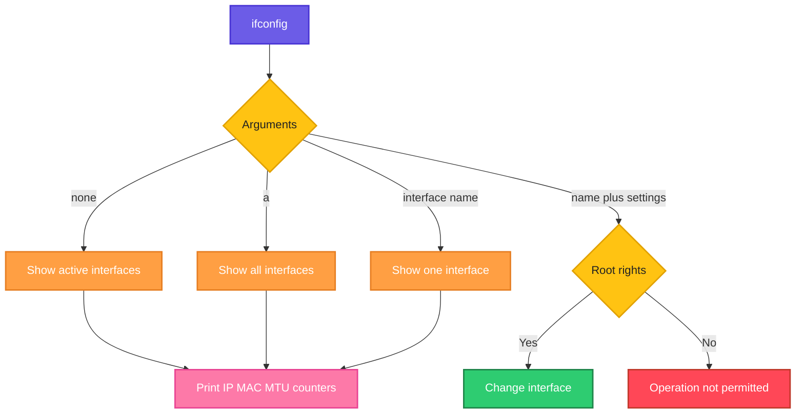

# ifconfig

## What is it?
`ifconfig` (interface configuration) shows and configures network interfaces: their IP addresses, MAC addresses, state and traffic counters. It is the classic tool from the `net-tools` package. On modern systems [`ip`](ip.md) replaces it, but you will still meet it on older servers and in many guides.

## Syntax
```bash
ifconfig [INTERFACE] [OPTIONS]
```

## Visual Overview
> `ifconfig` reads the state of the network interfaces from the kernel. Without arguments it prints all active interfaces. With an interface name it prints one. With an address or `up`/`down` (and root rights) it changes the interface.



## Options/Flags
| Flag / Argument | Description |
|-----------------|-------------|
| (no arguments) | Show all active interfaces |
| `-a` | Show all interfaces, including the ones that are down |
| `-s` | Short list: one line per interface with counters |
| `INTERFACE` | Show only this interface, for example `eth0` |
| `up` / `down` | Activate or deactivate an interface |
| `IP netmask MASK` | Set the IP address and netmask |
| `mtu N` | Set the MTU (maximum transfer unit) |
| `promisc` / `-promisc` | Turn promiscuous mode on or off |
| `hw ether MAC` | Change the MAC address |
| `INTERFACE:N IP` | Create an alias (a second IP on the same interface) |

## Usage Examples

### Example 1: Show active interfaces
**Command:**
```bash
ifconfig
```
**Sample Output:**
```text
eth0: flags=4163<UP,BROADCAST,RUNNING,MULTICAST>  mtu 1500
        inet 192.168.1.20  netmask 255.255.255.0  broadcast 192.168.1.255
        inet6 fe80::a00:27ff:fe4e:66a1  prefixlen 64  scopeid 0x20<link>
        ether 08:00:27:4e:66:a1  txqueuelen 1000  (Ethernet)
        RX packets 61245  bytes 48213977 (48.2 MB)
        RX errors 0  dropped 0  overruns 0  frame 0
        TX packets 40211  bytes 5120044 (5.1 MB)
        TX errors 0  dropped 0 overruns 0  carrier 0  collisions 0

lo: flags=73<UP,LOOPBACK,RUNNING>  mtu 65536
        inet 127.0.0.1  netmask 255.0.0.0
        inet6 ::1  prefixlen 128  scopeid 0x10<host>
        loop  txqueuelen 1000  (Local Loopback)
        RX packets 1820  bytes 148211 (148.2 KB)
        RX errors 0  dropped 0  overruns 0  frame 0
        TX packets 1820  bytes 148211 (148.2 KB)
        TX errors 0  dropped 0 overruns 0  carrier 0  collisions 0
```

### Example 2: Show all interfaces, also the ones that are down (`-a`)
**Command:**
```bash
ifconfig -a | grep flags
```
**Sample Output:**
```text
eth0: flags=4163<UP,BROADCAST,RUNNING,MULTICAST>  mtu 1500
eth1: flags=4098<BROADCAST,MULTICAST>  mtu 1500
lo: flags=73<UP,LOOPBACK,RUNNING>  mtu 65536
```
`eth1` has no `UP` flag, so it is down. Plain `ifconfig` would not list it.

### Example 3: Short list (`-s`)
**Command:**
```bash
ifconfig -s
```
**Sample Output:**
```text
Iface      MTU    RX-OK RX-ERR RX-DRP RX-OVR    TX-OK TX-ERR TX-DRP TX-OVR Flg
eth0      1500    61245      0      0 0         40211      0      0      0 BMRU
lo       65536     1820      0      0 0          1820      0      0      0 LRU
```

### Example 4: Show a single interface (`INTERFACE`)
**Command:**
```bash
ifconfig eth0
```
**Sample Output:**
```text
eth0: flags=4163<UP,BROADCAST,RUNNING,MULTICAST>  mtu 1500
        inet 192.168.1.20  netmask 255.255.255.0  broadcast 192.168.1.255
        ether 08:00:27:4e:66:a1  txqueuelen 1000  (Ethernet)
        RX packets 61245  bytes 48213977 (48.2 MB)
        TX packets 40211  bytes 5120044 (5.1 MB)
```

### Example 5: Bring an interface down and up (`down`, `up`)
**Command:**
```bash
sudo ifconfig eth1 up
ifconfig eth1 | head -n 1
sudo ifconfig eth1 down
ifconfig -a eth1 | head -n 1
```
**Sample Output:**
```text
eth1: flags=4163<UP,BROADCAST,RUNNING,MULTICAST>  mtu 1500
eth1: flags=4098<BROADCAST,MULTICAST>  mtu 1500
```

### Example 6: Set an IP address and netmask (`IP netmask MASK`)
**Command:**
```bash
sudo ifconfig eth1 10.0.2.15 netmask 255.255.255.0 up
ifconfig eth1 | grep inet
```
**Sample Output:**
```text
        inet 10.0.2.15  netmask 255.255.255.0  broadcast 10.0.2.255
```

### Example 7: Change the MTU (`mtu`)
**Command:**
```bash
sudo ifconfig eth1 mtu 9000
ifconfig eth1 | head -n 1
```
**Sample Output:**
```text
eth1: flags=4163<UP,BROADCAST,RUNNING,MULTICAST>  mtu 9000
```

### Example 8: Turn promiscuous mode on and off (`promisc`, `-promisc`)
**Command:**
```bash
sudo ifconfig eth0 promisc
ifconfig eth0 | head -n 1
sudo ifconfig eth0 -promisc
ifconfig eth0 | head -n 1
```
**Sample Output:**
```text
eth0: flags=4419<UP,BROADCAST,RUNNING,PROMISC,MULTICAST>  mtu 1500
eth0: flags=4163<UP,BROADCAST,RUNNING,MULTICAST>  mtu 1500
```

### Example 9: Change the MAC address (`hw ether`)
**Command:**
```bash
sudo ifconfig eth1 down
sudo ifconfig eth1 hw ether 02:00:00:aa:bb:cc
sudo ifconfig eth1 up
ifconfig eth1 | grep ether
```
**Sample Output:**
```text
        ether 02:00:00:aa:bb:cc  txqueuelen 1000  (Ethernet)
```

### Example 10: Add an alias IP (`INTERFACE:N`)
**Command:**
```bash
sudo ifconfig eth0:1 192.168.1.100 netmask 255.255.255.0 up
ifconfig eth0:1
```
**Sample Output:**
```text
eth0:1: flags=4163<UP,BROADCAST,RUNNING,MULTICAST>  mtu 1500
        inet 192.168.1.100  netmask 255.255.255.0  broadcast 192.168.1.255
        ether 08:00:27:4e:66:a1  txqueuelen 1000  (Ethernet)
```

## Pitfalls / Gotchas
- `ifconfig` is deprecated. It does not show all addresses on an interface that has several IPs, and it does not know many newer features. Prefer [`ip addr`](ip.md).
- It is not installed by default on many modern systems. Install it with `sudo apt install net-tools` (Debian, Ubuntu) or `sudo yum install net-tools` (RHEL, CentOS).
- Changes are lost at reboot. Make them permanent with netplan, NetworkManager or the network scripts.
- Taking down the interface of an SSH session disconnects you immediately.
- Without `-a`, interfaces that are down are hidden. This is a common reason for "my interface is missing".
- The output format differs between old and new `net-tools` versions (`inet addr:` in old versions versus `inet` in new ones). Do not rely on it in scripts.

## DevOps Use Cases

### Use Case 1: Find the IP address of a server quickly
**Situation:** You just logged in to a VM and need its IP.

**Command:**
```bash
ifconfig eth0 | grep "inet " | awk '{print $2}'
```
**Output:**
```text
192.168.1.20
```

### Use Case 2: Find the MAC address for a DHCP reservation
**Situation:** The network team needs the MAC address of the server.

**Command:**
```bash
ifconfig eth0 | grep ether | awk '{print $2}'
```
**Output:**
```text
08:00:27:4e:66:a1
```

### Use Case 3: Check for dropped packets and errors
**Situation:** The application sees random timeouts. Look at the error counters.

**Command:**
```bash
ifconfig eth0 | grep -E "RX errors|TX errors"
```
**Output:**
```text
        RX errors 0  dropped 8412  overruns 0  frame 0
        TX errors 0  dropped 0 overruns 0  carrier 0  collisions 0
```
8412 dropped RX packets point to an overloaded NIC or buffer.

### Use Case 4: Check if jumbo frames are enabled
**Situation:** Storage traffic is slow. Confirm the MTU is 9000.

**Command:**
```bash
ifconfig eth1 | head -n 1
```
**Output:**
```text
eth1: flags=4163<UP,BROADCAST,RUNNING,MULTICAST>  mtu 1500
```
The MTU is still 1500, so jumbo frames are not enabled on this NIC.

### Use Case 5: Add a floating IP during a failover
**Situation:** A standby node takes over a service IP.

**Command:**
```bash
sudo ifconfig eth0:0 192.168.1.100 netmask 255.255.255.0 up
ping -c 1 192.168.1.100
```
**Output:**
```text
PING 192.168.1.100 (192.168.1.100) 56(84) bytes of data.
64 bytes from 192.168.1.100: icmp_seq=1 ttl=64 time=0.031 ms

--- 192.168.1.100 ping statistics ---
1 packets transmitted, 1 received, 0% packet loss, time 0ms
rtt min/avg/max/mdev = 0.031/0.031/0.031/0.000 ms
```

### Use Case 6: Capture traffic with promiscuous mode
**Situation:** Prepare an interface to see all traffic on the network segment, for example before running a capture on a mirror port.

**Command:**
```bash
sudo ifconfig eth0 promisc
ifconfig eth0 | head -n 1
```
**Output:**
```text
eth0: flags=4419<UP,BROADCAST,RUNNING,PROMISC,MULTICAST>  mtu 1500
```
The `PROMISC` flag is set. Turn it off with `-promisc` when you are done.

### Use Case 7: List all interfaces with the state, also in containers
**Situation:** Inspect the network of a running Docker container.

**Command:**
```bash
docker exec web ifconfig eth0
```
**Output:**
```text
eth0: flags=4163<UP,BROADCAST,RUNNING,MULTICAST>  mtu 1500
        inet 172.17.0.2  netmask 255.255.0.0  broadcast 172.17.255.255
        ether 02:42:ac:11:00:02  txqueuelen 0  (Ethernet)
```

### Use Case 8: Check which interfaces are down on a server
**Situation:** An audit lists interfaces that are not up.

**Command:**
```bash
ifconfig -a | grep -v UP | grep flags
```
**Output:**
```text
eth1: flags=4098<BROADCAST,MULTICAST>  mtu 1500
```

## Related Commands
- [`ip`](ip.md) - modern replacement for `ifconfig`
- [`netstat`](netstat.md) - connections and routing from the same package
- [`ping`](ping.md) - test an address you just configured
- [`tcpdump`](tcpdump.md) - capture packets on an interface
- `nmcli` - manage NetworkManager connections
