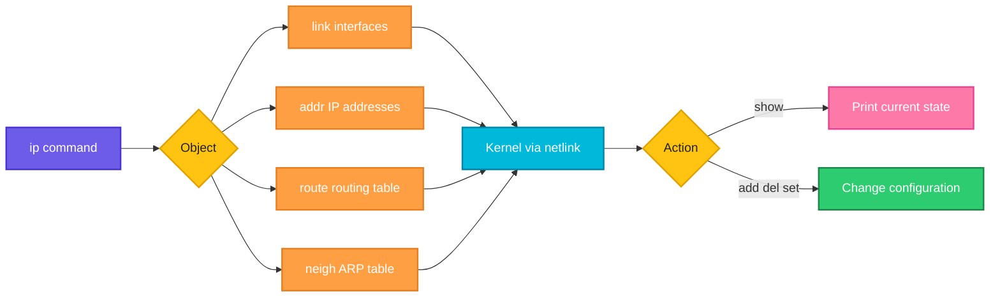

# ip

## What is it?
`ip` is the modern tool (from the `iproute2` package) to show and change network interfaces, IP addresses, routes and the neighbor (ARP) table. It replaces the older `ifconfig`, `route` and `arp`.

## Syntax
```bash
ip [OPTIONS] OBJECT [COMMAND] [ARGUMENTS]
```
Common objects: `addr` (address), `link` (interface), `route` (routing table), `neigh` (ARP table).

## Visual Overview
> `ip` talks to the kernel over netlink. You pick an object (link, addr, route, neigh) and an action (show, add, del, set). The kernel applies the change or returns the data.



## Options/Flags
| Flag / Subcommand | Description |
|-------------------|-------------|
| `addr show` | List IP addresses (short form: `ip a`) |
| `addr add IP/MASK dev IFACE` | Add an address to an interface |
| `addr del IP/MASK dev IFACE` | Remove an address from an interface |
| `link show` | List interfaces and their state (short form: `ip l`) |
| `link set IFACE up` / `down` | Bring an interface up or down |
| `route show` | Show the routing table (short form: `ip r`) |
| `route add` / `route del` | Add or remove a route |
| `route get IP` | Show which route the kernel would use for an address |
| `neigh show` | Show the ARP or neighbor table |
| `-4` / `-6` | Show only IPv4 or only IPv6 |
| `-br` | Brief, one line per interface |
| `-c` | Colored output |
| `-s` | Show statistics (packet and error counters) |
| `-j` | JSON output (add `-p` for pretty print) |

## Usage Examples

### Example 1: Show all addresses (`addr show`)
**Command:**
```bash
ip addr show
```
**Sample Output:**
```text
1: lo: <LOOPBACK,UP,LOWER_UP> mtu 65536 qdisc noqueue state UNKNOWN group default qlen 1000
    link/loopback 00:00:00:00:00:00 brd 00:00:00:00:00:00
    inet 127.0.0.1/8 scope host lo
       valid_lft forever preferred_lft forever
2: eth0: <BROADCAST,MULTICAST,UP,LOWER_UP> mtu 1500 qdisc fq_codel state UP group default qlen 1000
    link/ether 08:00:27:4e:66:a1 brd ff:ff:ff:ff:ff:ff
    inet 192.168.1.20/24 brd 192.168.1.255 scope global eth0
       valid_lft forever preferred_lft forever
```

### Example 2: Brief output (`-br`)
**Command:**
```bash
ip -br addr
```
**Sample Output:**
```text
lo               UNKNOWN        127.0.0.1/8
eth0             UP             192.168.1.20/24
```

### Example 3: Only IPv4 or only IPv6 (`-4`, `-6`)
**Command:**
```bash
ip -4 -br addr
ip -6 -br addr
```
**Sample Output:**
```text
lo               UNKNOWN        127.0.0.1/8
eth0             UP             192.168.1.20/24
lo               UNKNOWN        ::1/128
eth0             UP             fe80::a00:27ff:fe4e:66a1/64
```

### Example 4: Add an address (`addr add`)
**Command:**
```bash
sudo ip addr add 192.168.1.50/24 dev eth0
ip -br addr show eth0
```
**Sample Output:**
```text
eth0             UP             192.168.1.20/24 192.168.1.50/24
```

### Example 5: Remove an address (`addr del`)
**Command:**
```bash
sudo ip addr del 192.168.1.50/24 dev eth0
ip -br addr show eth0
```
**Sample Output:**
```text
eth0             UP             192.168.1.20/24
```

### Example 6: List interfaces (`link show`)
**Command:**
```bash
ip link show
```
**Sample Output:**
```text
1: lo: <LOOPBACK,UP,LOWER_UP> mtu 65536 qdisc noqueue state UNKNOWN mode DEFAULT group default qlen 1000
    link/loopback 00:00:00:00:00:00 brd 00:00:00:00:00:00
2: eth0: <BROADCAST,MULTICAST,UP,LOWER_UP> mtu 1500 qdisc fq_codel state UP mode DEFAULT group default qlen 1000
    link/ether 08:00:27:4e:66:a1 brd ff:ff:ff:ff:ff:ff
```

### Example 7: Bring an interface down and up (`link set`)
**Command:**
```bash
sudo ip link set eth0 down
ip -br link show eth0
sudo ip link set eth0 up
ip -br link show eth0
```
**Sample Output:**
```text
eth0             DOWN           08:00:27:4e:66:a1 <BROADCAST,MULTICAST>
eth0             UP             08:00:27:4e:66:a1 <BROADCAST,MULTICAST,UP,LOWER_UP>
```

### Example 8: Show the routing table (`route show`)
**Command:**
```bash
ip route show
```
**Sample Output:**
```text
default via 192.168.1.1 dev eth0 proto dhcp metric 100
192.168.1.0/24 dev eth0 proto kernel scope link src 192.168.1.20 metric 100
```

### Example 9: Add and remove a route (`route add`, `route del`)
**Command:**
```bash
sudo ip route add 10.10.0.0/16 via 192.168.1.254 dev eth0
ip route show 10.10.0.0/16
sudo ip route del 10.10.0.0/16
ip route show 10.10.0.0/16
```
**Sample Output:**
```text
10.10.0.0/16 via 192.168.1.254 dev eth0
```
The second `ip route show` prints nothing because the route is gone.

### Example 10: Ask which route is used (`route get`)
**Command:**
```bash
ip route get 8.8.8.8
```
**Sample Output:**
```text
8.8.8.8 via 192.168.1.1 dev eth0 src 192.168.1.20 uid 1000
    cache
```

### Example 11: Show the ARP table (`neigh show`)
**Command:**
```bash
ip neigh show
```
**Sample Output:**
```text
192.168.1.1 dev eth0 lladdr 52:54:00:12:35:02 REACHABLE
192.168.1.35 dev eth0 lladdr 08:00:27:aa:bb:cc STALE
```

### Example 12: Show packet statistics (`-s`)
**Command:**
```bash
ip -s link show eth0
```
**Sample Output:**
```text
2: eth0: <BROADCAST,MULTICAST,UP,LOWER_UP> mtu 1500 qdisc fq_codel state UP mode DEFAULT group default qlen 1000
    link/ether 08:00:27:4e:66:a1 brd ff:ff:ff:ff:ff:ff
    RX:  bytes packets errors dropped  missed   mcast
      48213977   61245      0       0       0     132
    TX:  bytes packets errors dropped carrier collsns
       5120044   40211      0       0       0       0
```

### Example 13: Colored output (`-c`)
**Command:**
```bash
ip -c -br addr
```
**Sample Output:**
```text
lo               UNKNOWN        127.0.0.1/8
eth0             UP             192.168.1.20/24
```
The text is the same. In a terminal, the state (`UP`) and addresses are colored.

### Example 14: JSON output (`-j`)
**Command:**
```bash
ip -j -br addr show eth0
```
**Sample Output:**
```text
[{"ifname":"eth0","operstate":"UP","addr_info":[{"local":"192.168.1.20","prefixlen":24}]}]
```

## Pitfalls / Gotchas
- Changes made with `ip addr add`, `ip link set` and `ip route add` are lost after a reboot. Make them permanent with netplan, NetworkManager or `/etc/network/interfaces`.
- Bringing down the interface you are connected to through SSH cuts your own session.
- `ip route del default` removes your internet access immediately.
- The output of `ip` is for humans. In scripts use `-j` with `jq` rather than parsing text.
- You need `sudo` to change anything. Showing information needs no privileges.

## DevOps Use Cases

### Use Case 1: Get the primary IP address in a script
**Situation:** A deploy script needs the server's main IPv4 address to write into a config.

**Command:**
```bash
ip -4 -br addr show eth0 | awk '{print $3}' | cut -d/ -f1
```
**Output:**
```text
192.168.1.20
```

### Use Case 2: Extract the IP with JSON and jq
**Situation:** A more reliable way to read the address in automation.

**Command:**
```bash
ip -j addr show eth0 | jq -r '.[0].addr_info[] | select(.family=="inet") | .local'
```
**Output:**
```text
192.168.1.20
```

### Use Case 3: Find the default gateway
**Situation:** A host has no internet. First check where its default route points.

**Command:**
```bash
ip route show default
```
**Output:**
```text
default via 192.168.1.1 dev eth0 proto dhcp metric 100
```

### Use Case 4: Check which interface traffic to a database will use
**Situation:** A server has two NICs and traffic to the database takes the wrong one.

**Command:**
```bash
ip route get 10.0.2.30
```
**Output:**
```text
10.0.2.30 dev eth1 src 10.0.2.15 uid 1000
    cache
```

### Use Case 5: Detect dropped packets on an interface
**Situation:** The app times out under load. Look for RX and TX drops.

**Command:**
```bash
ip -s link show eth0
```
**Output:**
```text
2: eth0: <BROADCAST,MULTICAST,UP,LOWER_UP> mtu 1500 qdisc fq_codel state UP mode DEFAULT group default qlen 1000
    link/ether 08:00:27:4e:66:a1 brd ff:ff:ff:ff:ff:ff
    RX:  bytes packets errors dropped  missed   mcast
   903311772 1103223      0    8412       0     211
    TX:  bytes packets errors dropped carrier collsns
   312004411  988134      0       0       0       0
```
8412 dropped RX packets point to an overloaded NIC or ring buffer.

### Use Case 6: Add a static route to a private network after a VPN connects
**Situation:** Traffic for the office network `172.16.0.0/16` must go through the VPN gateway.

**Command:**
```bash
sudo ip route add 172.16.0.0/16 via 10.8.0.1 dev tun0
ip route show 172.16.0.0/16
```
**Output:**
```text
172.16.0.0/16 via 10.8.0.1 dev tun0
```

### Use Case 7: Add a secondary IP for a floating or service address
**Situation:** A node takes over a virtual IP during failover.

**Command:**
```bash
sudo ip addr add 192.168.1.100/24 dev eth0
ip -br addr show eth0
```
**Output:**
```text
eth0             UP             192.168.1.20/24 192.168.1.100/24
```

### Use Case 8: Inspect the network inside a Docker container
**Situation:** Check the interface and IP of a running container without installing tools.

**Command:**
```bash
docker exec web ip -br addr
```
**Output:**
```text
lo               UNKNOWN        127.0.0.1/8
eth0@if12        UP             172.17.0.2/16
```

### Use Case 9: Find the MAC address of a neighbor in a troubleshooting session
**Situation:** Two hosts claim the same IP. Look at the ARP entry for the address.

**Command:**
```bash
ping -c 1 192.168.1.35 > /dev/null; ip neigh show 192.168.1.35
```
**Output:**
```text
192.168.1.35 dev eth0 lladdr 08:00:27:aa:bb:cc REACHABLE
```

### Use Case 10: Check an interface is up before starting a service
**Situation:** A systemd or startup script must wait for the interface to be up.

**Command:**
```bash
ip -br link show eth0 | awk '{print $2}'
```
**Output:**
```text
UP
```

## Related Commands
- [`ifconfig`](ifconfig.md) - legacy tool for interface information
- [`ss`](ss.md) - show sockets and listening ports
- [`ping`](ping.md) - test reachability
- [`traceroute`](traceroute.md) - show the path to a host
- `nmcli` - manage connections with NetworkManager
