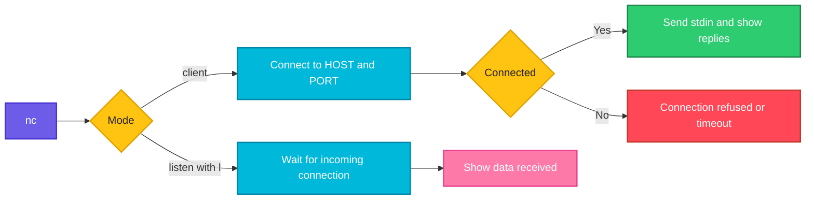

# nc

## What is it?
`nc` (netcat) reads and writes data across TCP or UDP connections. It is often called the "Swiss army knife" of networking: you can test if a port is open, send raw requests, transfer files or start a quick listener.

## Syntax
```bash
nc [OPTIONS] HOST PORT
nc -l [OPTIONS] PORT
```

## Visual Overview
> In client mode `nc` connects to a host and port and passes everything you type (or pipe in) to the remote side. In listen mode (`-l`) it waits for a connection and prints what it receives.



## Options/Flags
| Flag | Description |
|------|-------------|
| `-z` | Zero I/O mode: only check if the port is open, send no data |
| `-v` | Verbose output |
| `-l` | Listen for incoming connections |
| `-p PORT` | Source port (client) or listening port (some versions) |
| `-u` | Use UDP instead of TCP |
| `-w SECONDS` | Timeout for connections |
| `-k` | Keep listening after a client disconnects (with `-l`) |
| `-n` | Do not resolve names, use numeric IPs only |
| `-4` / `-6` | Use IPv4 or IPv6 |
| `-s ADDRESS` | Use this source address |
| `-N` | Shut down the network connection after end of input (OpenBSD `nc`) |
| `PORT1-PORT2` | Scan a range of ports (use with `-z`) |

The flags above are for the OpenBSD `nc` (Debian, Ubuntu). Other versions (ncat, traditional) differ slightly.

## Usage Examples

Let's say we have this file `message.txt`:

**Input file** (`message.txt`):
```text
hello from nc
```

Let's say we have this file `request.txt` (the last line is empty and the lines end with CRLF):

**Input file** (`request.txt`):
```text
GET /health HTTP/1.1
Host: api.example.com
Connection: close

```

### Example 1: Test if a port is open (`-z`, `-v`)
**Command:**
```bash
nc -zv 192.168.1.20 22
```
**Sample Output:**
```text
Connection to 192.168.1.20 22 port [tcp/ssh] succeeded!
```

### Example 2: A closed port
**Command:**
```bash
nc -zv 192.168.1.20 8080
```
**Sample Output:**
```text
nc: connect to 192.168.1.20 port 8080 (tcp) failed: Connection refused
```

### Example 3: Scan a range of ports
**Command:**
```bash
nc -zv 192.168.1.20 20-25
```
**Sample Output:**
```text
nc: connect to 192.168.1.20 port 20 (tcp) failed: Connection refused
nc: connect to 192.168.1.20 port 21 (tcp) failed: Connection refused
Connection to 192.168.1.20 22 port [tcp/ssh] succeeded!
nc: connect to 192.168.1.20 port 23 (tcp) failed: Connection refused
nc: connect to 192.168.1.20 port 24 (tcp) failed: Connection refused
nc: connect to 192.168.1.20 port 25 (tcp) failed: Connection refused
```

### Example 4: Set a timeout (`-w`)
**Command:**
```bash
nc -zv -w 3 203.0.113.99 443
```
**Sample Output:**
```text
nc: connect to 203.0.113.99 port 443 (tcp) timed out: Operation now in progress
```

### Example 5: No name resolution (`-n`)
**Command:**
```bash
nc -zvn 192.168.1.20 22
```
**Sample Output:**
```text
Connection to 192.168.1.20 22 port [tcp/*] succeeded!
```

### Example 6: Listen on a port (`-l`)
Open two terminals. In terminal 1 start a listener:

**Command (terminal 1):**
```bash
nc -l 9000
```
In terminal 2 send the file:

**Command (terminal 2):**
```bash
nc localhost 9000 < message.txt
```
**Sample Output (terminal 1):**
```text
hello from nc
```
Some versions need `nc -l -p 9000`.

### Example 7: Choose the listening or source port (`-p`)
**Command:**
```bash
nc -l -p 9000
```
**Sample Output:**
```text
(waiting for a connection, no output yet)
```
The command keeps running until a client connects. Stop it with `Ctrl+C`.

### Example 8: Keep listening for more clients (`-k`)
**Command (terminal 1):**
```bash
nc -lk 9000
```
**Command (terminal 2, run twice):**
```bash
echo "first" | nc localhost 9000
echo "second" | nc localhost 9000
```
**Sample Output (terminal 1):**
```text
first
second
```
Without `-k`, the listener would exit after the first client.

### Example 9: Test UDP (`-u`)
**Command:**
```bash
nc -zvu 192.168.1.1 53
```
**Sample Output:**
```text
Connection to 192.168.1.1 53 port [udp/domain] succeeded!
```
UDP has no handshake, so "succeeded" is not a guarantee that a service answers.

### Example 10: Send a raw HTTP request from a file
**Command:**
```bash
nc api.example.com 80 < request.txt
```
**Sample Output:**
```text
HTTP/1.1 200 OK
Content-Type: application/json
Content-Length: 15
Connection: close

{"status":"ok"}
```
Note: HTTP expects CRLF line endings. Use `unix2dos request.txt` first if the server rejects the request.

### Example 11: Close after sending (`-N`)
**Command:**
```bash
nc -N localhost 9000 < message.txt
```
**Sample Output:**
```text
(no output: the connection closes right after the file is sent)
```

### Example 12: Force IPv4 or IPv6 (`-4`, `-6`)
**Command:**
```bash
nc -4 -zv localhost 22
nc -6 -zv localhost 22
```
**Sample Output:**
```text
Connection to localhost (127.0.0.1) 22 port [tcp/ssh] succeeded!
Connection to localhost (::1) 22 port [tcp/ssh] succeeded!
```

### Example 13: Use a source address (`-s`)
**Command:**
```bash
nc -zv -s 192.168.1.50 192.168.1.20 22
```
**Sample Output:**
```text
Connection to 192.168.1.20 22 port [tcp/ssh] succeeded!
```

## Pitfalls / Gotchas
- There are several `nc` versions (OpenBSD, traditional, `ncat` from nmap). Flags such as `-p`, `-N` and `-q` behave differently. Check `nc -h`.
- `nc` with `-e` (execute a program) can give anyone who connects a shell. Do not use it on real servers.
- Data sent over `nc` is not encrypted and not authenticated.
- `-z` on UDP only tells you that no ICMP error came back. It cannot prove that a service is listening.
- Port scanning other people's systems without permission may be illegal. Scan only your own systems.
- A firewall that silently drops packets shows as a timeout. A closed port shows "Connection refused". The difference helps you find where packets are blocked.

## DevOps Use Cases

### Use Case 1: Check that a database port is reachable from an app server
**Situation:** The app cannot connect to PostgreSQL. Test the network path to port 5432.

**Command:**
```bash
nc -zv -w 3 db01.internal 5432
```
**Output:**
```text
Connection to db01.internal (10.0.2.30) 5432 port [tcp/postgresql] succeeded!
```

### Use Case 2: Tell a firewall block from a stopped service
**Situation:** A connection fails. Decide whether the packets are dropped or the service is down.

**Command:**
```bash
nc -zv -w 3 10.0.2.30 5432
```
**Output:**
```text
nc: connect to 10.0.2.30 port 5432 (tcp) timed out: Operation now in progress
```
A timeout means a firewall or security group probably drops the packets. "Connection refused" would mean the host answered but nothing listens on that port.

### Use Case 3: Wait for a port in a CI pipeline
**Situation:** A pipeline waits until a service container accepts connections.

Let's say we have this file `wait_for_port.sh`:

**Input file** (`wait_for_port.sh`):
```bash
#!/bin/bash
HOST=$1
PORT=$2
for i in $(seq 1 15); do
    if nc -z -w 2 "$HOST" "$PORT"; then
        echo "$HOST:$PORT is ready"
        exit 0
    fi
    echo "waiting for $HOST:$PORT ($i)"
    sleep 2
done
echo "timeout waiting for $HOST:$PORT"
exit 1
```
**Command:**
```bash
bash wait_for_port.sh localhost 5432
```
**Output:**
```text
waiting for localhost:5432 (1)
waiting for localhost:5432 (2)
localhost:5432 is ready
```

### Use Case 4: Test a firewall rule with a temporary listener
**Situation:** You opened port 9000 in the firewall and want to test it before the real service exists.

**Command (on the server):**
```bash
nc -l 9000
```
**Command (from a client):**
```bash
echo "firewall test" | nc 203.0.113.20 9000
```
**Output (on the server):**
```text
firewall test
```

### Use Case 5: Transfer a file between two servers without SSH
**Situation:** Quickly move a file inside a trusted network.

Let's say we have this file `backup.sql` on the sending server:

**Input file** (`backup.sql`):
```text
CREATE TABLE users (id INT);
```
**Command (receiving server):**
```bash
nc -l 9000 > backup.sql
```
**Command (sending server):**
```bash
nc -N 10.0.2.40 9000 < backup.sql
```
**Output (receiving server, after the transfer):**
```text
cat backup.sql
CREATE TABLE users (id INT);
```
The data is not encrypted. Use `scp` for anything sensitive.

### Use Case 6: Check a web server with a raw HTTP request
**Situation:** Test a web server without curl, for example inside a minimal container.

**Command:**
```bash
printf "GET /health HTTP/1.1\r\nHost: localhost\r\nConnection: close\r\n\r\n" | nc localhost 8080
```
**Output:**
```text
HTTP/1.1 200 OK
Content-Type: application/json
Content-Length: 15
Connection: close

{"status":"ok"}
```

### Use Case 7: Send a metric to Graphite or StatsD
**Situation:** Push a custom metric from a script.

**Command:**
```bash
echo "deploys.count:1|c" | nc -u -w 1 statsd.internal 8125
echo "exit code: $?"
```
**Output:**
```text
exit code: 0
```

### Use Case 8: Test several ports of a Kubernetes service
**Situation:** Check whether a pod accepts connections on its service and metrics ports.

**Command:**
```bash
for p in 8080 9090; do nc -zv -w 2 10.96.45.12 $p; done
```
**Output:**
```text
Connection to 10.96.45.12 8080 port [tcp/http-alt] succeeded!
nc: connect to 10.96.45.12 port 9090 (tcp) failed: Connection refused
```

### Use Case 9: Quick port scan of your own server
**Situation:** Confirm that only the expected ports are open on a server you own.

**Command:**
```bash
nc -zv 192.168.1.20 20-25 80 443 2>&1 | grep succeeded
```
**Output:**
```text
Connection to 192.168.1.20 22 port [tcp/ssh] succeeded!
Connection to 192.168.1.20 80 port [tcp/http] succeeded!
Connection to 192.168.1.20 443 port [tcp/https] succeeded!
```

## Related Commands
- [`ss`](ss.md) - see which ports are listening locally
- [`netstat`](netstat.md) - legacy socket view
- [`curl`](curl.md) - full HTTP client
- [`tcpdump`](tcpdump.md) - capture the traffic nc generates
- `nmap` - full port scanner
