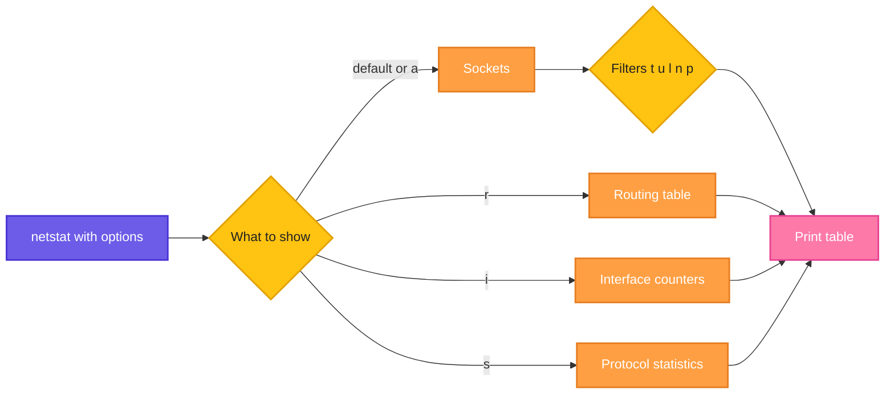

# netstat

## What is it?
`netstat` (network statistics) shows network connections, listening ports, the routing table and interface statistics. It is the classic tool that `ss` and `ip` are replacing, but it is still found on many servers and in many tutorials.

## Syntax
```bash
netstat [OPTIONS]
```

## Visual Overview
> `netstat` reads the kernel's network tables (sockets, routes, interfaces) and prints the part you ask for. By default it shows connected sockets. Options switch it to listening ports, the routing table or interface counters.



## Options/Flags
| Flag | Description |
|------|-------------|
| `-t` | Show TCP sockets |
| `-u` | Show UDP sockets |
| `-l` | Show only listening sockets |
| `-a` | Show all sockets (listening and not listening) |
| `-n` | Show numeric addresses and ports, no name resolution |
| `-p` | Show the PID and name of the owning program (needs root for other users) |
| `-r` | Show the routing table |
| `-i` | Show network interface statistics |
| `-s` | Show per-protocol statistics |
| `-c` | Print the output continuously every second |
| `-e` | Show extended information such as the user |
| `-o` | Show timers |
| `-4` / `-6` | Show only IPv4 or only IPv6 |

## Usage Examples

### Example 1: Show listening TCP ports (`-t`, `-l`, `-n`)
**Command:**
```bash
netstat -tln
```
**Sample Output:**
```text
Active Internet connections (only servers)
Proto Recv-Q Send-Q Local Address           Foreign Address         State
tcp        0      0 0.0.0.0:22              0.0.0.0:*               LISTEN
tcp        0      0 0.0.0.0:80              0.0.0.0:*               LISTEN
tcp        0      0 127.0.0.1:5432          0.0.0.0:*               LISTEN
tcp6       0      0 :::22                   :::*                    LISTEN
```

### Example 2: Show the owning process (`-p`)
**Command:**
```bash
sudo netstat -tlnp
```
**Sample Output:**
```text
Active Internet connections (only servers)
Proto Recv-Q Send-Q Local Address           Foreign Address         State       PID/Program name
tcp        0      0 0.0.0.0:22              0.0.0.0:*               LISTEN      812/sshd
tcp        0      0 0.0.0.0:80              0.0.0.0:*               LISTEN      1044/nginx: master
tcp        0      0 127.0.0.1:5432          0.0.0.0:*               LISTEN      990/postgres
```

### Example 3: Show listening UDP ports (`-u`)
**Command:**
```bash
netstat -uln
```
**Sample Output:**
```text
Active Internet connections (only servers)
Proto Recv-Q Send-Q Local Address           Foreign Address         State
udp        0      0 127.0.0.53:53           0.0.0.0:*
udp        0      0 0.0.0.0:68              0.0.0.0:*
```

### Example 4: Show all sockets (`-a`)
**Command:**
```bash
netstat -tan
```
**Sample Output:**
```text
Active Internet connections (servers and established)
Proto Recv-Q Send-Q Local Address           Foreign Address         State
tcp        0      0 0.0.0.0:22              0.0.0.0:*               LISTEN
tcp        0      0 192.168.1.20:22         192.168.1.5:51334       ESTABLISHED
tcp        0      0 192.168.1.20:80         192.168.1.8:40122       TIME_WAIT
tcp        0      0 0.0.0.0:80              0.0.0.0:*               LISTEN
```

### Example 5: Show the routing table (`-r`)
**Command:**
```bash
netstat -rn
```
**Sample Output:**
```text
Kernel IP routing table
Destination     Gateway         Genmask         Flags   MSS Window  irtt Iface
0.0.0.0         192.168.1.1     0.0.0.0         UG        0 0          0 eth0
192.168.1.0     0.0.0.0         255.255.255.0   U         0 0          0 eth0
```

### Example 6: Show interface statistics (`-i`)
**Command:**
```bash
netstat -i
```
**Sample Output:**
```text
Kernel Interface table
Iface      MTU    RX-OK RX-ERR RX-DRP RX-OVR    TX-OK TX-ERR TX-DRP TX-OVR Flg
eth0      1500    61245      0      0 0         40211      0      0      0 BMRU
lo       65536     1820      0      0 0          1820      0      0      0 LRU
```

### Example 7: Show protocol statistics (`-s`)
**Command:**
```bash
netstat -s | head -n 12
```
**Sample Output:**
```text
Ip:
    Forwarding: 2
    61245 total packets received
    0 forwarded
    0 incoming packets discarded
    61245 incoming packets delivered
    40211 requests sent out
Icmp:
    14 ICMP messages received
    0 input ICMP message failed
    ICMP input histogram:
        destination unreachable: 2
```

### Example 8: Refresh continuously (`-c`)
**Command:**
```bash
netstat -tn -c
```
**Sample Output:**
```text
Active Internet connections (w/o servers)
Proto Recv-Q Send-Q Local Address           Foreign Address         State
tcp        0      0 192.168.1.20:22         192.168.1.5:51334       ESTABLISHED

Active Internet connections (w/o servers)
Proto Recv-Q Send-Q Local Address           Foreign Address         State
tcp        0      0 192.168.1.20:22         192.168.1.5:51334       ESTABLISHED
tcp        0      0 192.168.1.20:443        192.168.1.9:50622       ESTABLISHED
```
Press `Ctrl+C` to stop.

### Example 9: Extended information (`-e`)
**Command:**
```bash
netstat -tlne
```
**Sample Output:**
```text
Active Internet connections (only servers)
Proto Recv-Q Send-Q Local Address           Foreign Address         State       User       Inode
tcp        0      0 0.0.0.0:22              0.0.0.0:*               LISTEN      0          20311
tcp        0      0 0.0.0.0:80              0.0.0.0:*               LISTEN      0          20931
```

### Example 10: Show timers (`-o`)
**Command:**
```bash
netstat -tno
```
**Sample Output:**
```text
Active Internet connections (w/o servers)
Proto Recv-Q Send-Q Local Address           Foreign Address         State       Timer
tcp        0      0 192.168.1.20:22         192.168.1.5:51334       ESTABLISHED keepalive (7012.34/0/0)
```

### Example 11: IPv4 or IPv6 only (`-4`, `-6`)
**Command:**
```bash
netstat -4 -tln
netstat -6 -tln
```
**Sample Output:**
```text
Active Internet connections (only servers)
Proto Recv-Q Send-Q Local Address           Foreign Address         State
tcp        0      0 0.0.0.0:22              0.0.0.0:*               LISTEN
tcp        0      0 0.0.0.0:80              0.0.0.0:*               LISTEN
Active Internet connections (only servers)
Proto Recv-Q Send-Q Local Address           Foreign Address         State
tcp6       0      0 :::22                   :::*                    LISTEN
```

## Pitfalls / Gotchas
- `netstat` is deprecated and part of the `net-tools` package, which is not installed by default on newer distributions. Use [`ss`](ss.md) and [`ip`](ip.md) instead.
- Without `-n`, `netstat` tries to resolve names and can be very slow when DNS is slow.
- Without `-a` or `-l`, listening sockets are hidden.
- Without `sudo`, the `-p` column is empty for processes you do not own.
- On macOS and BSD, the flags differ (for example `-p` selects a protocol). The examples here are for Linux.

## DevOps Use Cases

### Use Case 1: Find what is using a port
**Situation:** A service fails to start because port 8080 is taken.

**Command:**
```bash
sudo netstat -tlnp | grep :8080
```
**Output:**
```text
tcp        0      0 0.0.0.0:8080            0.0.0.0:*               LISTEN      7421/java
```

### Use Case 2: Count connections per state
**Situation:** The server is slow. Check for many half closed connections.

**Command:**
```bash
netstat -tan | awk 'NR>2 {print $6}' | sort | uniq -c | sort -rn
```
**Output:**
```text
    318 CLOSE_WAIT
     44 ESTABLISHED
     12 TIME_WAIT
      2 LISTEN
```
Many `CLOSE_WAIT` sockets suggest that the application does not close connections.

### Use Case 3: Find the top client IPs hitting a web server
**Situation:** Traffic spikes. Find who sends the most connections to port 80.

**Command:**
```bash
netstat -tn | awk '$4 ~ /:80$/ {split($5,a,":"); print a[1]}' | sort | uniq -c | sort -rn | head -n 3
```
**Output:**
```text
     87 203.0.113.77
     12 198.51.100.4
      3 192.168.1.8
```
An IP with a very high count may be a bot or a DoS source.

### Use Case 4: Check the default gateway
**Situation:** A server has no internet. Check the default route.

**Command:**
```bash
netstat -rn | grep ^0.0.0.0
```
**Output:**
```text
0.0.0.0         192.168.1.1     0.0.0.0         UG        0 0          0 eth0
```

### Use Case 5: Detect interface errors and drops
**Situation:** Check whether a NIC drops packets under load.

**Command:**
```bash
netstat -i
```
**Output:**
```text
Kernel Interface table
Iface      MTU    RX-OK RX-ERR RX-DRP RX-OVR    TX-OK TX-ERR TX-DRP TX-OVR Flg
eth0      1500  1103223      0   8412 0        988134      0      0      0 BMRU
```
8412 in `RX-DRP` points to dropped packets that need investigation.

### Use Case 6: Verify a service is not exposed to the world
**Situation:** PostgreSQL must listen only on localhost.

**Command:**
```bash
netstat -tln | grep 5432
```
**Output:**
```text
tcp        0      0 127.0.0.1:5432          0.0.0.0:*               LISTEN
```
The address is `127.0.0.1`, so it is not reachable from other hosts. If it showed `0.0.0.0:5432`, it would be exposed.

### Use Case 7: Check retransmissions to spot a bad network
**Situation:** Users report slow transfers. Look at TCP retransmit counters.

**Command:**
```bash
netstat -s | grep -i retrans
```
**Output:**
```text
    1824 segments retransmitted
    312 fast retransmits
```
A growing retransmit count points to packet loss on the path.

### Use Case 8: Count active connections to a database
**Situation:** Check how many client connections the app holds to MySQL.

**Command:**
```bash
netstat -tn | grep ':3306' | grep ESTABLISHED | wc -l
```
**Output:**
```text
27
```

### Use Case 9: Monitor connections during a deployment
**Situation:** Watch connections drain from an old node before shutting it down.

**Command:**
```bash
watch -n 2 "netstat -tn | grep -c ESTABLISHED"
```
**Output:**
```text
Every 2.0s: netstat -tn | grep -c ESTABLISHED

12
```

## Related Commands
- [`ss`](ss.md) - modern replacement for `netstat`
- [`ip`](ip.md) - modern replacement for `netstat -r` and `netstat -i`
- [`ifconfig`](ifconfig.md) - legacy interface tool from the same package
- [`tcpdump`](tcpdump.md) - capture packets
- `lsof -i` - list network files per process
