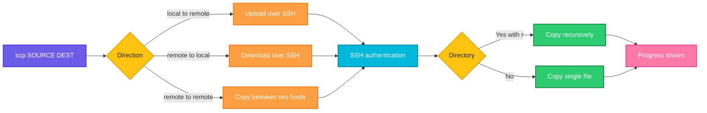

# scp

## What is it?
`scp` (secure copy) copies files and directories between two machines over SSH. The data is encrypted and it uses the same login methods as `ssh`.

## Syntax
```bash
scp [OPTIONS] SOURCE... DESTINATION
```
A remote path is written as `[USER@]HOST:PATH`.

## Visual Overview
> `scp` opens an SSH connection, then copies the file or directory in the direction you describe: local to remote (upload), remote to local (download) or remote to remote.



## Options/Flags
| Flag | Description |
|------|-------------|
| `-r` | Copy directories recursively |
| `-P PORT` | SSH port on the remote host (capital P) |
| `-i FILE` | Use this private key |
| `-p` | Preserve modification times, access times and modes |
| `-q` | Quiet mode: no progress meter |
| `-v` | Verbose output for debugging |
| `-C` | Compress data during transfer |
| `-l KBPS` | Limit the bandwidth in Kbit/s |
| `-J HOST` | Jump through a bastion host |
| `-o OPTION` | Pass an SSH option, for example `-o StrictHostKeyChecking=accept-new` |
| `-3` | For remote to remote copies, route the data through your local machine |
| `-4` / `-6` | Force IPv4 or IPv6 |

## Usage Examples

Let's say we have this file `app.conf`:

**Input file** (`app.conf`):
```text
port=8080
env=prod
```

Let's say we have this directory `configs/` that holds the file `app.conf` above and this file `db.conf`:

**Input file** (`configs/db.conf`):
```text
host=10.0.2.30
```

### Example 1: Upload a file
**Command:**
```bash
scp app.conf deploy@192.168.1.20:/tmp/
```
**Sample Output:**
```text
app.conf                                     100%   20     0.9KB/s   00:00
```

### Example 2: Download a file
**Command:**
```bash
scp deploy@192.168.1.20:/var/log/app.log .
```
**Sample Output:**
```text
app.log                                      100%  842KB  12.1MB/s   00:00
```

### Example 3: Copy a directory (`-r`)
**Command:**
```bash
scp -r configs deploy@192.168.1.20:/tmp/
```
**Sample Output:**
```text
app.conf                                     100%   20     0.9KB/s   00:00
db.conf                                      100%   16     0.8KB/s   00:00
```

### Example 4: Use a different port (`-P`)
**Command:**
```bash
scp -P 2222 app.conf deploy@192.168.1.20:/tmp/
```
**Sample Output:**
```text
app.conf                                     100%   20     0.9KB/s   00:00
```

### Example 5: Use a private key (`-i`)
**Command:**
```bash
scp -i ~/.ssh/deploy_key app.conf deploy@192.168.1.20:/tmp/
```
**Sample Output:**
```text
app.conf                                     100%   20     0.9KB/s   00:00
```

### Example 6: Preserve times and modes (`-p`)
**Command:**
```bash
scp -p app.conf deploy@192.168.1.20:/tmp/
ssh deploy@192.168.1.20 "ls -l --time-style=long-iso /tmp/app.conf"
```
**Sample Output:**
```text
app.conf                                     100%   20     0.9KB/s   00:00
-rw-r--r-- 1 deploy deploy 20 2026-10-06 18:30 /tmp/app.conf
```
The modification time on the server matches the local file, not the time of the copy.

### Example 7: Quiet mode (`-q`)
**Command:**
```bash
scp -q app.conf deploy@192.168.1.20:/tmp/
echo "exit code: $?"
```
**Sample Output:**
```text
exit code: 0
```

### Example 8: Verbose output (`-v`)
**Command:**
```bash
scp -v app.conf deploy@192.168.1.20:/tmp/ 2>&1 | grep -E "Authenticated|Sending file|Transferred"
```
**Sample Output:**
```text
Authenticated to 192.168.1.20 ([192.168.1.20]:22) using "publickey".
Sending file modes: C0644 20 app.conf
Transferred: sent 3560, received 2744 bytes, in 0.1 seconds
```

### Example 9: Compress data (`-C`)
**Command:**
```bash
scp -C deploy@192.168.1.20:/var/log/app.log .
```
**Sample Output:**
```text
app.log                                      100%  842KB   3.2MB/s   00:00
```
Compression helps on slow links and text files. It does not help for already compressed files such as `.zip` or `.jpg`.

### Example 10: Limit the bandwidth (`-l`)
**Command:**
```bash
scp -l 800 deploy@192.168.1.20:/var/log/app.log .
```
**Sample Output:**
```text
app.log                                      100%  842KB 100.0KB/s   00:08
```
`-l 800` limits the transfer to 800 Kbit/s, which is about 100 KB/s.

### Example 11: Jump through a bastion (`-J`)
**Command:**
```bash
scp -J admin@bastion.example.com app.conf deploy@10.0.1.15:/tmp/
```
**Sample Output:**
```text
app.conf                                     100%   20     0.5KB/s   00:00
```

### Example 12: Pass an SSH option (`-o`)
**Command:**
```bash
scp -o ConnectTimeout=5 -o StrictHostKeyChecking=accept-new app.conf deploy@192.168.1.20:/tmp/
```
**Sample Output:**
```text
Warning: Permanently added '192.168.1.20' (ED25519) to the list of known hosts.
app.conf                                     100%   20     0.9KB/s   00:00
```

### Example 13: Copy between two remote hosts (`-3`)
**Command:**
```bash
scp -3 deploy@web01:/tmp/app.conf deploy@web02:/tmp/
```
**Sample Output:**
```text
app.conf                                     100%   20     0.9KB/s   00:00
```
With `-3`, the data flows through your machine, so web01 and web02 do not need to reach each other.

### Example 14: Force IPv4 or IPv6 (`-4`, `-6`)
**Command:**
```bash
scp -4 app.conf deploy@192.168.1.20:/tmp/
scp -6 app.conf deploy@[2001:db8::20]:/tmp/
```
**Sample Output:**
```text
app.conf                                     100%   20     0.9KB/s   00:00
app.conf                                     100%   20     1.1KB/s   00:00
```

## Pitfalls / Gotchas
- The port flag is `-P` (capital) for `scp`, but `-p` (lowercase) for `ssh`. In `scp`, lowercase `-p` means preserve times.
- `scp` overwrites existing files without asking.
- A trailing slash on the destination directory (`/tmp/`) makes it clear that it is a directory. Without the slash, if `/tmp/new` does not exist, the file is copied to a file called `new`.
- Remote paths with spaces or wildcards need quoting: `scp "deploy@host:/var/log/*.log" .`
- For large trees or repeated syncs, `rsync` is faster because it copies only the changes. The OpenSSH project calls `scp` legacy, and newer versions use the SFTP protocol under the hood.
- Remote shell output (for example from `.bashrc` printing text) can break `scp`. Keep non-interactive shells silent.

## DevOps Use Cases

### Use Case 1: Ship a build artifact to a server
**Situation:** A pipeline copies the new JAR to the app server.

**Command:**
```bash
scp -i ~/.ssh/deploy_key target/app-1.4.2.jar deploy@192.168.1.20:/opt/app/
```
**Output:**
```text
app-1.4.2.jar                                100%   48MB  62.4MB/s   00:00
```

### Use Case 2: Pull logs from a server for analysis
**Situation:** Download the log of a failing server to inspect it locally.

**Command:**
```bash
scp deploy@192.168.1.20:/var/log/nginx/error.log ./web01-error.log
grep -c "upstream timed out" web01-error.log
```
**Output:**
```text
error.log                                    100% 1203KB  15.0MB/s   00:00
37
```

### Use Case 3: Push a config file to many servers
**Situation:** Distribute a new configuration to all web servers.

Let's say we have this file `servers.txt`:

**Input file** (`servers.txt`):
```text
web01.example.com
web02.example.com
```
**Command:**
```bash
for s in $(cat servers.txt); do scp -q app.conf deploy@$s:/etc/app/ && echo "$s done"; done
```
**Output:**
```text
web01.example.com done
web02.example.com done
```

### Use Case 4: Copy a backup to a remote backup server
**Situation:** After a nightly dump, copy the file off the database server.

**Command:**
```bash
scp -p /backup/db_2026-10-07.sql.gz backup@10.0.9.5:/backups/db/
```
**Output:**
```text
db_2026-10-07.sql.gz                         100%  512MB  95.2MB/s   00:05
```

### Use Case 5: Reach a private server through a bastion
**Situation:** The server is only reachable through a jump host.

**Command:**
```bash
scp -J admin@bastion.example.com -r configs deploy@10.0.1.15:/tmp/
```
**Output:**
```text
app.conf                                     100%   20     0.5KB/s   00:00
db.conf                                      100%   16     0.4KB/s   00:00
```

### Use Case 6: Fetch a kubeconfig from a control plane node
**Situation:** Copy the cluster admin config to your laptop.

**Command:**
```bash
scp admin@k8s-master.example.com:/etc/kubernetes/admin.conf ~/.kube/config
kubectl get nodes
```
**Output:**
```text
admin.conf                                   100% 5641   410.2KB/s   00:00
NAME         STATUS   ROLES           AGE   VERSION
k8s-master   Ready    control-plane   42d   v1.29.3
k8s-node1    Ready    <none>          42d   v1.29.3
```

### Use Case 7: Throttle a large copy during business hours
**Situation:** Copy a big file without saturating the production link.

**Command:**
```bash
scp -l 20000 /backup/db_full.tar.gz backup@10.0.9.5:/backups/
```
**Output:**
```text
db_full.tar.gz                               100% 2048MB   2.4MB/s   14:12
```

### Use Case 8: Copy a file between two servers without a direct link
**Situation:** web01 and web02 are on different networks and cannot talk to each other.

**Command:**
```bash
scp -3 deploy@web01:/var/www/release.tar.gz deploy@web02:/var/www/
```
**Output:**
```text
release.tar.gz                               100%  120MB  18.3MB/s   00:06
```

### Use Case 9: Verify a transfer with a checksum
**Situation:** Confirm that the copy is identical.

**Command:**
```bash
sha256sum app.conf
ssh deploy@192.168.1.20 "sha256sum /tmp/app.conf"
```
**Output:**
```text
9f2c1d8a4b6e7f3a0c5d9e1b2a4c6e8f0a1b3c5d7e9f1a2b4c6d8e0f2a4b6c8d  app.conf
9f2c1d8a4b6e7f3a0c5d9e1b2a4c6e8f0a1b3c5d7e9f1a2b4c6d8e0f2a4b6c8d  /tmp/app.conf
```

## Related Commands
- [`ssh`](ssh.md) - remote login and tunnels
- [`wget`](wget.md) - download files over HTTP
- [`curl`](curl.md) - transfer data over HTTP and other protocols
- [`cp`](../file-management/cp.md) - copy files locally
- `rsync` - efficient sync over SSH
- `sftp` - interactive secure file transfer
