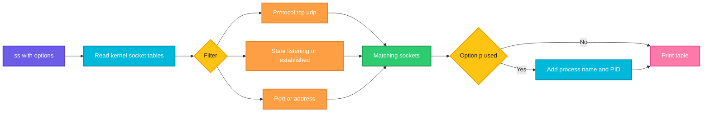

# ss

## What is it?
`ss` (socket statistics) shows network sockets: listening ports, established connections and their states. It reads data directly from the kernel, so it is faster than `netstat`, which it replaces.

## Syntax
```bash
ss [OPTIONS] [FILTER]
```

## Visual Overview
> `ss` reads the socket tables from the kernel, keeps the entries that match your options and filter, and prints them. With `-p` it also looks up the process that owns each socket.



## Options/Flags
| Flag | Description |
|------|-------------|
| `-t` | Show TCP sockets |
| `-u` | Show UDP sockets |
| `-l` | Show only listening sockets |
| `-a` | Show all sockets (listening and not listening) |
| `-n` | Do not resolve names: show numeric ports and addresses |
| `-p` | Show the process that owns each socket (needs root for other users) |
| `-s` | Show a summary of socket counts |
| `-4` / `-6` | Show only IPv4 or only IPv6 |
| `-o` | Show timer information |
| `-e` | Show extended information such as user and inode |
| `-H` | Hide the header line |
| `state STATE` | Filter by TCP state, for example `established` |
| `sport` / `dport` | Filter by source or destination port |

## Usage Examples

### Example 1: Show listening TCP ports with numbers (`-t`, `-l`, `-n`)
**Command:**
```bash
ss -tln
```
**Sample Output:**
```text
State    Recv-Q   Send-Q     Local Address:Port      Peer Address:Port  Process
LISTEN   0        128              0.0.0.0:22             0.0.0.0:*
LISTEN   0        511              0.0.0.0:80             0.0.0.0:*
LISTEN   0        4096           127.0.0.1:5432           0.0.0.0:*
LISTEN   0        128                 [::]:22                [::]:*
```

### Example 2: Show the process that owns each port (`-p`)
**Command:**
```bash
sudo ss -tlnp
```
**Sample Output:**
```text
State    Recv-Q   Send-Q     Local Address:Port      Peer Address:Port  Process
LISTEN   0        128              0.0.0.0:22             0.0.0.0:*      users:(("sshd",pid=812,fd=3))
LISTEN   0        511              0.0.0.0:80             0.0.0.0:*      users:(("nginx",pid=1044,fd=6))
LISTEN   0        4096           127.0.0.1:5432           0.0.0.0:*      users:(("postgres",pid=990,fd=5))
```

### Example 3: Show listening UDP ports (`-u`)
**Command:**
```bash
ss -uln
```
**Sample Output:**
```text
State    Recv-Q   Send-Q     Local Address:Port      Peer Address:Port  Process
UNCONN   0        0          127.0.0.53%lo:53             0.0.0.0:*
UNCONN   0        0                0.0.0.0:68             0.0.0.0:*
```

### Example 4: Show all sockets (`-a`)
**Command:**
```bash
ss -tan
```
**Sample Output:**
```text
State      Recv-Q  Send-Q   Local Address:Port    Peer Address:Port  Process
LISTEN     0       128            0.0.0.0:22           0.0.0.0:*
ESTAB      0       0         192.168.1.20:22      192.168.1.5:51334
TIME-WAIT  0       0         192.168.1.20:80      192.168.1.8:40122
LISTEN     0       511            0.0.0.0:80           0.0.0.0:*
```

### Example 5: Socket summary (`-s`)
**Command:**
```bash
ss -s
```
**Sample Output:**
```text
Total: 214
TCP:   9 (estab 2, closed 3, orphaned 0, timewait 3)

Transport Total     IP        IPv6
RAW       1         0         1
UDP       4         3         1
TCP       6         4         2
INET      11        7         4
FRAG      0         0         0
```

### Example 6: IPv4 or IPv6 only (`-4`, `-6`)
**Command:**
```bash
ss -4 -tln
ss -6 -tln
```
**Sample Output:**
```text
State    Recv-Q   Send-Q     Local Address:Port      Peer Address:Port  Process
LISTEN   0        128              0.0.0.0:22             0.0.0.0:*
LISTEN   0        511              0.0.0.0:80             0.0.0.0:*
State    Recv-Q   Send-Q     Local Address:Port      Peer Address:Port  Process
LISTEN   0        128                 [::]:22                [::]:*
```

### Example 7: Show timers (`-o`)
**Command:**
```bash
ss -tno state established
```
**Sample Output:**
```text
Recv-Q  Send-Q   Local Address:Port    Peer Address:Port  Process
0       0         192.168.1.20:22      192.168.1.5:51334  timer:(keepalive,119min,0)
```

### Example 8: Extended information (`-e`)
**Command:**
```bash
ss -tlne sport = :80
```
**Sample Output:**
```text
State   Recv-Q  Send-Q   Local Address:Port    Peer Address:Port  Process
LISTEN  0       511            0.0.0.0:80           0.0.0.0:*      ino:20931 sk:3 cgroup:/system.slice/nginx.service <->
```

### Example 9: Hide the header (`-H`)
**Command:**
```bash
ss -Htln
```
**Sample Output:**
```text
LISTEN 0 128  0.0.0.0:22  0.0.0.0:*
LISTEN 0 511  0.0.0.0:80  0.0.0.0:*
```

### Example 10: Filter by state
**Command:**
```bash
ss -tn state established
```
**Sample Output:**
```text
Recv-Q  Send-Q   Local Address:Port    Peer Address:Port  Process
0       0         192.168.1.20:22      192.168.1.5:51334
0       0         192.168.1.20:443     192.168.1.9:50622
```

### Example 11: Filter by port (`sport`, `dport`)
**Command:**
```bash
ss -tn sport = :22
ss -tn dport = :443
```
**Sample Output:**
```text
State  Recv-Q  Send-Q   Local Address:Port    Peer Address:Port  Process
ESTAB  0       0         192.168.1.20:22      192.168.1.5:51334
State  Recv-Q  Send-Q   Local Address:Port    Peer Address:Port  Process
ESTAB  0       0         192.168.1.20:48800   140.82.112.3:443
```

## Pitfalls / Gotchas
- Without `-n`, `ss` resolves ports to service names (`ssh` instead of `22`). This can hide the real port number and slow the output.
- Without `-a` or `-l`, `ss` shows only connected (non listening) sockets.
- You need `sudo` with `-p` to see processes owned by other users.
- Filters such as `sport = :22` need spaces around `=`. In many shells you must quote them if you use `(` or `)`.
- `Recv-Q` and `Send-Q` mean different things for LISTEN sockets (queue size) and connected sockets (bytes waiting).

## DevOps Use Cases

### Use Case 1: Confirm a service is listening after a deploy
**Situation:** After deploying, check whether the app listens on port 8080.

**Command:**
```bash
ss -tln sport = :8080
```
**Output:**
```text
State   Recv-Q  Send-Q   Local Address:Port    Peer Address:Port  Process
LISTEN  0       128            0.0.0.0:8080         0.0.0.0:*
```

### Use Case 2: Find which process is blocking a port
**Situation:** The service fails with `Address already in use` on port 3000.

**Command:**
```bash
sudo ss -tlnp sport = :3000
```
**Output:**
```text
State   Recv-Q  Send-Q   Local Address:Port    Peer Address:Port  Process
LISTEN  0       511            0.0.0.0:3000         0.0.0.0:*      users:(("node",pid=7421,fd=19))
```
Kill or stop process 7421, or change the port.

### Use Case 3: Count established connections per client IP
**Situation:** One client may be flooding the server. Count connections to port 443 per source IP.

**Command:**
```bash
ss -Htn state established sport = :443 | awk '{print $4}' | cut -d: -f1 | sort | uniq -c | sort -rn
```
**Output:**
```text
     42 203.0.113.77
      5 198.51.100.4
      2 192.168.1.9
```

### Use Case 4: Spot a socket leak with many TIME-WAIT or CLOSE-WAIT states
**Situation:** The app slows down. Count sockets per state.

**Command:**
```bash
ss -Htan | awk '{print $1}' | sort | uniq -c
```
**Output:**
```text
      4 ESTAB
      2 LISTEN
    318 CLOSE-WAIT
     12 TIME-WAIT
```
A large `CLOSE-WAIT` count means the application is not closing connections.

### Use Case 5: Check connections to a database
**Situation:** Verify how many connections the app holds to PostgreSQL on port 5432.

**Command:**
```bash
ss -tn state established dport = :5432
```
**Output:**
```text
Recv-Q  Send-Q   Local Address:Port    Peer Address:Port  Process
0       0          10.0.1.15:51822      10.0.2.30:5432
0       0          10.0.1.15:51824      10.0.2.30:5432
0       0          10.0.1.15:51830      10.0.2.30:5432
```

### Use Case 6: Audit for unexpected open ports
**Situation:** A security check lists everything listening on all interfaces and compares it with the allowed list.

Let's say we have this file `allowed_ports.txt`:

**Input file** (`allowed_ports.txt`):
```text
22
80
443
```
**Command:**
```bash
ss -Htln | awk '{print $4}' | awk -F: '{print $NF}' | sort -un | grep -vxFf allowed_ports.txt
```
**Output:**
```text
5432
9100
```
Ports 5432 and 9100 are listening but not on the allowed list.

### Use Case 7: Health check for a Kubernetes node or container
**Situation:** Check that the kubelet and the app both listen, from inside a pod that has `ss`.

**Command:**
```bash
kubectl exec web-7d9f -- ss -tln
```
**Output:**
```text
State   Recv-Q  Send-Q   Local Address:Port    Peer Address:Port  Process
LISTEN  0       511            0.0.0.0:8080         0.0.0.0:*
```

### Use Case 8: CI smoke test that waits for a port to open
**Situation:** A pipeline starts a container and must wait until port 8080 is listening.

Let's say we have this file `wait_port.sh`:

**Input file** (`wait_port.sh`):
```bash
#!/bin/bash
PORT=$1
for i in $(seq 1 10); do
    if ss -Htln sport = :$PORT | grep -q LISTEN; then
        echo "Port $PORT is open"
        exit 0
    fi
    sleep 2
done
echo "Port $PORT did not open"
exit 1
```
**Command:**
```bash
bash wait_port.sh 8080
```
**Output:**
```text
Port 8080 is open
```

### Use Case 9: Watch the socket summary during a load test
**Situation:** Refresh the summary every second while running a load test.

**Command:**
```bash
watch -n 1 ss -s
```
**Output:**
```text
Every 1.0s: ss -s

Total: 1840
TCP:   1622 (estab 1204, closed 380, orphaned 3, timewait 376)
```

## Related Commands
- [`netstat`](netstat.md) - the older tool that `ss` replaces
- [`ip`](ip.md) - interfaces, addresses and routes
- [`nc`](nc.md) - test a port from the outside
- [`tcpdump`](tcpdump.md) - capture packets
- `lsof -i` - list open network files per process
