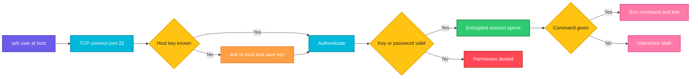

# ssh

## What is it?
`ssh` (Secure Shell) opens an encrypted connection to a remote machine so you can run commands, forward ports and tunnel traffic. It is the standard way to administer Linux servers.

## Syntax
```bash
ssh [OPTIONS] [USER@]HOST [COMMAND]
```

## Visual Overview
> `ssh` connects to the server, verifies the server's host key, authenticates you (key or password) and then opens an encrypted session. You get a shell, or the single command you passed runs and the session closes.



## Options/Flags
| Flag | Description |
|------|-------------|
| `-p PORT` | Connect to this port (default 22) |
| `-i FILE` | Use this private key file |
| `-l USER` | Log in as this user (same as `USER@HOST`) |
| `-v` | Verbose output (`-vv`, `-vvv` for more detail) |
| `-q` | Quiet mode |
| `-t` | Force a pseudo terminal (needed for interactive commands) |
| `-N` | Do not run a command (used for tunnels) |
| `-f` | Go to the background after authentication |
| `-L` | Local port forwarding: `-L LOCAL:HOST:REMOTE` |
| `-R` | Remote port forwarding: `-R REMOTE:HOST:LOCAL` |
| `-D PORT` | Dynamic SOCKS proxy on a local port |
| `-J HOST` | Jump through a bastion (ProxyJump) |
| `-A` | Forward your SSH agent |
| `-o OPTION` | Set a config option, for example `-o StrictHostKeyChecking=no` |
| `-F FILE` | Use this config file instead of `~/.ssh/config` |
| `-C` | Compress traffic |
| `-X` | Enable X11 forwarding |

## Usage Examples

Let's say we have this file `~/.ssh/config`:

**Input file** (`~/.ssh/config`):
```text
Host web01
    HostName 192.168.1.20
    User deploy
    Port 2222
    IdentityFile ~/.ssh/deploy_key
```

Let's say we have this file `custom_config`:

**Input file** (`custom_config`):
```text
Host staging
    HostName 203.0.113.60
    User ubuntu
```

### Example 1: Log in to a server
**Command:**
```bash
ssh deploy@192.168.1.20
```
**Sample Output:**
```text
The authenticity of host '192.168.1.20 (192.168.1.20)' can't be established.
ED25519 key fingerprint is SHA256:abcDEF123exampleFingerprint.
Are you sure you want to continue connecting (yes/no/[fingerprint])? yes
Warning: Permanently added '192.168.1.20' (ED25519) to the list of known hosts.
deploy@192.168.1.20's password:
Welcome to Ubuntu 22.04.4 LTS
deploy@web01:~$
```

### Example 2: Use a different port (`-p`)
**Command:**
```bash
ssh -p 2222 deploy@192.168.1.20
```
**Sample Output:**
```text
Welcome to Ubuntu 22.04.4 LTS
deploy@web01:~$
```

### Example 3: Use a private key (`-i`)
**Command:**
```bash
ssh -i ~/.ssh/deploy_key deploy@192.168.1.20
```
**Sample Output:**
```text
Welcome to Ubuntu 22.04.4 LTS
deploy@web01:~$
```

### Example 4: Give the user with `-l`
**Command:**
```bash
ssh -l deploy 192.168.1.20 hostname
```
**Sample Output:**
```text
web01
```

### Example 5: Run one command and exit
**Command:**
```bash
ssh deploy@192.168.1.20 "uptime"
```
**Sample Output:**
```text
 10:58:21 up 12 days,  3:41,  1 user,  load average: 0.08, 0.03, 0.01
```

### Example 6: Verbose output for debugging (`-v`)
**Command:**
```bash
ssh -v deploy@192.168.1.20 exit
```
**Sample Output:**
```text
OpenSSH_9.6p1 Ubuntu-3ubuntu13, OpenSSL 3.0.13 30 Jan 2024
debug1: Reading configuration data /etc/ssh/ssh_config
debug1: Connecting to 192.168.1.20 [192.168.1.20] port 22.
debug1: Connection established.
debug1: Authenticating to 192.168.1.20:22 as 'deploy'
debug1: Authentication succeeded (publickey).
```

### Example 7: Quiet mode (`-q`)
**Command:**
```bash
ssh -q deploy@192.168.1.20 "echo done"
```
**Sample Output:**
```text
done
```

### Example 8: Force a terminal (`-t`)
**Command:**
```bash
ssh -t deploy@192.168.1.20 "sudo systemctl status nginx --no-pager | head -n 3"
```
**Sample Output:**
```text
[sudo] password for deploy:
● nginx.service - A high performance web server
     Loaded: loaded (/lib/systemd/system/nginx.service; enabled)
     Active: active (running) since Wed 2026-10-07 08:01:12 UTC; 2h 57min ago
```

### Example 9: Local port forwarding (`-L`) in the background (`-N`, `-f`)
Forward local port 5433 to the PostgreSQL port on a private database reached through the server:

**Command:**
```bash
ssh -N -f -L 5433:10.0.2.30:5432 deploy@192.168.1.20
ss -tln sport = :5433
```
**Sample Output:**
```text
State   Recv-Q  Send-Q   Local Address:Port    Peer Address:Port  Process
LISTEN  0       128          127.0.0.1:5433         0.0.0.0:*
```
Now `psql -h 127.0.0.1 -p 5433` reaches the private database.

### Example 10: Remote port forwarding (`-R`)
Make port 8080 of your laptop reachable on port 9000 of the server:

**Command:**
```bash
ssh -N -R 9000:localhost:8080 deploy@192.168.1.20
```
**Sample Output:**
```text
(no output: the command stays connected until you press Ctrl+C)
```
On the server, `curl localhost:9000` now reaches your laptop's port 8080.

### Example 11: SOCKS proxy (`-D`)
**Command:**
```bash
ssh -N -D 1080 deploy@192.168.1.20
```
**Sample Output:**
```text
(no output: the proxy runs until you press Ctrl+C)
```
Set your browser or `curl --socks5-hostname localhost:1080` to use the proxy.

### Example 12: Jump through a bastion host (`-J`)
**Command:**
```bash
ssh -J admin@bastion.example.com deploy@10.0.1.15 hostname
```
**Sample Output:**
```text
app01
```

### Example 13: Forward your SSH agent (`-A`)
**Command:**
```bash
ssh -A deploy@192.168.1.20 "ssh-add -l"
```
**Sample Output:**
```text
256 SHA256:abcDEF123exampleFingerprint deploy@laptop (ED25519)
```

### Example 14: Set an option (`-o`)
**Command:**
```bash
ssh -o ConnectTimeout=5 -o StrictHostKeyChecking=accept-new deploy@192.168.1.20 "echo ok"
```
**Sample Output:**
```text
ok
```

### Example 15: Use a host from the config file
**Command:**
```bash
ssh web01
```
**Sample Output:**
```text
Welcome to Ubuntu 22.04.4 LTS
deploy@web01:~$
```
`ssh web01` reads `HostName`, `User`, `Port` and `IdentityFile` from `~/.ssh/config`.

### Example 16: Use another config file (`-F`)
**Command:**
```bash
ssh -F custom_config staging hostname
```
**Sample Output:**
```text
staging01
```

### Example 17: Compress traffic (`-C`)
**Command:**
```bash
ssh -C deploy@192.168.1.20 "cat /var/log/syslog | head -n 1"
```
**Sample Output:**
```text
Oct  7 08:00:01 web01 systemd[1]: Started Daily apt download activities.
```

### Example 18: X11 forwarding (`-X`)
**Command:**
```bash
ssh -X deploy@192.168.1.20 xclock
```
**Sample Output:**
```text
(a clock window opens on your local screen)
```

## Pitfalls / Gotchas
- Private key files must not be readable by others. If you see `UNPROTECTED PRIVATE KEY FILE`, run `chmod 600 ~/.ssh/id_ed25519`.
- `StrictHostKeyChecking=no` skips the host key check and makes a man in the middle attack possible. Use `accept-new` or manage `known_hosts` properly.
- `-A` (agent forwarding) lets root on the remote host use your keys while you are connected. Prefer `-J` (jump host) when possible.
- A `REMOTE HOST IDENTIFICATION HAS CHANGED` warning means the server's key changed. It can be a rebuilt server or an attack. Verify before you remove the old key with `ssh-keygen -R HOST`.
- Commands with quotes, `$` or pipes must be quoted so they run on the remote side and not on your own machine.
- Without `-t`, interactive programs such as `sudo` prompts, `top` or `vim` can fail.
- Forwarded ports bind to `127.0.0.1` by default. They are not reachable from other machines unless you set a bind address (`-L 0.0.0.0:...`) and the server allows it.

## DevOps Use Cases

### Use Case 1: Run a command on many servers
**Situation:** Check the disk usage on all web servers.

Let's say we have this file `servers.txt`:

**Input file** (`servers.txt`):
```text
web01.example.com
web02.example.com
```
**Command:**
```bash
for s in $(cat servers.txt); do echo "== $s"; ssh deploy@$s "df -h / | tail -n 1"; done
```
**Output:**
```text
== web01.example.com
/dev/sda1        40G   18G   20G  48% /
== web02.example.com
/dev/sda1        40G   35G  3.0G  93% /
```
`web02` is almost full.

### Use Case 2: Deploy by running a remote script
**Situation:** Run a local deploy script on a remote server without copying it.

Let's say we have this file `deploy.sh`:

**Input file** (`deploy.sh`):
```bash
#!/bin/bash
echo "Deploying on $(hostname)"
systemctl restart app
echo "Done"
```
**Command:**
```bash
ssh deploy@192.168.1.20 'bash -s' < deploy.sh
```
**Output:**
```text
Deploying on web01
Done
```

### Use Case 3: Reach a private database through a bastion host
**Situation:** The database is only reachable from the bastion. Build a tunnel.

**Command:**
```bash
ssh -N -f -L 5433:db01.internal:5432 admin@bastion.example.com
psql -h 127.0.0.1 -p 5433 -U app -c "select 1"
```
**Output:**
```text
 ?column?
----------
        1
(1 row)
```

### Use Case 4: Jump through a bastion with the config file
**Situation:** Make `ssh app01` always go through the bastion.

Let's say we have this file `~/.ssh/config`:

**Input file** (`~/.ssh/config`):
```text
Host bastion
    HostName bastion.example.com
    User admin

Host app01
    HostName 10.0.1.15
    User deploy
    ProxyJump bastion
```
**Command:**
```bash
ssh app01 hostname
```
**Output:**
```text
app01
```

### Use Case 5: Stream logs from a remote server
**Situation:** Follow a remote log and filter errors locally.

**Command:**
```bash
ssh deploy@192.168.1.20 "tail -f /var/log/app.log" | grep --line-buffered ERROR
```
**Output:**
```text
2026-10-07 11:02:44 ERROR Connection refused to payment-api
2026-10-07 11:02:51 ERROR Timeout calling payment-api
```

### Use Case 6: Copy a backup stream between servers
**Situation:** Create a tar of a directory on one server and unpack it on another through your machine.

**Command:**
```bash
ssh deploy@web01 "tar czf - /var/www" | ssh deploy@web02 "tar xzf - -C /"
echo "exit code: $?"
```
**Output:**
```text
exit code: 0
```

### Use Case 7: Use ssh in a CI/CD pipeline with a deploy key
**Situation:** A pipeline job restarts a service after deploying. Host checking is set up safely with `accept-new`.

**Command:**
```bash
ssh -i ~/.ssh/deploy_key -o StrictHostKeyChecking=accept-new deploy@192.168.1.20 "sudo systemctl restart app && systemctl is-active app"
```
**Output:**
```text
active
```

### Use Case 8: Test SSH connectivity and key login without opening a shell
**Situation:** A health check verifies key based login works.

**Command:**
```bash
ssh -o BatchMode=yes -o ConnectTimeout=5 deploy@192.168.1.20 exit && echo "SSH OK" || echo "SSH FAILED"
```
**Output:**
```text
SSH OK
```
`BatchMode=yes` makes ssh fail instead of asking for a password.

### Use Case 9: Debug "Permission denied (publickey)"
**Situation:** Key login fails. Use verbose mode to see which keys are tried.

**Command:**
```bash
ssh -vv deploy@192.168.1.20 2>&1 | grep -E "Offering|Authentications|denied"
```
**Output:**
```text
debug1: Offering public key: /home/user/.ssh/id_ed25519 ED25519 SHA256:abcDEF123example agent
debug1: Authentications that can continue: publickey
deploy@192.168.1.20: Permission denied (publickey).
```
The server rejected the offered key. Check `~/.ssh/authorized_keys` on the server and its permissions.

### Use Case 10: Access a Kubernetes dashboard through an SSH tunnel
**Situation:** The dashboard listens only on the control plane node's localhost.

**Command:**
```bash
ssh -N -f -L 8443:localhost:8443 admin@k8s-master.example.com
curl -sk -o /dev/null -w "%{http_code}\n" https://localhost:8443
```
**Output:**
```text
200
```

## Related Commands
- [`scp`](scp.md) - copy files over SSH
- [`curl`](curl.md) - call HTTP services, also through tunnels
- [`ss`](ss.md) - check forwarded ports locally
- [`nc`](nc.md) - test that port 22 is reachable
- `ssh-keygen` - create and manage SSH keys
- `rsync` - sync files over SSH
