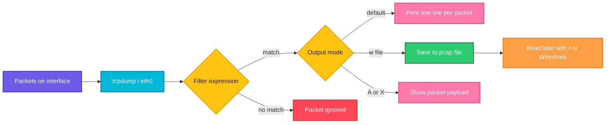

# tcpdump

## What is it?
`tcpdump` captures and prints network packets as they pass through a network interface. It is the main command line packet analyzer: you can watch live traffic, filter it by host, port or protocol, and save it to a file for later analysis (for example in Wireshark).

## Syntax
```bash
sudo tcpdump [OPTIONS] [FILTER EXPRESSION]
```

## Visual Overview
> `tcpdump` puts the interface into capture mode, applies your filter in the kernel (BPF), and prints or saves only the packets that match. You can stop after a number of packets or when you press `Ctrl+C`.



## Options/Flags
| Flag | Description |
|------|-------------|
| `-i IFACE` | Capture on this interface (`any` for all) |
| `-D` | List the interfaces available for capture |
| `-n` | Do not resolve host names |
| `-nn` | Do not resolve host names or port names |
| `-c N` | Stop after `N` packets |
| `-w FILE` | Write the raw packets to a file |
| `-r FILE` | Read packets from a file |
| `-v` / `-vv` | More verbose output |
| `-A` | Print packet payload as ASCII |
| `-X` | Print packet payload in hex and ASCII |
| `-s N` | Capture `N` bytes of each packet (`0` for the full packet) |
| `-e` | Show the link level (MAC) header |
| `-q` | Quiet: print less protocol information |
| `-t` / `-tttt` | No timestamps / human readable timestamps with date |
| `-l` | Line buffered output (useful in pipes) |
| `-F FILE` | Read the filter expression from a file |
| `host`, `port`, `src`, `dst`, `net` | Filter keywords |
| `and`, `or`, `not` | Combine filters |

## Usage Examples

Let's say we have this file `filter.txt`:

**Input file** (`filter.txt`):
```text
tcp port 443 and host 203.0.113.10
```

### Example 1: Capture on an interface (`-i`)
**Command:**
```bash
sudo tcpdump -i eth0 -c 3
```
**Sample Output:**
```text
tcpdump: verbose output suppressed, use -v[v]... for full protocol decode
listening on eth0, link-type EN10MB (Ethernet), snapshot length 262144 bytes
11:10:01.120331 IP web01.ssh > 192.168.1.5.51334: Flags [P.], seq 2400:2512, ack 1, win 501, length 112
11:10:01.120845 IP 192.168.1.5.51334 > web01.ssh: Flags [.], ack 2512, win 4096, length 0
11:10:01.452110 ARP, Request who-has 192.168.1.1 tell 192.168.1.20, length 28
3 packets captured
3 packets received by filter
0 packets dropped by kernel
```

### Example 2: List interfaces (`-D`)
**Command:**
```bash
tcpdump -D
```
**Sample Output:**
```text
1.eth0 [Up, Running, Connected]
2.any (Pseudo-device that captures on all interfaces) [Up, Running]
3.lo [Up, Running, Loopback]
4.docker0 [Up, Running]
```

### Example 3: Do not resolve names (`-n`, `-nn`)
**Command:**
```bash
sudo tcpdump -i eth0 -c 2 -n
sudo tcpdump -i eth0 -c 2 -nn
```
**Sample Output:**
```text
11:11:01.120331 IP 192.168.1.20.ssh > 192.168.1.5.51334: Flags [P.], seq 2400:2512, ack 1, win 501, length 112
11:11:01.120845 IP 192.168.1.5.51334 > 192.168.1.20.ssh: Flags [.], ack 2512, win 4096, length 0
11:11:02.120331 IP 192.168.1.20.22 > 192.168.1.5.51334: Flags [P.], seq 2512:2624, ack 1, win 501, length 112
11:11:02.120845 IP 192.168.1.5.51334 > 192.168.1.20.22: Flags [.], ack 2624, win 4096, length 0
```
With `-n` the port is still shown as a name (`ssh`). With `-nn` it is shown as a number (`22`).

### Example 4: Filter by host
**Command:**
```bash
sudo tcpdump -i eth0 -nn -c 2 host 203.0.113.10
```
**Sample Output:**
```text
11:12:05.001122 IP 192.168.1.20.48800 > 203.0.113.10.443: Flags [S], seq 3011223344, win 64240, length 0
11:12:05.015400 IP 203.0.113.10.443 > 192.168.1.20.48800: Flags [S.], seq 1122334455, ack 3011223345, win 65535, length 0
```

### Example 5: Filter by port
**Command:**
```bash
sudo tcpdump -i eth0 -nn -c 2 port 53
```
**Sample Output:**
```text
11:13:10.220001 IP 192.168.1.20.41022 > 192.168.1.1.53: 41022+ A? example.com. (29)
11:13:10.238870 IP 192.168.1.1.53 > 192.168.1.20.41022: 41022 1/0/0 A 93.184.216.34 (45)
```

### Example 6: Filter by source or destination (`src`, `dst`)
**Command:**
```bash
sudo tcpdump -i eth0 -nn -c 1 src 192.168.1.5
sudo tcpdump -i eth0 -nn -c 1 dst port 80
```
**Sample Output:**
```text
11:14:00.100200 IP 192.168.1.5.51334 > 192.168.1.20.22: Flags [.], ack 2624, win 4096, length 0
11:14:02.400100 IP 198.51.100.4.50011 > 192.168.1.20.80: Flags [S], seq 77001, win 64240, length 0
```

### Example 7: Filter by network (`net`)
**Command:**
```bash
sudo tcpdump -i eth0 -nn -c 2 net 10.0.2.0/24
```
**Sample Output:**
```text
11:15:00.310200 IP 192.168.1.20.51822 > 10.0.2.30.5432: Flags [P.], seq 1:42, ack 1, win 501, length 41
11:15:00.311500 IP 10.0.2.30.5432 > 192.168.1.20.51822: Flags [.], ack 42, win 502, length 0
```

### Example 8: Combine filters (`and`, `or`, `not`)
**Command:**
```bash
sudo tcpdump -i eth0 -nn -c 2 'tcp and port 443 and not host 192.168.1.5'
```
**Sample Output:**
```text
11:16:20.500010 IP 192.168.1.20.48800 > 203.0.113.10.443: Flags [P.], seq 1:518, ack 1, win 501, length 517
11:16:20.514020 IP 203.0.113.10.443 > 192.168.1.20.48800: Flags [.], ack 518, win 502, length 0
```

### Example 9: Save to a file (`-w`) and read it back (`-r`)
**Command:**
```bash
sudo tcpdump -i eth0 -nn -c 3 -w capture.pcap port 443
tcpdump -nn -r capture.pcap
```
**Sample Output:**
```text
tcpdump: listening on eth0, link-type EN10MB (Ethernet), snapshot length 262144 bytes
3 packets captured
3 packets received by filter
0 packets dropped by kernel
reading from file capture.pcap, link-type EN10MB (Ethernet), snapshot length 262144
11:17:30.000100 IP 192.168.1.20.48800 > 203.0.113.10.443: Flags [S], seq 3011223344, win 64240, length 0
11:17:30.014200 IP 203.0.113.10.443 > 192.168.1.20.48800: Flags [S.], seq 1122334455, ack 3011223345, win 65535, length 0
11:17:30.014250 IP 192.168.1.20.48800 > 203.0.113.10.443: Flags [.], ack 1, win 502, length 0
```

### Example 10: More detail (`-v`, `-vv`)
**Command:**
```bash
sudo tcpdump -i eth0 -nn -c 1 -vv port 53
```
**Sample Output:**
```text
11:18:00.100100 IP (tos 0x0, ttl 64, id 31022, offset 0, flags [DF], proto UDP (17), length 57)
    192.168.1.20.41022 > 192.168.1.1.53: [udp sum ok] 41022+ A? example.com. (29)
```

### Example 11: Show the payload as text (`-A`)
**Command:**
```bash
sudo tcpdump -i lo -nn -c 3 -A port 8080
```
**Sample Output:**
```text
11:19:00.100100 IP 127.0.0.1.50122 > 127.0.0.1.8080: Flags [P.], seq 1:79, ack 1, win 512, length 78: HTTP: GET /health HTTP/1.1
E..j.@.@.....................P...........GET /health HTTP/1.1
Host: localhost:8080
User-Agent: curl/8.5.0
Accept: */*
```

### Example 12: Show the payload in hex and ASCII (`-X`)
**Command:**
```bash
sudo tcpdump -i lo -nn -c 1 -X port 8080
```
**Sample Output:**
```text
11:20:00.100100 IP 127.0.0.1.50122 > 127.0.0.1.8080: Flags [P.], seq 1:79, ack 1, win 512, length 78: HTTP: GET /health HTTP/1.1
	0x0000:  4500 0082 6f40 4000 4006 cd3a 7f00 0001  E...o@@.@..:....
	0x0010:  7f00 0001 c3ca 1f90 5d4f 1e22 0d0a 3a11  ........]O."..:.
	0x0020:  8018 0200 fe76 0000 0101 080a 0a1b 2c3d  .....v........,=
```

### Example 13: Capture whole packets (`-s`)
**Command:**
```bash
sudo tcpdump -i eth0 -nn -s 0 -c 1 -w full.pcap port 443
```
**Sample Output:**
```text
tcpdump: listening on eth0, link-type EN10MB (Ethernet), snapshot length 262144 bytes
1 packet captured
1 packet received by filter
0 packets dropped by kernel
```

### Example 14: Show MAC addresses (`-e`)
**Command:**
```bash
sudo tcpdump -i eth0 -nn -e -c 1 arp
```
**Sample Output:**
```text
11:21:00.452110 08:00:27:4e:66:a1 > ff:ff:ff:ff:ff:ff, ethertype ARP (0x0806), length 42: Request who-has 192.168.1.1 tell 192.168.1.20, length 28
```

### Example 15: Quiet output (`-q`)
**Command:**
```bash
sudo tcpdump -i eth0 -nn -q -c 2 port 22
```
**Sample Output:**
```text
11:22:00.120331 IP 192.168.1.20.22 > 192.168.1.5.51334: tcp 112
11:22:00.120845 IP 192.168.1.5.51334 > 192.168.1.20.22: tcp 0
```

### Example 16: Timestamps (`-t`, `-tttt`)
**Command:**
```bash
sudo tcpdump -i eth0 -nn -c 1 -tttt port 22
sudo tcpdump -i eth0 -nn -c 1 -t port 22
```
**Sample Output:**
```text
2026-10-07 11:23:00.120331 IP 192.168.1.20.22 > 192.168.1.5.51334: Flags [P.], seq 2400:2512, ack 1, win 501, length 112
IP 192.168.1.20.22 > 192.168.1.5.51334: Flags [P.], seq 2512:2624, ack 1, win 501, length 112
```

### Example 17: Line buffered output for pipes (`-l`)
**Command:**
```bash
sudo tcpdump -i eth0 -nn -l port 53 | grep -m 1 "example.com"
```
**Sample Output:**
```text
11:24:10.220001 IP 192.168.1.20.41022 > 192.168.1.1.53: 41022+ A? example.com. (29)
```

### Example 18: Read the filter from a file (`-F`)
**Command:**
```bash
sudo tcpdump -i eth0 -nn -c 2 -F filter.txt
```
**Sample Output:**
```text
11:25:05.001122 IP 192.168.1.20.48800 > 203.0.113.10.443: Flags [S], seq 3011223344, win 64240, length 0
11:25:05.015400 IP 203.0.113.10.443 > 192.168.1.20.48800: Flags [S.], seq 1122334455, ack 3011223345, win 65535, length 0
```

## Pitfalls / Gotchas
- You need root (`sudo`) to capture packets.
- Without `-n` or `-nn`, `tcpdump` does DNS lookups for every IP, which slows it down and generates extra DNS traffic that shows up in your own capture.
- Capturing on a busy interface without a filter produces huge output and files. Always filter and use `-c`.
- The default snapshot length is 262144 bytes on newer versions, but older versions cut packets to 96 bytes. Use `-s 0` there if you need the full payload.
- Traffic encrypted with TLS or SSH shows only headers. The payload is unreadable.
- Capture files can contain passwords and tokens. Treat them as sensitive and delete them after use.
- Filters with special characters (`(`, `)`, `&`) need to be quoted.
- On a switch network you only see your own traffic and broadcasts, unless you use a mirror port.

## DevOps Use Cases

### Use Case 1: Check if traffic from a service arrives at a server
**Situation:** The app says it sends requests to the API on port 8080, but the API logs show nothing.

**Command:**
```bash
sudo tcpdump -i eth0 -nn -c 3 'tcp port 8080 and src 10.0.1.15'
```
**Output:**
```text
11:30:01.100100 IP 10.0.1.15.51822 > 192.168.1.20.8080: Flags [S], seq 77001, win 64240, length 0
11:30:02.103200 IP 10.0.1.15.51822 > 192.168.1.20.8080: Flags [S], seq 77001, win 64240, length 0
11:30:04.107300 IP 10.0.1.15.51822 > 192.168.1.20.8080: Flags [S], seq 77001, win 64240, length 0
```
The server receives the SYN but never answers (no `S.` back). A local firewall or the app itself is not accepting the connection.

### Use Case 2: Debug DNS problems
**Situation:** Name lookups are slow or fail. Watch the DNS queries and responses.

**Command:**
```bash
sudo tcpdump -i any -nn -c 4 port 53
```
**Output:**
```text
11:31:00.220001 IP 192.168.1.20.41022 > 192.168.1.1.53: 41022+ A? api.example.com. (33)
11:31:05.221100 IP 192.168.1.20.41022 > 192.168.1.1.53: 41022+ A? api.example.com. (33)
11:31:10.222200 IP 192.168.1.20.41022 > 192.168.1.1.53: 41022+ A? api.example.com. (33)
11:31:15.223300 IP 192.168.1.20.41022 > 192.168.1.1.53: 41022+ A? api.example.com. (33)
```
Queries go out but no responses come back, so the DNS server is not answering.

### Use Case 3: Find out who is sending traffic to a port
**Situation:** Find the busiest clients that connect to port 443 over a short sample.

**Command:**
```bash
sudo tcpdump -i eth0 -nn -c 200 'tcp dst port 443' | awk '{print $3}' | cut -d. -f1-4 | sort | uniq -c | sort -rn | head -n 3
```
**Output:**
```text
    142 203.0.113.77
     41 198.51.100.4
     17 192.168.1.9
```

### Use Case 4: See HTTP traffic in clear text for debugging an internal service
**Situation:** A plain HTTP call between two internal services returns the wrong data. Look at the actual request.

**Command:**
```bash
sudo tcpdump -i lo -nn -c 2 -A 'tcp port 8080 and (tcp[tcpflags] & tcp-push != 0)'
```
**Output:**
```text
11:32:10.100100 IP 127.0.0.1.50122 > 127.0.0.1.8080: Flags [P.], seq 1:79, ack 1, win 512, length 78: HTTP: GET /api/items?id=7 HTTP/1.1
E..j.@.@.....................P...........GET /api/items?id=7 HTTP/1.1
Host: localhost:8080
Accept: */*

11:32:10.101200 IP 127.0.0.1.8080 > 127.0.0.1.50122: Flags [P.], seq 1:120, ack 79, win 512, length 119: HTTP: HTTP/1.1 500 Internal Server Error
```
The server answers with a 500, so the problem is in the service, not the network.

### Use Case 5: Capture traffic for 60 seconds and analyze it later
**Situation:** An intermittent problem needs a capture that the network team can open in Wireshark.

**Command:**
```bash
sudo timeout 60 tcpdump -i eth0 -nn -w /tmp/incident.pcap host 10.0.2.30
ls -lh /tmp/incident.pcap
```
**Output:**
```text
tcpdump: listening on eth0, link-type EN10MB (Ethernet), snapshot length 262144 bytes
1823 packets captured
1823 packets received by filter
0 packets dropped by kernel
-rw-r--r-- 1 root root 412K Oct  7 11:35 /tmp/incident.pcap
```

### Use Case 6: Detect TCP resets and connection failures
**Situation:** Clients report "connection reset". Capture packets with the RST flag.

**Command:**
```bash
sudo tcpdump -i eth0 -nn -c 2 'tcp[tcpflags] & tcp-rst != 0'
```
**Output:**
```text
11:36:00.100100 IP 192.168.1.20.5432 > 10.0.1.15.51822: Flags [R.], seq 1, ack 42, win 0, length 0
11:36:00.100900 IP 192.168.1.20.5432 > 10.0.1.15.51824: Flags [R.], seq 1, ack 17, win 0, length 0
```
The database server resets connections. Check its connection limit and logs.

### Use Case 7: Verify that a Kubernetes service reaches the pod
**Situation:** Check that traffic for a pod arrives on the node's bridge interface.

**Command:**
```bash
sudo tcpdump -i cni0 -nn -c 2 host 10.244.1.15 and port 8080
```
**Output:**
```text
11:37:10.200100 IP 10.244.0.1.43211 > 10.244.1.15.8080: Flags [S], seq 99001, win 64240, length 0
11:37:10.200400 IP 10.244.1.15.8080 > 10.244.0.1.43211: Flags [S.], seq 55001, ack 99002, win 65160, length 0
```

### Use Case 8: Prove that a firewall change works
**Situation:** After opening port 9000, check that packets arrive on the server.

**Command:**
```bash
sudo tcpdump -i eth0 -nn -c 1 port 9000
```
**Output:**
```text
11:38:00.100100 IP 203.0.113.20.50011 > 192.168.1.20.9000: Flags [S], seq 12001, win 64240, length 0
```
The first SYN arrives, so the firewall now lets the traffic through.

### Use Case 9: Monitor ICMP to investigate ping problems
**Situation:** Verify that ping requests reach the server and that replies leave it.

**Command:**
```bash
sudo tcpdump -i eth0 -nn -c 2 icmp
```
**Output:**
```text
11:39:00.100100 IP 192.168.1.5 > 192.168.1.20: ICMP echo request, id 1021, seq 1, length 64
11:39:00.100200 IP 192.168.1.20 > 192.168.1.5: ICMP echo reply, id 1021, seq 1, length 64
```

### Use Case 10: Run a quick capture inside a container without installing tools
**Situation:** The container has no `tcpdump`. Use the host to capture inside the container's network namespace.

**Command:**
```bash
PID=$(docker inspect -f '{{.State.Pid}}' web)
sudo nsenter -t $PID -n tcpdump -i eth0 -nn -c 2
```
**Output:**
```text
listening on eth0, link-type EN10MB (Ethernet), snapshot length 262144 bytes
11:40:00.100100 IP 172.17.0.1.52211 > 172.17.0.2.8080: Flags [S], seq 31001, win 64240, length 0
11:40:00.100300 IP 172.17.0.2.8080 > 172.17.0.1.52211: Flags [S.], seq 41001, ack 31002, win 65160, length 0
```

## Related Commands
- [`ss`](ss.md) - show sockets and listening ports
- [`ip`](ip.md) - show interfaces to capture on
- [`ping`](ping.md) - generate ICMP traffic to capture
- [`curl`](curl.md) - generate HTTP traffic to capture
- [`traceroute`](traceroute.md) - generate path probes
- `wireshark` / `tshark` - graphical and command line packet analysis
