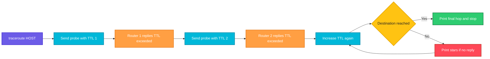

# traceroute

## What is it?
`traceroute` shows the path packets take from your machine to a destination, one router (hop) at a time, together with the time each hop needs to answer. It helps to find where a connection slows down or stops.

## Syntax
```bash
traceroute [OPTIONS] DESTINATION
```

## Visual Overview
> `traceroute` sends packets with a TTL (time to live) of 1, then 2, then 3 and so on. Each router that drops a packet because the TTL reached zero answers with an error, which reveals that router. This repeats until the destination answers.



## Options/Flags
| Flag | Description |
|------|-------------|
| `-n` | Do not resolve IP addresses to names (faster) |
| `-m MAX` | Maximum number of hops (default 30) |
| `-q N` | Number of probes per hop (default 3) |
| `-w SECONDS` | Time to wait for a reply to each probe |
| `-f FIRST` | Start at this TTL instead of 1 |
| `-I` | Use ICMP echo probes instead of UDP |
| `-T` | Use TCP SYN probes |
| `-p PORT` | Destination port (for UDP and TCP probes) |
| `-i INTERFACE` | Send probes out of this interface |
| `-s ADDRESS` | Use this source address |
| `-4` / `-6` | Force IPv4 or IPv6 |

## Usage Examples

### Example 1: Trace a route
**Command:**
```bash
traceroute example.com
```
**Sample Output:**
```text
traceroute to example.com (93.184.216.34), 30 hops max, 60 byte packets
 1  _gateway (192.168.1.1)  1.021 ms  0.987 ms  1.140 ms
 2  10.20.0.1 (10.20.0.1)  4.832 ms  4.790 ms  4.901 ms
 3  isp-core.example.net (198.51.100.5)  9.210 ms  9.305 ms  9.188 ms
 4  93.184.216.34 (93.184.216.34)  14.510 ms  14.388 ms  14.602 ms
```

### Example 2: Do not resolve names (`-n`)
**Command:**
```bash
traceroute -n example.com
```
**Sample Output:**
```text
traceroute to example.com (93.184.216.34), 30 hops max, 60 byte packets
 1  192.168.1.1  1.021 ms  0.987 ms  1.140 ms
 2  10.20.0.1  4.832 ms  4.790 ms  4.901 ms
 3  198.51.100.5  9.210 ms  9.305 ms  9.188 ms
 4  93.184.216.34  14.510 ms  14.388 ms  14.602 ms
```

### Example 3: Limit the number of hops (`-m`)
**Command:**
```bash
traceroute -n -m 2 example.com
```
**Sample Output:**
```text
traceroute to example.com (93.184.216.34), 2 hops max, 60 byte packets
 1  192.168.1.1  1.021 ms  0.987 ms  1.140 ms
 2  10.20.0.1  4.832 ms  4.790 ms  4.901 ms
```

### Example 4: Number of probes per hop (`-q`)
**Command:**
```bash
traceroute -n -q 1 example.com
```
**Sample Output:**
```text
traceroute to example.com (93.184.216.34), 30 hops max, 60 byte packets
 1  192.168.1.1  1.021 ms
 2  10.20.0.1  4.832 ms
 3  198.51.100.5  9.210 ms
 4  93.184.216.34  14.510 ms
```

### Example 5: Wait time per probe (`-w`)
**Command:**
```bash
traceroute -n -w 1 -m 3 203.0.113.99
```
**Sample Output:**
```text
traceroute to 203.0.113.99 (203.0.113.99), 3 hops max, 60 byte packets
 1  192.168.1.1  1.021 ms  0.987 ms  1.140 ms
 2  10.20.0.1  4.832 ms  4.790 ms  4.901 ms
 3  * * *
```

### Example 6: Start at a later hop (`-f`)
**Command:**
```bash
traceroute -n -f 3 example.com
```
**Sample Output:**
```text
traceroute to example.com (93.184.216.34), 30 hops max, 60 byte packets
 3  198.51.100.5  9.210 ms  9.305 ms  9.188 ms
 4  93.184.216.34  14.510 ms  14.388 ms  14.602 ms
```

### Example 7: Use ICMP probes (`-I`)
**Command:**
```bash
sudo traceroute -n -I example.com
```
**Sample Output:**
```text
traceroute to example.com (93.184.216.34), 30 hops max, 60 byte packets
 1  192.168.1.1  1.002 ms  0.951 ms  1.087 ms
 2  10.20.0.1  4.801 ms  4.760 ms  4.844 ms
 3  198.51.100.5  9.150 ms  9.204 ms  9.121 ms
 4  93.184.216.34  14.402 ms  14.351 ms  14.480 ms
```

### Example 8: Use TCP probes on a port (`-T`, `-p`)
**Command:**
```bash
sudo traceroute -n -T -p 443 example.com
```
**Sample Output:**
```text
traceroute to example.com (93.184.216.34), 30 hops max, 60 byte packets
 1  192.168.1.1  1.040 ms  1.012 ms  1.133 ms
 2  10.20.0.1  4.870 ms  4.822 ms  4.933 ms
 3  198.51.100.5  9.240 ms  9.311 ms  9.200 ms
 4  93.184.216.34  14.530 ms  14.410 ms  14.620 ms
```

### Example 9: Choose the interface (`-i`)
**Command:**
```bash
traceroute -n -i eth1 -m 2 10.0.2.1
```
**Sample Output:**
```text
traceroute to 10.0.2.1 (10.0.2.1), 2 hops max, 60 byte packets
 1  10.0.2.1  0.412 ms  0.380 ms  0.402 ms
```

### Example 10: Choose the source address (`-s`)
**Command:**
```bash
traceroute -n -s 192.168.1.50 -m 2 example.com
```
**Sample Output:**
```text
traceroute to example.com (93.184.216.34), 2 hops max, 60 byte packets
 1  192.168.1.1  1.030 ms  0.995 ms  1.120 ms
 2  10.20.0.1  4.840 ms  4.800 ms  4.915 ms
```

### Example 11: Force IPv4 or IPv6 (`-4`, `-6`)
**Command:**
```bash
traceroute -4 -n -m 1 example.com
traceroute -6 -n -m 1 example.com
```
**Sample Output:**
```text
traceroute to example.com (93.184.216.34), 1 hops max, 60 byte packets
 1  192.168.1.1  1.021 ms  0.987 ms  1.140 ms
traceroute to example.com (2606:2800:220:1:248:1893:25c8:1946), 1 hops max, 80 byte packets
 1  fe80::1  1.310 ms  1.250 ms  1.402 ms
```

## Pitfalls / Gotchas
- `* * *` on a hop does not always mean a problem. Many routers do not answer probes but still forward traffic. It is only a problem if all following hops also show stars.
- Default probes use UDP. Firewalls often block these. Try `-I` (ICMP) or `-T -p 443` (TCP) to get through.
- `-I` and `-T` need root.
- A high latency on one hop followed by normal latency on later hops is usually the router answering slowly, not a real problem.
- The path out and the path back can differ. `traceroute` only shows the way out.
- If `traceroute` is not found, install it (`apt install traceroute`). On minimal systems `tracepath` is often present instead.

## DevOps Use Cases

### Use Case 1: Find where a connection to a service breaks
**Situation:** An app cannot reach `10.50.0.20` in another VPC. See where the packets stop.

**Command:**
```bash
traceroute -n -w 1 -m 6 10.50.0.20
```
**Output:**
```text
traceroute to 10.50.0.20 (10.50.0.20), 6 hops max, 60 byte packets
 1  10.0.1.1  0.620 ms  0.601 ms  0.588 ms
 2  10.0.0.1  1.120 ms  1.098 ms  1.130 ms
 3  * * *
 4  * * *
 5  * * *
 6  * * *
```
The packets stop after hop 2. Check route tables, peering and security groups at that boundary.

### Use Case 2: Check the path through a firewall that blocks UDP
**Situation:** Default traceroute only shows stars. Test over TCP on the service port.

**Command:**
```bash
sudo traceroute -n -T -p 443 shop.example.com
```
**Output:**
```text
traceroute to shop.example.com (203.0.113.50), 30 hops max, 60 byte packets
 1  10.0.1.1  0.640 ms  0.610 ms  0.601 ms
 2  198.51.100.1  3.210 ms  3.188 ms  3.240 ms
 3  203.0.113.50  8.420 ms  8.390 ms  8.455 ms
```

### Use Case 3: Locate a latency jump between regions
**Situation:** Users in Asia report slow responses. Compare latency per hop.

**Command:**
```bash
traceroute -n -q 1 app.example.com
```
**Output:**
```text
traceroute to app.example.com (203.0.113.80), 30 hops max, 60 byte packets
 1  10.0.1.1  0.600 ms
 2  198.51.100.1  2.100 ms
 3  198.51.100.9  3.050 ms
 4  192.0.2.17  182.400 ms
 5  203.0.113.80  184.100 ms
```
The jump from 3 ms to 182 ms at hop 4 shows an ocean crossing or a congested link at that provider.

### Use Case 4: Verify traffic leaves through the VPN
**Situation:** After connecting a VPN, confirm that traffic to the office network uses `tun0`.

**Command:**
```bash
traceroute -n -m 2 172.16.5.10
```
**Output:**
```text
traceroute to 172.16.5.10 (172.16.5.10), 2 hops max, 60 byte packets
 1  10.8.0.1  28.410 ms  27.980 ms  28.120 ms
 2  172.16.5.10  29.300 ms  29.150 ms  29.410 ms
```
The first hop `10.8.0.1` is the VPN gateway, so traffic goes through the tunnel.

### Use Case 5: Compare the path through two interfaces
**Situation:** A server has two uplinks. Check that the backup link works.

**Command:**
```bash
traceroute -n -i eth1 -m 3 8.8.8.8
```
**Output:**
```text
traceroute to 8.8.8.8 (8.8.8.8), 3 hops max, 60 byte packets
 1  10.0.2.1  0.610 ms  0.580 ms  0.595 ms
 2  198.51.100.33  4.120 ms  4.090 ms  4.150 ms
 3  8.8.8.8  9.820 ms  9.790 ms  9.855 ms
```

### Use Case 6: Save the route to a log for the network team
**Situation:** Attach evidence to an incident ticket.

**Command:**
```bash
traceroute -n api.example.com > /tmp/trace_api.txt 2>&1
cat /tmp/trace_api.txt
```
**Output:**
```text
traceroute to api.example.com (203.0.113.10), 30 hops max, 60 byte packets
 1  10.0.1.1  0.640 ms  0.610 ms  0.601 ms
 2  198.51.100.1  3.210 ms  3.188 ms  3.240 ms
 3  203.0.113.10  8.420 ms  8.390 ms  8.455 ms
```

### Use Case 7: Count the hops to a host in a script
**Situation:** Report the hop count to a remote site.

**Command:**
```bash
traceroute -n -q 1 203.0.113.10 | tail -n +2 | wc -l
```
**Output:**
```text
3
```

### Use Case 8: Check if a cloud region is reached through the expected gateway
**Situation:** Traffic to a cloud API must go through the NAT gateway at `10.0.0.5`.

**Command:**
```bash
traceroute -n -m 2 203.0.113.10 | grep -c "10.0.0.5"
```
**Output:**
```text
1
```

## Related Commands
- [`ping`](ping.md) - test basic reachability and latency
- [`ip`](ip.md) - view the routing table that decides the first hop
- [`tcpdump`](tcpdump.md) - capture the probe and reply packets
- [`dig`](dig.md) - check DNS before tracing
- `mtr` - live traceroute with loss statistics
