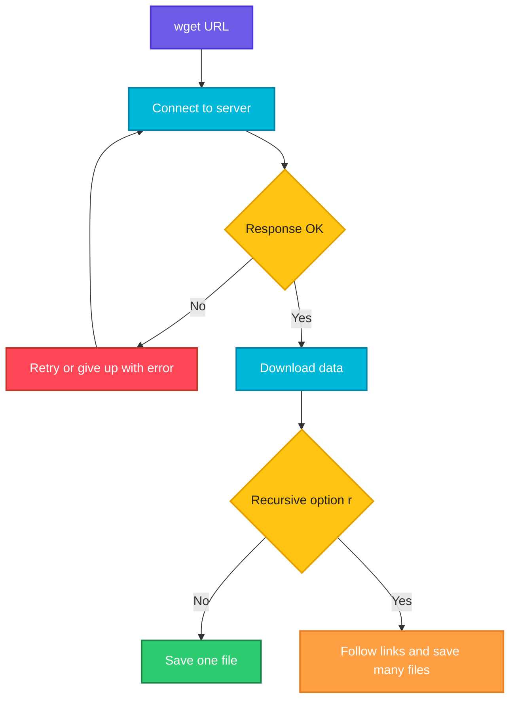

# wget

## What is it?
`wget` downloads files from the web over HTTP, HTTPS and FTP. It works without user interaction, can resume broken downloads and can download whole websites recursively. This makes it a good fit for scripts and servers.

## Syntax
```bash
wget [OPTIONS] URL...
```

## Visual Overview
> `wget` connects to the URL, downloads the file and saves it in the current directory (or where you tell it). If the transfer breaks, it can retry or resume. With `-r` it follows links and downloads more files.



## Options/Flags
| Flag | Description |
|------|-------------|
| `-O FILE` | Save the download as `FILE` (use `-O -` to print to stdout) |
| `-P DIR` | Save files into the directory `DIR` |
| `-c` | Continue a partially downloaded file |
| `-q` | Quiet: print nothing |
| `-b` | Run in the background (output goes to `wget-log`) |
| `-i FILE` | Download all URLs listed in `FILE` |
| `-r` | Recursive download |
| `-np` | Do not go up to the parent directory when recursing |
| `-l DEPTH` | Maximum recursion depth |
| `-m` | Mirror a site (recursion, timestamping, infinite depth) |
| `--limit-rate=RATE` | Limit the download speed, for example `200k` |
| `-t N` | Number of retries |
| `-T SECONDS` | Network timeout |
| `-N` | Download only if the remote file is newer |
| `-nc` | Do not overwrite or re-download an existing file |
| `--spider` | Check that a URL exists without downloading it |
| `-S` | Print the server response headers |
| `--header="H: v"` | Add a request header |
| `--user=USER --password=PASS` | Send basic authentication credentials |
| `--no-check-certificate` | Skip TLS certificate verification (insecure) |
| `-A LIST` | Accept only files with these extensions |

## Usage Examples

Let's say we have this file `urls.txt`:

**Input file** (`urls.txt`):
```text
https://downloads.example.com/a.txt
https://downloads.example.com/b.txt
```

### Example 1: Download a file
**Command:**
```bash
wget https://downloads.example.com/tool-1.2.tar.gz
```
**Sample Output:**
```text
--2026-10-07 10:40:11--  https://downloads.example.com/tool-1.2.tar.gz
Resolving downloads.example.com (downloads.example.com)... 203.0.113.20
Connecting to downloads.example.com (downloads.example.com)|203.0.113.20|:443... connected.
HTTP request sent, awaiting response... 200 OK
Length: 2097152 (2.0M) [application/gzip]
Saving to: 'tool-1.2.tar.gz'

tool-1.2.tar.gz     100%[===================>]   2.00M  5.10MB/s    in 0.4s

2026-10-07 10:40:12 (5.10 MB/s) - 'tool-1.2.tar.gz' saved [2097152/2097152]
```

### Example 2: Save under another name (`-O`)
**Command:**
```bash
wget -q -O tool.tar.gz https://downloads.example.com/tool-1.2.tar.gz
ls tool.tar.gz
```
**Sample Output:**
```text
tool.tar.gz
```
`-q` hides the progress output, so only the `ls` line is printed.

### Example 3: Print to stdout (`-O -`) with quiet mode (`-q`)
**Command:**
```bash
wget -qO- https://api.example.com/health
```
**Sample Output:**
```text
{"status":"ok"}
```

### Example 4: Save into a directory (`-P`)
**Command:**
```bash
wget -q -P /tmp/downloads https://downloads.example.com/tool-1.2.tar.gz
ls /tmp/downloads
```
**Sample Output:**
```text
tool-1.2.tar.gz
```

### Example 5: Resume a download (`-c`)
Let's say a previous download stopped at 1 MB:

**Command:**
```bash
ls -l tool-1.2.tar.gz
wget -c https://downloads.example.com/tool-1.2.tar.gz
```
**Sample Output:**
```text
-rw-r--r-- 1 user user 1048576 Oct  7 10:41 tool-1.2.tar.gz
--2026-10-07 10:42:01--  https://downloads.example.com/tool-1.2.tar.gz
Resolving downloads.example.com... 203.0.113.20
Connecting to downloads.example.com|203.0.113.20|:443... connected.
HTTP request sent, awaiting response... 206 Partial Content
Length: 2097152 (2.0M), 1048576 (1.0M) remaining [application/gzip]
Saving to: 'tool-1.2.tar.gz'

tool-1.2.tar.gz     100%[+++++++++++++++====>]   2.00M  4.80MB/s    in 0.2s

2026-10-07 10:42:01 (4.80 MB/s) - 'tool-1.2.tar.gz' saved [2097152/2097152]
```

### Example 6: Run in the background (`-b`)
**Command:**
```bash
wget -b https://downloads.example.com/big.iso
```
**Sample Output:**
```text
Continuing in background, pid 4521.
Output will be written to 'wget-log'.
```

### Example 7: Download a list of URLs (`-i`)
**Command:**
```bash
wget -q -i urls.txt
ls
```
**Sample Output:**
```text
a.txt  b.txt  urls.txt
```

### Example 8: Recursive download (`-r`, `-np`, `-l`)
**Command:**
```bash
wget -q -r -np -l 1 https://downloads.example.com/releases/
find downloads.example.com -type f
```
**Sample Output:**
```text
downloads.example.com/releases/index.html
downloads.example.com/releases/v1.0.tar.gz
downloads.example.com/releases/v1.1.tar.gz
```

### Example 9: Mirror a site (`-m`)
**Command:**
```bash
wget -q -m https://docs.example.com/
ls docs.example.com
```
**Sample Output:**
```text
guide  index.html  reference
```

### Example 10: Limit the speed (`--limit-rate`)
**Command:**
```bash
wget --limit-rate=200k https://downloads.example.com/tool-1.2.tar.gz
```
**Sample Output:**
```text
Length: 2097152 (2.0M) [application/gzip]
Saving to: 'tool-1.2.tar.gz'

tool-1.2.tar.gz     100%[===================>]   2.00M   200KB/s    in 10s

2026-10-07 10:45:30 (200 KB/s) - 'tool-1.2.tar.gz' saved [2097152/2097152]
```

### Example 11: Set retries and timeout (`-t`, `-T`)
**Command:**
```bash
wget -t 3 -T 5 https://slow.example.com/file.zip
```
**Sample Output:**
```text
--2026-10-07 10:46:00--  https://slow.example.com/file.zip
Resolving slow.example.com... 203.0.113.30
Connecting to slow.example.com|203.0.113.30|:443... failed: Connection timed out.
Retrying.

--2026-10-07 10:46:06--  (try: 2)  https://slow.example.com/file.zip
Connecting to slow.example.com|203.0.113.30|:443... failed: Connection timed out.
Retrying.

--2026-10-07 10:46:13--  (try: 3)  https://slow.example.com/file.zip
Connecting to slow.example.com|203.0.113.30|:443... failed: Connection timed out.
Giving up.
```

### Example 12: Download only newer files (`-N`)
**Command:**
```bash
wget -N https://downloads.example.com/tool-1.2.tar.gz
```
**Sample Output:**
```text
--2026-10-07 10:47:10--  https://downloads.example.com/tool-1.2.tar.gz
Connecting to downloads.example.com|203.0.113.20|:443... connected.
HTTP request sent, awaiting response... 304 Not Modified
File 'tool-1.2.tar.gz' not modified on server. Omitting download.
```

### Example 13: Do not overwrite (`-nc`)
**Command:**
```bash
wget -nc https://downloads.example.com/tool-1.2.tar.gz
```
**Sample Output:**
```text
File 'tool-1.2.tar.gz' already there; not retrieving.
```

### Example 14: Check a URL without downloading (`--spider`)
**Command:**
```bash
wget --spider https://downloads.example.com/tool-1.2.tar.gz
```
**Sample Output:**
```text
Spider mode enabled. Check if remote file exists.
--2026-10-07 10:48:00--  https://downloads.example.com/tool-1.2.tar.gz
Connecting to downloads.example.com|203.0.113.20|:443... connected.
HTTP request sent, awaiting response... 200 OK
Length: 2097152 (2.0M) [application/gzip]
Remote file exists.
```

### Example 15: Show server headers (`-S`)
**Command:**
```bash
wget -S --spider https://downloads.example.com/tool-1.2.tar.gz 2>&1 | grep -E "HTTP/|Content-Length|Content-Type"
```
**Sample Output:**
```text
  HTTP/1.1 200 OK
  Content-Type: application/gzip
  Content-Length: 2097152
```

### Example 16: Add a header (`--header`)
**Command:**
```bash
wget -qO- --header="Authorization: Bearer abc123" https://api.example.com/me
```
**Sample Output:**
```text
{"user":"admin"}
```

### Example 17: Basic authentication (`--user`, `--password`)
**Command:**
```bash
wget -qO- --user=admin --password=secret https://api.example.com/admin
```
**Sample Output:**
```text
{"role":"admin"}
```

### Example 18: Skip certificate checks (`--no-check-certificate`)
**Command:**
```bash
wget -qO- --no-check-certificate https://self-signed.internal/health
```
**Sample Output:**
```text
{"status":"ok"}
```

### Example 19: Accept only some file types (`-A`)
**Command:**
```bash
wget -q -r -np -l 1 -nd -A pdf https://docs.example.com/manuals/
ls
```
**Sample Output:**
```text
install.pdf  upgrade.pdf
```
`-nd` saves all files in the current directory without creating sub-directories.

## Pitfalls / Gotchas
- Re-downloading a file that exists creates `file.1`, `file.2` and so on. Use `-O`, `-nc` or `-N` to control this.
- `-r` without `-np` can climb to the parent directory and download far more than you expect. Always combine it with `-np` and `-l`.
- `--no-check-certificate` disables security. Avoid it in production.
- `wget -O file URL` creates (and empties) `file` even if the download fails.
- Passwords in `--password` are visible in the process list and shell history.
- Recursive downloads can hit a server hard. Use `--limit-rate` and `-w` (wait) to be polite.

## DevOps Use Cases

### Use Case 1: Install a tool in a Dockerfile or provisioning script
**Situation:** Download a release archive quietly and unpack it.

**Command:**
```bash
wget -q https://downloads.example.com/tool-1.2.tar.gz && tar -xzf tool-1.2.tar.gz && ls
```
**Output:**
```text
tool-1.2  tool-1.2.tar.gz
```

### Use Case 2: Download several artifacts listed in a file
**Situation:** A release job pulls all artifacts listed in a manifest.

Let's say we have this file `artifacts.txt`:

**Input file** (`artifacts.txt`):
```text
https://repo.example.com/app-1.4.2.jar
https://repo.example.com/app-1.4.2.jar.sha256
```
**Command:**
```bash
wget -q -i artifacts.txt -P /opt/releases
ls /opt/releases
```
**Output:**
```text
app-1.4.2.jar  app-1.4.2.jar.sha256
```

### Use Case 3: Quick health check in a script
**Situation:** Check an endpoint and use the exit status.

**Command:**
```bash
wget -q --spider -T 5 -t 1 https://api.example.com/health && echo "UP" || echo "DOWN"
```
**Output:**
```text
UP
```

### Use Case 4: Resume a large ISO download on a flaky connection
**Situation:** A 4 GB image download keeps getting interrupted on a build server.

**Command:**
```bash
wget -c -t 0 --retry-connrefused https://downloads.example.com/os-install.iso
```
**Output:**
```text
HTTP request sent, awaiting response... 206 Partial Content
Length: 4294967296 (4.0G), 1073741824 (1.0G) remaining [application/x-iso9660-image]
Saving to: 'os-install.iso'

os-install.iso      100%[+++++++++++++++====>]   4.00G  38.2MB/s    in 28s
```
`-t 0` means unlimited retries.

### Use Case 5: Verify a download with a checksum
**Situation:** Make sure a downloaded binary was not corrupted.

**Command:**
```bash
wget -q https://downloads.example.com/tool-1.2.tar.gz https://downloads.example.com/tool-1.2.tar.gz.sha256
sha256sum -c tool-1.2.tar.gz.sha256
```
**Output:**
```text
tool-1.2.tar.gz: OK
```

### Use Case 6: Fetch a config from an internal server with a token
**Situation:** A new VM fetches its configuration at boot from a config server.

**Command:**
```bash
wget -q --header="Authorization: Bearer abc123" -O /etc/app/config.yaml https://config.internal/app/prod
head -n 2 /etc/app/config.yaml
```
**Output:**
```text
env: prod
log_level: info
```

### Use Case 7: Warm up a cache after a deploy
**Situation:** Request key pages after a deploy without saving them.

Let's say we have this file `warmup_urls.txt`:

**Input file** (`warmup_urls.txt`):
```text
https://shop.example.com/
https://shop.example.com/products
https://shop.example.com/cart
```
**Command:**
```bash
wget -q --spider -i warmup_urls.txt && echo "all pages respond"
```
**Output:**
```text
all pages respond
```

### Use Case 8: Back up a static site
**Situation:** Create a local copy of the documentation site every night.

**Command:**
```bash
wget -q -m -np -P /backup/site https://docs.example.com/
find /backup/site -maxdepth 2 -type d
```
**Output:**
```text
/backup/site
/backup/site/docs.example.com
```

### Use Case 9: Download in the background and watch the log
**Situation:** Start a large download and keep working.

**Command:**
```bash
wget -b https://downloads.example.com/big.iso
head -n 1 wget-log
```
**Output:**
```text
Continuing in background, pid 4521.
Output will be written to 'wget-log'.
--2026-10-07 10:50:00--  https://downloads.example.com/big.iso
```

## Related Commands
- [`curl`](curl.md) - call APIs and transfer data
- [`scp`](scp.md) - copy files over SSH
- [`ping`](ping.md) - test reachability
- `rsync` - synchronize files
- `tar` - unpack downloaded archives
