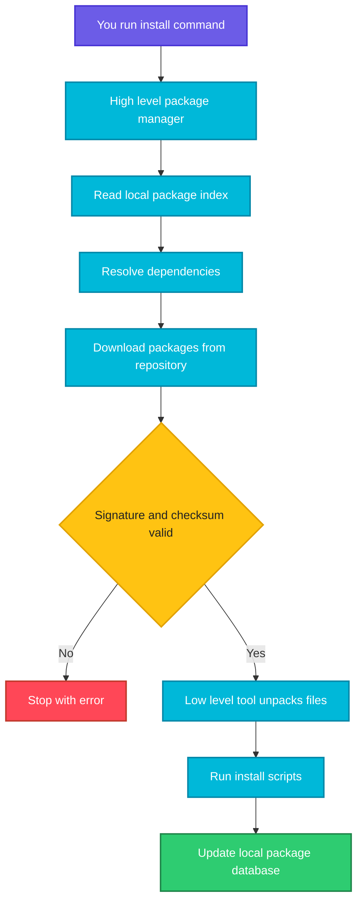
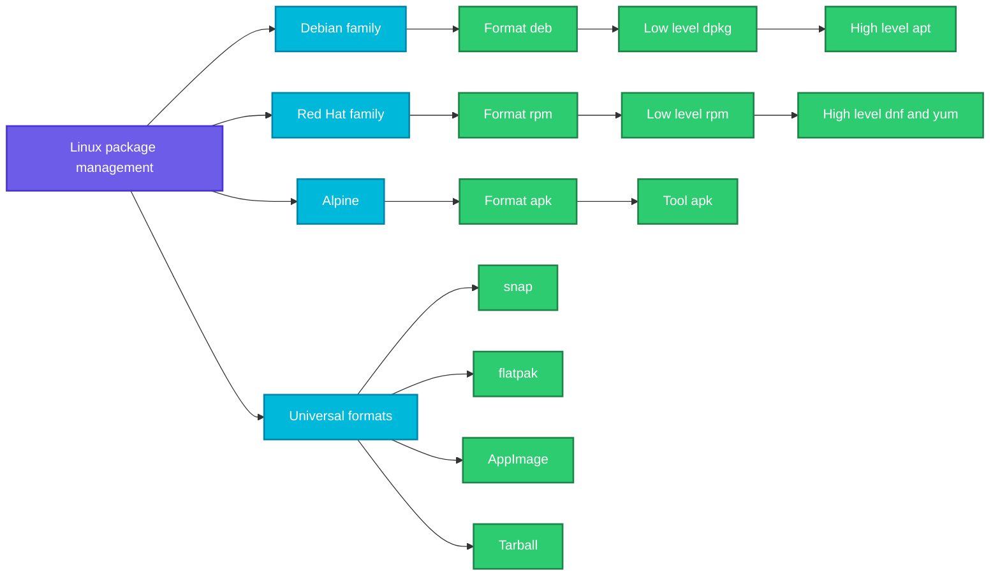

# Package Management in Linux

## What is it?
A **package** is a single archive file that contains everything needed to install one piece of software: the program files, configuration files, documentation and metadata (name, version, description, dependencies, install and remove scripts).

A **package manager** is the tool that installs, upgrades, removes and tracks these packages for you. Instead of downloading a program from a website and copying files around by hand, you run one command and the package manager does the rest.

Why packages matter, especially in DevOps:

| Reason | What it gives you |
|--------|-------------------|
| Easy installs | One command instead of manual download, extract and copy |
| Dependency handling | Libraries the software needs are installed automatically |
| Clean removal | Every file is tracked, so removal leaves nothing behind |
| Safe updates | Security patches arrive through one trusted channel |
| Trust | Packages are signed with GPG keys, so tampering is detected |
| Reproducibility | The same package version gives the same result on every server |
| Automation | Package commands work in scripts, Dockerfiles, Ansible and CI/CD |
| Auditing | You can list what is installed and which package owns a file |

## Syntax
Every package manager follows the same basic shape, only the command name differs:

```bash
<package-manager> <action> <package-name>
```

| Action | apt (Debian, Ubuntu) | dnf or yum (RHEL, CentOS, Fedora) | apk (Alpine) |
|--------|----------------------|-----------------------------------|--------------|
| Refresh package list | `apt update` | `dnf check-update` | `apk update` |
| Install | `apt install nginx` | `dnf install nginx` | `apk add nginx` |
| Remove | `apt remove nginx` | `dnf remove nginx` | `apk del nginx` |
| Upgrade all | `apt upgrade` | `dnf upgrade` | `apk upgrade` |
| Search | `apt search nginx` | `dnf search nginx` | `apk search nginx` |
| Show details | `apt show nginx` | `dnf info nginx` | `apk info nginx` |
| List installed | `apt list --installed` | `dnf list installed` | `apk info` |

## Visual Overview
> A package manager sits between you and the software repositories. It reads a local list of available packages, works out dependencies, downloads and verifies the files, and then hands them to a low level tool that unpacks them onto the system.



### Package formats and their tools
> Linux distributions are grouped into families. Each family uses its own package format, a low level tool that handles single files, and a high level tool that handles repositories and dependencies.



## Options/Flags
This is an overview, so instead of flags this section lists the main concepts you will meet in every package manager.

### Types of packages
| Format | File extension | Used by | Notes |
|--------|----------------|---------|-------|
| DEB | `.deb` | Debian, Ubuntu, Linux Mint | Most common on servers and in Docker images |
| RPM | `.rpm` | RHEL, CentOS, Rocky, AlmaLinux, Fedora, Amazon Linux, SUSE | Common in enterprise environments |
| APK | `.apk` | Alpine Linux | Very small, popular for container images |
| Pacman package | `.pkg.tar.zst` | Arch Linux, Manjaro | Rolling release distributions |
| Snap | `.snap` | Ubuntu and others | Self contained, sandboxed, updates itself |
| Flatpak | n/a | Fedora, Ubuntu and others | Mostly desktop applications |
| AppImage | `.AppImage` | Any distribution | A single executable file, no install |
| Source tarball | `.tar.gz`, `.tar.xz` | Any distribution | Needs compiling with `./configure`, `make`, `make install` |

### Types of package managers
| Level | Job | Examples |
|-------|-----|----------|
| Low level | Install, remove and inspect a single package file. Does not fetch dependencies | `dpkg`, `rpm` |
| High level | Talks to repositories, downloads packages and resolves dependencies | `apt`, `apt-get`, `dnf`, `yum`, `zypper`, `apk`, `pacman` |
| Universal | Works across distributions, bundles its own dependencies | `snap`, `flatpak` |

### Distribution to tool mapping
| Distribution family | Package format | Low level tool | High level tool |
|---------------------|----------------|----------------|-----------------|
| Debian, Ubuntu | deb | `dpkg` | `apt`, `apt-get` |
| RHEL, CentOS, Rocky, Alma | rpm | `rpm` | `dnf`, `yum` |
| Fedora | rpm | `rpm` | `dnf` |
| Amazon Linux | rpm | `rpm` | `yum` or `dnf` |
| SUSE, openSUSE | rpm | `rpm` | `zypper` |
| Alpine | apk | `apk` | `apk` |
| Arch | pkg.tar.zst | `pacman` | `pacman` |

### Key concepts
| Term | Meaning |
|------|---------|
| Repository | A server that hosts packages and an index describing them |
| Package index | A local copy of the repository's package list, refreshed with `apt update` or similar |
| Dependency | Another package that must be present for this one to work |
| Package database | The local record of what is installed (`/var/lib/dpkg`, `/var/lib/rpm`) |
| GPG key | A signing key used to verify that a package came from the repository owner |
| Version pinning or hold | Preventing a package from being upgraded |
| Upgrade vs full upgrade | Upgrade never removes packages, full upgrade may |
| Cache | Downloaded package files kept on disk (`/var/cache/apt`, `/var/cache/dnf`) |

### Where package managers keep their configuration
| Family | Repository configuration |
|--------|--------------------------|
| Debian, Ubuntu | `/etc/apt/sources.list` and `/etc/apt/sources.list.d/` |
| RHEL, CentOS, Fedora | `/etc/yum.repos.d/*.repo` |
| Alpine | `/etc/apk/repositories` |

## Usage Examples

### Example 1: Install a package on Debian or Ubuntu
**Command:**
```bash
sudo apt update && sudo apt install -y tree
```

**Sample Output:**
```text
Hit:1 http://archive.ubuntu.com/ubuntu jammy InRelease
Reading package lists... Done
Building dependency tree... Done
The following NEW packages will be installed:
  tree
Setting up tree (2.0.2-1) ...
```

`apt update` refreshes the package index first, then `apt install` downloads and installs `tree`. The `-y` flag answers yes to the confirmation prompt.

### Example 2: Install a package on RHEL, CentOS or Fedora
**Command:**
```bash
sudo dnf install -y tree
```

**Sample Output:**
```text
Dependencies resolved.
 Package   Arch     Version        Repository     Size
Installing:
 tree      x86_64   1.8.0-10.el9   baseos         57 k
Complete!
```

### Example 3: Install a package on Alpine
**Command:**
```bash
apk add --no-cache tree
```

**Sample Output:**
```text
fetch https://dl-cdn.alpinelinux.org/alpine/v3.19/main/x86_64/APKINDEX.tar.gz
(1/1) Installing tree (2.1.1-r0)
OK: 8 MiB in 16 packages
```

`--no-cache` skips storing the index on disk, which keeps container images small.

### Example 4: Find out which package owns a file
**Command:**
```bash
dpkg -S /usr/bin/tree
```

**Sample Output:**
```text
tree: /usr/bin/tree
```

On the Red Hat family the equivalent is `rpm -qf /usr/bin/tree`.

### Example 5: List the files a package installed
**Command:**
```bash
dpkg -L tree
```

**Sample Output:**
```text
/.
/usr
/usr/bin
/usr/bin/tree
/usr/share/man/man1/tree.1.gz
```

On the Red Hat family the equivalent is `rpm -ql tree`.

### Example 6: Check whether a package is installed
**Command:**
```bash
dpkg -l | grep tree
```

**Sample Output:**
```text
ii  tree  2.0.2-1  amd64  displays directory tree, in color
```

`ii` at the start means the package is installed correctly. On the Red Hat family use `rpm -qa | grep tree`.

### Example 7: Remove a package
**Command:**
```bash
sudo apt remove -y tree
```

**Sample Output:**
```text
The following packages will be REMOVED:
  tree
Removing tree (2.0.2-1) ...
```

`remove` keeps configuration files, `purge` deletes them too.

## Pitfalls / Gotchas
- Always run the index refresh (`apt update`) before installing, otherwise you may get "package not found" or an old version.
- Mixing package managers on one system, for example installing the same software with `apt` and `snap` or from source, can create conflicts and confusing `PATH` issues.
- `dpkg -i` and `rpm -i` do not fetch dependencies. Prefer `apt install ./file.deb` or `dnf install ./file.rpm`.
- Do not install packages in a Dockerfile without cleaning the cache, or the image grows needlessly.
- Third party repositories and added GPG keys are a trust decision, only add ones you trust.
- `-y` is convenient in scripts but can hide a surprising removal, so read the plan first when working by hand.
- Unpinned versions make builds non reproducible, the latest version today may differ tomorrow.
- Package names differ between distributions, for example `apache2` on Debian and `httpd` on Red Hat.
- `yum` is replaced by `dnf` on newer Red Hat family systems, `yum` often remains as an alias.

## Related Commands
This README is an overview. Separate pages for each tool will be added in this folder:

- `apt`, `apt-get`, `apt-cache`, `dpkg` (Debian family)
- `yum`, `dnf`, `rpm` (Red Hat family)
- `apk` (Alpine)
- `snap`, `flatpak`
- `tar`, `zip`, `unzip`, `gzip` (archives and source installs)
- `wget`, `curl` (downloading packages, see [networking](../networking/))
