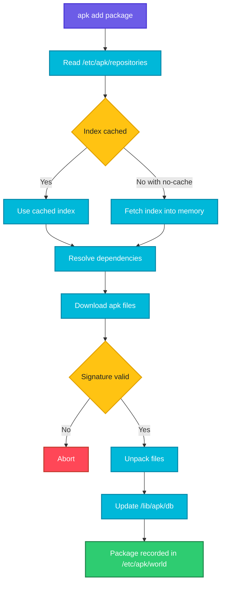

# apk

## What is it?
`apk` (Alpine Package Keeper) is the package manager of Alpine Linux, the very small distribution used as the base for most lightweight Docker images. It is fast, installs `.apk` packages from repositories listed in `/etc/apk/repositories`, and combines the work of a high level tool (like `apt`) and a low level tool (like `dpkg`) in one command.

Alpine uses `musl` instead of `glibc` and `busybox` instead of GNU tools, so some commands behave slightly differently from Ubuntu or CentOS.

When to use which sub command:

| Goal | Use |
|------|-----|
| Refresh the package index | `apk update` |
| Install software | `apk add` |
| Install without leaving an index cache (Dockerfile) | `apk add --no-cache` |
| Install build tools that you remove afterwards | `apk add --virtual` |
| Upgrade installed software | `apk upgrade` |
| Remove software | `apk del` |
| Find a package | `apk search` |
| Inspect a package or the installed set | `apk info` |
| Fix an inconsistent installation | `apk fix` |
| Clean cached files | `apk cache clean` |
| Check package state | `apk audit` and `apk verify` |

## Syntax
```bash
apk [OPTIONS] COMMAND [ARGUMENTS]
apk add [--no-cache] [--virtual NAME] PACKAGE[=VERSION]
```

## Visual Overview
> `apk` keeps a small index of each repository. `apk add` reads the index, works out dependencies, downloads the `.apk` files, verifies signatures, unpacks them and updates the installed database in `/lib/apk/db`. With `--no-cache` the index is fetched on the fly and not kept on disk.



## Options/Flags

### Sub commands
| Sub command | Description |
|-------------|-------------|
| `add PKG...` | Install packages and add them to the world file (the list you asked for) |
| `del PKG...` | Remove packages from the world and uninstall what is no longer needed |
| `update` | Download fresh repository indexes |
| `upgrade` | Upgrade all installed packages (or named ones) |
| `search TEXT` | Search packages by name. Use `-d` to search descriptions too |
| `info [PKG]` | Show information. With no name it lists installed packages |
| `list` | List packages in the indexes (`--installed`, `--upgradable`, `--available`) |
| `fix` | Repair or reinstall a package |
| `cache clean` | Delete cached packages that are no longer needed |
| `cache download` | Download packages in the world into the cache |
| `cache sync` | Clean and download, to match the world file |
| `stats` | Show package and repository counts |
| `audit` | List changes made to system files since install |
| `verify PKG` | Verify package signature and file checksums |
| `policy PKG` | Show which repository provides which version |
| `version` | Compare installed and available versions (`-l '<'` shows outdated) |
| `manifest FILE` | Show checksums of files in a package |
| `dot PKG` | Output a dependency graph |

### Options
| Flag | Description |
|------|-------------|
| `--no-cache` | Do not use or keep the local index cache. Always fetches fresh data |
| `--virtual NAME` | Group the added packages under one virtual package so they can be removed together |
| `-U`, `--update-cache` | Run `update` before the command |
| `-u`, `--upgrade` | Allow upgrading already installed packages during `add` |
| `-s`, `--simulate` | Do not change anything, show what would happen |
| `-v`, `--verbose` | More output |
| `-q`, `--quiet` | Less output |
| `-i`, `--interactive` | Ask before changes |
| `-p DIR`, `--root DIR` | Install into another root directory |
| `-X URL`, `--repository URL` | Use an extra repository for this command |
| `--allow-untrusted` | Install packages with an unknown signature (insecure) |
| `-L`, `--contents` | With `info`, list the files of a package |
| `-W`, `--who-owns FILE` | With `info`, find the package that owns a file |
| `-R`, `--depends` | With `info`, list what a package requires |
| `-r`, `--rdepends` | With `info`, list what depends on a package |
| `-a`, `--all` | With `info`, show everything |
| `-d`, `--description` | With `search`, also search descriptions |
| `-e`, `--exact` | With `search`, exact name only |
| `PKG=VERSION` | Install an exact version |
| `PKG>=VERSION` | Install at least this version |
| `PKG@tag` | Install from a tagged repository, for example `@edge` or `@testing` |

## Usage Examples

Let's say we have this file `/etc/apk/repositories`:

**Input file** (`/etc/apk/repositories`):
```text
https://dl-cdn.alpinelinux.org/alpine/v3.19/main
https://dl-cdn.alpinelinux.org/alpine/v3.19/community
@testing https://dl-cdn.alpinelinux.org/alpine/edge/testing
```

### Example 1: Update the index (`update`)
**Command:**
```bash
apk update
```
**Sample Output:**
```text
fetch https://dl-cdn.alpinelinux.org/alpine/v3.19/main/x86_64/APKINDEX.tar.gz
fetch https://dl-cdn.alpinelinux.org/alpine/v3.19/community/x86_64/APKINDEX.tar.gz
v3.19.1-61-g1b1b7ec6d3a [https://dl-cdn.alpinelinux.org/alpine/v3.19/main]
OK: 22983 distinct packages available
```

### Example 2: Install a package (`add`)
**Command:**
```bash
apk add tree
```
**Sample Output:**
```text
(1/1) Installing tree (2.1.1-r0)
Executing busybox-1.36.1-r15.trigger
OK: 8 MiB in 16 packages
```

### Example 3: Install in a Dockerfile without cache (`--no-cache`)
**Command:**
```bash
apk add --no-cache curl
```
**Sample Output:**
```text
fetch https://dl-cdn.alpinelinux.org/alpine/v3.19/main/x86_64/APKINDEX.tar.gz
(1/7) Installing ca-certificates (20240226-r0)
(2/7) Installing nghttp2-libs (1.58.0-r0)
(7/7) Installing curl (8.5.0-r0)
OK: 12 MiB in 23 packages
```
No `apk update` is needed, and no index is stored in `/var/cache/apk`.

### Example 4: Install several packages
**Command:**
```bash
apk add --no-cache bash git openssh-client
```
**Sample Output:**
```text
(1/14) Installing ncurses-terminfo-base (6.4_p20231125-r0)
(14/14) Installing openssh-client (9.6_p1-r0)
OK: 32 MiB in 37 packages
```

### Example 5: Install an exact version (`PKG=VERSION`)
**Command:**
```bash
apk add --no-cache nginx=1.24.0-r15
```
**Sample Output:**
```text
(1/2) Installing nginx (1.24.0-r15)
OK: 10 MiB in 18 packages
```

### Example 6: Install from a tagged repository (`PKG@tag`)
**Command:**
```bash
apk add --no-cache htop@testing
```
**Sample Output:**
```text
(1/2) Installing libncursesw (6.4_p20231125-r0)
(2/2) Installing htop (3.3.0-r0)
OK: 9 MiB in 18 packages
```
`@testing` matches the tag in the `/etc/apk/repositories` file shown above.

### Example 7: Temporary build dependencies (`--virtual`)
**Command:**
```bash
apk add --no-cache --virtual .build-deps gcc musl-dev make
apk del .build-deps
```
**Sample Output:**
```text
(1/12) Installing binutils (2.41-r0)
(12/12) Installing .build-deps (20260707.151200)
OK: 215 MiB in 40 packages
(1/12) Purging .build-deps (20260707.151200)
(2/12) Purging gcc (13.2.1_git20231014-r0)
OK: 12 MiB in 20 packages
```
All build tools are removed in one step, which keeps the final image small.

### Example 8: Simulate (`-s`)
**Command:**
```bash
apk add -s nginx
```
**Sample Output:**
```text
(1/2) Installing pcre2 (10.42-r2)
(2/2) Installing nginx (1.24.0-r15)
OK: 10 MiB in 18 packages
```
Nothing is installed with `-s`.

### Example 9: Update the index and install in one command (`-U`)
**Command:**
```bash
apk add -U tree
```
**Sample Output:**
```text
fetch https://dl-cdn.alpinelinux.org/alpine/v3.19/main/x86_64/APKINDEX.tar.gz
(1/1) Installing tree (2.1.1-r0)
OK: 8 MiB in 16 packages
```

### Example 10: Upgrade everything (`upgrade`)
**Command:**
```bash
apk update && apk upgrade
```
**Sample Output:**
```text
(1/3) Upgrading libcrypto3 (3.1.4-r5 -> 3.1.4-r6)
(2/3) Upgrading libssl3 (3.1.4-r5 -> 3.1.4-r6)
(3/3) Upgrading openssl (3.1.4-r5 -> 3.1.4-r6)
OK: 8 MiB in 16 packages
```

### Example 11: Upgrade a single package
**Command:**
```bash
apk add --upgrade openssl
```
**Sample Output:**
```text
(1/1) Upgrading openssl (3.1.4-r5 -> 3.1.4-r6)
OK: 8 MiB in 16 packages
```

### Example 12: Remove a package (`del`)
**Command:**
```bash
apk del tree
```
**Sample Output:**
```text
(1/1) Purging tree (2.1.1-r0)
OK: 8 MiB in 15 packages
```

### Example 13: Search (`search`)
**Command:**
```bash
apk search -d "web server" | head -3
```
**Sample Output:**
```text
lighttpd-1.4.73-r0
nginx-1.24.0-r15
nginx-mod-http-geoip-1.24.0-r15
```
Without `-d`, only package names are searched. Add `-e` for exact names, for example `apk search -e nginx`.

### Example 14: List installed packages (`info`)
**Command:**
```bash
apk info
```
**Sample Output:**
```text
alpine-baselayout
alpine-baselayout-data
alpine-keys
apk-tools
busybox
musl
```

### Example 15: Show package details (`info PKG`)
**Command:**
```bash
apk info curl
```
**Sample Output:**
```text
curl-8.5.0-r0 description:
Network file transfer tool

curl-8.5.0-r0 webpage:
https://curl.se/

curl-8.5.0-r0 installed size:
464 KiB
```

### Example 16: List files of a package (`info -L`)
**Command:**
```bash
apk info -L tree
```
**Sample Output:**
```text
tree-2.1.1-r0 contains:
usr/bin/tree
usr/share/man/man1/tree.1.gz
```

### Example 17: Which package owns a file (`info -W`)
**Command:**
```bash
apk info -W /usr/bin/tree
```
**Sample Output:**
```text
/usr/bin/tree is owned by tree-2.1.1-r0
```

### Example 18: Dependencies and reverse dependencies (`info -R`, `info -r`)
**Command:**
```bash
apk info -R curl
apk info -r libcurl
```
**Sample Output:**
```text
curl-8.5.0-r0 depends on:
so:libc.musl-x86_64.so.1
so:libcurl.so.4
libcurl-8.5.0-r0 is required by:
curl-8.5.0-r0
git-2.43.0-r0
```

### Example 19: List upgradable and installed packages (`list`)
**Command:**
```bash
apk list --upgradable
apk list --installed | head -2
```
**Sample Output:**
```text
openssl-3.1.4-r6 x86_64 {openssl} (Apache-2.0) [upgradable from: openssl-3.1.4-r5]
alpine-baselayout-3.4.3-r2 x86_64 {alpine-baselayout} (GPL-2.0-only) [installed]
alpine-baselayout-data-3.4.3-r2 x86_64 {alpine-baselayout} (GPL-2.0-only) [installed]
```

### Example 20: Check which repository provides a version (`policy`)
**Command:**
```bash
apk policy nginx
```
**Sample Output:**
```text
nginx policy:
  1.24.0-r15:
    lib/apk/db/installed
    https://dl-cdn.alpinelinux.org/alpine/v3.19/main
```

### Example 21: Compare installed and available versions (`version`)
**Command:**
```bash
apk version -l '<'
```
**Sample Output:**
```text
Installed:                                Available:
openssl-3.1.4-r5                        < 3.1.4-r6
```

### Example 22: Fix a damaged package (`fix`)
**Command:**
```bash
apk fix curl
```
**Sample Output:**
```text
(1/1) Reinstalling curl (8.5.0-r0)
OK: 12 MiB in 23 packages
```

### Example 23: Audit changed files (`audit`)
**Command:**
```bash
apk audit
```
**Sample Output:**
```text
M etc/passwd
A etc/motd
```
`M` means modified, `A` means added.

### Example 24: Verify a package (`verify`)
**Command:**
```bash
apk verify curl
```
**Sample Output:**
```text
(no output)
```
No output means all files match the package. Any file that differs is printed.

### Example 25: Use the world file
**Command:**
```bash
cat /etc/apk/world
```
**Sample Output:**
```text
alpine-base
curl
nginx
```
The world file lists the packages you asked for explicitly. `apk del` removes entries from it and uninstalls dependencies that nothing needs.

### Example 26: Clean the cache (`cache clean`)
**Command:**
```bash
apk cache clean
```
**Sample Output:**
```text
(no output)
```
Prints nothing when it succeeds. It deletes old files in `/var/cache/apk` (when it is enabled).

### Example 27: Install into another root (`-p`)
**Command:**
```bash
apk add -p /mnt/rootfs --initdb --no-cache alpine-base
```
**Sample Output:**
```text
(1/20) Installing alpine-baselayout-data (3.4.3-r2)
(20/20) Installing alpine-base (3.19.1-r0)
OK: 10 MiB in 20 packages
```

### Example 28: Use a custom repository (`-X`)
**Command:**
```bash
apk add --no-cache -X https://packages.example.com/alpine/v3.19/main --allow-untrusted mytool
```
**Sample Output:**
```text
fetch https://packages.example.com/alpine/v3.19/main/x86_64/APKINDEX.tar.gz
(1/1) Installing mytool (2.1.0-r0)
OK: 9 MiB in 17 packages
```

### Example 29: Show repository statistics (`stats`)
**Command:**
```bash
apk stats
```
**Sample Output:**
```text
installed:
  packages: 16
  dirs: 524
  files: 1385
  bytes: 8412160
```

## Pitfalls / Gotchas
- In Dockerfiles use `apk add --no-cache PKG`. Using `apk update` followed by `apk add` leaves the index in `/var/cache/apk` and makes the image bigger.
- The Alpine mirror only keeps the newest version of each package for a release. An exact version pin like `nginx=1.24.0-r15` stops working after the next patch release. Pin the base image digest instead.
- Alpine uses `musl`. Pre built binaries built for `glibc` (some Python wheels, Node native modules, closed source agents) can fail with `not found` or `Error loading shared library`. Install `gcompat` or use a Debian based image.
- `busybox` versions of `ls`, `grep`, `sed`, `tar` and `ps` support fewer flags than GNU versions. Install `coreutils`, `grep`, `findutils`, `procps` or `bash` when you need the full versions.
- Packages that need compilation need `build-base` or `gcc musl-dev`. Add them with `--virtual` and remove them after the build.
- `apk del` of a package also removes dependencies that are only needed by it. This is usually what you want, but check with `-s`.
- Packages from `edge` or `testing` repositories mixed into a stable release can break `libc` dependencies. Use tags such as `@testing` and install only what you need.
- `apk upgrade` inside a running container changes the image state. Rebuild the image instead of patching running containers.
- Always check `cat /etc/os-release` to know which Alpine version you are on, because package names change between releases (for example `python3`, `py3-pip`).

## DevOps Use Cases

### Use Case 1: Minimal Dockerfile with curl and ca-certificates
**Situation:** Build a tiny image for a health check script.

Let's say we have this file `Dockerfile`:

**Input file** (`Dockerfile`):
```dockerfile
FROM alpine:3.19
RUN apk add --no-cache curl ca-certificates tzdata
CMD ["curl", "--version"]
```
**Command:**
```bash
docker build -t alpine-curl . && docker run --rm alpine-curl
```
**Output:**
```text
curl 8.5.0 (x86_64-alpine-linux-musl) libcurl/8.5.0 OpenSSL/3.1.4 zlib/1.3.1
```

### Use Case 2: Compile and clean up in one layer
**Situation:** A Python package needs a compiler only while installing.

Let's say we have this file `requirements.txt`:

**Input file** (`requirements.txt`):
```text
psycopg2==2.9.9
```
**Command:**
```bash
apk add --no-cache --virtual .build-deps gcc musl-dev postgresql-dev \
 && apk add --no-cache libpq \
 && pip install --no-cache-dir -r requirements.txt \
 && apk del .build-deps
```
**Output:**
```text
(1/25) Installing libpq (16.2-r0)
Successfully installed psycopg2-2.9.9
(1/24) Purging .build-deps (20260707.151200)
OK: 78 MiB in 52 packages
```

### Use Case 3: Check installed package versions in a running container
**Situation:** Find which OpenSSL version a container uses.

**Command:**
```bash
docker exec web apk info -v | grep -E '^(openssl|libssl3|libcrypto3)-'
```
**Output:**
```text
libcrypto3-3.1.4-r6
libssl3-3.1.4-r6
openssl-3.1.4-r6
```

### Use Case 4: Show packages that need an update in an image
**Situation:** Security scanning shows old packages. See what is outdated.

**Command:**
```bash
docker run --rm alpine:3.19 sh -c "apk update -q && apk version -l '<'"
```
**Output:**
```text
Installed:                                Available:
musl-1.2.4_git20230717-r4               < 1.2.4_git20230717-r5
```
The fix is to rebuild with `apk upgrade --no-cache` in the Dockerfile or use a newer base image.

### Use Case 5: Install a debugging toolbox in a container
**Situation:** An Alpine based pod has no network tools.

**Command:**
```bash
kubectl exec -it web-pod -- sh -c "apk add --no-cache curl bind-tools iproute2 && dig +short example.com"
```
**Output:**
```text
(1/6) Installing bind-libs (9.18.24-r0)
(6/6) Installing curl (8.5.0-r0)
93.184.216.34
```
This is for troubleshooting only. The change disappears when the pod restarts.

### Use Case 6: Find which package provides a command
**Situation:** `dig` is not found on Alpine.

**Command:**
```bash
apk search -x cmd:dig
apk add --no-cache bind-tools
```
**Output:**
```text
bind-tools-9.18.24-r0
(1/6) Installing bind-libs (9.18.24-r0)
OK: 16 MiB in 26 packages
```

### Use Case 7: Reproducible images
**Situation:** Make sure builds do not change when a new Alpine patch version is published.

Let's say we have this file `Dockerfile`:

**Input file** (`Dockerfile`):
```dockerfile
FROM alpine:3.19.1@sha256:c5b1261d6d3e43071626931fc004f70149baeba2c8ec672bd4f27761f8e1ad6b
RUN apk add --no-cache curl=8.5.0-r0
```
**Command:**
```bash
docker build -t pinned . 2>&1 | tail -2
```
**Output:**
```text
 => exporting to image
 => => naming to docker.io/library/pinned:latest
```
Pinning the base image by digest locks all package versions from that image's index.

### Use Case 8: Inventory of an image for SBOM purposes
**Situation:** List every package and version in the image.

**Command:**
```bash
docker run --rm myapp apk info -vv | sort
```
**Output:**
```text
alpine-baselayout-3.4.3-r2 - Alpine base dir structure and init scripts
busybox-1.36.1-r15 - Size optimized toolbox of many common UNIX utilities
curl-8.5.0-r0 - URL retrival utility and library
musl-1.2.4_git20230717-r4 - the musl c library (libc) implementation
```

### Use Case 9: Switch the mirror in a restricted network
**Situation:** The company mirror replaces the public CDN.

**Command:**
```bash
sed -i 's#https://dl-cdn.alpinelinux.org#https://mirror.corp.example.com#g' /etc/apk/repositories
apk update
```
**Output:**
```text
fetch https://mirror.corp.example.com/alpine/v3.19/main/x86_64/APKINDEX.tar.gz
OK: 22983 distinct packages available
```

## Related Commands
- [apt](apt.md) - Debian and Ubuntu equivalent
- [dnf](dnf.md) / [yum](yum.md) - Red Hat family equivalents
- [tar](tar.md) - an `.apk` file is a tar.gz archive under the hood
- [wget](../networking/wget.md) / [curl](../networking/curl.md) - download tools often installed with apk
