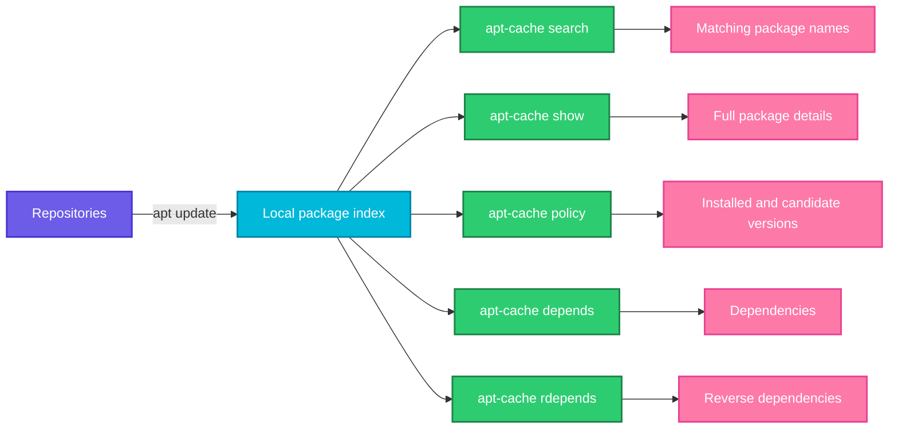

# apt-cache

## What is it?
`apt-cache` queries the local package index that `apt update` downloads. It is a read only tool: it never installs, removes or changes anything. Use it to search for packages, read their details, see which version would be installed, and walk the dependency tree.

Because it only reads the local index, results are only as fresh as your last `apt update`.

When to use which sub command:

| Goal | Use |
|------|-----|
| Find a package by name or keyword | `apt-cache search` |
| Read package details | `apt-cache show` |
| See installed vs candidate version and source repo | `apt-cache policy` |
| See what a package needs | `apt-cache depends` |
| See what needs a package | `apt-cache rdepends` |
| List all package names | `apt-cache pkgnames` |
| Statistics about the cache | `apt-cache stats` |

## Syntax
```bash
apt-cache [OPTIONS] COMMAND [PACKAGE...]
```

## Visual Overview
> `apt update` fills the local package index. `apt-cache` only reads that index and prints answers. It never contacts the network and never changes the system.



## Options/Flags

### Sub commands
| Sub command | Description |
|-------------|-------------|
| `search REGEX` | Search package names and descriptions |
| `show PKG` | Show the full record of a package (latest candidate version) |
| `showpkg PKG` | Show low level info: versions, dependencies and reverse dependencies |
| `policy [PKG]` | Show installed version, candidate version and the repositories (with priorities) |
| `depends PKG` | List the packages a package depends on |
| `rdepends PKG` | List the packages that depend on it |
| `pkgnames [PREFIX]` | List every known package name, optionally starting with a prefix |
| `stats` | Print counts of packages, versions and dependencies in the cache |
| `madison PKG` | Show every available version in table form |
| `unmet` | List packages with unmet dependencies |

### Options
| Flag | Description |
|------|-------------|
| `-n`, `--names-only` | With `search`, match only package names |
| `-f`, `--full` | With `search`, print the full record for each match |
| `-i`, `--important` | With `depends`, show only hard dependencies (Depends and PreDepends) |
| `--installed` | With `depends` or `rdepends`, only show installed packages |
| `--recurse` | With `depends`, follow dependencies all the way down |
| `--no-all-versions` | With `show`, print only the candidate version |
| `-a`, `--all-versions` | With `show`, print every version |

## Usage Examples

### Example 1: Search by keyword (`search`)
**Command:**
```bash
apt-cache search "web server" | head -3
```
**Sample Output:**
```text
apache2 - Apache HTTP Server
nginx - small, powerful, scalable web/proxy server
lighttpd - fast webserver with minimal memory footprint
```

### Example 2: Search names only (`-n`)
**Command:**
```bash
apt-cache search -n ^nginx
```
**Sample Output:**
```text
nginx - small, powerful, scalable web/proxy server
nginx-common - small, powerful, scalable web/proxy server - common files
nginx-core - nginx web/proxy server (standard version)
```

### Example 3: Full records (`-f`)
**Command:**
```bash
apt-cache search -f -n ^tree$ | head -6
```
**Sample Output:**
```text
Package: tree
Priority: optional
Section: universe/utils
Installed-Size: 115
Maintainer: Ubuntu Developers <ubuntu-devel-discuss@lists.ubuntu.com>
Architecture: amd64
```

### Example 4: Show package details (`show`)
**Command:**
```bash
apt-cache show tree | head -8
```
**Sample Output:**
```text
Package: tree
Architecture: amd64
Version: 2.0.2-1
Priority: optional
Section: universe/utils
Origin: Ubuntu
Installed-Size: 115
Depends: libc6 (>= 2.34)
```

### Example 5: Check installed and candidate versions (`policy`)
**Command:**
```bash
apt-cache policy curl
```
**Sample Output:**
```text
curl:
  Installed: 7.81.0-1ubuntu1.18
  Candidate: 7.81.0-1ubuntu1.18
  Version table:
 *** 7.81.0-1ubuntu1.18 500
        500 http://archive.ubuntu.com/ubuntu jammy-updates/main amd64 Packages
        100 /var/lib/dpkg/status
     7.81.0-1ubuntu1 500
        500 http://archive.ubuntu.com/ubuntu jammy/main amd64 Packages
```
`***` marks the installed version. The number is the repository priority.

### Example 6: List all versions in a table (`madison`)
**Command:**
```bash
apt-cache madison nginx
```
**Sample Output:**
```text
     nginx | 1.18.0-6ubuntu14.4 | http://archive.ubuntu.com/ubuntu jammy-updates/main amd64 Packages
     nginx | 1.18.0-6ubuntu14 | http://archive.ubuntu.com/ubuntu jammy/main amd64 Packages
```

### Example 7: Show what a package depends on (`depends`)
**Command:**
```bash
apt-cache depends curl
```
**Sample Output:**
```text
curl
  Depends: libc6
  Depends: libcurl4
  Recommends: ca-certificates
```

### Example 8: Show only hard dependencies (`-i`)
**Command:**
```bash
apt-cache depends -i curl
```
**Sample Output:**
```text
curl
  Depends: libc6
  Depends: libcurl4
```

### Example 9: Follow dependencies recursively (`--recurse`)
**Command:**
```bash
apt-cache depends --recurse --no-recommends --no-suggests --no-conflicts --no-breaks --no-replaces --no-enhances tree | grep "^\w" | sort -u
```
**Sample Output:**
```text
gcc-12-base
libc6
libcrypt1
libgcc-s1
tree
```

### Example 10: Show reverse dependencies (`rdepends`)
**Command:**
```bash
apt-cache rdepends libcurl4 | head -6
```
**Sample Output:**
```text
libcurl4
Reverse Depends:
  curl
  git
  libcurl4-openssl-dev
  python3-pycurl
```

### Example 11: Only installed reverse dependencies (`--installed`)
**Command:**
```bash
apt-cache rdepends --installed libcurl4
```
**Sample Output:**
```text
libcurl4
Reverse Depends:
  git
  curl
```
Use this before removing a library to see what would break.

### Example 12: List package names by prefix (`pkgnames`)
**Command:**
```bash
apt-cache pkgnames python3-yaml
```
**Sample Output:**
```text
python3-yaml
python3-yaml-dbg
```

### Example 13: Cache statistics (`stats`)
**Command:**
```bash
apt-cache stats
```
**Sample Output:**
```text
Total package names: 63540 (1,271 k)
Total package structures: 69612 (4,454 k)
  Normal packages: 58421
  Pure virtual packages: 1206
Total distinct versions: 62940 (5,031 k)
```

### Example 14: Find unmet dependencies (`unmet`)
**Command:**
```bash
apt-cache unmet
```
**Sample Output:**
```text
Package: some-broken-pkg
 Depends: missing-lib
```
No output means every dependency is satisfied.

### Example 15: Show all versions of a record (`-a`)
**Command:**
```bash
apt-cache show -a nginx | grep -E "^(Package|Version)"
```
**Sample Output:**
```text
Package: nginx
Version: 1.18.0-6ubuntu14.4
Package: nginx
Version: 1.18.0-6ubuntu14
```

## Pitfalls / Gotchas
- Results come from the local index. Run `sudo apt update` first, or `policy` may show a stale candidate version.
- `search` takes a regular expression and matches descriptions too, so it can return many unrelated packages. Add `-n` and anchors like `^name$`.
- A package that is not in the index at all prints nothing (or `N: Unable to locate package`), which is easy to mistake for success.
- `depends` shows `Recommends` and `Suggests` too. Use `-i` to see only what is really required.
- `apt-cache` shows what is possible. To see what is installed use `dpkg -l` or `apt list --installed`.
- `apt-cache` is part of the older apt tool family. `apt search`, `apt show`, `apt policy` and `apt depends` give similar output for interactive use.

## DevOps Use Cases

### Use Case 1: Check which version a deployment will get
**Situation:** Before a rollout, confirm what `apt install nginx` would install.

**Command:**
```bash
apt-cache policy nginx | grep -E "Installed|Candidate"
```
**Output:**
```text
  Installed: (none)
  Candidate: 1.18.0-6ubuntu14.4
```

### Use Case 2: Check that a pinned version still exists
**Situation:** A Dockerfile pins `nginx=1.18.0-6ubuntu14.2` and the build suddenly fails.

**Command:**
```bash
apt-cache madison nginx | grep 14.2 || echo "version no longer available"
```
**Output:**
```text
version no longer available
```

### Use Case 3: Safe removal check
**Situation:** Before removing a library, see which installed packages need it.

**Command:**
```bash
apt-cache rdepends --installed libssl3 | head -6
```
**Output:**
```text
libssl3
Reverse Depends:
  openssh-server
  curl
  openssl
  python3
```

### Use Case 4: Estimate the install footprint
**Situation:** Work out the dependency tree of a package for a minimal container.

**Command:**
```bash
apt-cache depends --recurse --no-recommends --no-suggests --no-conflicts --no-breaks --no-replaces --no-enhances curl | grep "^\w" | sort -u | wc -l
```
**Output:**
```text
38
```

### Use Case 5: Audit repositories after adding a new one
**Situation:** You added the Docker repository and want to confirm packages come from it.

**Command:**
```bash
apt-cache policy docker-ce | sed -n 1,6p
```
**Output:**
```text
docker-ce:
  Installed: (none)
  Candidate: 5:27.0.3-1~ubuntu.22.04~jammy
  Version table:
     5:27.0.3-1~ubuntu.22.04~jammy 500
        500 https://download.docker.com/linux/ubuntu jammy/stable amd64 Packages
```

### Use Case 6: Find the package name before installing
**Situation:** You know you need the `dig` command but not the package name.

**Command:**
```bash
apt-cache search dig | grep -i "dns"
```
**Output:**
```text
bind9-dnsutils - Clients provided with BIND 9
```

### Use Case 7: Detect available upgrades for a package in a script
**Situation:** Alert if the installed version differs from the candidate.

**Command:**
```bash
pkg=openssl
inst=$(apt-cache policy $pkg | awk '/Installed:/{print $2}')
cand=$(apt-cache policy $pkg | awk '/Candidate:/{print $2}')
[ "$inst" != "$cand" ] && echo "$pkg update available: $inst -> $cand"
```
**Output:**
```text
openssl update available: 3.0.2-0ubuntu1.15 -> 3.0.2-0ubuntu1.17
```

### Use Case 8: Compare a package across two Ubuntu releases
**Situation:** Check which versions each release offers before a migration.

**Command:**
```bash
apt-cache madison python3 | awk -F'|' '{print $2, $3}'
```
**Output:**
```text
 3.10.6-1~22.04 http://archive.ubuntu.com/ubuntu jammy-updates/main amd64 Packages
 3.10.4-0ubuntu2 http://archive.ubuntu.com/ubuntu jammy/main amd64 Packages
```

## Related Commands
- [apt](apt.md) - install, remove and upgrade packages
- [apt-mark](apt-mark.md) - hold packages and manage manual or auto flags
- [dpkg](dpkg.md) - inspect what is actually installed
- [dnf](dnf.md) - `dnf repoquery` and `dnf info` give similar answers on the Red Hat family
