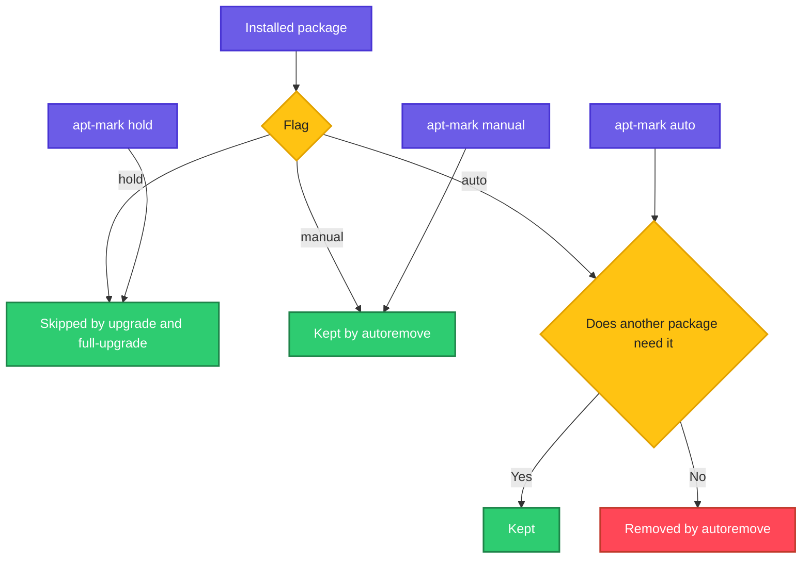

# apt-mark

## What is it?
`apt-mark` changes or shows the flags that `apt` keeps for each package. There are three kinds of flags:

- **hold**: the package is frozen at its current version and will not be upgraded, installed over or removed.
- **auto / manual**: tells `apt autoremove` whether a package was installed on purpose (manual) or only as a dependency (auto). Auto packages that nothing needs any more are removed by `autoremove`.
- **dpkg selections**: `dpkg` level states such as `install` and `hold`.

When to use which sub command:

| Goal | Use |
|------|-----|
| Stop a package from being upgraded | `apt-mark hold` |
| Allow upgrades again | `apt-mark unhold` |
| See what is on hold | `apt-mark showhold` |
| Protect a package from `autoremove` | `apt-mark manual` |
| Let `autoremove` clean a package up | `apt-mark auto` |
| See which packages were installed by hand | `apt-mark showmanual` |
| See which packages are only dependencies | `apt-mark showauto` |

## Syntax
```bash
apt-mark [OPTIONS] COMMAND [PACKAGE...]
```

## Visual Overview
> Every installed package has flags in apt's state files. `hold` blocks upgrades, `manual` keeps the package safe from `autoremove`, and `auto` marks it as removable once nothing depends on it.



## Options/Flags

### Sub commands
| Sub command | Description |
|-------------|-------------|
| `hold PKG...` | Prevent the package from being installed, upgraded or removed automatically |
| `unhold PKG...` | Remove the hold |
| `showhold` | List packages on hold |
| `manual PKG...` | Mark as manually installed |
| `auto PKG...` | Mark as automatically installed (a dependency) |
| `showmanual` | List manually installed packages |
| `showauto` | List automatically installed packages |
| `minimize-manual` | Mark packages that are dependencies of other manual packages as auto |

### Options
| Flag | Description |
|------|-------------|
| `-f FILE`, `--file=FILE` | Read or write the state from this file instead of the default |
| `-s`, `--simulate` | Do not change anything, print what would happen |
| `-v`, `--verbose` | Print more information |
| `-q`, `--quiet` | Less output |

## Usage Examples

### Example 1: Hold a package (`hold`)
**Command:**
```bash
sudo apt-mark hold nginx
```
**Sample Output:**
```text
nginx set on hold.
```

### Example 2: Hold several packages at once
**Command:**
```bash
sudo apt-mark hold nginx nginx-common docker-ce
```
**Sample Output:**
```text
nginx set on hold.
nginx-common set on hold.
docker-ce set on hold.
```

### Example 3: List held packages (`showhold`)
**Command:**
```bash
apt-mark showhold
```
**Sample Output:**
```text
docker-ce
nginx
nginx-common
```

### Example 4: See the effect during an upgrade
**Command:**
```bash
sudo apt upgrade -s | grep -A2 "kept back"
```
**Sample Output:**
```text
The following packages have been kept back:
  nginx
0 upgraded, 0 newly installed, 0 to remove and 1 not upgraded.
```

### Example 5: Remove the hold (`unhold`)
**Command:**
```bash
sudo apt-mark unhold nginx
```
**Sample Output:**
```text
Canceled hold on nginx.
```

### Example 6: Mark a package as manual (`manual`)
**Command:**
```bash
sudo apt-mark manual curl
```
**Sample Output:**
```text
curl set to manually installed.
```
`autoremove` will no longer remove `curl`, even if no other package depends on it.

### Example 7: Mark a package as automatic (`auto`)
**Command:**
```bash
sudo apt-mark auto tree
```
**Sample Output:**
```text
tree set to automatically installed.
```
If nothing depends on `tree`, the next `apt autoremove` removes it.

### Example 8: List manually installed packages (`showmanual`)
**Command:**
```bash
apt-mark showmanual | head -5
```
**Sample Output:**
```text
adduser
apt
base-files
base-passwd
bash
```

### Example 9: List automatically installed packages (`showauto`)
**Command:**
```bash
apt-mark showauto | head -5
```
**Sample Output:**
```text
gcc-12-base
libacl1
libapparmor1
libargon2-1
libaudit-common
```

### Example 10: Simulate a change (`-s`)
**Command:**
```bash
apt-mark -s hold nginx
```
**Sample Output:**
```text
nginx set on hold.
```
Nothing is changed with `-s`. Run `apt-mark showhold` afterwards to confirm that nginx is not listed.

### Example 11: Mark dependencies of manual packages as auto (`minimize-manual`)
**Command:**
```bash
sudo apt-mark minimize-manual
```
**Sample Output:**
```text
libcurl4 set to automatically installed.
libpcre2-8-0 set to automatically installed.
```

### Example 12: Save and restore the manual list (`showmanual`)
Let's say we want to record what is installed on this server in a file called `manual-packages.txt`:

**Command:**
```bash
apt-mark showmanual > manual-packages.txt
head -3 manual-packages.txt
```
**Sample Output:**
```text
adduser
apt
base-files
```

## Pitfalls / Gotchas
- A held package does not receive security updates. Remember what you held and why, and review the list regularly with `apt-mark showhold`.
- `hold` is not the same as `apt pin`. Hold blocks changes to one package, pinning in `/etc/apt/preferences.d` changes which repository or version is preferred.
- Marking something `auto` that you actually need means a later `apt autoremove` will delete it. Mark tools you rely on as `manual`.
- `minimize-manual` rewrites many flags at once. Preview what `autoremove` would do afterwards with `apt autoremove -s`.
- `apt-mark` changes need root, but `showhold`, `showmanual` and `showauto` do not.
- Holds are stored in `dpkg` state. A held package can still be removed or replaced by explicit commands like `apt install --allow-change-held-packages`.
- Kernel and Docker packages are often held in production. Hold all related packages, for example `docker-ce`, `docker-ce-cli` and `containerd.io` together.

## DevOps Use Cases

### Use Case 1: Freeze a database version
**Situation:** PostgreSQL major upgrades need planning. Block accidental upgrades during routine patching.

**Command:**
```bash
sudo apt-mark hold postgresql-14 postgresql-client-14
apt-mark showhold
```
**Output:**
```text
postgresql-14 set on hold.
postgresql-client-14 set on hold.
postgresql-14
postgresql-client-14
```

### Use Case 2: Freeze the kernel on fleet servers
**Situation:** A driver is only certified with kernel 5.15.0-100.

**Command:**
```bash
sudo apt-mark hold linux-image-generic linux-headers-generic
```
**Output:**
```text
linux-image-generic set on hold.
linux-headers-generic set on hold.
```

### Use Case 3: Audit held packages across servers
**Situation:** Collect which servers hold packages, using SSH.

**Command:**
```bash
for h in web1 web2; do echo "== $h"; ssh $h apt-mark showhold; done
```
**Output:**
```text
== web1
nginx
== web2
nginx
docker-ce
```

### Use Case 4: Make a patch run skip held packages (and say so)
**Situation:** The patch job should report anything it skipped.

**Command:**
```bash
sudo apt-get update -qq && sudo apt-get upgrade -y -qq && echo "Held:" && apt-mark showhold
```
**Output:**
```text
Held:
nginx
```

### Use Case 5: Clean up safely before imaging a server
**Situation:** Remove leftovers but protect tools you installed by hand.

**Command:**
```bash
sudo apt-mark manual htop curl jq
sudo apt autoremove --purge -s | tail -3
```
**Output:**
```text
Remv libjs-sphinxdoc [3.5.4-2ubuntu1]
Remv libjs-underscore [1.13.2~dfsg-2]
```

### Use Case 6: Compare two servers
**Situation:** Find what was installed by hand on server A but is missing on server B.

Let's say we have these files `a.txt` and `b.txt`:

**Input file** (`a.txt`):
```text
curl
git
jq
tree
```
**Input file** (`b.txt`):
```text
curl
git
```
**Command:**
```bash
comm -23 a.txt b.txt
```
**Output:**
```text
jq
tree
```
Create each file with `ssh serverA apt-mark showmanual | sort > a.txt`.

### Use Case 7: Rebuild the same package set on a new server
**Situation:** Reinstall everything that was installed by hand on the old server.

**Command:**
```bash
xargs -a manual-packages.txt sudo apt install -y
```
**Output:**
```text
0 upgraded, 0 newly installed, 0 to remove and 0 not upgraded.
```

### Use Case 8: Ansible hold task
**Situation:** Use the same hold in configuration management.

**Command:**
```bash
ansible web -b -m ansible.builtin.dpkg_selections -a "name=nginx selection=hold"
```
**Output:**
```text
web1 | CHANGED => {
    "changed": true,
    "name": "nginx",
    "selection": "hold"
}
```

## Related Commands
- [apt](apt.md) - install, upgrade and `autoremove`
- [apt-cache](apt-cache.md) - query versions and dependencies
- [dpkg](dpkg.md) - `dpkg --get-selections` shows the same hold state
- [yum](yum.md) / [dnf](dnf.md) - `versionlock` plugin is the equivalent on the Red Hat family
