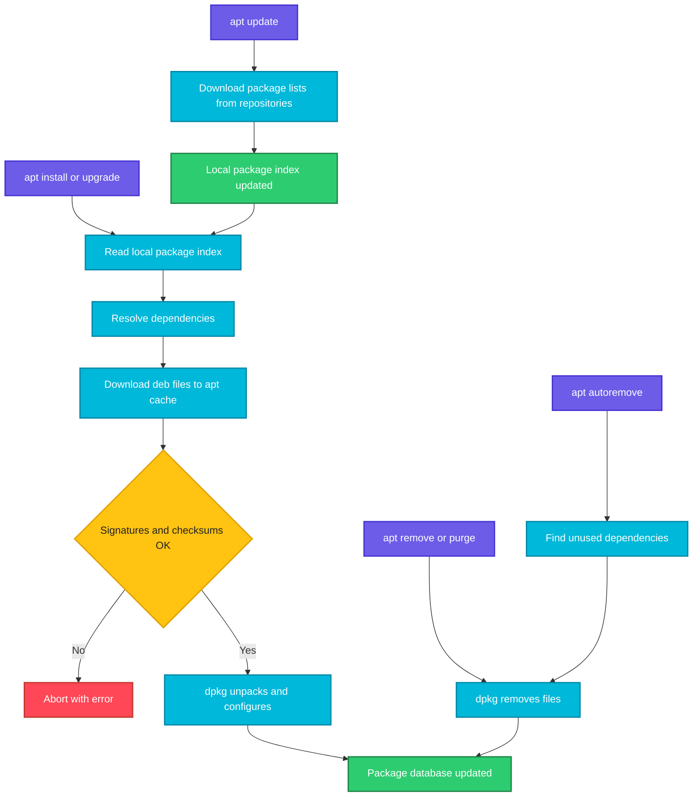

# apt

## What is it?
`apt` (Advanced Package Tool) is the main command line package manager on Debian, Ubuntu and their derivatives. It downloads packages from repositories, resolves dependencies, installs, upgrades and removes software, and keeps a local database of what is installed.

`apt` is the friendly, interactive front end (progress bar, colours, summaries). For scripts, `apt-get` is the older, stable interface with output that does not change between versions. Both use the same repositories and the same low level tool, `dpkg`.

When to use which sub command:

| Goal | Use |
|------|-----|
| Refresh the list of available packages | `apt update` |
| Install new software | `apt install` |
| Update installed software safely | `apt upgrade` |
| Update software even if it needs removals or new dependencies | `apt full-upgrade` |
| Remove software but keep its config | `apt remove` |
| Remove software and its config | `apt purge` |
| Remove libraries nobody needs any more | `apt autoremove` |
| Find a package | `apt search` |
| Read package details | `apt show` |
| See installed or upgradable packages | `apt list` |
| Free disk space used by downloads | `apt clean` |

## Syntax
```bash
apt [OPTIONS] COMMAND [ARGUMENTS]
sudo apt install [OPTIONS] PACKAGE[=VERSION] ...
```

## Visual Overview
> `apt update` downloads fresh package lists. Install and upgrade commands read those lists, work out dependencies, download the `.deb` files and pass them to `dpkg`, which unpacks and configures them.



## Options/Flags

### Sub commands
| Sub command | Description |
|-------------|-------------|
| `update` | Download the latest package lists from all repositories. Installs nothing |
| `upgrade` | Install newer versions of installed packages. Never removes packages and never installs new ones |
| `full-upgrade` | Like `upgrade`, but will remove or add packages if that is needed to finish the upgrade (same as `apt-get dist-upgrade`) |
| `install PKG` | Install one or more packages. Also upgrades them if already installed |
| `reinstall PKG` | Install the same version again to repair missing or broken files |
| `remove PKG` | Remove the package but keep its configuration files |
| `purge PKG` | Remove the package and its configuration files |
| `autoremove` | Remove dependencies that were installed automatically and are no longer needed |
| `search TEXT` | Search package names and descriptions |
| `show PKG` | Show version, size, dependencies and description |
| `list` | List packages. Combine with `--installed`, `--upgradable` or `--all-versions` |
| `policy PKG` | Show installed and candidate versions and which repository they come from |
| `download PKG` | Download the `.deb` file into the current directory without installing |
| `changelog PKG` | Show the changelog of a package |
| `depends PKG` | Show what a package depends on |
| `rdepends PKG` | Show which packages depend on it |
| `satisfy "DEPS"` | Install whatever is needed to satisfy a dependency string |
| `edit-sources` | Open `/etc/apt/sources.list` in your editor |
| `clean` | Delete all downloaded `.deb` files from `/var/cache/apt/archives` |
| `autoclean` | Delete only downloaded files that can no longer be downloaded again (old versions) |

### Options
| Flag | Description |
|------|-------------|
| `-y`, `--yes` | Answer yes to every prompt (non interactive) |
| `-s`, `--simulate`, `--dry-run` | Show what would happen without changing anything |
| `--no-install-recommends` | Skip recommended packages, install only hard dependencies |
| `--install-suggests` | Also install suggested packages |
| `-f`, `--fix-broken` | Try to repair broken dependencies |
| `--only-upgrade` | Upgrade the package if installed, never install it fresh |
| `--allow-downgrades` | Allow installing an older version than the one installed |
| `-t RELEASE` | Pick packages from a specific release, for example `jammy-backports` |
| `-V`, `--verbose-versions` | Show full version numbers in the plan |
| `-q`, `-qq` | Quiet output, `-qq` prints nothing except errors |
| `--purge` | With `autoremove`, also delete configuration files |
| `-o KEY=VALUE` | Set any apt configuration option on the command line |
| `PKG=VERSION` | Install an exact version |
| `PKG/RELEASE` | Install from a specific release |
| `./file.deb` | Install a local `.deb` file and fetch its dependencies |

## Usage Examples

Let's say we have this file `/etc/apt/sources.list.d/docker.list`:

**Input file** (`/etc/apt/sources.list.d/docker.list`):
```text
deb [arch=amd64 signed-by=/etc/apt/keyrings/docker.asc] https://download.docker.com/linux/ubuntu jammy stable
```

### Example 1: Refresh package lists (`update`)
**Command:**
```bash
sudo apt update
```
**Sample Output:**
```text
Hit:1 http://archive.ubuntu.com/ubuntu jammy InRelease
Get:2 http://archive.ubuntu.com/ubuntu jammy-updates InRelease [119 kB]
Get:3 https://download.docker.com/linux/ubuntu jammy InRelease [48.8 kB]
Fetched 168 kB in 1s (210 kB/s)
Reading package lists... Done
Building dependency tree... Done
12 packages can be upgraded. Run 'apt list --upgradable' to see them.
```
The `docker.list` file above is why the `download.docker.com` line appears: every file in `sources.list.d` is read during `update`.

### Example 2: Install a package (`install`)
**Command:**
```bash
sudo apt install tree
```
**Sample Output:**
```text
Reading package lists... Done
Building dependency tree... Done
The following NEW packages will be installed:
  tree
0 upgraded, 1 newly installed, 0 to remove and 12 not upgraded.
Need to get 47.9 kB of archives.
After this operation, 116 kB of additional disk space will be used.
Do you want to continue? [Y/n] y
Get:1 http://archive.ubuntu.com/ubuntu jammy/universe amd64 tree amd64 2.0.2-1 [47.9 kB]
Setting up tree (2.0.2-1) ...
```

### Example 3: Install without prompts (`-y`)
**Command:**
```bash
sudo apt install -y curl
```
**Sample Output:**
```text
curl is already the newest version (7.81.0-1ubuntu1.18).
0 upgraded, 0 newly installed, 0 to remove and 12 not upgraded.
```

### Example 4: Dry run (`-s`)
**Command:**
```bash
apt install -s nginx
```
**Sample Output:**
```text
NOTE: This is only a simulation!
      apt needs root privileges for real execution.
Inst nginx (1.18.0-6ubuntu14.4 Ubuntu:22.04/jammy-updates [amd64])
Conf nginx (1.18.0-6ubuntu14.4 Ubuntu:22.04/jammy-updates [amd64])
```

### Example 5: Skip recommended packages (`--no-install-recommends`)
**Command:**
```bash
sudo apt install -y --no-install-recommends git
```
**Sample Output:**
```text
The following NEW packages will be installed:
  git git-man liberror-perl
0 upgraded, 3 newly installed, 0 to remove and 12 not upgraded.
```
Without the flag, extra recommended packages such as `ssh-client` would also be pulled in.

### Example 6: Install an exact version (`PKG=VERSION`)
**Command:**
```bash
sudo apt install -y nginx=1.18.0-6ubuntu14.4
```
**Sample Output:**
```text
Setting up nginx (1.18.0-6ubuntu14.4) ...
```

### Example 7: Only upgrade if installed (`--only-upgrade`)
**Command:**
```bash
sudo apt install --only-upgrade -y openssl
```
**Sample Output:**
```text
The following packages will be upgraded:
  openssl
1 upgraded, 0 newly installed, 0 to remove and 11 not upgraded.
```
If `openssl` were not installed, nothing would be installed.

### Example 8: Install a local .deb file (`./file.deb`)
**Command:**
```bash
sudo apt install -y ./google-chrome-stable_current_amd64.deb
```
**Sample Output:**
```text
Note, selecting 'google-chrome-stable' instead of './google-chrome-stable_current_amd64.deb'
The following additional packages will be installed:
  fonts-liberation libvulkan1
Setting up google-chrome-stable (126.0.6478.126-1) ...
```
Unlike `dpkg -i`, this fetches the dependencies automatically.

### Example 9: Upgrade installed packages (`upgrade`)
**Command:**
```bash
sudo apt upgrade -y
```
**Sample Output:**
```text
Calculating upgrade... Done
The following packages will be upgraded:
  libssl3 openssl
The following packages have been kept back:
  linux-generic
2 upgraded, 0 newly installed, 0 to remove and 1 not upgraded.
```
"Kept back" means the upgrade needs a new dependency or a removal. Use `full-upgrade` for those.

### Example 10: Full upgrade (`full-upgrade`)
**Command:**
```bash
sudo apt full-upgrade -y
```
**Sample Output:**
```text
The following NEW packages will be installed:
  linux-image-5.15.0-119-generic
The following packages will be upgraded:
  linux-generic
1 upgraded, 1 newly installed, 0 to remove and 0 not upgraded.
```

### Example 11: Remove a package (`remove`)
**Command:**
```bash
sudo apt remove -y tree
```
**Sample Output:**
```text
The following packages will be REMOVED:
  tree
0 upgraded, 0 newly installed, 1 to remove and 12 not upgraded.
Removing tree (2.0.2-1) ...
```

### Example 12: Remove with configuration (`purge`)
**Command:**
```bash
sudo apt purge -y nginx
```
**Sample Output:**
```text
The following packages will be REMOVED:
  nginx*
Removing nginx (1.18.0-6ubuntu14.4) ...
Purging configuration files for nginx (1.18.0-6ubuntu14.4) ...
```
The `*` after the name marks a package whose config files will be purged too.

### Example 13: Remove unused dependencies (`autoremove`, `--purge`)
**Command:**
```bash
sudo apt autoremove --purge -y
```
**Sample Output:**
```text
The following packages will be REMOVED:
  libjs-jquery* libjs-sphinxdoc*
0 upgraded, 0 newly installed, 2 to remove and 12 not upgraded.
After this operation, 1,205 kB disk space will be freed.
```

### Example 14: Reinstall a package (`reinstall`)
**Command:**
```bash
sudo apt reinstall -y tree
```
**Sample Output:**
```text
0 upgraded, 0 newly installed, 1 reinstalled, 0 to remove and 12 not upgraded.
Preparing to unpack .../tree_2.0.2-1_amd64.deb ...
Setting up tree (2.0.2-1) ...
```

### Example 15: Search for a package (`search`)
**Command:**
```bash
apt search ^nginx$
```
**Sample Output:**
```text
Sorting... Done
Full Text Search... Done
nginx/jammy-updates,jammy-security 1.18.0-6ubuntu14.4 amd64
  small, powerful, scalable web/proxy server
```
The search text is a regular expression, so `^nginx$` matches only the exact name.

### Example 16: Show package details (`show`)
**Command:**
```bash
apt show tree
```
**Sample Output:**
```text
Package: tree
Version: 2.0.2-1
Priority: optional
Section: universe/utils
Installed-Size: 115 kB
Depends: libc6 (>= 2.34)
Homepage: https://oldmanprogrammer.net/source.php?dir=projects/tree
Description: displays directory tree, in color
```

### Example 17: List installed packages (`list --installed`)
**Command:**
```bash
apt list --installed 2>/dev/null | grep -E "^(curl|git|tree)/"
```
**Sample Output:**
```text
curl/jammy-updates,jammy-security,now 7.81.0-1ubuntu1.18 amd64 [installed]
git/jammy-updates,jammy-security,now 1:2.34.1-1ubuntu1.11 amd64 [installed]
tree/jammy,now 2.0.2-1 amd64 [installed]
```

### Example 18: List upgradable packages (`list --upgradable`)
**Command:**
```bash
apt list --upgradable 2>/dev/null
```
**Sample Output:**
```text
Listing...
libssl3/jammy-updates,jammy-security 3.0.2-0ubuntu1.17 amd64 [upgradable from: 3.0.2-0ubuntu1.15]
openssl/jammy-updates,jammy-security 3.0.2-0ubuntu1.17 amd64 [upgradable from: 3.0.2-0ubuntu1.15]
```

### Example 19: List every available version (`list --all-versions`)
**Command:**
```bash
apt list -a nginx 2>/dev/null
```
**Sample Output:**
```text
Listing...
nginx/jammy-updates,jammy-security 1.18.0-6ubuntu14.4 amd64
nginx/jammy 1.18.0-6ubuntu14 amd64
```

### Example 20: Check where a version comes from (`policy`)
**Command:**
```bash
apt policy nginx
```
**Sample Output:**
```text
nginx:
  Installed: (none)
  Candidate: 1.18.0-6ubuntu14.4
  Version table:
     1.18.0-6ubuntu14.4 500
        500 http://archive.ubuntu.com/ubuntu jammy-updates/main amd64 Packages
     1.18.0-6ubuntu14 500
        500 http://archive.ubuntu.com/ubuntu jammy/main amd64 Packages
```

### Example 21: Download without installing (`download`)
**Command:**
```bash
apt download tree && ls *.deb
```
**Sample Output:**
```text
Get:1 http://archive.ubuntu.com/ubuntu jammy/universe amd64 tree amd64 2.0.2-1 [47.9 kB]
Fetched 47.9 kB in 0s (180 kB/s)
tree_2.0.2-1_amd64.deb
```

### Example 22: Show dependencies (`depends`, `rdepends`)
**Command:**
```bash
apt depends tree
```
**Sample Output:**
```text
tree
  Depends: libc6 (>= 2.34)
```

### Example 23: Fix broken dependencies (`-f`)
**Command:**
```bash
sudo apt install -f -y
```
**Sample Output:**
```text
Correcting dependencies... Done
0 upgraded, 0 newly installed, 0 to remove and 0 not upgraded.
```

### Example 24: Install from a different release (`-t`)
**Command:**
```bash
sudo apt install -y -t jammy-backports cockpit
```
**Sample Output:**
```text
Get:1 http://archive.ubuntu.com/ubuntu jammy-backports/universe amd64 cockpit all 287-1~ubuntu22.04.1 [24.2 kB]
```

### Example 25: Pass a config option (`-o`)
**Command:**
```bash
sudo apt -o Dpkg::Options::="--force-confold" upgrade -y
```
**Sample Output:**
```text
Calculating upgrade... Done
0 upgraded, 0 newly installed, 0 to remove and 0 not upgraded.
```
`--force-confold` keeps your existing config files when a package ships a new default.

### Example 26: Clean the download cache (`clean`, `autoclean`)
**Command:**
```bash
du -sh /var/cache/apt/archives
sudo apt clean
du -sh /var/cache/apt/archives
```
**Sample Output:**
```text
214M	/var/cache/apt/archives
4.0K	/var/cache/apt/archives
```

### Example 27: Quiet output for scripts (`-qq`)
**Command:**
```bash
sudo apt-get -qq install -y tree && echo "done"
```
**Sample Output:**
```text
done
```

## Pitfalls / Gotchas
- Always run `apt update` before `apt install` on a fresh machine or container, otherwise you get `E: Unable to locate package`.
- `apt update` only refreshes lists. It does not upgrade anything.
- `apt upgrade` never removes packages. Packages "kept back" need `apt full-upgrade`.
- `apt remove` leaves configuration files behind. If you reinstall later, old config returns. Use `purge` for a clean slate.
- `apt autoremove` can remove packages you rely on if they were installed as dependencies only. Read the list before using `-y`.
- `apt` warns in scripts: "apt does not have a stable CLI interface". Use `apt-get` in scripts and Dockerfiles.
- In Dockerfiles run `apt-get update && apt-get install -y PKG` in the same `RUN` layer, and finish with `rm -rf /var/lib/apt/lists/*` to keep the image small.
- Running two apt commands at once fails with `Could not get lock /var/lib/dpkg/lock-frontend`. Wait, or find the other process. Never delete the lock file blindly.
- `-y` auto confirms removals too. Combine with `-s` first when unsure.
- `apt install PKG=VERSION` requires the version to still exist in the repository. Old versions disappear.
- `DEBIAN_FRONTEND=noninteractive` is needed in CI so packages that ask questions (tzdata, for example) do not hang.

## DevOps Use Cases

### Use Case 1: Standard server bootstrap
**Situation:** A fresh Ubuntu server must be patched and have the usual tools installed.

**Command:**
```bash
sudo apt update && sudo apt upgrade -y && sudo apt install -y curl git vim htop unzip
```
**Output:**
```text
Hit:1 http://archive.ubuntu.com/ubuntu jammy InRelease
Reading package lists... Done
2 upgraded, 3 newly installed, 0 to remove and 0 not upgraded.
Setting up htop (3.0.5-7build2) ...
```

### Use Case 2: Dockerfile with a small image
**Situation:** Build a lean Ubuntu image that has `curl` and `ca-certificates`.

Let's say we have this file `Dockerfile`:

**Input file** (`Dockerfile`):
```dockerfile
FROM ubuntu:22.04
RUN apt-get update \
 && DEBIAN_FRONTEND=noninteractive apt-get install -y --no-install-recommends curl ca-certificates \
 && rm -rf /var/lib/apt/lists/*
```
**Command:**
```bash
docker build -t demo . 2>&1 | tail -3
```
**Output:**
```text
 => [2/2] RUN apt-get update  && DEBIAN_FRONTEND=noninteractive apt-get install -y --no-install-recommends curl ca-certificates  && rm -rf /var/lib/apt/lists/*   6.1s
 => exporting to image                                                                                                0.2s
 => => naming to docker.io/library/demo:latest                                                                        0.0s
```

### Use Case 3: Install a list of packages from a file
**Situation:** The team keeps the required packages in a text file used by the provisioning script.

Let's say we have this file `packages.txt`:

**Input file** (`packages.txt`):
```text
curl
jq
tree
```
**Command:**
```bash
xargs -a packages.txt sudo apt install -y
```
**Output:**
```text
The following NEW packages will be installed:
  jq libjq1 libonig5 tree
Setting up jq (1.6-2.1ubuntu3) ...
Setting up tree (2.0.2-1) ...
```

### Use Case 4: Security updates only
**Situation:** Apply only security patches without moving to new feature versions.

**Command:**
```bash
sudo apt update && apt list --upgradable 2>/dev/null | grep -i security
sudo apt install -y --only-upgrade openssl libssl3
```
**Output:**
```text
libssl3/jammy-updates,jammy-security 3.0.2-0ubuntu1.17 amd64 [upgradable from: 3.0.2-0ubuntu1.15]
openssl/jammy-updates,jammy-security 3.0.2-0ubuntu1.17 amd64 [upgradable from: 3.0.2-0ubuntu1.15]
2 upgraded, 0 newly installed, 0 to remove and 10 not upgraded.
```

### Use Case 5: Check pending updates in monitoring
**Situation:** A monitoring script reports how many packages are waiting for an update.

**Command:**
```bash
apt list --upgradable 2>/dev/null | grep -c upgradable
```
**Output:**
```text
12
```

### Use Case 6: Add a third party repository
**Situation:** Install Docker from the official repository.

**Command:**
```bash
sudo install -m 0755 -d /etc/apt/keyrings
sudo curl -fsSL https://download.docker.com/linux/ubuntu/gpg -o /etc/apt/keyrings/docker.asc
echo "deb [arch=amd64 signed-by=/etc/apt/keyrings/docker.asc] https://download.docker.com/linux/ubuntu jammy stable" | sudo tee /etc/apt/sources.list.d/docker.list
sudo apt update && apt policy docker-ce | head -3
```
**Output:**
```text
deb [arch=amd64 signed-by=/etc/apt/keyrings/docker.asc] https://download.docker.com/linux/ubuntu jammy stable
docker-ce:
  Installed: (none)
  Candidate: 5:27.0.3-1~ubuntu.22.04~jammy
```

### Use Case 7: Pin a version in production
**Situation:** Install an exact version and stop it from changing on the next `upgrade`.

**Command:**
```bash
sudo apt install -y nginx=1.18.0-6ubuntu14.4 && sudo apt-mark hold nginx
```
**Output:**
```text
Setting up nginx (1.18.0-6ubuntu14.4) ...
nginx set on hold.
```

### Use Case 8: Find which repository supplies a package
**Situation:** Two repositories offer different versions and you need to know which one wins.

**Command:**
```bash
apt policy nginx | head -6
```
**Output:**
```text
nginx:
  Installed: 1.18.0-6ubuntu14.4
  Candidate: 1.18.0-6ubuntu14.4
  Version table:
 *** 1.18.0-6ubuntu14.4 500
        500 http://archive.ubuntu.com/ubuntu jammy-updates/main amd64 Packages
```

### Use Case 9: Non interactive installs in CI
**Situation:** A pipeline installs packages that would normally ask questions, such as `tzdata`.

**Command:**
```bash
export DEBIAN_FRONTEND=noninteractive
sudo -E apt-get install -y -qq tzdata
echo "exit code: $?"
```
**Output:**
```text
exit code: 0
```

### Use Case 10: Reclaim disk space on a full server
**Situation:** `/var` is nearly full and you need space without touching data.

**Command:**
```bash
sudo apt autoremove --purge -y && sudo apt clean && df -h /var | tail -1
```
**Output:**
```text
/dev/sda2        20G   11G  8.0G  58% /var
```

### Use Case 11: Roll back by installing a previous version
**Situation:** A new release broke the app and you need the previous version.

**Command:**
```bash
apt list -a nginx 2>/dev/null
sudo apt install -y --allow-downgrades nginx=1.18.0-6ubuntu14
```
**Output:**
```text
nginx/jammy-updates,jammy-security 1.18.0-6ubuntu14.4 amd64
nginx/jammy 1.18.0-6ubuntu14 amd64
Preparing to unpack .../nginx_1.18.0-6ubuntu14_amd64.deb ...
Setting up nginx (1.18.0-6ubuntu14) ...
```

## Related Commands
- [apt-cache](apt-cache.md) - query the package cache (search, depends, policy)
- [apt-mark](apt-mark.md) - hold packages or mark them manual and auto
- [dpkg](dpkg.md) - low level tool that apt uses to install `.deb` files
- [dnf](dnf.md) / [yum](yum.md) - the Red Hat family equivalents
- [apk](apk.md) - the Alpine equivalent
- [wget](../networking/wget.md) / [curl](../networking/curl.md) - download keys and packages
