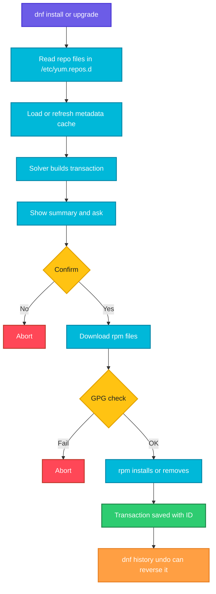

# dnf

## What is it?
`dnf` (Dandified YUM) is the package manager of the modern Red Hat family: RHEL 8 and newer, CentOS Stream, Rocky Linux, AlmaLinux, Fedora and Amazon Linux 2023. It is the successor of [yum](yum.md), with a faster dependency solver, better memory use and support for **modules** (several versions of the same software in one repository). On these systems `yum` is just a link to `dnf`.

When to use which sub command:

| Goal | Use |
|------|-----|
| Refresh metadata and see pending updates | `dnf check-update` |
| Install software | `dnf install` |
| Update everything or one package | `dnf upgrade` |
| Remove software | `dnf remove` |
| Find a package | `dnf search` |
| Find which package provides a file | `dnf provides` |
| Read package details | `dnf info` |
| Choose a software stream (for example Node 18 or 20) | `dnf module` |
| Install a set of packages | `dnf group install` |
| Undo a change | `dnf history undo` |
| Query repositories without installing | `dnf repoquery` |
| Freeze versions | `dnf versionlock` |
| Free disk space | `dnf clean all` |

## Syntax
```bash
dnf [OPTIONS] COMMAND [ARGUMENTS]
sudo dnf install [-y] PACKAGE[-VERSION]
```

## Visual Overview
> `dnf` reads repo files, downloads metadata, uses a solver to calculate the whole transaction, downloads and verifies the `.rpm` files and lets `rpm` install them. Each transaction gets an ID in the history.



## Options/Flags

### Sub commands
| Sub command | Description |
|-------------|-------------|
| `install PKG` | Install packages. Also accepts `./file.rpm`, URLs and `@group` |
| `upgrade [PKG]` | Upgrade the named packages or everything (`update` is an alias) |
| `check-update` | List available updates. Exit code 100 means updates exist |
| `downgrade PKG` | Go back to the previous version |
| `reinstall PKG` | Reinstall the current version |
| `remove PKG` | Remove a package and anything that depends on it |
| `autoremove` | Remove dependencies that nothing needs any more |
| `search TEXT` | Search names and summaries |
| `info PKG` | Show package details |
| `list [installed\|available\|updates]` | List packages |
| `provides FILE` | Find the package that provides a file or capability |
| `repoquery` | Advanced queries on repositories (dependencies, files, reverse dependencies) |
| `repolist [--all]` | List enabled or all repositories |
| `config-manager --add-repo URL` | Add a repo (needs `dnf-plugins-core`) |
| `config-manager --set-enabled/--set-disabled REPO` | Enable or disable a repository |
| `makecache` | Download and cache metadata |
| `clean all` | Remove cached data |
| `group list` | List package groups |
| `group install "NAME"` | Install a group |
| `group remove "NAME"` | Remove a group |
| `module list` | List modules and streams |
| `module enable NAME:STREAM` | Select a stream |
| `module install NAME:STREAM` | Enable a stream and install its default profile |
| `module reset NAME` | Forget the chosen stream |
| `history` | List transactions |
| `history info ID` | Show one transaction |
| `history undo ID` | Reverse a transaction |
| `versionlock add PKG` | Lock a package version (needs `python3-dnf-plugin-versionlock`) |
| `download PKG` | Download the rpm without installing (needs `dnf-plugins-core`) |
| `needs-restarting -r` | Report if a reboot is required (needs `dnf-utils` or `dnf-plugins-core`) |
| `updateinfo list security` | List security advisories |
| `distro-sync` | Sync all packages to the versions in the enabled repositories |
| `shell` | Interactive dnf shell |

### Options
| Flag | Description |
|------|-------------|
| `-y`, `--assumeyes` | Assume yes |
| `--assumeno` | Assume no, preview only |
| `-q` | Quiet |
| `-v` | Verbose |
| `--enablerepo=REPO` | Enable a repo for this run |
| `--disablerepo=REPO` | Disable a repo for this run |
| `--exclude=PKG` | Exclude packages |
| `--nogpgcheck` | Skip signature checks (insecure) |
| `--security` | Only apply security updates |
| `--bugfix` | Only apply bug fix updates |
| `--allowerasing` | Allow removal of conflicting packages |
| `--best` / `--nobest` | Require or allow the best available version |
| `--skip-broken` | Skip packages with dependency problems |
| `--downloadonly` | Download only |
| `-C`, `--cacheonly` | Use the cache only |
| `--refresh` | Refresh metadata before running |
| `--showduplicates` | Show all versions |
| `--releasever=VER` | Use a different release version |
| `--setopt=KEY=VALUE` | Set a config option |

## Usage Examples

Let's say we have this file `/etc/yum.repos.d/docker-ce.repo`:

**Input file** (`/etc/yum.repos.d/docker-ce.repo`):
```text
[docker-ce-stable]
name=Docker CE Stable - $basearch
baseurl=https://download.docker.com/linux/centos/$releasever/$basearch/stable
enabled=1
gpgcheck=1
gpgkey=https://download.docker.com/linux/centos/gpg
```

### Example 1: Check for updates (`check-update`)
**Command:**
```bash
dnf check-update
```
**Sample Output:**
```text
kernel.x86_64          5.14.0-427.28.1.el9_4      baseos
openssl.x86_64         1:3.0.7-28.el9_4           baseos
```

### Example 2: Install a package (`install`)
**Command:**
```bash
sudo dnf install tree
```
**Sample Output:**
```text
Dependencies resolved.
================================================================
 Package    Architecture    Version           Repository   Size
================================================================
Installing:
 tree       x86_64          1.8.0-10.el9      baseos       57 k

Transaction Summary
Install  1 Package

Is this ok [y/N]: y
Installed:
  tree-1.8.0-10.el9.x86_64
Complete!
```

### Example 3: Install without prompts (`-y`)
**Command:**
```bash
sudo dnf install -y httpd
```
**Sample Output:**
```text
Installed:
  httpd-2.4.57-8.el9.x86_64  httpd-core-2.4.57-8.el9.x86_64
Complete!
```

### Example 4: Install an exact version (`PKG-VERSION`)
**Command:**
```bash
sudo dnf install -y nginx-1:1.20.1-14.el9
```
**Sample Output:**
```text
Installed:
  nginx-1:1.20.1-14.el9.x86_64
Complete!
```

### Example 5: Install a local file (`./file.rpm`)
**Command:**
```bash
sudo dnf install -y ./myapp-2.0-1.el9.x86_64.rpm
```
**Sample Output:**
```text
Installed:
  myapp-2.0-1.el9.x86_64
Complete!
```

### Example 6: Install from a URL
**Command:**
```bash
sudo dnf install -y https://dl.fedoraproject.org/pub/epel/epel-release-latest-9.noarch.rpm
```
**Sample Output:**
```text
Installed:
  epel-release-9-7.el9.noarch
Complete!
```

### Example 7: Upgrade everything (`upgrade`)
**Command:**
```bash
sudo dnf upgrade -y
```
**Sample Output:**
```text
Transaction Summary
Install  1 Package
Upgrade  14 Packages
Complete!
```

### Example 8: Upgrade one package
**Command:**
```bash
sudo dnf upgrade -y openssl
```
**Sample Output:**
```text
Upgraded:
  openssl-1:3.0.7-28.el9_4.x86_64  openssl-libs-1:3.0.7-28.el9_4.x86_64
Complete!
```

### Example 9: Security or bug fix updates only (`--security`, `--bugfix`)
**Command:**
```bash
sudo dnf upgrade --security -y
```
**Sample Output:**
```text
Upgraded:
  openssl-1:3.0.7-28.el9_4.x86_64
Complete!
```

### Example 10: List security advisories (`updateinfo`)
**Command:**
```bash
dnf updateinfo list security
```
**Sample Output:**
```text
RLSA-2026:4321 Important/Sec. openssl-1:3.0.7-28.el9_4.x86_64
RLSA-2026:4290 Moderate/Sec. curl-7.76.1-29.el9_4.x86_64
```

### Example 11: Downgrade (`downgrade`)
**Command:**
```bash
sudo dnf downgrade -y nginx
```
**Sample Output:**
```text
Downgraded:
  nginx-1:1.20.1-14.el9.x86_64
Complete!
```

### Example 12: Reinstall (`reinstall`)
**Command:**
```bash
sudo dnf reinstall -y tree
```
**Sample Output:**
```text
Reinstalled:
  tree-1.8.0-10.el9.x86_64
Complete!
```

### Example 13: Remove (`remove`)
**Command:**
```bash
sudo dnf remove -y tree
```
**Sample Output:**
```text
Removed:
  tree-1.8.0-10.el9.x86_64
Complete!
```

### Example 14: Remove unused dependencies (`autoremove`)
**Command:**
```bash
sudo dnf autoremove -y
```
**Sample Output:**
```text
Removed:
  libicu-67.1-9.el9.x86_64
Complete!
```

### Example 15: Search (`search`)
**Command:**
```bash
dnf search nginx
```
**Sample Output:**
```text
=================== Name Exactly Matched: nginx ===================
nginx.x86_64 : A high performance web server and reverse proxy server
=================== Name & Summary Matched: nginx ===================
nginx-mod-stream.x86_64 : Nginx stream modules
```

### Example 16: Package details (`info`)
**Command:**
```bash
dnf info tree
```
**Sample Output:**
```text
Name         : tree
Version      : 1.8.0
Release      : 10.el9
Architecture : x86_64
Size         : 57 k
Repository   : baseos
Summary      : File system tree viewer
```

### Example 17: List installed and available packages (`list`)
**Command:**
```bash
dnf list installed | grep -E "^(tree|openssl)"
```
**Sample Output:**
```text
openssl.x86_64     1:3.0.7-28.el9_4     @baseos
tree.x86_64        1.8.0-10.el9         @baseos
```

### Example 18: Which package provides a file (`provides`)
**Command:**
```bash
dnf provides /usr/bin/dig
```
**Sample Output:**
```text
bind-utils-32:9.16.23-18.el9.x86_64 : Utilities for querying DNS name servers
Repo        : appstream
Matched from:
Filename    : /usr/bin/dig
```

### Example 19: Query dependencies (`repoquery`)
**Command:**
```bash
dnf repoquery --requires tree
```
**Sample Output:**
```text
libc.so.6()(64bit)
libc.so.6(GLIBC_2.34)(64bit)
rtld(GNU_HASH)
```

### Example 20: Query reverse dependencies and files (`repoquery`)
**Command:**
```bash
dnf repoquery --installed --whatrequires openssl-libs | head -3
dnf repoquery -l tree
```
**Sample Output:**
```text
curl-0:7.76.1-29.el9_4.x86_64
openssh-0:8.7p1-38.el9.x86_64
python3-0:3.9.18-3.el9_4.x86_64
/usr/bin/tree
/usr/share/doc/tree/README
/usr/share/man/man1/tree.1.gz
```

### Example 21: List repositories (`repolist`)
**Command:**
```bash
dnf repolist
```
**Sample Output:**
```text
repo id            repo name
appstream          Rocky Linux 9 - AppStream
baseos             Rocky Linux 9 - BaseOS
docker-ce-stable   Docker CE Stable - x86_64
```
`docker-ce-stable` is defined by the `docker-ce.repo` file shown at the top.

### Example 22: Add a repository (`config-manager`)
**Command:**
```bash
sudo dnf install -y dnf-plugins-core
sudo dnf config-manager --add-repo https://download.docker.com/linux/centos/docker-ce.repo
```
**Sample Output:**
```text
Adding repo from: https://download.docker.com/linux/centos/docker-ce.repo
```

### Example 23: Enable or disable a repository (`--set-enabled`, `--set-disabled`)
**Command:**
```bash
sudo dnf config-manager --set-disabled docker-ce-stable
dnf repolist | grep docker || echo "docker repo disabled"
```
**Sample Output:**
```text
docker repo disabled
```

### Example 24: Use a repository for one command (`--enablerepo`)
**Command:**
```bash
sudo dnf install -y --enablerepo=crb --enablerepo=epel htop
```
**Sample Output:**
```text
Installed:
  htop-3.3.0-1.el9.x86_64
Complete!
```

### Example 25: Exclude a package (`--exclude`)
**Command:**
```bash
sudo dnf upgrade -y --exclude=kernel*
```
**Sample Output:**
```text
Upgraded:
  openssl-1:3.0.7-28.el9_4.x86_64
Complete!
```

### Example 26: Download only (`--downloadonly`, `download`)
**Command:**
```bash
sudo dnf install -y --downloadonly --downloaddir=/tmp/rpms tree
ls /tmp/rpms
sudo dnf download tree
ls tree*.rpm
```
**Sample Output:**
```text
tree-1.8.0-10.el9.x86_64.rpm
tree-1.8.0-10.el9.x86_64.rpm
```
Both commands save the same file. `dnf download` saves it in the current directory.

### Example 27: Package groups (`group`)
**Command:**
```bash
dnf group list | head -5
sudo dnf group install -y "Development Tools"
```
**Sample Output:**
```text
Available Environment Groups:
   Server
   Minimal Install
Installed Groups:
   Development Tools
```
Older versions use `groupinstall`, which still works.

### Example 28: List modules and streams (`module list`)
**Command:**
```bash
dnf module list nodejs
```
**Sample Output:**
```text
Name     Stream   Profiles                              Summary
nodejs   18       common [d], development, minimal, s2i Javascript runtime
nodejs   20       common [d], development, minimal, s2i Javascript runtime
```
`[d]` marks the default profile.

### Example 29: Enable a module stream and install (`module enable`, `module install`)
**Command:**
```bash
sudo dnf module enable -y nodejs:20
sudo dnf install -y nodejs
node --version
```
**Sample Output:**
```text
Enabling module streams:
 nodejs  20
Complete!
v20.11.1
```
One command also works: `sudo dnf module install -y nodejs:20/common`.

### Example 30: Reset a module (`module reset`)
**Command:**
```bash
sudo dnf module reset -y nodejs
```
**Sample Output:**
```text
Resetting modules:
 nodejs
Complete!
```

### Example 31: Transaction history (`history`, `history info`)
**Command:**
```bash
sudo dnf history
```
**Sample Output:**
```text
ID     | Command line              | Date and time    | Action(s)      | Altered
------------------------------------------------------------------------------
     8 | install -y tree           | 2026-10-07 10:12 | Install        |    1
     7 | upgrade -y                | 2026-10-06 22:01 | I, U           |   15
```

### Example 32: Undo a transaction (`history undo`)
**Command:**
```bash
sudo dnf history undo 8 -y
```
**Sample Output:**
```text
Removed:
  tree-1.8.0-10.el9.x86_64
Complete!
```

### Example 33: Lock a version (`versionlock`)
**Command:**
```bash
sudo dnf install -y python3-dnf-plugin-versionlock
sudo dnf versionlock add nginx
sudo dnf versionlock list
```
**Sample Output:**
```text
Adding versionlock on: nginx-1:1.20.1-14.el9.*
nginx-1:1.20.1-14.el9.*
```

### Example 34: Refresh and clean (`makecache`, `clean all`, `--refresh`)
**Command:**
```bash
sudo dnf clean all && sudo dnf makecache
```
**Sample Output:**
```text
33 files removed
Metadata cache created.
```

### Example 35: Check if a reboot is needed (`needs-restarting`)
**Command:**
```bash
sudo dnf needs-restarting -r
```
**Sample Output:**
```text
Core libraries or services have been updated since boot-up:
  * kernel
Reboot is required to fully utilize these updates.
```
The exit code is 1 when a reboot is required and 0 when it is not.

### Example 36: Sync to repository versions (`distro-sync`)
**Command:**
```bash
sudo dnf distro-sync -y
```
**Sample Output:**
```text
Downgraded:
  libfoo-1.2-1.el9.x86_64
Complete!
```
Use this after switching repos to bring every package to the repository version, even if that means a downgrade.

### Example 37: Allow replacing conflicting packages (`--allowerasing`)
**Command:**
```bash
sudo dnf install -y --allowerasing curl
```
**Sample Output:**
```text
Removed:
  curl-minimal-7.76.1-29.el9_4.x86_64
Installed:
  curl-7.76.1-29.el9_4.x86_64
Complete!
```
Needed on Amazon Linux 2023 and some containers where `curl-minimal` conflicts with `curl`.

## Pitfalls / Gotchas
- `dnf upgrade` upgrades the kernel too. On production servers use `dnf upgrade PKG`, `--security` or `--exclude=kernel*`.
- `dnf remove` removes dependent packages. Read the list. Removing `python3` or `dnf` itself can break the machine.
- Modules: if a stream is enabled, packages from other streams are hidden. If a package "does not exist", check `dnf module list`.
- `dnf install` of a package from a stream you have not enabled can fail with `Modular dependency problems`. Enable the right stream first.
- `check-update` returns exit code 100 when updates exist. In scripts with `set -e` handle this explicitly.
- Metadata is cached. When a repo changed, run `dnf clean all` or use `--refresh`.
- Rocky, AlmaLinux and RHEL 9 need the `crb` repository enabled for many EPEL packages.
- `--nogpgcheck` removes protection against tampered packages. Avoid it.
- `dnf` and `yum` share the same history on RHEL 8 and newer, since `yum` is a link to `dnf`.
- On Amazon Linux 2023 the default package set is `dnf` only. `yum` still works as a link.

## DevOps Use Cases

### Use Case 1: Standard server bootstrap
**Situation:** Patch a fresh Rocky or AlmaLinux 9 server and install common tools.

**Command:**
```bash
sudo dnf upgrade -y && sudo dnf install -y epel-release && sudo dnf install -y git jq htop wget tar unzip
```
**Output:**
```text
Upgraded:
  openssl-1:3.0.7-28.el9_4.x86_64  ...
Installed:
  git-2.43.5-1.el9_4.x86_64  jq-1.6-14.el9.x86_64  htop-3.3.0-1.el9.x86_64
Complete!
```

### Use Case 2: Dockerfile for a Rocky or Alma image
**Situation:** Install packages in a container and keep the layer small.

Let's say we have this file `Dockerfile`:

**Input file** (`Dockerfile`):
```dockerfile
FROM rockylinux:9
RUN dnf install -y --setopt=install_weak_deps=False nginx \
 && dnf clean all \
 && rm -rf /var/cache/dnf
```
**Command:**
```bash
docker build -t nginx-rocky . 2>&1 | tail -2
```
**Output:**
```text
 => exporting to image
 => => naming to docker.io/library/nginx-rocky:latest
```

### Use Case 3: Unattended security patching
**Situation:** Apply only security updates automatically each night.

**Command:**
```bash
sudo dnf install -y dnf-automatic
sudo sed -i 's/^upgrade_type = .*/upgrade_type = security/; s/^apply_updates = .*/apply_updates = yes/' /etc/dnf/automatic.conf
sudo systemctl enable --now dnf-automatic.timer
systemctl list-timers dnf-automatic.timer --no-pager
```
**Output:**
```text
NEXT                        LEFT          LAST PASSED UNIT                ACTIVATES
Thu 2026-10-08 06:12:00 UTC 14h left      n/a  n/a    dnf-automatic.timer dnf-automatic.service
```

### Use Case 4: Check for pending updates in monitoring
**Situation:** Report the number of pending updates to the monitoring system.

**Command:**
```bash
dnf -q check-update | grep -cE '^[a-zA-Z0-9_.+-]+\.[a-z0-9_]+ '
```
**Output:**
```text
14
```

### Use Case 5: Node.js version selection with modules
**Situation:** The application needs Node 20 but the default stream is 18.

**Command:**
```bash
sudo dnf module reset -y nodejs && sudo dnf module enable -y nodejs:20 && sudo dnf install -y nodejs && node --version
```
**Output:**
```text
Complete!
v20.11.1
```

### Use Case 6: Roll back after a failed update
**Situation:** A patch broke the application. Undo the last transaction.

**Command:**
```bash
sudo dnf history list | head -4
sudo dnf history undo last -y
```
**Output:**
```text
ID     | Command line      | Date and time    | Action(s)      | Altered
     9 | upgrade -y        | 2026-10-07 02:00 | I, U           |   15
Removed:
  libfoo-1.3-1.el9.x86_64
Installed:
  libfoo-1.2-1.el9.x86_64
Complete!
```

### Use Case 7: Reboot after kernel updates
**Situation:** After patching, reboot only when needed.

**Command:**
```bash
sudo dnf needs-restarting -r || sudo systemctl reboot
```
**Output:**
```text
Core libraries or services have been updated since boot-up:
  * kernel
Reboot is required to fully utilize these updates.
```

### Use Case 8: Offline repository mirror
**Situation:** Prepare RPMs for an isolated network.

**Command:**
```bash
sudo dnf install -y dnf-utils createrepo_c
sudo dnf reposync --repoid=appstream --download-path=/srv/mirror --newest-only
sudo createrepo_c /srv/mirror/appstream
ls /srv/mirror/appstream | head -3
```
**Output:**
```text
Packages
repodata
```

### Use Case 9: Find a package by the command you need
**Situation:** `ss`, `dig` or `lsof` is missing in a minimal image.

**Command:**
```bash
dnf provides '*/bin/lsof' | grep -m1 "^lsof"
sudo dnf install -y lsof
```
**Output:**
```text
lsof-4.94.0-3.el9.x86_64 : A utility which lists open files on a Linux/UNIX system
Installed:
  lsof-4.94.0-3.el9.x86_64
```

### Use Case 10: Pin versions for a release
**Situation:** Freeze the web stack for a release freeze.

**Command:**
```bash
sudo dnf versionlock add nginx openssl
sudo dnf versionlock list
```
**Output:**
```text
Adding versionlock on: nginx-1:1.20.1-14.el9.*
Adding versionlock on: openssl-1:3.0.7-28.el9_4.*
nginx-1:1.20.1-14.el9.*
openssl-1:3.0.7-28.el9_4.*
```

## Related Commands
- [yum](yum.md) - the older version, same family
- [rpm](rpm.md) - low level tool underneath dnf
- [apt](apt.md) - Debian family equivalent
- [systemctl](systemctl.md) - control `dnf-automatic.timer` and services
