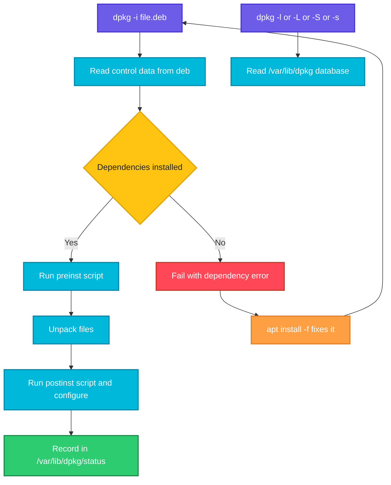

# dpkg

## What is it?
`dpkg` is the low level package tool of Debian, Ubuntu and their derivatives. It installs, removes and inspects individual `.deb` files and keeps the database of installed packages in `/var/lib/dpkg`.

`dpkg` does not download anything and does not resolve dependencies. `apt` is built on top of it: `apt` finds and downloads the packages, `dpkg` does the actual unpacking and configuring.

When to use which option:

| Goal | Use |
|------|-----|
| Install a downloaded `.deb` file | `dpkg -i` (or `apt install ./file.deb` to get dependencies too) |
| Remove a package, keep config | `dpkg -r` |
| Remove a package and its config | `dpkg -P` |
| List installed packages | `dpkg -l` |
| List files installed by a package | `dpkg -L` |
| Find which package owns a file | `dpkg -S` |
| Show package status and details | `dpkg -s` |
| See what is inside a `.deb` before installing | `dpkg -c` and `dpkg -I` |
| Finish interrupted installs | `dpkg --configure -a` |

## Syntax
```bash
dpkg [OPTIONS] ACTION [PACKAGE | FILE.deb]
```

## Visual Overview
> `dpkg` works on single package files and on its local database. When you install a `.deb`, it checks the dependencies against the database, unpacks the files, runs the package scripts and records the package as installed.



## Options/Flags
| Flag | Description |
|------|-------------|
| `-i FILE.deb`, `--install` | Install or upgrade a package from a `.deb` file |
| `-r PKG`, `--remove` | Remove a package but keep its configuration files |
| `-P PKG`, `--purge` | Remove a package and its configuration files |
| `-l [PATTERN]`, `--list` | List packages, optionally matching a pattern |
| `-L PKG`, `--listfiles` | List files installed by a package |
| `-S PATTERN`, `--search` | Find which installed package owns a file |
| `-s PKG`, `--status` | Show the status and details of an installed package |
| `-p PKG`, `--print-avail` | Show details from the available list |
| `-c FILE.deb`, `--contents` | List the files inside a `.deb` file |
| `-I FILE.deb`, `--info` | Show control information of a `.deb` file |
| `-x FILE.deb DIR`, `--extract` | Extract files of a `.deb` into a directory without installing |
| `-e FILE.deb DIR`, `--control` | Extract the control files (scripts and metadata) |
| `-C`, `--audit` | Find packages that are only partly installed |
| `--configure -a` | Configure all packages that were unpacked but not configured |
| `--get-selections` | Print the install and hold state of every package |
| `--set-selections` | Read selections from stdin and apply them |
| `--print-architecture` | Show the main architecture, for example `amd64` |
| `--add-architecture ARCH` | Allow installing packages of another architecture |
| `--compare-versions A OP B` | Compare two versions, exit code 0 if the test is true |
| `--force-confold` / `--force-confnew` | Keep the old or take the new config file on upgrade |
| `--force-depends` | Ignore dependency problems (dangerous) |
| `--dry-run`, `-D` | Do not change anything (`--no-act`) |
| `-V [PKG]`, `--verify` | Check that installed files still match the package |
| `dpkg-reconfigure PKG` | Re-run the configuration questions of a package |
| `dpkg-deb -b DIR FILE.deb` | Build a `.deb` from a directory |

## Usage Examples

Let's say we have this file `hello_1.0_amd64.deb`. It is a binary archive, so its contents are shown by `dpkg -c` and `dpkg -I`:

**Input file** (`hello_1.0_amd64.deb`):
```text
$ dpkg -c hello_1.0_amd64.deb
drwxr-xr-x root/root         0 2026-10-07 09:00 ./
drwxr-xr-x root/root         0 2026-10-07 09:00 ./usr/
drwxr-xr-x root/root         0 2026-10-07 09:00 ./usr/bin/
-rwxr-xr-x root/root        36 2026-10-07 09:00 ./usr/bin/hello

$ dpkg -I hello_1.0_amd64.deb
 Package: hello
 Version: 1.0
 Architecture: amd64
 Maintainer: DevOps Team <devops@example.com>
 Depends: libc6 (>= 2.34)
 Description: tiny demo program
```

### Example 1: List the contents of a .deb file (`-c`)
**Command:**
```bash
dpkg -c hello_1.0_amd64.deb
```
**Sample Output:**
```text
drwxr-xr-x root/root         0 2026-10-07 09:00 ./
drwxr-xr-x root/root         0 2026-10-07 09:00 ./usr/
drwxr-xr-x root/root         0 2026-10-07 09:00 ./usr/bin/
-rwxr-xr-x root/root        36 2026-10-07 09:00 ./usr/bin/hello
```

### Example 2: Show package metadata of a .deb file (`-I`)
**Command:**
```bash
dpkg -I hello_1.0_amd64.deb
```
**Sample Output:**
```text
 Package: hello
 Version: 1.0
 Architecture: amd64
 Maintainer: DevOps Team <devops@example.com>
 Depends: libc6 (>= 2.34)
 Description: tiny demo program
```

### Example 3: Install a .deb file (`-i`)
**Command:**
```bash
sudo dpkg -i hello_1.0_amd64.deb
```
**Sample Output:**
```text
Selecting previously unselected package hello.
(Reading database ... 74210 files and directories currently installed.)
Preparing to unpack hello_1.0_amd64.deb ...
Unpacking hello (1.0) ...
Setting up hello (1.0) ...
```

### Example 4: Install fails because of a missing dependency
**Command:**
```bash
sudo dpkg -i app_2.0_amd64.deb
```
**Sample Output:**
```text
dpkg: dependency problems prevent configuration of app:
 app depends on libfoo (>= 1.2); however:
  Package libfoo is not installed.
dpkg: error processing package app (--install):
 dependency problems - leaving unconfigured
```
Fix it with `sudo apt install -f`, which installs `libfoo` and finishes the configuration.

### Example 5: List installed packages (`-l`)
**Command:**
```bash
dpkg -l | head -6
```
**Sample Output:**
```text
Desired=Unknown/Install/Remove/Purge/Hold
| Status=Not/Inst/Conf-files/Unpacked/halF-conf/Half-inst/trig-aWait/Trig-pend
|/ Err?=(none)/Reinst-required (Status,Err: uppercase=bad)
||/ Name           Version         Architecture Description
+++-==============-===============-============-=================================
ii  adduser        3.118ubuntu5    all          add and remove users and groups
```
The first two letters are the state: `ii` means installed, `rc` means removed but config remains, `hi` means installed and on hold.

### Example 6: Filter the list by pattern (`-l PATTERN`)
**Command:**
```bash
dpkg -l 'nginx*'
```
**Sample Output:**
```text
||/ Name           Version              Architecture Description
+++-==============-====================-============-=============================
ii  nginx          1.18.0-6ubuntu14.4   amd64        small, powerful, scalable web/proxy server
ii  nginx-common   1.18.0-6ubuntu14.4   all          small, powerful, scalable web/proxy server - common files
```

### Example 7: List files of a package (`-L`)
**Command:**
```bash
dpkg -L hello
```
**Sample Output:**
```text
/.
/usr
/usr/bin
/usr/bin/hello
```

### Example 8: Find which package owns a file (`-S`)
**Command:**
```bash
dpkg -S /usr/bin/hello
```
**Sample Output:**
```text
hello: /usr/bin/hello
```

### Example 9: Show package status (`-s`)
**Command:**
```bash
dpkg -s hello
```
**Sample Output:**
```text
Package: hello
Status: install ok installed
Priority: optional
Installed-Size: 12
Architecture: amd64
Version: 1.0
Depends: libc6 (>= 2.34)
Description: tiny demo program
```
`Status: install ok installed` is the healthy state.

### Example 10: Check whether a package is installed in a script (`-s`)
**Command:**
```bash
dpkg -s hello >/dev/null 2>&1 && echo "installed" || echo "not installed"
```
**Sample Output:**
```text
installed
```

### Example 11: Extract a .deb without installing (`-x`)
**Command:**
```bash
mkdir /tmp/hello-extract
dpkg -x hello_1.0_amd64.deb /tmp/hello-extract
find /tmp/hello-extract -type f
```
**Sample Output:**
```text
/tmp/hello-extract/usr/bin/hello
```

### Example 12: Extract the control files (`-e`)
**Command:**
```bash
dpkg -e hello_1.0_amd64.deb /tmp/hello-control
ls /tmp/hello-control
```
**Sample Output:**
```text
control  md5sums  postinst
```

### Example 13: Remove a package, keep config (`-r`)
**Command:**
```bash
sudo dpkg -r hello
```
**Sample Output:**
```text
(Reading database ... 74215 files and directories currently installed.)
Removing hello (1.0) ...
```

### Example 14: Remove a package and its config (`-P`)
**Command:**
```bash
sudo dpkg -P hello
```
**Sample Output:**
```text
(Reading database ... 74212 files and directories currently installed.)
Removing hello (1.0) ...
Purging configuration files for hello (1.0) ...
```

### Example 15: Find leftover configs (`rc` state)
**Command:**
```bash
dpkg -l | grep '^rc'
```
**Sample Output:**
```text
rc  oldpkg  2.1-1  amd64  removed but config files remain
```
Run `sudo dpkg -P oldpkg` to delete those configuration files.

### Example 16: Fix an interrupted install (`--configure -a`)
**Command:**
```bash
sudo dpkg --configure -a
```
**Sample Output:**
```text
Setting up hello (1.0) ...
```

### Example 17: Find half installed packages (`-C`)
**Command:**
```bash
sudo dpkg -C
```
**Sample Output:**
```text
The following packages are only half configured, probably due to problems
configuring them the first time.  The configuration should be retried using
dpkg --configure <package> or the configure menu option in dselect:
 app                  my app
```
No output means all packages are fully installed.

### Example 18: Verify installed files (`-V`)
**Command:**
```bash
sudo dpkg -V openssh-server
```
**Sample Output:**
```text
??5?????? c /etc/ssh/sshd_config
```
The `5` means the checksum of that file differs from the package. The `c` marks a config file, so this is normal after editing.

### Example 19: Show selections and holds (`--get-selections`)
**Command:**
```bash
dpkg --get-selections | grep -E "nginx|hello"
```
**Sample Output:**
```text
hello					install
nginx					hold
```

### Example 20: Set a hold with selections (`--set-selections`)
**Command:**
```bash
echo "hello hold" | sudo dpkg --set-selections
dpkg --get-selections hello
```
**Sample Output:**
```text
hello					hold
```
Use `echo "hello install" | sudo dpkg --set-selections` to release the hold.

### Example 21: Show the architecture (`--print-architecture`)
**Command:**
```bash
dpkg --print-architecture
```
**Sample Output:**
```text
amd64
```

### Example 22: Compare versions (`--compare-versions`)
**Command:**
```bash
dpkg --compare-versions 1.10 gt 1.9 && echo "1.10 is newer than 1.9"
```
**Sample Output:**
```text
1.10 is newer than 1.9
```
Version sorting is not plain text sorting. A normal string comparison would put `1.9` first.

### Example 23: Reconfigure a package (`dpkg-reconfigure`)
**Command:**
```bash
sudo dpkg-reconfigure -f noninteractive tzdata
```
**Sample Output:**
```text
Current default time zone: 'Etc/UTC'
Local time is now:      Wed Oct  7 15:30:00 UTC 2026.
Universal Time is now:  Wed Oct  7 15:30:00 UTC 2026.
```

### Example 24: Keep old config on upgrade (`--force-confold`)
**Command:**
```bash
sudo dpkg -i --force-confold nginx-extras_1.18.0-6ubuntu14.4_amd64.deb
```
**Sample Output:**
```text
Preparing to unpack nginx-extras_1.18.0-6ubuntu14.4_amd64.deb ...
Setting up nginx-extras (1.18.0-6ubuntu14.4) ...
```
Your edited config files stay as they were. Use `--force-confnew` to take the package's version instead.

### Example 25: Build a .deb from a directory (`dpkg-deb -b`)
Let's say we have this file `hello-pkg/DEBIAN/control`:

**Input file** (`hello-pkg/DEBIAN/control`):
```text
Package: hello
Version: 1.0
Architecture: amd64
Maintainer: DevOps Team <devops@example.com>
Description: tiny demo program
```
**Command:**
```bash
dpkg-deb -b hello-pkg hello_1.0_amd64.deb
```
**Sample Output:**
```text
dpkg-deb: building package 'hello' in 'hello_1.0_amd64.deb'.
```

### Example 26: Dry run (`--dry-run`)
**Command:**
```bash
sudo dpkg --dry-run -i hello_1.0_amd64.deb
```
**Sample Output:**
```text
Selecting previously unselected package hello.
Preparing to unpack hello_1.0_amd64.deb ...
Unpacking hello (1.0) ...
Setting up hello (1.0) ...
```
Nothing is actually installed.

## Pitfalls / Gotchas
- `dpkg -i` does not install missing dependencies. Prefer `sudo apt install ./file.deb`, or run `sudo apt install -f` after a failed `dpkg -i`.
- `dpkg -S` only finds files that exist in a package. Files created by scripts or by hand are not found.
- `dpkg -l` truncates long names and descriptions when output goes to a terminal. Pipe it through `cat` or use `dpkg-query -W -f='${Package} ${Version}\n'`.
- `--force-depends` and other `--force-*` options can break the system. Use them only to recover.
- `dpkg -r` keeps configuration. If a reinstall behaves oddly because of old config, use `-P`.
- If `apt` reports `dpkg was interrupted, you must manually run 'dpkg --configure -a'`, run exactly that.
- Only one `dpkg` or `apt` process can run at a time because of `/var/lib/dpkg/lock-frontend`. Never delete the lock while another process is running.
- `dpkg -L` and `dpkg -S` only know about installed packages. Use `apt-file` for packages that are not installed.

## DevOps Use Cases

### Use Case 1: Find which package provides a command
**Situation:** `/usr/bin/dig` exists but you do not know what installed it.

**Command:**
```bash
dpkg -S $(which dig)
```
**Output:**
```text
bind9-dnsutils: /usr/bin/dig
```

### Use Case 2: Quickly confirm a package is installed in a provisioning script
**Situation:** Skip installation if a package is already present.

**Command:**
```bash
dpkg -s nginx >/dev/null 2>&1 || sudo apt install -y nginx
echo "nginx ready"
```
**Output:**
```text
nginx ready
```

### Use Case 3: Export an inventory of installed packages
**Situation:** Create a software inventory for audit or for recreating a server.

**Command:**
```bash
dpkg-query -W -f='${Package}\t${Version}\n' | sort > inventory.tsv
head -3 inventory.tsv
```
**Output:**
```text
adduser	3.118ubuntu5
apt	2.4.12
base-files	12ubuntu4.6
```

### Use Case 4: Clone package selections to another server
**Situation:** Make server B match server A.

**Command:**
```bash
# on server A
dpkg --get-selections > selections.txt
# on server B
sudo dpkg --set-selections < selections.txt
sudo apt-get dselect-upgrade -y
```
**Output:**
```text
The following NEW packages will be installed:
  htop jq tree
3 newly installed, 0 to remove and 0 not upgraded.
```

### Use Case 5: Detect tampered binaries
**Situation:** Security wants to confirm system files still match what the packages shipped.

**Command:**
```bash
sudo dpkg -V coreutils openssh-server
```
**Output:**
```text
??5?????? c /etc/ssh/sshd_config
```
Only the config file differs. Any non config file in this list deserves investigation. For a stronger check install `debsums` and run `debsums -c`.

### Use Case 6: Clean up leftover configuration of removed packages
**Situation:** Many packages were removed over time, but `/etc` still has their files.

**Command:**
```bash
dpkg -l | awk '/^rc/{print $2}' | xargs -r sudo dpkg -P
```
**Output:**
```text
(Reading database ... 74210 files and directories currently installed.)
Purging configuration files for oldpkg (2.1-1) ...
```

### Use Case 7: Install a vendor .deb in an air gapped environment
**Situation:** The server cannot reach the internet. Packages are copied from a USB drive.

**Command:**
```bash
sudo dpkg -i *.deb
sudo apt install -f -y
```
**Output:**
```text
Setting up libfoo (1.2.3) ...
Setting up app (2.0) ...
```
`dpkg -i *.deb` installs all files in one run, so the packages can satisfy each other.

### Use Case 8: Check the exact version in a CI gate
**Situation:** Fail the pipeline if the installed `openssl` is older than the required version.

**Command:**
```bash
ver=$(dpkg-query -W -f='${Version}' openssl)
dpkg --compare-versions "$ver" ge 3.0.2-0ubuntu1.17 && echo "OK $ver" || { echo "TOO OLD $ver"; exit 1; }
```
**Output:**
```text
OK 3.0.2-0ubuntu1.17
```

### Use Case 9: Repair a half finished system update
**Situation:** The connection dropped during `apt upgrade`. Next `apt` call complains about dpkg.

**Command:**
```bash
sudo dpkg --configure -a && sudo apt install -f -y && sudo apt upgrade -y
```
**Output:**
```text
Setting up linux-image-5.15.0-119-generic (5.15.0-119.129) ...
0 upgraded, 0 newly installed, 0 to remove and 0 not upgraded.
```

## Related Commands
- [apt](apt.md) - high level installer that calls dpkg and fetches dependencies
- [apt-cache](apt-cache.md) - query the package index
- [apt-mark](apt-mark.md) - hold packages
- [rpm](rpm.md) - the Red Hat family equivalent
- [tar](tar.md) - a `.deb` is an `ar` archive containing tar files
