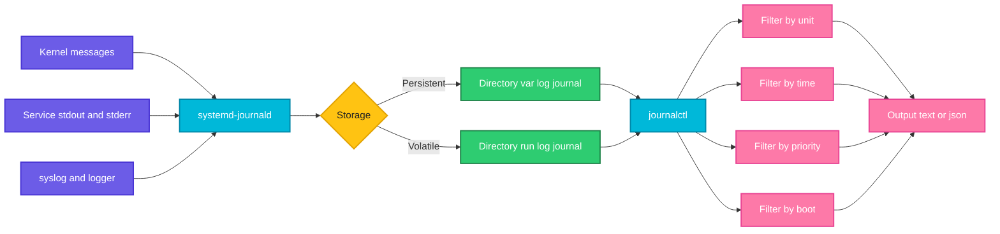

# journalctl

## What is it?
`journalctl` reads the logs collected by `systemd-journald`, the logging service of systemd. The journal is a structured, indexed binary log that contains messages from the kernel, system services, applications (anything writing to stdout or stderr of a systemd service) and `syslog`. Each entry carries metadata such as the unit, PID, priority and boot ID, so you can filter precisely instead of using `grep` on text files.

Use it after `systemctl` tells you a service failed, to see why. It is also useful after package installs and upgrades, because service scripts log their problems there.

When to use which option:

| Goal | Use |
|------|-----|
| Logs of one service | `journalctl -u UNIT` |
| Follow logs live | `-f` |
| Last N lines | `-n N` |
| Only errors | `-p err` |
| Logs since a time | `--since` / `--until` |
| Logs of this boot or the previous boot | `-b` / `-b -1` |
| Kernel messages | `-k` |
| Logs of one process or user | `_PID=` / `_UID=` / `_COMM=` |
| Machine readable output | `-o json` |
| Disk space used by logs | `--disk-usage` |
| Free disk space | `--vacuum-size` / `--vacuum-time` |

## Syntax
```bash
journalctl [OPTIONS] [MATCHES]
sudo journalctl -u UNIT [--since TIME] [-p PRIORITY] [-f]
```

## Visual Overview
> Services and the kernel send messages to `systemd-journald`, which stores them with metadata in `/var/log/journal` (persistent) or `/run/log/journal` (lost at reboot). `journalctl` filters these entries by unit, time, priority and boot.



## Options/Flags

### Selecting entries
| Flag | Description |
|------|-------------|
| `-u UNIT`, `--unit=UNIT` | Entries from a unit (can be repeated). Suffix `.service` is optional |
| `--user-unit=UNIT` | Entries from a user unit |
| `-b [ID]`, `--boot[=ID]` | Entries from a boot. `-b` current, `-b -1` previous, `-b 0` current |
| `--list-boots` | List recorded boots |
| `-k`, `--dmesg` | Kernel messages only (like `dmesg`) |
| `-p PRIORITY`, `--priority=` | Minimum priority: `emerg` (0), `alert` (1), `crit` (2), `err` (3), `warning` (4), `notice` (5), `info` (6), `debug` (7). `FROM..TO` is also allowed |
| `-t ID`, `--identifier=ID` | Entries with this syslog identifier (program name) |
| `-g PATTERN`, `--grep=PATTERN` | Show entries whose message matches the regular expression |
| `-S TIME`, `--since=TIME` | Entries newer than the time |
| `-U TIME`, `--until=TIME` | Entries older than the time |
| `_PID=N`, `_UID=N`, `_COMM=NAME`, `_SYSTEMD_UNIT=NAME` | Field matches. Several fields are ANDed |
| `/path/to/binary` | Entries from that executable |
| `--system` / `--user` | System or user journal only |
| `-D DIR`, `--directory=DIR` | Read a journal from another directory (for example a rescued disk) |
| `-m`, `--merge` | Merge entries from all journals |
| `--case-sensitive=BOOL` | Change case matching of `--grep` |

### Showing entries
| Flag | Description |
|------|-------------|
| `-n N`, `--lines=N` | Show the last N lines (default 10 when used alone) |
| `-f`, `--follow` | Follow new entries (like `tail -f`) |
| `-r`, `--reverse` | Newest first |
| `-e`, `--pager-end` | Jump to the end in the pager |
| `--no-pager` | Do not use a pager |
| `-o FORMAT`, `--output=FORMAT` | `short` (default), `short-iso`, `short-precise`, `verbose`, `json`, `json-pretty`, `cat` (message only), `export` |
| `-x`, `--catalog` | Add explanations from the message catalog |
| `-a`, `--all` | Show all fields even if long or unprintable |
| `-l`, `--full` | Do not shorten long fields (default) |
| `--no-hostname` | Hide the hostname |
| `-q`, `--quiet` | Do not print info messages like "Logs begin at" |
| `--utc` | Show times in UTC |
| `-N`, `--fields` | List all field names in the journal |
| `-F FIELD`, `--field=FIELD` | List all values for a field |

### Maintaining the journal
| Flag | Description |
|------|-------------|
| `--disk-usage` | Show how much space the journal uses |
| `--vacuum-size=SIZE` | Delete old entries until the journal is below this size |
| `--vacuum-time=TIME` | Delete entries older than the time |
| `--vacuum-files=N` | Keep only N journal files |
| `--verify` | Check journal file integrity |
| `--rotate` | Ask journald to rotate files now |
| `--flush` | Move the journal from `/run` to `/var/log/journal` |
| `--sync` | Make sure all logs are written to disk |
| `--header` | Show journal file metadata |

## Usage Examples

Let's say we have this file `/etc/systemd/journald.conf`:

**Input file** (`/etc/systemd/journald.conf`):
```text
[Journal]
Storage=persistent
SystemMaxUse=500M
MaxRetentionSec=1month
```

### Example 1: Show the whole journal
**Command:**
```bash
journalctl --no-pager | head -4
```
**Sample Output:**
```text
Oct 07 08:00:01 web1 kernel: Linux version 5.15.0-119-generic (buildd@lcy02-amd64-050)
Oct 07 08:00:01 web1 kernel: Command line: BOOT_IMAGE=/vmlinuz-5.15.0-119-generic root=UUID=3b1e ro quiet
Oct 07 08:00:05 web1 systemd[1]: Started Journal Service.
Oct 07 08:00:06 web1 systemd[1]: Starting Network Manager...
```
Normally this opens in the `less` pager. Press `q` to leave, `/text` to search, `G` for the end.

### Example 2: Logs for one service (`-u`)
**Command:**
```bash
journalctl -u nginx --no-pager
```
**Sample Output:**
```text
Oct 07 08:00:12 web1 systemd[1]: Starting A high performance web server...
Oct 07 08:00:12 web1 systemd[1]: Started A high performance web server.
Oct 07 11:03:44 web1 systemd[1]: Reloading A high performance web server.
Oct 07 11:03:44 web1 systemd[1]: Reloaded A high performance web server.
```

### Example 3: Last lines (`-n`)
**Command:**
```bash
journalctl -u nginx -n 3 --no-pager
```
**Sample Output:**
```text
Oct 07 11:03:44 web1 systemd[1]: Reloading A high performance web server.
Oct 07 11:03:44 web1 systemd[1]: Reloaded A high performance web server.
Oct 07 11:15:02 web1 nginx[812]: 2026/10/07 11:15:02 [warn] 812#812: conflicting server name "example.com"
```

### Example 4: Follow live (`-f`)
**Command:**
```bash
journalctl -u myapp -f
```
**Sample Output:**
```text
Oct 07 11:30:12 web1 python3[4521]: listening on port 8080
Oct 07 11:30:40 web1 python3[4521]: GET /health 200
Oct 07 11:30:41 web1 python3[4521]: GET /api/users 500
^C
```
Press `Ctrl+C` to stop. Combine with `-n 50` to show the last 50 lines first: `journalctl -u myapp -n 50 -f`.

### Example 5: Several services at once (`-u -u`)
**Command:**
```bash
journalctl -u nginx -u myapp -n 4 --no-pager
```
**Sample Output:**
```text
Oct 07 11:30:40 web1 python3[4521]: GET /health 200
Oct 07 11:30:41 web1 python3[4521]: GET /api/users 500
Oct 07 11:30:41 web1 nginx[812]: 10.0.0.5 "GET /api/users" 502
Oct 07 11:30:42 web1 python3[4521]: GET /health 200
```
Entries from both units are mixed in time order, which helps to trace a request across services.

### Example 6: Logs since a time (`--since`, `--until`)
**Command:**
```bash
journalctl -u myapp --since "2026-10-07 11:00" --until "2026-10-07 11:30" --no-pager
```
**Sample Output:**
```text
Oct 07 11:05:12 web1 python3[4521]: GET /health 200
Oct 07 11:12:45 web1 python3[4521]: GET /api/orders 500
Oct 07 11:29:58 web1 python3[4521]: GET /health 200
```

### Example 7: Relative times (`--since "1 hour ago"`)
**Command:**
```bash
journalctl --since "1 hour ago" -p err --no-pager
journalctl --since yesterday --until today --no-pager | wc -l
journalctl --since "10 min ago" --no-pager | wc -l
```
**Sample Output:**
```text
Oct 07 10:44:03 web1 kernel: EXT4-fs error (device sda1): ext4_lookup:1851
8212
145
```
Accepted words: `now`, `today`, `yesterday`, `tomorrow`, `N min ago`, `N hours ago`, `-2h`.

### Example 8: Filter by priority (`-p`)
**Command:**
```bash
journalctl -p err -b --no-pager
```
**Sample Output:**
```text
Oct 07 08:00:09 web1 systemd[1]: Failed to start myapp.service.
Oct 07 08:00:09 web1 kernel: ACPI Error: AE_NOT_FOUND
```
`-p err` includes `err`, `crit`, `alert` and `emerg`. A range works too: `-p warning..err`.

### Example 9: Current and previous boot (`-b`, `--list-boots`)
**Command:**
```bash
journalctl --list-boots --no-pager
journalctl -b -1 -p err --no-pager | tail -2
```
**Sample Output:**
```text
-1 3f0e1c2a4b5d4e6f8a9b0c1d2e3f4a5b Tue 2026-10-06 08:00:01 UTC—Tue 2026-10-06 23:58:10 UTC
 0 a1b2c3d4e5f60718293a4b5c6d7e8f90 Wed 2026-10-07 08:00:01 UTC—Wed 2026-10-07 11:50:44 UTC
Oct 06 23:57:12 web1 kernel: Out of memory: Killed process 3921 (java)
Oct 06 23:57:12 web1 kernel: oom_reaper: reaped process 3921 (java)
```
This is how to see why a server crashed or rebooted. Previous boots are only available when the journal is persistent (see Pitfalls).

### Example 10: Kernel messages (`-k`)
**Command:**
```bash
journalctl -k -b --no-pager | tail -3
```
**Sample Output:**
```text
Oct 07 08:00:03 web1 kernel: EXT4-fs (sda1): mounted filesystem with ordered data mode
Oct 07 08:00:04 web1 kernel: NET: Registered PF_INET6 protocol family
Oct 07 08:00:04 web1 kernel: Adding 2097148k swap on /swapfile
```

### Example 11: Search the message text (`-g`)
**Command:**
```bash
journalctl -u myapp -g "timeout|refused" --no-pager
```
**Sample Output:**
```text
Oct 07 11:12:45 web1 python3[4521]: db error: connection refused
Oct 07 11:12:50 web1 python3[4521]: upstream timeout after 30s
```
`-g` uses a regular expression and is case insensitive when the pattern is all lowercase. Otherwise combine with a pipe to `grep` for more control.

### Example 12: Syslog identifier (`-t`)
**Command:**
```bash
journalctl -t sudo --since today --no-pager
```
**Sample Output:**
```text
Oct 07 09:12:03 web1 sudo[2210]: alice : TTY=pts/0 ; PWD=/home/alice ; USER=root ; COMMAND=/usr/bin/systemctl restart nginx
```

### Example 13: By process or user (`_PID`, `_UID`, `_COMM`)
**Command:**
```bash
journalctl _PID=4521 --no-pager | tail -2
journalctl _UID=1001 _COMM=python3 -n 2 --no-pager
```
**Sample Output:**
```text
Oct 07 11:30:41 web1 python3[4521]: GET /api/users 500
Oct 07 11:30:42 web1 python3[4521]: GET /health 200
Oct 07 11:30:41 web1 python3[4521]: GET /api/users 500
Oct 07 11:30:42 web1 python3[4521]: GET /health 200
```

### Example 14: By executable path
**Command:**
```bash
journalctl /usr/sbin/sshd -n 2 --no-pager
```
**Sample Output:**
```text
Oct 07 11:55:10 web1 sshd[5120]: Accepted publickey for alice from 10.0.0.5 port 51822 ssh2
Oct 07 11:55:10 web1 sshd[5120]: pam_unix(sshd:session): session opened for user alice(uid=1000)
```
On Red Hat family systems the SSH unit is `sshd`, on Debian and Ubuntu it is `ssh`.

### Example 15: Newest first (`-r`)
**Command:**
```bash
journalctl -u nginx -r -n 2 --no-pager
```
**Sample Output:**
```text
Oct 07 11:15:02 web1 nginx[812]: 2026/10/07 11:15:02 [warn] conflicting server name "example.com"
Oct 07 11:03:44 web1 systemd[1]: Reloaded A high performance web server.
```

### Example 16: Message only (`-o cat`)
**Command:**
```bash
journalctl -u myapp -o cat -n 3 --no-pager
```
**Sample Output:**
```text
GET /health 200
GET /api/users 500
GET /health 200
```
No timestamps or host names. Good for piping into other tools.

### Example 17: ISO timestamps with microseconds (`-o short-iso`, `short-precise`)
**Command:**
```bash
journalctl -u myapp -o short-iso -n 1 --no-pager
journalctl -u myapp -o short-precise -n 1 --no-pager
```
**Sample Output:**
```text
2026-10-07T11:30:42+0000 web1 python3[4521]: GET /health 200
Oct 07 11:30:42.318754 web1 python3[4521]: GET /health 200
```

### Example 18: JSON output (`-o json`, `json-pretty`)
**Command:**
```bash
journalctl -u myapp -n 1 -o json-pretty --no-pager
```
**Sample Output:**
```text
{
        "_SYSTEMD_UNIT" : "myapp.service",
        "_PID" : "4521",
        "PRIORITY" : "6",
        "SYSLOG_IDENTIFIER" : "python3",
        "MESSAGE" : "GET /health 200",
        "__REALTIME_TIMESTAMP" : "1791200242318754"
}
```
Pipe `-o json` into `jq` to filter, for example `jq -r '.MESSAGE'`.

### Example 19: Verbose output with all fields (`-o verbose`)
**Command:**
```bash
journalctl -u myapp -n 1 -o verbose --no-pager
```
**Sample Output:**
```text
Wed 2026-10-07 11:30:42.318754 UTC [s=...;i=1a2b;b=a1b2...;m=...;t=...;x=...]
    _SYSTEMD_UNIT=myapp.service
    _PID=4521
    _UID=1001
    _COMM=python3
    PRIORITY=6
    MESSAGE=GET /health 200
```

### Example 20: Explanations for system messages (`-x`)
**Command:**
```bash
journalctl -xeu myapp --no-pager | tail -6
```
**Sample Output:**
```text
Oct 07 11:42:09 web1 systemd[1]: myapp.service: Failed with result 'exit-code'.
░░ Subject: Unit failed
░░ Defined-By: systemd
░░ Support: http://www.ubuntu.com/support
░░
░░ The unit myapp.service has entered the 'failed' state with result 'exit-code'.
```
`-xeu UNIT` is the combination suggested by `systemctl status` when a unit fails.

### Example 21: Disk usage (`--disk-usage`)
**Command:**
```bash
journalctl --disk-usage
```
**Sample Output:**
```text
Archived and active journals take up 384.0M in the file system.
```

### Example 22: Free space by size (`--vacuum-size`)
**Command:**
```bash
sudo journalctl --vacuum-size=200M
```
**Sample Output:**
```text
Deleted archived journal /var/log/journal/3b1e.../system@0005.journal (128.0M).
Vacuuming done, freed 128.0M of archived journals from /var/log/journal/3b1e....
```

### Example 23: Free space by age (`--vacuum-time`)
**Command:**
```bash
sudo journalctl --vacuum-time=14d
```
**Sample Output:**
```text
Vacuuming done, freed 0B of archived journals from /var/log/journal/3b1e....
```

### Example 24: Limit the size permanently
Using the `journald.conf` shown at the top of this page, apply it with:

**Command:**
```bash
sudo systemctl restart systemd-journald
journalctl --disk-usage
```
**Sample Output:**
```text
Archived and active journals take up 212.0M in the file system.
```
`SystemMaxUse=500M` caps total journal size, `MaxRetentionSec=1month` removes older entries.

### Example 25: Check integrity (`--verify`)
**Command:**
```bash
sudo journalctl --verify 2>&1 | tail -2
```
**Sample Output:**
```text
PASS: /var/log/journal/3b1e.../system.journal
PASS: /var/log/journal/3b1e.../user-1000.journal
```

### Example 26: Show which fields and values exist (`-N`, `-F`)
**Command:**
```bash
journalctl -F _SYSTEMD_UNIT | sort | head -4
```
**Sample Output:**
```text
cron.service
myapp.service
nginx.service
ssh.service
```

### Example 27: Read the journal of another machine (`-D`)
**Command:**
```bash
journalctl -D /mnt/rescue/var/log/journal -b -1 -p err --no-pager | tail -2
```
**Sample Output:**
```text
Oct 06 23:57:12 web1 kernel: Out of memory: Killed process 3921 (java)
Oct 06 23:57:12 web1 systemd[1]: java-app.service: Main process exited, code=killed, status=9/KILL
```

### Example 28: Write your own entry (`logger`, `systemd-cat`)
**Command:**
```bash
logger -t deploy -p user.notice "release 1.4.2 deployed"
journalctl -t deploy -n 1 --no-pager
echo "backup done" | systemd-cat -t backup -p info
```
**Sample Output:**
```text
Oct 07 12:01:11 web1 deploy[6101]: release 1.4.2 deployed
```
Use this in deploy scripts to leave markers in the log.

## Pitfalls / Gotchas
- On many systems (including the Ubuntu cloud images) the journal is **volatile**. It lives in `/run/log/journal` and disappears at reboot, so `-b -1` shows nothing. Make it persistent with `sudo mkdir -p /var/log/journal && sudo systemctl restart systemd-journald`, or set `Storage=persistent` in `/etc/systemd/journald.conf`.
- You need root, or membership in the `systemd-journal` or `adm` group, to see all logs. As a normal user you only see your own entries and `journalctl` prints "Hint: You are currently not seeing messages from other users and the system."
- `journalctl` opens a pager. In scripts always add `--no-pager`.
- `--since` and `--until` use the local time zone unless you add `--utc` or an explicit zone. Servers in UTC and laptops in local time disagree.
- `-p err` means error **and worse**, not only errors.
- `-u nginx` matches only the unit. Messages from child processes outside the unit's cgroup, or logs written to files such as `/var/log/nginx/access.log`, are not in the journal. Check the application's own logging.
- `-f` shows only new entries after the last 10 lines. Use `-n 100 -f` to see more context first.
- `-g` is a regular expression, not a plain string. Special characters such as `.` and `(` need escaping.
- `-n` with no `-u` shows the last lines of everything, which is usually mostly noise.
- Large journals make searches slow. Narrow by `-u`, `-b` and `--since` first.
- Vacuum commands only delete archived files, never the file currently being written. Run `--rotate` first if little is freed.
- On Alpine, containers and WSL without systemd there is no journal. Use `docker logs`, `kubectl logs`, `/var/log/messages` or the application log files.
- Messages longer than a single line may be truncated in the display. Use `-o cat` or `--no-pager -l` for the full text.

## DevOps Use Cases

### Use Case 1: Why did my service fail
**Situation:** `systemctl status` says failed. Get the last logs of this run.

**Command:**
```bash
journalctl -u myapp -n 20 --no-pager -o short-iso
```
**Output:**
```text
2026-10-07T11:42:09+0000 web1 systemd[1]: Started My demo application.
2026-10-07T11:42:09+0000 web1 python3[4602]: FileNotFoundError: [Errno 2] No such file or directory: '/opt/myapp/app.py'
2026-10-07T11:42:09+0000 web1 systemd[1]: myapp.service: Main process exited, code=exited, status=1/FAILURE
2026-10-07T11:42:09+0000 web1 systemd[1]: myapp.service: Failed with result 'exit-code'.
```

### Use Case 2: Investigate a crash or an unexpected reboot
**Situation:** A server rebooted overnight and you need to know why.

**Command:**
```bash
journalctl --list-boots --no-pager | tail -2
journalctl -b -1 -n 15 --no-pager
journalctl -b -1 -g "Out of memory|Killed process|panic" --no-pager
```
**Output:**
```text
-1 3f0e1c2a4b5d4e6f8a9b0c1d2e3f4a5b Tue 2026-10-06 08:00:01 UTC—Tue 2026-10-06 23:58:10 UTC
 0 a1b2c3d4e5f60718293a4b5c6d7e8f90 Wed 2026-10-07 08:00:01 UTC—Wed 2026-10-07 11:50:44 UTC
Oct 06 23:57:12 web1 kernel: Out of memory: Killed process 3921 (java) total-vm:8123456kB
```
The OOM killer ended the Java process.

### Use Case 3: Security audit of SSH logins
**Situation:** See failed and successful SSH logins from the last day.

**Command:**
```bash
journalctl -u ssh --since yesterday --no-pager -g "Failed password|Accepted" | tail -4
```
**Output:**
```text
Oct 07 03:12:44 web1 sshd[3011]: Failed password for root from 203.0.113.50 port 51344 ssh2
Oct 07 03:12:47 web1 sshd[3011]: Failed password for root from 203.0.113.50 port 51344 ssh2
Oct 07 09:12:01 web1 sshd[3410]: Accepted publickey for alice from 10.0.0.5 port 51822 ssh2
```

### Use Case 4: Count the top offenders in the logs
**Situation:** Which IP addresses cause most failed logins?

**Command:**
```bash
journalctl -u ssh --since "24 hours ago" --no-pager -o cat | grep "Failed password" | awk '{print $(NF-3)}' | sort | uniq -c | sort -rn | head -3
```
**Output:**
```text
     212 203.0.113.50
      18 198.51.100.7
       4 192.0.2.44
```
The result can feed `fail2ban` or a firewall rule.

### Use Case 5: Tail several services during a deployment
**Situation:** Watch app, worker and nginx logs together while deploying.

**Command:**
```bash
journalctl -u app -u worker -u nginx -f -n 0 -o short-precise
```
**Output:**
```text
Oct 07 12:10:01.114301 web1 systemd[1]: Stopping app...
Oct 07 12:10:02.221907 web1 systemd[1]: Started app.
Oct 07 12:10:02.884012 web1 app[6402]: ready on port 8080
```

### Use Case 6: Error rate in the last 10 minutes
**Situation:** A quick check without a monitoring system.

**Command:**
```bash
journalctl -u myapp --since "10 min ago" --no-pager -o cat | grep -c " 500"
```
**Output:**
```text
17
```

### Use Case 7: Export logs for an incident ticket
**Situation:** Save the logs of the incident window as a file and compress it.

**Command:**
```bash
journalctl -u myapp -u nginx --since "2026-10-07 11:00" --until "2026-10-07 12:00" --no-pager > incident.log
gzip -9 incident.log
ls -lh incident.log.gz
```
**Output:**
```text
-rw-r--r-- 1 user user 41K Oct  7 12:20 incident.log.gz
```

### Use Case 8: Ship structured logs into jq
**Situation:** Get all error messages of a service as a clean list.

**Command:**
```bash
journalctl -u myapp -p err --since today -o json --no-pager | jq -r '[.__REALTIME_TIMESTAMP, .MESSAGE] | @tsv' | head -2
```
**Output:**
```text
1791198765000000	db error: connection refused
1791198770000000	upstream timeout after 30s
```
`__REALTIME_TIMESTAMP` is in microseconds since 1970.

### Use Case 9: Keep the journal from filling the disk
**Situation:** `/var` is almost full of journal files.

**Command:**
```bash
journalctl --disk-usage
sudo journalctl --vacuum-size=300M --vacuum-time=30d
df -h /var | tail -1
```
**Output:**
```text
Archived and active journals take up 4.1G in the file system.
Vacuuming done, freed 3.8G of archived journals from /var/log/journal/3b1e....
/dev/sda2        20G   9.6G  9.4G  51% /var
```

### Use Case 10: Check what an upgrade did to a service
**Situation:** After `apt upgrade`, a service behaves differently. Compare logs before and after.

**Command:**
```bash
grep " upgrade " /var/log/dpkg.log | tail -2
journalctl -u nginx --since "2026-10-07 02:00" --until "2026-10-07 02:10" --no-pager
```
**Output:**
```text
2026-10-07 02:00:41 upgrade nginx:amd64 1.18.0-6ubuntu14 1.18.0-6ubuntu14.4
Oct 07 02:00:43 web1 systemd[1]: Stopping A high performance web server...
Oct 07 02:00:44 web1 systemd[1]: Started A high performance web server.
```
On Red Hat family systems check `dnf history` or `/var/log/dnf.log` instead of `dpkg.log`.

### Use Case 11: Alert when a service logs critical errors
**Situation:** A cron job notifies the team when `crit` or worse appears.

**Command:**
```bash
n=$(journalctl -p crit --since "5 min ago" --no-pager -q | wc -l)
[ "$n" -gt 0 ] && echo "ALERT: $n critical log lines" || echo "OK"
```
**Output:**
```text
ALERT: 3 critical log lines
```

## Related Commands
- [systemctl](systemctl.md) - start, stop and inspect the services whose logs you read
- [apt](apt.md) / [dnf](dnf.md) / [yum](yum.md) - installs and upgrades that you may want to correlate with log entries
- [tar](tar.md) / [zip-unzip](zip-unzip.md) - archive logs for tickets
- [curl](../networking/curl.md) / [ss](../networking/ss.md) - reproduce and check the problem while following the logs
