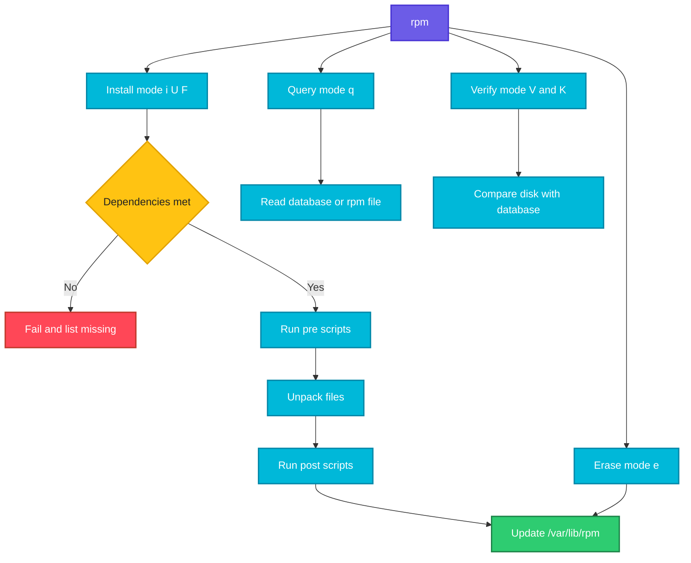

# rpm

## What is it?
`rpm` (RPM Package Manager) is the low level package tool of the Red Hat family: RHEL, CentOS, Rocky, AlmaLinux, Fedora, Amazon Linux, SUSE and openSUSE. It installs, removes, queries and verifies individual `.rpm` files and keeps the database of installed packages in `/var/lib/rpm`.

`rpm` does not download packages and does not fetch dependencies. [yum](yum.md) and [dnf](dnf.md) sit on top of it and add repositories and dependency resolution.

When to use which option:

| Goal | Use |
|------|-----|
| Install a `.rpm` file | `rpm -ivh` (or `dnf install ./file.rpm` to get dependencies) |
| Upgrade or install a `.rpm` file | `rpm -Uvh` |
| Upgrade only if already installed | `rpm -Fvh` |
| Remove a package | `rpm -e` |
| List all installed packages | `rpm -qa` |
| Details of an installed package | `rpm -qi` |
| Files of an installed package | `rpm -ql` |
| Which package owns a file | `rpm -qf` |
| Dependencies of a package | `rpm -qR` |
| Look inside a `.rpm` file before installing | `rpm -qp...` |
| Check if files were modified | `rpm -V` |
| Trust a vendor's signing key | `rpm --import` |
| Check a package signature | `rpm -K` |

## Syntax
```bash
rpm -i|-U|-F|-e [OPTIONS] PACKAGE_FILE_or_NAME
rpm -q [QUERY_OPTIONS] [PACKAGE]
rpm -V [PACKAGE]
```

## Visual Overview
> `rpm` has three modes. Install and upgrade modes unpack a `.rpm` file and update the database. Query mode only reads the database or a file. Verify mode compares the disk against the database.



## Options/Flags

### Modes
| Flag | Description |
|------|-------------|
| `-i`, `--install` | Install a package file |
| `-U`, `--upgrade` | Upgrade, or install if not present. Removes older versions |
| `-F`, `--freshen` | Upgrade only packages that are already installed |
| `-e`, `--erase` | Remove a package |
| `-q`, `--query` | Query installed packages or package files |
| `-V`, `--verify` | Verify installed files against the database |
| `-K`, `--checksig` | Check digests and signatures of a package file |
| `--import KEY` | Import a GPG public key |

### Install and erase modifiers
| Flag | Description |
|------|-------------|
| `-v`, `-vv` | Verbose output |
| `-h` | Print hash marks as a progress bar |
| `--test` | Check what would happen without changing anything |
| `--nodeps` | Skip dependency checks (dangerous) |
| `--force` | Reinstall or replace files, ignore conflicts |
| `--replacepkgs` | Reinstall an already installed package |
| `--oldpackage` | Allow a downgrade with `-U` |
| `--prefix DIR` / `--relocate OLD=NEW` | Install under another directory (relocatable packages only) |
| `--nosignature` / `--nodigest` | Skip signature or digest checks |
| `--noscripts` | Do not run scriptlets |
| `--nodeps -e` | Erase ignoring packages that depend on it |

### Query modifiers
| Flag | Description |
|------|-------------|
| `-a` | All installed packages |
| `-f FILE` | Package that owns FILE |
| `-p FILE.rpm` | Query an rpm file instead of the database |
| `-i` | Information (name, version, summary) |
| `-l` | List files |
| `-c` | List only configuration files |
| `-d` | List only documentation files |
| `-R` | What the package requires |
| `--provides` | What the package provides |
| `--whatrequires CAP` | Which installed packages require this capability |
| `--whatprovides CAP` | Which installed package provides this capability |
| `--scripts` | Show install and uninstall scripts |
| `--changelog` | Show the changelog |
| `--last` | Sort by install time (newest first) |
| `--qf FORMAT`, `--queryformat` | Custom output format |

### Verify symbols
| Symbol | Meaning |
|--------|---------|
| `S` | File size differs |
| `5` | MD5 digest differs |
| `T` | Modification time differs |
| `U` / `G` | Owner or group differs |
| `M` | Mode (permissions) differs |
| `L` | Link path differs |
| `c` | The file is a configuration file |

## Usage Examples

Let's say we have this file `hello-1.0-1.el9.x86_64.rpm`. It is a binary archive, so we show what `rpm -qpi` and `rpm -qpl` say about it:

**Input file** (`hello-1.0-1.el9.x86_64.rpm`):
```text
$ rpm -qpi hello-1.0-1.el9.x86_64.rpm
Name        : hello
Version     : 1.0
Release     : 1.el9
Architecture: x86_64
Summary     : tiny demo program
License     : MIT

$ rpm -qpl hello-1.0-1.el9.x86_64.rpm
/usr/bin/hello
/usr/share/doc/hello/README
```

### Example 1: Look inside a package file (`-qpi`, `-qpl`)
**Command:**
```bash
rpm -qpi hello-1.0-1.el9.x86_64.rpm
rpm -qpl hello-1.0-1.el9.x86_64.rpm
```
**Sample Output:**
```text
Name        : hello
Version     : 1.0
Release     : 1.el9
Architecture: x86_64
Summary     : tiny demo program
License     : MIT
/usr/bin/hello
/usr/share/doc/hello/README
```

### Example 2: Check dependencies of a package file (`-qpR`)
**Command:**
```bash
rpm -qpR hello-1.0-1.el9.x86_64.rpm
```
**Sample Output:**
```text
libc.so.6()(64bit)
libc.so.6(GLIBC_2.34)(64bit)
rpmlib(CompressedFileNames) <= 3.0.4-1
```

### Example 3: Check the signature (`-K`)
**Command:**
```bash
rpm -K hello-1.0-1.el9.x86_64.rpm
```
**Sample Output:**
```text
hello-1.0-1.el9.x86_64.rpm: digests signatures OK
```
If the key is missing you see `NOKEY`. Import it first with `rpm --import`.

### Example 4: Import a vendor GPG key (`--import`)
**Command:**
```bash
sudo rpm --import https://nginx.org/keys/nginx_signing.key
rpm -qa gpg-pubkey*
```
**Sample Output:**
```text
gpg-pubkey-7bd9bf62-5762e6b8
```

### Example 5: Test an install (`--test`)
**Command:**
```bash
sudo rpm -ivh --test hello-1.0-1.el9.x86_64.rpm
```
**Sample Output:**
```text
Verifying...                          ################################# [100%]
Preparing...                          ################################# [100%]
```
Nothing is installed. If a dependency was missing it would be listed as an error.

### Example 6: Install a package (`-ivh`)
**Command:**
```bash
sudo rpm -ivh hello-1.0-1.el9.x86_64.rpm
```
**Sample Output:**
```text
Verifying...                          ################################# [100%]
Preparing...                          ################################# [100%]
Updating / installing...
   1:hello-1.0-1.el9                  ################################# [100%]
```

### Example 7: Install fails with missing dependencies
**Command:**
```bash
sudo rpm -ivh app-2.0-1.el9.x86_64.rpm
```
**Sample Output:**
```text
error: Failed dependencies:
	libfoo.so.1()(64bit) is needed by app-2.0-1.el9.x86_64
```
Use `sudo dnf install ./app-2.0-1.el9.x86_64.rpm` to have the dependency installed automatically.

### Example 8: Upgrade (`-Uvh`)
**Command:**
```bash
sudo rpm -Uvh hello-1.1-1.el9.x86_64.rpm
```
**Sample Output:**
```text
Verifying...                          ################################# [100%]
Preparing...                          ################################# [100%]
Updating / installing...
   1:hello-1.1-1.el9                  ################################# [ 50%]
Cleaning up / removing...
   2:hello-1.0-1.el9                  ################################# [100%]
```

### Example 9: Upgrade only if installed (`-Fvh`)
**Command:**
```bash
sudo rpm -Fvh *.rpm
```
**Sample Output:**
```text
Updating / installing...
   1:hello-1.1-1.el9                  ################################# [100%]
```
Packages in the folder that are not installed are skipped.

### Example 10: Downgrade (`--oldpackage`)
**Command:**
```bash
sudo rpm -Uvh --oldpackage hello-1.0-1.el9.x86_64.rpm
```
**Sample Output:**
```text
Updating / installing...
   1:hello-1.0-1.el9                  ################################# [ 50%]
Cleaning up / removing...
   2:hello-1.1-1.el9                  ################################# [100%]
```

### Example 11: Reinstall (`--replacepkgs`)
**Command:**
```bash
sudo rpm -ivh --replacepkgs hello-1.0-1.el9.x86_64.rpm
```
**Sample Output:**
```text
Updating / installing...
   1:hello-1.0-1.el9                  ################################# [100%]
```

### Example 12: Remove a package (`-e`)
**Command:**
```bash
sudo rpm -e hello
```
**Sample Output:**
```text
(no output)
```
No output means success. Verify with `rpm -q hello`, which prints `package hello is not installed`.

### Example 13: Remove is blocked by a dependency
**Command:**
```bash
sudo rpm -e openssl-libs
```
**Sample Output:**
```text
error: Failed dependencies:
	libssl.so.3()(64bit) is needed by (installed) curl-7.76.1-29.el9_4.x86_64
```

### Example 14: Is a package installed (`-q`)
**Command:**
```bash
rpm -q openssl hello
```
**Sample Output:**
```text
openssl-3.0.7-28.el9_4.x86_64
package hello is not installed
```

### Example 15: List all installed packages (`-qa`)
**Command:**
```bash
rpm -qa | sort | head -4
```
**Sample Output:**
```text
NetworkManager-1.46.0-8.el9.x86_64
NetworkManager-libnm-1.46.0-8.el9.x86_64
audit-3.1.2-1.el9.x86_64
audit-libs-3.1.2-1.el9.x86_64
```

### Example 16: Filter installed packages (`-qa` with pattern)
**Command:**
```bash
rpm -qa 'kernel*'
```
**Sample Output:**
```text
kernel-5.14.0-427.28.1.el9_4.x86_64
kernel-core-5.14.0-427.28.1.el9_4.x86_64
kernel-modules-5.14.0-427.28.1.el9_4.x86_64
```

### Example 17: Package information (`-qi`)
**Command:**
```bash
rpm -qi tree
```
**Sample Output:**
```text
Name        : tree
Version     : 1.8.0
Release     : 10.el9
Architecture: x86_64
Install Date: Wed 07 Oct 2026 10:12:11 AM UTC
Size        : 111436
License     : GPLv2+
Summary     : File system tree viewer
```

### Example 18: List files of a package (`-ql`)
**Command:**
```bash
rpm -ql tree
```
**Sample Output:**
```text
/usr/bin/tree
/usr/share/doc/tree
/usr/share/doc/tree/README
/usr/share/man/man1/tree.1.gz
```

### Example 19: Config and doc files (`-qc`, `-qd`)
**Command:**
```bash
rpm -qc openssh-server
rpm -qd tree
```
**Sample Output:**
```text
/etc/pam.d/sshd
/etc/ssh/sshd_config
/etc/sysconfig/sshd
/usr/share/doc/tree/README
/usr/share/man/man1/tree.1.gz
```

### Example 20: Which package owns a file (`-qf`)
**Command:**
```bash
rpm -qf /usr/bin/tree
```
**Sample Output:**
```text
tree-1.8.0-10.el9.x86_64
```

### Example 21: What does a package require (`-qR`)
**Command:**
```bash
rpm -qR tree
```
**Sample Output:**
```text
libc.so.6()(64bit)
libc.so.6(GLIBC_2.34)(64bit)
rtld(GNU_HASH)
```

### Example 22: What does a package provide (`--provides`)
**Command:**
```bash
rpm -q --provides tree
```
**Sample Output:**
```text
tree = 1.8.0-10.el9
tree(x86-64) = 1.8.0-10.el9
```

### Example 23: Which installed packages need a library (`--whatrequires`)
**Command:**
```bash
rpm -q --whatrequires openssl-libs | head -3
```
**Sample Output:**
```text
curl-7.76.1-29.el9_4.x86_64
openssh-8.7p1-38.el9.x86_64
python3-3.9.18-3.el9_4.x86_64
```

### Example 24: Which package provides a capability (`--whatprovides`)
**Command:**
```bash
rpm -q --whatprovides /bin/sh
```
**Sample Output:**
```text
bash-5.1.8-9.el9.x86_64
```

### Example 25: Newest installed packages first (`--last`)
**Command:**
```bash
rpm -qa --last | head -3
```
**Sample Output:**
```text
tree-1.8.0-10.el9.x86_64                      Wed 07 Oct 2026 10:12:11 AM UTC
openssl-3.0.7-28.el9_4.x86_64                 Tue 06 Oct 2026 10:01:44 PM UTC
curl-7.76.1-29.el9_4.x86_64                   Tue 06 Oct 2026 10:01:40 PM UTC
```

### Example 26: Show scripts and changelog (`--scripts`, `--changelog`)
**Command:**
```bash
rpm -q --scripts openssh-server | head -4
rpm -q --changelog tree | head -3
```
**Sample Output:**
```text
preinstall scriptlet (using /bin/sh):
getent group sshd >/dev/null || groupadd -r sshd || :
* Mon Jul 15 2026 Packager <pkg@example.com> - 1.8.0-10
- Rebuilt for RHEL 9.4
```

### Example 27: Custom output format (`--qf`)
**Command:**
```bash
rpm -qa --qf '%{NAME}\t%{VERSION}-%{RELEASE}\t%{ARCH}\n' | sort | head -3
```
**Sample Output:**
```text
NetworkManager	1.46.0-8.el9	x86_64
audit	3.1.2-1.el9	x86_64
audit-libs	3.1.2-1.el9	x86_64
```

### Example 28: Verify one package (`-V`)
**Command:**
```bash
sudo rpm -V openssh-server
```
**Sample Output:**
```text
S.5....T.  c /etc/ssh/sshd_config
```
`S`, `5` and `T` show that size, checksum and time differ. The `c` shows it is a config file. This is normal after you edit it. No output means everything matches.

### Example 29: Verify all packages (`-Va`)
**Command:**
```bash
sudo rpm -Va | head -4
```
**Sample Output:**
```text
S.5....T.  c /etc/ssh/sshd_config
.M.......    /var/log/audit
..5....T.  c /etc/chrony.conf
```

### Example 30: Extract files from an rpm without installing (`rpm2cpio`)
**Command:**
```bash
mkdir /tmp/hello-extract && cd /tmp/hello-extract
rpm2cpio ~/hello-1.0-1.el9.x86_64.rpm | cpio -idmv
```
**Sample Output:**
```text
./usr/bin/hello
./usr/share/doc/hello/README
1 block
```

### Example 31: Rebuild a damaged database (`--rebuilddb`)
**Command:**
```bash
sudo rpm --rebuilddb
rpm -qa | wc -l
```
**Sample Output:**
```text
412
```

## Pitfalls / Gotchas
- `rpm -i` does not resolve dependencies. Use `dnf install ./file.rpm` when you have a file.
- Use `-U` instead of `-i` for packages that may already exist, otherwise you can end up with two versions installed side by side. The kernel is the exception, it is meant to be installed with `-i`.
- `--nodeps` and `--force` can leave the system in a state that `dnf` cannot repair.
- `rpm -e` removes only the named package, not its unused dependencies. `dnf autoremove` handles those.
- `rpm -qa` gives no output sorting. Always pipe through `sort`.
- `rpm -V` flags config files you edited. Look for non config files (no `c`) with `5` or `S` for real problems.
- A corrupted RPM database gives errors like `error: rpmdb: BDB0113 Thread/process ... failed`. Fix with `rpm --rebuilddb`.
- `rpm -K` says `NOKEY` until you import the vendor key with `rpm --import`.
- `rpm -qf` needs the real path of the file. For a command use `rpm -qf $(which cmd)`.

## DevOps Use Cases

### Use Case 1: Find the package for a command or file
**Situation:** You have a binary and need to know which package owns it.

**Command:**
```bash
rpm -qf $(which ss)
```
**Output:**
```text
iproute-6.2.0-5.el9.x86_64
```

### Use Case 2: Audit installed software for a report
**Situation:** Produce a package inventory with versions.

**Command:**
```bash
rpm -qa --qf '%{NAME},%{VERSION}-%{RELEASE},%{ARCH}\n' | sort > inventory.csv
head -3 inventory.csv
```
**Output:**
```text
NetworkManager,1.46.0-8.el9,x86_64
audit,3.1.2-1.el9,x86_64
audit-libs,3.1.2-1.el9,x86_64
```

### Use Case 3: Check whether a vulnerable version is installed
**Situation:** A CVE affects `openssl` before 3.0.7-28. Check each server.

**Command:**
```bash
rpm -q openssl --qf '%{VERSION}-%{RELEASE}\n'
rpm -q --changelog openssl | grep -m1 "CVE-2026-"
```
**Output:**
```text
3.0.7-27.el9
- Fix CVE-2026-1234: buffer overflow in X509 parsing
```
The changelog lists CVEs fixed by each release, so you can see whether yours is included.

### Use Case 4: Detect modified system binaries
**Situation:** Security wants to know if any non config files changed after an incident.

**Command:**
```bash
sudo rpm -Va | grep -v ' c ' | grep -E '^..5'
```
**Output:**
```text
..5....T.    /usr/bin/ssh
```
A changed checksum on `/usr/bin/ssh` that is not a config file needs investigation. Reinstall with `dnf reinstall openssh-clients` and compare.

### Use Case 5: Install a vendor RPM safely
**Situation:** Install a downloaded agent after checking its signature.

**Command:**
```bash
sudo rpm --import https://vendor.example.com/RPM-GPG-KEY
rpm -K agent-5.2-1.x86_64.rpm && sudo dnf install -y ./agent-5.2-1.x86_64.rpm
```
**Output:**
```text
agent-5.2-1.x86_64.rpm: digests signatures OK
Installed:
  agent-5.2-1.x86_64
Complete!
```

### Use Case 6: Clean up old kernels
**Situation:** `/boot` is full of old kernels.

**Command:**
```bash
rpm -q kernel
sudo dnf remove -y $(dnf repoquery --installonly --latest-limit=-2 -q)
```
**Output:**
```text
kernel-5.14.0-362.8.1.el9_3.x86_64
kernel-5.14.0-427.13.1.el9_4.x86_64
kernel-5.14.0-427.28.1.el9_4.x86_64
Removed:
  kernel-5.14.0-362.8.1.el9_3.x86_64
Complete!
```

### Use Case 7: Compare package lists between two servers
**Situation:** Find drift between a working and a failing server.

Let's say we have these files `prod.txt` and `stage.txt`:

**Input file** (`prod.txt`):
```text
curl-7.76.1-29.el9_4.x86_64
openssl-3.0.7-28.el9_4.x86_64
```
**Input file** (`stage.txt`):
```text
curl-7.76.1-29.el9_4.x86_64
openssl-3.0.7-27.el9.x86_64
```
**Command:**
```bash
diff prod.txt stage.txt
```
**Output:**
```text
2c2
< openssl-3.0.7-28.el9_4.x86_64
---
> openssl-3.0.7-27.el9.x86_64
```
Create each file with `rpm -qa | sort > prod.txt` on the matching server.

### Use Case 8: Recover a broken package database
**Situation:** `dnf` fails with an rpmdb error after a crash.

**Command:**
```bash
sudo rm -f /var/lib/rpm/__db.*
sudo rpm --rebuilddb && rpm -qa | wc -l && sudo dnf check
```
**Output:**
```text
412
```
`dnf check` printing nothing means the database is consistent.

### Use Case 9: See what a package will run on your system
**Situation:** Review scriptlets of a third party RPM before installing.

**Command:**
```bash
rpm -qp --scripts agent-5.2-1.x86_64.rpm
```
**Output:**
```text
postinstall scriptlet (using /bin/sh):
systemctl enable agent.service
preuninstall scriptlet (using /bin/sh):
systemctl stop agent.service
```

## Related Commands
- [dnf](dnf.md) / [yum](yum.md) - high level tools that fetch from repositories
- [dpkg](dpkg.md) - the Debian family equivalent
- [tar](tar.md) - `rpm2cpio` output is a cpio archive, tar handles similar jobs
- [systemctl](systemctl.md) - manage services installed by packages
