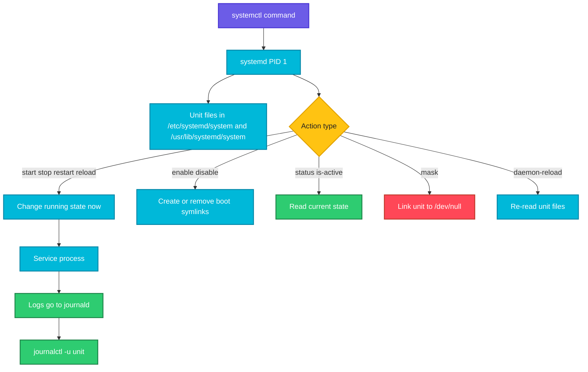

# systemctl

## What is it?
`systemctl` is the command used to control **systemd**, the init system and service manager of almost every modern Linux distribution (Ubuntu, Debian, RHEL, CentOS, Rocky, Fedora, Amazon Linux, SUSE). It starts, stops, restarts, enables and inspects **units**. A unit is anything systemd manages: a service (`.service`), a timer (`.timer`), a socket (`.socket`), a mount (`.mount`), a target (`.target`, a group of units like "multi-user") and so on.

It belongs next to package management because installing a package usually installs a service, and the next step is to start it, enable it at boot and check it works. (Alpine Linux uses OpenRC instead of systemd, so `systemctl` is not available there. Use `rc-service` and `rc-update`.)

When to use which sub command:

| Goal | Use |
|------|-----|
| Start or stop a service now | `start` / `stop` |
| Apply a changed config | `restart` or `reload` |
| Start a service at every boot | `enable` |
| Do both, start now and at boot | `enable --now` |
| See if a service is running | `status` or `is-active` |
| See if it will start at boot | `is-enabled` |
| List services | `list-units` / `list-unit-files` |
| Find failed services | `--failed` |
| After editing a unit file | `daemon-reload` |
| Override a vendor unit safely | `edit` |
| Prevent a service from starting at all | `mask` |
| See dependencies | `list-dependencies` |
| Scheduled jobs | `list-timers` |

## Syntax
```bash
systemctl [OPTIONS] COMMAND [UNIT...]
sudo systemctl start|stop|restart|reload|enable|disable UNIT
```
If you leave out the suffix, `.service` is assumed: `systemctl status nginx` is the same as `systemctl status nginx.service`.

## Visual Overview
> `systemctl` talks to the systemd process (PID 1). `start` and `stop` change the running state right now. `enable` and `disable` create or remove symlinks in `/etc/systemd/system/*.wants/`, which decides what starts at boot. They are independent of each other.



## Options/Flags

### Sub commands: service control
| Sub command | Description |
|-------------|-------------|
| `start UNIT` | Start now |
| `stop UNIT` | Stop now |
| `restart UNIT` | Stop and start (starts it if it is not running) |
| `try-restart UNIT` | Restart only if it is running |
| `reload UNIT` | Ask the service to re-read its config without stopping (needs support) |
| `reload-or-restart UNIT` | Reload if supported, else restart |
| `kill UNIT` | Send a signal to the processes of a unit (`--signal=SIGHUP`) |
| `enable UNIT` | Start at boot |
| `disable UNIT` | Do not start at boot |
| `enable --now UNIT` | Enable and start immediately |
| `disable --now UNIT` | Disable and stop immediately |
| `reenable UNIT` | Disable and enable again (refresh symlinks) |
| `mask UNIT` | Make the unit impossible to start (links it to `/dev/null`) |
| `unmask UNIT` | Remove the mask |

### Sub commands: inspection
| Sub command | Description |
|-------------|-------------|
| `status UNIT` | Show state, PID, memory and the last log lines |
| `is-active UNIT` | Print `active` or another state. Exit code 0 if active |
| `is-enabled UNIT` | Print `enabled`, `disabled`, `masked`, `static` and so on |
| `is-failed UNIT` | Exit code 0 if the unit is in a failed state |
| `show UNIT` | Show all properties (`-p Property` for one) |
| `cat UNIT` | Print the unit file and its overrides |
| `list-units` | List loaded units (active by default) |
| `list-unit-files` | List installed unit files and whether they are enabled |
| `list-dependencies UNIT` | Show the dependency tree |
| `list-timers` | Show scheduled timers |
| `list-sockets` | Show socket units |
| `--failed` | List units in the failed state |

### Sub commands: configuration and system
| Sub command | Description |
|-------------|-------------|
| `daemon-reload` | Re-read all unit files. Run after editing or adding a unit |
| `daemon-reexec` | Restart the systemd process itself |
| `edit UNIT` | Create a drop in override file in `/etc/systemd/system/UNIT.d/override.conf` |
| `edit --full UNIT` | Edit a full copy of the unit file |
| `revert UNIT` | Remove overrides and go back to the vendor unit |
| `reset-failed [UNIT]` | Clear the failed state |
| `get-default` | Show the default target |
| `set-default TARGET` | Set the default target, for example `multi-user.target` |
| `isolate TARGET` | Switch to a target (for example `rescue.target`) |
| `reboot` | Reboot the machine |
| `poweroff` | Shut down |
| `suspend` | Suspend to RAM |
| `rescue` / `emergency` | Boot into rescue or emergency mode |

### Options
| Flag | Description |
|------|-------------|
| `-t TYPE`, `--type=TYPE` | Limit to a unit type: `service`, `timer`, `socket`, `mount` |
| `--state=STATE` | Filter by state (`running`, `failed`, `active`) |
| `-a`, `--all` | Show inactive units too |
| `-l`, `--full` | Do not shorten output |
| `-n N`, `--lines=N` | Number of log lines in `status` |
| `--no-pager` | Do not use `less` (good for scripts) |
| `--no-legend` | Hide headers and footers |
| `--no-ask-password` | Do not prompt for a password |
| `-q`, `--quiet` | No output, use the exit code |
| `--user` | Manage the per user service manager |
| `--system` | Manage the system service manager (default) |
| `-H HOST` | Run on a remote host through SSH |
| `--now` | With `enable` or `disable`, also start or stop |
| `--runtime` | Make changes that vanish at reboot |
| `-p PROPERTY` | With `show`, print only the property |
| `--value` | With `show -p`, print only the value |
| `--signal=SIG` | With `kill`, the signal to send |

## Usage Examples

Let's say we have this file `/etc/systemd/system/myapp.service`:

**Input file** (`/etc/systemd/system/myapp.service`):
```text
[Unit]
Description=My demo application
After=network.target

[Service]
User=appuser
WorkingDirectory=/opt/myapp
ExecStart=/usr/bin/python3 /opt/myapp/app.py
Restart=on-failure
RestartSec=5
Environment=PORT=8080

[Install]
WantedBy=multi-user.target
```

### Example 1: Tell systemd about a new unit file (`daemon-reload`)
**Command:**
```bash
sudo systemctl daemon-reload
```
**Sample Output:**
```text
(no output)
```
Always do this after creating or editing a unit file. Without it, systemd warns: `Warning: The unit file, source configuration file or drop-ins of myapp.service changed on disk. Run 'systemctl daemon-reload' to reload units.`

### Example 2: Start a service (`start`)
**Command:**
```bash
sudo systemctl start myapp
```
**Sample Output:**
```text
(no output)
```
No output means the start request succeeded. Check the result with `status`.

### Example 3: Check status (`status`)
**Command:**
```bash
systemctl status myapp --no-pager
```
**Sample Output:**
```text
● myapp.service - My demo application
     Loaded: loaded (/etc/systemd/system/myapp.service; disabled; vendor preset: enabled)
     Active: active (running) since Wed 2026-10-07 11:30:12 UTC; 8s ago
   Main PID: 4521 (python3)
      Tasks: 1 (limit: 4557)
     Memory: 18.2M
        CPU: 112ms
     CGroup: /system.slice/myapp.service
             └─4521 /usr/bin/python3 /opt/myapp/app.py

Oct 07 11:30:12 web1 systemd[1]: Started My demo application.
Oct 07 11:30:12 web1 python3[4521]: listening on port 8080
```
`Loaded: ... disabled` means it will not start at boot. `Active: active (running)` means it is running now.

### Example 4: Stop a service (`stop`)
**Command:**
```bash
sudo systemctl stop myapp
systemctl is-active myapp
```
**Sample Output:**
```text
inactive
```

### Example 5: Restart a service (`restart`)
**Command:**
```bash
sudo systemctl restart myapp
systemctl is-active myapp
```
**Sample Output:**
```text
active
```

### Example 6: Reload configuration without downtime (`reload`)
**Command:**
```bash
sudo nginx -t && sudo systemctl reload nginx
```
**Sample Output:**
```text
nginx: the configuration file /etc/nginx/nginx.conf syntax is ok
nginx: configuration file /etc/nginx/nginx.conf test is successful
```
`reload` sends the service a signal (SIGHUP for nginx) so it re-reads its config while keeping connections open. If the service does not support it, use `reload-or-restart`.

### Example 7: Start at boot (`enable`)
**Command:**
```bash
sudo systemctl enable myapp
```
**Sample Output:**
```text
Created symlink /etc/systemd/system/multi-user.target.wants/myapp.service → /etc/systemd/system/myapp.service.
```
This comes from the `[Install]` section `WantedBy=multi-user.target` in the unit file above.

### Example 8: Enable and start together (`enable --now`)
**Command:**
```bash
sudo systemctl enable --now nginx
```
**Sample Output:**
```text
Synchronizing state of nginx.service with SysV service script with /lib/systemd/systemd-sysv-install.
Executing: /lib/systemd/systemd-sysv-install enable nginx
Created symlink /etc/systemd/system/multi-user.target.wants/nginx.service → /lib/systemd/system/nginx.service.
```

### Example 9: Disable (`disable`, `disable --now`)
**Command:**
```bash
sudo systemctl disable --now myapp
```
**Sample Output:**
```text
Removed /etc/systemd/system/multi-user.target.wants/myapp.service.
```

### Example 10: Is it enabled (`is-enabled`)
**Command:**
```bash
systemctl is-enabled nginx myapp
```
**Sample Output:**
```text
enabled
disabled
```
Other answers are `static` (no `[Install]` section, started only as a dependency), `masked` and `indirect`.

### Example 11: Is it active in a script (`is-active`, `-q`)
**Command:**
```bash
systemctl is-active --quiet nginx && echo "nginx is running" || echo "nginx is NOT running"
```
**Sample Output:**
```text
nginx is running
```

### Example 12: List running services (`list-units`)
**Command:**
```bash
systemctl list-units --type=service --state=running --no-pager
```
**Sample Output:**
```text
UNIT                      LOAD   ACTIVE SUB     DESCRIPTION
cron.service              loaded active running Regular background program processing daemon
nginx.service             loaded active running A high performance web server
ssh.service               loaded active running OpenBSD Secure Shell server
systemd-journald.service  loaded active running Journal Service

4 loaded units listed.
```

### Example 13: Find failed services (`--failed`)
**Command:**
```bash
systemctl --failed --no-pager
```
**Sample Output:**
```text
UNIT          LOAD   ACTIVE SUB    DESCRIPTION
myapp.service loaded failed failed My demo application

1 loaded units listed.
```

### Example 14: List unit files and their boot state (`list-unit-files`)
**Command:**
```bash
systemctl list-unit-files --type=service --state=enabled --no-pager | head -5
```
**Sample Output:**
```text
UNIT FILE                    STATE   VENDOR PRESET
cron.service                 enabled enabled
nginx.service                enabled enabled
ssh.service                  enabled enabled
```

### Example 15: Show the unit file (`cat`)
**Command:**
```bash
systemctl cat myapp
```
**Sample Output:**
```text
# /etc/systemd/system/myapp.service
[Unit]
Description=My demo application
After=network.target

[Service]
User=appuser
ExecStart=/usr/bin/python3 /opt/myapp/app.py
Restart=on-failure

[Install]
WantedBy=multi-user.target
```
`cat` also prints override files, so it shows the final result.

### Example 16: Read a single property (`show -p`)
**Command:**
```bash
systemctl show myapp -p MainPID -p ActiveState -p NRestarts --no-pager
```
**Sample Output:**
```text
MainPID=4521
ActiveState=active
NRestarts=0
```

### Example 17: Override settings safely (`edit`)
**Command:**
```bash
sudo systemctl edit nginx
```
**Sample Output:**
```text
(opens the editor on /etc/systemd/system/nginx.service.d/override.conf)
```
Let's say we add this to the override file:

**Input file** (`/etc/systemd/system/nginx.service.d/override.conf`):
```text
[Service]
LimitNOFILE=65535
Restart=always
```
After saving, systemd reloads the units for you. Check it with `systemctl show nginx -p LimitNOFILE`, which prints `LimitNOFILE=65535`. Use `systemctl revert nginx` to remove the override.

### Example 18: Show dependencies (`list-dependencies`)
**Command:**
```bash
systemctl list-dependencies myapp --no-pager
```
**Sample Output:**
```text
myapp.service
● ├─system.slice
● └─sysinit.target
●   ├─apparmor.service
●   └─systemd-journald.service
```

### Example 19: Show timers (`list-timers`)
**Command:**
```bash
systemctl list-timers --no-pager
```
**Sample Output:**
```text
NEXT                        LEFT         LAST                        PASSED  UNIT                         ACTIVATES
Thu 2026-10-08 00:00:00 UTC 12h left     Wed 2026-10-07 00:00:01 UTC 11h ago logrotate.timer              logrotate.service
Thu 2026-10-08 06:12:00 UTC 18h left     Wed 2026-10-07 06:12:01 UTC 5h ago  apt-daily-upgrade.timer      apt-daily-upgrade.service
```

### Example 20: Prevent a service from ever starting (`mask`)
**Command:**
```bash
sudo systemctl mask apache2
sudo systemctl start apache2
```
**Sample Output:**
```text
Created symlink /etc/systemd/system/apache2.service → /dev/null.
Failed to start apache2.service: Unit apache2.service is masked.
```
`unmask` reverses it. Masking stops other packages or dependencies from starting it behind your back.

### Example 21: Clear a failed state (`reset-failed`)
**Command:**
```bash
sudo systemctl reset-failed myapp
systemctl --failed --no-pager
```
**Sample Output:**
```text
0 loaded units listed.
```

### Example 22: Send a signal (`kill`)
**Command:**
```bash
sudo systemctl kill --signal=SIGHUP myapp
```
**Sample Output:**
```text
(no output)
```

### Example 23: Manage a user service (`--user`)
**Command:**
```bash
systemctl --user status syncthing --no-pager | head -3
```
**Sample Output:**
```text
● syncthing.service - Syncthing
     Loaded: loaded (/home/user/.config/systemd/user/syncthing.service; enabled)
     Active: active (running) since Wed 2026-10-07 09:00:01 UTC; 2h 30min ago
```
Run `loginctl enable-linger USER` to keep user services running after logout.

### Example 24: Control a remote machine (`-H`)
**Command:**
```bash
systemctl -H admin@web2 is-active nginx
```
**Sample Output:**
```text
active
```

### Example 25: Default target and runlevels (`get-default`, `set-default`)
**Command:**
```bash
systemctl get-default
sudo systemctl set-default multi-user.target
```
**Sample Output:**
```text
graphical.target
Removed /etc/systemd/system/default.target.
Created symlink /etc/systemd/system/default.target → /lib/systemd/system/multi-user.target.
```
Servers normally use `multi-user.target` (no desktop).

### Example 26: Reboot and power off (`reboot`, `poweroff`)
**Command:**
```bash
sudo systemctl reboot
```
**Sample Output:**
```text
Connection to web1 closed by remote host.
```

### Example 27: Show the boot time of services (`systemd-analyze`)
**Command:**
```bash
systemd-analyze blame | head -3
```
**Sample Output:**
```text
6.215s cloud-init-local.service
2.110s apt-daily.service
1.480s snapd.service
```

### Example 28: A service that keeps failing
**Command:**
```bash
sudo systemctl start myapp
systemctl status myapp --no-pager -n 4
```
**Sample Output:**
```text
× myapp.service - My demo application
     Active: failed (Result: exit-code) since Wed 2026-10-07 11:42:09 UTC; 3s ago
    Process: 4602 ExecStart=/usr/bin/python3 /opt/myapp/app.py (code=exited, status=1/FAILURE)
Oct 07 11:42:09 web1 python3[4602]: FileNotFoundError: [Errno 2] No such file or directory: '/opt/myapp/app.py'
Oct 07 11:42:09 web1 systemd[1]: myapp.service: Main process exited, code=exited, status=1/FAILURE
Oct 07 11:42:09 web1 systemd[1]: myapp.service: Failed with result 'exit-code'.
```
Use `journalctl -u myapp` for the full log, see [journalctl](journalctl.md).

## Pitfalls / Gotchas
- `enable` does not start the service now and `start` does not enable it at boot. Use `enable --now` for both.
- After changing a unit file, run `systemctl daemon-reload`, then `restart`. A restart alone does not read the new file.
- Edit overrides with `systemctl edit`, not by changing files in `/usr/lib/systemd/system/` or `/lib/systemd/system/`. Package updates overwrite those files.
- `reload` only works if the service supports it. Otherwise you get `Job type reload is not applicable`. Use `reload-or-restart`.
- `restart` drops active connections. `reload` does not. Test the configuration first (`nginx -t`, `apachectl configtest`, `sshd -t`) to avoid taking the service down with a typo.
- Do not restart `sshd` over SSH without testing the config (`sshd -t`) and keeping a second session open.
- `status` pipes to a pager. Use `--no-pager` in scripts and add `-l` to avoid truncated lines.
- A service with `Restart=always` that crashes repeatedly hits the start limit: `Start request repeated too quickly`. Fix the cause, then run `systemctl reset-failed UNIT`.
- A service run by systemd does not have your shell environment or `PATH`. Set `Environment=` or `EnvironmentFile=` and use absolute paths in `ExecStart`.
- `Type=simple` services that fork into the background look "dead" to systemd. Set `Type=forking` or run the program in the foreground.
- `mask` is stronger than `disable`. A disabled service can still be started by a dependency or by hand.
- On containers (Docker, Podman without systemd) and Alpine, `systemctl` does not work. Use the process manager of the image or `rc-service`.
- Package installs on Debian and Ubuntu start services automatically, but Red Hat family packages usually do not. Check with `systemctl is-active`.

## DevOps Use Cases

### Use Case 1: Install, enable and verify a service
**Situation:** After installing a package, make sure it runs now and after reboot.

**Command:**
```bash
sudo apt install -y nginx
sudo systemctl enable --now nginx
systemctl is-enabled nginx && systemctl is-active nginx && curl -sI localhost | head -1
```
**Output:**
```text
enabled
active
HTTP/1.1 200 OK
```

### Use Case 2: Run an application as a managed service
**Situation:** Turn a script into a service that starts at boot and restarts on failure.

Let's say we have the `myapp.service` file from the top of this page.

**Command:**
```bash
sudo cp myapp.service /etc/systemd/system/
sudo systemctl daemon-reload
sudo systemctl enable --now myapp
systemctl status myapp --no-pager | sed -n 1,4p
```
**Output:**
```text
Created symlink /etc/systemd/system/multi-user.target.wants/myapp.service → /etc/systemd/system/myapp.service.
● myapp.service - My demo application
     Loaded: loaded (/etc/systemd/system/myapp.service; enabled; vendor preset: enabled)
     Active: active (running) since Wed 2026-10-07 11:50:00 UTC; 1s ago
```

### Use Case 3: Run a job on a schedule with a timer
**Situation:** Replace a cron job with a systemd timer for better logging.

Let's say we have this file `/etc/systemd/system/backup.service`:

**Input file** (`/etc/systemd/system/backup.service`):
```text
[Unit]
Description=Nightly backup

[Service]
Type=oneshot
ExecStart=/usr/local/bin/backup.sh
```
And this file `/etc/systemd/system/backup.timer`:

**Input file** (`/etc/systemd/system/backup.timer`):
```text
[Unit]
Description=Run backup every night

[Timer]
OnCalendar=*-*-* 02:00:00
Persistent=true

[Install]
WantedBy=timers.target
```
**Command:**
```bash
sudo systemctl daemon-reload
sudo systemctl enable --now backup.timer
systemctl list-timers backup.timer --no-pager
```
**Output:**
```text
Created symlink /etc/systemd/system/timers.target.wants/backup.timer → /etc/systemd/system/backup.timer.
NEXT                        LEFT     LAST PASSED UNIT         ACTIVATES
Thu 2026-10-08 02:00:00 UTC 14h left n/a  n/a    backup.timer backup.service
```
`Persistent=true` runs a missed job after the machine was off.

### Use Case 4: Health check for monitoring
**Situation:** Report failed units to a monitoring system.

**Command:**
```bash
failed=$(systemctl --failed --no-legend --plain | awk '{print $1}')
[ -z "$failed" ] && echo "OK: no failed units" || echo "CRITICAL: $failed"
```
**Output:**
```text
CRITICAL: myapp.service
```

### Use Case 5: Raise file limits for a busy service
**Situation:** nginx hits `Too many open files`.

**Command:**
```bash
sudo mkdir -p /etc/systemd/system/nginx.service.d
printf '[Service]\nLimitNOFILE=65535\n' | sudo tee /etc/systemd/system/nginx.service.d/limits.conf
sudo systemctl daemon-reload && sudo systemctl restart nginx
systemctl show nginx -p LimitNOFILE
```
**Output:**
```text
[Service]
LimitNOFILE=65535
LimitNOFILE=65535
```

### Use Case 6: Safe configuration rollout
**Situation:** Change an nginx config and reload without dropping traffic.

**Command:**
```bash
sudo nginx -t && sudo systemctl reload nginx && echo "reloaded"
```
**Output:**
```text
nginx: configuration file /etc/nginx/nginx.conf test is successful
reloaded
```

### Use Case 7: Troubleshoot a service that will not start
**Situation:** `systemctl start myapp` says failed. Find out why.

**Command:**
```bash
systemctl status myapp --no-pager -l | tail -4
journalctl -u myapp -n 5 --no-pager
```
**Output:**
```text
Oct 07 11:42:09 web1 python3[4602]: FileNotFoundError: '/opt/myapp/app.py'
Oct 07 11:42:09 web1 systemd[1]: myapp.service: Failed with result 'exit-code'.
Oct 07 11:42:09 web1 python3[4602]: FileNotFoundError: '/opt/myapp/app.py'
```

### Use Case 8: Restart all services of a stack
**Situation:** Restart app, worker and queue in the right order after a deploy.

**Command:**
```bash
for s in queue worker app; do sudo systemctl restart $s && echo "$s restarted"; done
```
**Output:**
```text
queue restarted
worker restarted
app restarted
```

### Use Case 9: Check that an upgrade needs restarts
**Situation:** After patching, find services still using old libraries.

**Command:**
```bash
sudo needrestart -r l 2>/dev/null || sudo dnf needs-restarting -s
```
**Output:**
```text
nginx.service
ssh.service
```
Restart each with `sudo systemctl restart`, or reboot if the kernel changed.

### Use Case 10: Disable a service you do not want on the server
**Situation:** Hardening: Bluetooth and Avahi are not needed on servers.

**Command:**
```bash
sudo systemctl disable --now avahi-daemon bluetooth
sudo systemctl mask avahi-daemon
systemctl is-enabled avahi-daemon
```
**Output:**
```text
Removed /etc/systemd/system/multi-user.target.wants/avahi-daemon.service.
Created symlink /etc/systemd/system/avahi-daemon.service → /dev/null.
masked
```

### Use Case 11: Ansible and automation
**Situation:** Manage a service with Ansible instead of by hand.

**Command:**
```bash
ansible web -b -m ansible.builtin.systemd -a "name=nginx state=started enabled=yes daemon_reload=yes"
```
**Output:**
```text
web1 | SUCCESS => {
    "changed": false,
    "enabled": true,
    "name": "nginx",
    "state": "started"
}
```

## Related Commands
- [journalctl](journalctl.md) - read the logs of services managed by systemd
- [apt](apt.md) / [dnf](dnf.md) / [yum](yum.md) - install the packages that provide services
- [ss](../networking/ss.md) / [netstat](../networking/netstat.md) - check the ports a service listens on
- [curl](../networking/curl.md) - test a service after starting it
