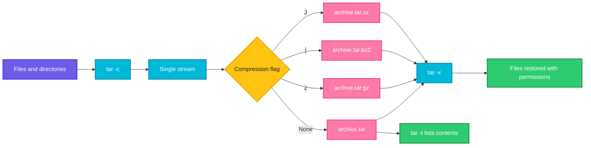

# tar

## What is it?
`tar` (tape archive) bundles many files and directories into one archive file, and can also unpack, list and update archives. On its own `tar` does not compress, but it can pass the archive through `gzip`, `bzip2`, `xz` or `zstd` to produce `.tar.gz`, `.tar.bz2`, `.tar.xz` and `.tar.zst` files (called tarballs).

`tar` keeps permissions, owners, timestamps, symbolic links and directory structure, which is why it is the standard format for backups, software releases and Docker build contexts.

When to use which mode:

| Goal | Use |
|------|-----|
| Create an archive | `tar -c` (`-czf` for gzip) |
| Extract an archive | `tar -x` (`-xzf` for gzip) |
| See what is inside | `tar -t` (`-tzf` for gzip) |
| Add files to an existing uncompressed archive | `tar -r` |
| Update only newer files | `tar -u` |
| Compare archive with disk | `tar -d` |
| Pick a compression | `-z` gzip, `-j` bzip2, `-J` xz, `--zstd` zstd |

## Syntax
```bash
tar -c [OPTIONS] -f ARCHIVE FILES...
tar -x [OPTIONS] -f ARCHIVE [-C DIR] [MEMBERS...]
tar -t [OPTIONS] -f ARCHIVE
```

## Visual Overview
> To create, `tar` reads the files, writes them one after another into one stream with headers, and optionally pipes the stream through a compressor. To extract, it reads the stream (decompressing if needed) and recreates each file with its saved permissions.



## Options/Flags
| Flag | Description |
|------|-------------|
| `-c`, `--create` | Create a new archive |
| `-x`, `--extract` | Extract files from an archive |
| `-t`, `--list` | List the contents of an archive |
| `-r`, `--append` | Append files to the end of an archive (not compressed archives) |
| `-u`, `--update` | Append only files newer than the ones in the archive |
| `-d`, `--diff` | Compare the archive with the file system |
| `-f FILE` | Archive file name. Use `-` for stdin or stdout |
| `-v` | Verbose: print each file |
| `-z`, `--gzip` | Filter through gzip (`.tar.gz`, `.tgz`) |
| `-j`, `--bzip2` | Filter through bzip2 (`.tar.bz2`) |
| `-J`, `--xz` | Filter through xz (`.tar.xz`) |
| `--zstd` | Filter through zstd (`.tar.zst`) |
| `-a`, `--auto-compress` | Choose compression from the file extension |
| `-C DIR` | Change to this directory before doing the work |
| `--exclude=PATTERN` | Skip files that match the pattern |
| `-X FILE` | Read exclude patterns from a file |
| `-T FILE` | Read the list of files to include from a file |
| `--strip-components=N` | Remove N leading path parts when extracting |
| `-p`, `--preserve-permissions` | Keep permissions when extracting (default for root) |
| `--same-owner` | Restore file owners (default for root) |
| `--no-same-owner` | Do not restore owners |
| `--numeric-owner` | Use numeric user and group IDs |
| `-h`, `--dereference` | Follow symbolic links and archive the target files |
| `-P`, `--absolute-names` | Keep leading `/` in names (not recommended) |
| `--wildcards` | Allow wildcards in member names when extracting |
| `-k`, `--keep-old-files` | Do not overwrite existing files |
| `--overwrite` | Overwrite existing files |
| `-O`, `--to-stdout` | Extract file contents to stdout |
| `-W`, `--verify` | Verify the archive after writing |
| `-N DATE`, `--newer=DATE` | Only archive files newer than the date |
| `--remove-files` | Delete the original files after they are added |
| `--one-file-system` | Do not cross into other mounted file systems |
| `--totals` | Print total bytes written |
| `--checkpoint=N` | Print a progress message every N records |
| `--transform=EXPR` | Rename files with a sed expression while archiving or extracting |

## Usage Examples

Let's say we have this directory `project/` with these files:

**Input file** (`project/app.conf`):
```text
port=8080
mode=production
```
**Input file** (`project/notes.txt`):
```text
deploy on friday
```
**Input file** (`project/debug.log`):
```text
2026-10-07 start
2026-10-07 error: timeout
```
**Command:**
```bash
ls -l project
```
**Sample Output:**
```text
total 12
-rw-r--r-- 1 user user 28 Oct  7 10:00 app.conf
-rw-r--r-- 1 user user 56 Oct  7 10:00 debug.log
-rw-r--r-- 1 user user 17 Oct  7 10:00 notes.txt
```

### Example 1: Create an archive (`-c`, `-v`, `-f`)
**Command:**
```bash
tar -cvf project.tar project/
```
**Sample Output:**
```text
project/
project/app.conf
project/debug.log
project/notes.txt
```

### Example 2: List the contents (`-t`)
**Command:**
```bash
tar -tvf project.tar
```
**Sample Output:**
```text
drwxr-xr-x user/user         0 2026-10-07 10:00 project/
-rw-r--r-- user/user        28 2026-10-07 10:00 project/app.conf
-rw-r--r-- user/user        56 2026-10-07 10:00 project/debug.log
-rw-r--r-- user/user        17 2026-10-07 10:00 project/notes.txt
```

### Example 3: Extract an archive (`-x`)
**Command:**
```bash
mkdir restore && cd restore
tar -xvf ../project.tar
```
**Sample Output:**
```text
project/
project/app.conf
project/debug.log
project/notes.txt
```

### Example 4: Extract into a directory (`-C`)
**Command:**
```bash
mkdir -p /tmp/restore
tar -xf project.tar -C /tmp/restore
ls /tmp/restore/project
```
**Sample Output:**
```text
app.conf  debug.log  notes.txt
```

### Example 5: Create a gzip archive (`-z`)
**Command:**
```bash
tar -czvf project.tar.gz project/
ls -lh project.tar.gz
```
**Sample Output:**
```text
project/
project/app.conf
project/debug.log
project/notes.txt
-rw-r--r-- 1 user user 235 Oct  7 10:05 project.tar.gz
```

### Example 6: Extract a gzip archive (`-xzf`)
**Command:**
```bash
tar -xzvf project.tar.gz -C /tmp/restore
```
**Sample Output:**
```text
project/
project/app.conf
project/debug.log
project/notes.txt
```
Modern GNU `tar` detects the compression itself, so `tar -xf project.tar.gz` also works.

### Example 7: List a gzip archive (`-tzf`)
**Command:**
```bash
tar -tzf project.tar.gz
```
**Sample Output:**
```text
project/
project/app.conf
project/debug.log
project/notes.txt
```

### Example 8: bzip2 and xz archives (`-j`, `-J`)
**Command:**
```bash
tar -cjf project.tar.bz2 project/
tar -cJf project.tar.xz project/
ls -l project.tar.*
```
**Sample Output:**
```text
-rw-r--r-- 1 user user  251 Oct  7 10:06 project.tar.bz2
-rw-r--r-- 1 user user  264 Oct  7 10:06 project.tar.gz
-rw-r--r-- 1 user user  244 Oct  7 10:06 project.tar.xz
```
`xz` compresses best but is the slowest. `gzip` is the fastest and most common.

### Example 9: Let tar choose compression from the name (`-a`)
**Command:**
```bash
tar -caf project.tar.xz project/
file project.tar.xz
```
**Sample Output:**
```text
project.tar.xz: XZ compressed data, checksum CRC64
```

### Example 10: zstd compression (`--zstd`)
**Command:**
```bash
tar --zstd -cf project.tar.zst project/
tar --zstd -tf project.tar.zst
```
**Sample Output:**
```text
project/
project/app.conf
project/debug.log
project/notes.txt
```

### Example 11: Exclude files (`--exclude`)
**Command:**
```bash
tar -czvf clean.tar.gz --exclude='*.log' project/
```
**Sample Output:**
```text
project/
project/app.conf
project/notes.txt
```
`debug.log` is skipped. Put `--exclude` before the file list.

### Example 12: Exclude patterns from a file (`-X`)
Let's say we have this file `exclude.txt`:

**Input file** (`exclude.txt`):
```text
*.log
notes.txt
```
**Command:**
```bash
tar -czvf small.tar.gz -X exclude.txt project/
```
**Sample Output:**
```text
project/
project/app.conf
```

### Example 13: Include files from a list (`-T`)
Let's say we have this file `files.txt`:

**Input file** (`files.txt`):
```text
project/app.conf
project/notes.txt
```
**Command:**
```bash
tar -czvf selected.tar.gz -T files.txt
```
**Sample Output:**
```text
project/app.conf
project/notes.txt
```

### Example 14: Extract one file (`MEMBER`)
**Command:**
```bash
tar -xzvf project.tar.gz project/app.conf
cat project/app.conf
```
**Sample Output:**
```text
project/app.conf
port=8080
mode=production
```

### Example 15: Extract by wildcard (`--wildcards`)
**Command:**
```bash
tar -xzvf project.tar.gz --wildcards '*.conf'
```
**Sample Output:**
```text
project/app.conf
```

### Example 16: Remove the top directory when extracting (`--strip-components`)
**Command:**
```bash
mkdir /tmp/flat
tar -xzf project.tar.gz -C /tmp/flat --strip-components=1
ls /tmp/flat
```
**Sample Output:**
```text
app.conf  debug.log  notes.txt
```
Useful for release tarballs like `tool-1.2/bin/tool` when you want files directly in the target directory.

### Example 17: Add a file to an archive (`-r`)
**Command:**
```bash
echo "extra" > extra.txt
tar -rvf project.tar extra.txt
tar -tf project.tar
```
**Sample Output:**
```text
extra.txt
project/
project/app.conf
project/debug.log
project/notes.txt
extra.txt
```
`-r` works only on uncompressed `.tar` files.

### Example 18: Update changed files only (`-u`)
**Command:**
```bash
echo "port=9090" > project/app.conf
tar -uvf project.tar project/
```
**Sample Output:**
```text
project/app.conf
```

### Example 19: Compare archive with disk (`-d`)
**Command:**
```bash
tar -df project.tar project/
```
**Sample Output:**
```text
project/app.conf: Mod time differs
project/app.conf: Size differs
```
No output means everything matches.

### Example 20: Print a file from the archive (`-O`)
**Command:**
```bash
tar -xzOf project.tar.gz project/notes.txt
```
**Sample Output:**
```text
deploy on friday
```

### Example 21: Keep existing files (`-k`)
**Command:**
```bash
tar -xkf project.tar.gz
```
**Sample Output:**
```text
tar: project/app.conf: Cannot open: File exists
tar: project/debug.log: Cannot open: File exists
tar: project/notes.txt: Cannot open: File exists
tar: Exiting with failure status due to previous errors
```

### Example 22: Only newer files (`--newer`)
**Command:**
```bash
tar -czvf recent.tar.gz --newer='2026-10-07 09:00' project/
```
**Sample Output:**
```text
project/app.conf
project/debug.log
project/notes.txt
```

### Example 23: Archive with a dated name
**Command:**
```bash
tar -czf backup-$(date +%F).tar.gz project/
ls backup-*.tar.gz
```
**Sample Output:**
```text
backup-2026-10-07.tar.gz
```

### Example 24: Change directory before archiving (`-C`)
**Command:**
```bash
tar -czf project-clean.tar.gz -C project .
tar -tzf project-clean.tar.gz
```
**Sample Output:**
```text
./
./app.conf
./debug.log
./notes.txt
```
Paths start with `./` and not `project/`, so the archive unpacks into the current directory.

### Example 25: Rename while archiving (`--transform`)
**Command:**
```bash
tar -czf release.tar.gz --transform 's,^project,app-1.0,' project/
tar -tzf release.tar.gz | head -2
```
**Sample Output:**
```text
app-1.0/
app-1.0/app.conf
```

### Example 26: Follow symbolic links (`-h`)
**Command:**
```bash
ln -s /etc/hostname project/hostname-link
tar -chf links.tar project/ && tar -tvf links.tar | grep hostname
```
**Sample Output:**
```text
-rw-r--r-- root/root         7 2026-10-07 08:00 project/hostname-link
```
Without `-h` the entry would be shown as a link: `lrwxrwxrwx ... project/hostname-link -> /etc/hostname`.

### Example 27: Verify after writing (`-W`)
**Command:**
```bash
tar -cWvf verified.tar project/
```
**Sample Output:**
```text
project/
project/app.conf
project/debug.log
project/notes.txt
Verify project/
Verify project/app.conf
Verify project/debug.log
Verify project/notes.txt
```
`-W` works only with uncompressed archives.

### Example 28: Stream over SSH (`-f -`)
**Command:**
```bash
tar -czf - project/ | ssh backup@backup01 "cat > /backups/project.tar.gz"
ssh backup@backup01 "ls -l /backups/project.tar.gz"
```
**Sample Output:**
```text
-rw-r--r-- 1 backup backup 235 Oct  7 10:20 /backups/project.tar.gz
```

### Example 29: Copy a directory tree exactly (pipe tar to tar)
**Command:**
```bash
tar -cf - -C project . | tar -xf - -C /mnt/copy
ls /mnt/copy
```
**Sample Output:**
```text
app.conf  debug.log  notes.txt
```
Keeps permissions and ownership, which `cp -r` may not.

### Example 30: Show totals and progress (`--totals`, `--checkpoint`)
**Command:**
```bash
tar -czf big.tar.gz --totals --checkpoint=1000 --checkpoint-action=dot /var/log
```
**Sample Output:**
```text
.......
Total bytes written: 73216000 (70MiB, 38MiB/s)
```

### Example 31: Extract a tarball from the internet in one step
**Command:**
```bash
curl -fsSL https://downloads.example.com/tool-1.2.tar.gz | tar -xz -C /opt
ls /opt/tool-1.2
```
**Sample Output:**
```text
bin  README.md  LICENSE
```

## Pitfalls / Gotchas
- Option order matters for GNU `tar` when mixing old style flags: `-f` must be directly followed by the archive name. `tar -cfv a.tar x` creates an archive named `v`.
- The archive must not be inside the directory you are archiving, or `tar` tries to include itself (`file is the archive; not dumped`).
- Absolute paths (`/etc/hosts`) are stored without the leading `/`, which is safer. Do not use `-P` unless you need it.
- Extracting as root restores the original owners. Use `--no-same-owner` to extract files owned by you.
- Extracting a tarball from an untrusted source can overwrite files with names like `../../etc/passwd`. Check with `tar -tf` first. Modern GNU `tar` removes `..` components, but older versions and other tools may not.
- `tar -tf` before `tar -xf` avoids creating a mess in the current directory when the archive has no top level folder (a "tarbomb").
- `--exclude` patterns are matched against full member names. Quote them so the shell does not expand them.
- `-r` and `-u` do not work with compressed archives.
- A `.tar.gz` file is not a `.zip` file. Use `tar`, not `unzip`, for it (see [zip-unzip](zip-unzip.md)).
- `tar` has a non zero exit status 1 when files change while reading (`file changed as we read it`). For live logs this is a warning, not a failure.
- `tar` preserves sparse files poorly unless `-S` is used (disk images, database files).

## DevOps Use Cases

### Use Case 1: Daily backup with rotation
**Situation:** Back up `/etc` and the application folder every night and keep seven days.

**Command:**
```bash
sudo tar -czf /backups/app-$(date +%F).tar.gz --exclude='*.log' -C / etc/nginx opt/app
find /backups -name 'app-*.tar.gz' -mtime +7 -delete
ls -lh /backups
```
**Output:**
```text
-rw-r--r-- 1 root root 2.4M Oct  7 02:00 app-2026-10-07.tar.gz
-rw-r--r-- 1 root root 2.4M Oct  6 02:00 app-2026-10-06.tar.gz
```

### Use Case 2: Install a release tarball
**Situation:** Install a tool from an upstream release into `/opt`.

**Command:**
```bash
curl -fsSLO https://downloads.example.com/tool-1.2.tar.gz
tar -tzf tool-1.2.tar.gz | head -3
sudo tar -xzf tool-1.2.tar.gz -C /opt
sudo ln -sfn /opt/tool-1.2 /opt/tool
/opt/tool/bin/tool --version
```
**Output:**
```text
tool-1.2/
tool-1.2/bin/
tool-1.2/bin/tool
tool 1.2
```

### Use Case 3: Docker image with an archive added
**Situation:** Copy and unpack an application bundle in one Dockerfile step.

Let's say we have this file `Dockerfile`:

**Input file** (`Dockerfile`):
```dockerfile
FROM alpine:3.19
ADD app-1.0.tar.gz /opt/
CMD ["ls", "/opt/app-1.0"]
```
**Command:**
```bash
docker build -t app . && docker run --rm app
```
**Output:**
```text
app.conf
bin
```
`ADD` extracts local tar archives automatically. `COPY` does not.

### Use Case 4: Move data between servers while keeping permissions
**Situation:** Copy a web root to a new server without a temporary file.

**Command:**
```bash
tar -czf - -C /var/www html | ssh newserver "sudo tar -xzf - -C /var/www"
ssh newserver "ls -ld /var/www/html"
```
**Output:**
```text
drwxr-xr-x 5 www-data www-data 4096 Oct  7 10:30 /var/www/html
```

### Use Case 5: Collect logs for a support ticket
**Situation:** Gather logs from a time window and attach them to an incident.

**Command:**
```bash
tar -czf incident-$(hostname)-$(date +%F).tar.gz \
  --newer-mtime='2026-10-07 08:00' /var/log/nginx /var/log/app
tar -tzf incident-web1-2026-10-07.tar.gz | head -3
```
**Output:**
```text
var/log/nginx/
var/log/nginx/error.log
var/log/app/app.log
```

### Use Case 6: Backup a Docker volume
**Situation:** Create a backup of a named volume with a throwaway container.

**Command:**
```bash
docker run --rm -v pgdata:/data -v "$PWD":/backup alpine tar -czf /backup/pgdata.tar.gz -C /data .
ls -lh pgdata.tar.gz
```
**Output:**
```text
-rw-r--r-- 1 root root 41M Oct  7 10:40 pgdata.tar.gz
```

### Use Case 7: Restore a single config from a backup
**Situation:** Someone broke `nginx.conf`. Restore just that file.

**Command:**
```bash
tar -tzf /backups/app-2026-10-06.tar.gz | grep nginx.conf
sudo tar -xzf /backups/app-2026-10-06.tar.gz -C / etc/nginx/nginx.conf
```
**Output:**
```text
etc/nginx/nginx.conf
```

### Use Case 8: Build artifacts in CI
**Situation:** Package a build output, then verify its checksum for the release.

**Command:**
```bash
tar -czf app-1.4.2.tar.gz -C build .
sha256sum app-1.4.2.tar.gz | tee app-1.4.2.tar.gz.sha256
```
**Output:**
```text
9f2c3b7d4e8a1c5b6d0e7f8a9b1c2d3e4f5a6b7c8d9e0f1a2b3c4d5e6f7a8b9c  app-1.4.2.tar.gz
```

### Use Case 9: Incremental backups
**Situation:** Full backup on Sunday, then only changes on other days.

**Command:**
```bash
tar --listed-incremental=/backups/app.snar -czf /backups/full.tar.gz /opt/app
echo "new" >> /opt/app/data.txt
tar --listed-incremental=/backups/app.snar -czf /backups/inc1.tar.gz /opt/app
tar -tzf /backups/inc1.tar.gz
```
**Output:**
```text
opt/app/
opt/app/data.txt
```
The `.snar` file stores the state between runs. Delete it to force a new full backup.

### Use Case 10: Check an archive before deploying
**Situation:** Make sure an uploaded bundle is complete and has no unsafe paths.

**Command:**
```bash
tar -tzf upload.tar.gz > /dev/null && echo "archive OK"
tar -tzf upload.tar.gz | grep -E '^/|\.\./' && echo "UNSAFE PATHS" || echo "paths OK"
```
**Output:**
```text
archive OK
paths OK
```

## Related Commands
- [zip-unzip](zip-unzip.md) - the zip format, common on Windows
- [apt](apt.md) / [dnf](dnf.md) / [apk](apk.md) - package managers, whose packages are tar based archives
- [rpm](rpm.md) - `rpm2cpio` extracts RPM payloads
- [wget](../networking/wget.md) / [curl](../networking/curl.md) - download tarballs
- [scp](../networking/scp.md) / [ssh](../networking/ssh.md) - move archives between servers
