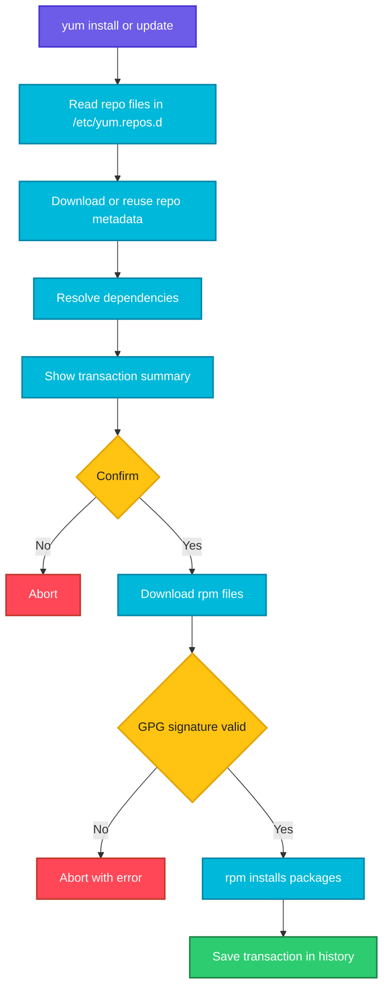

# yum

## What is it?
`yum` (Yellowdog Updater, Modified) is the high level package manager of the Red Hat family: RHEL 7 and older, CentOS 7, Amazon Linux 2 and Oracle Linux 7. It downloads `.rpm` packages from repositories, resolves dependencies and installs, upgrades and removes software. The low level tool underneath is `rpm`.

On RHEL 8 and newer, CentOS Stream, Rocky, AlmaLinux and Fedora, `yum` is only a link to [dnf](dnf.md), so the same commands work and give the same output.

When to use which sub command:

| Goal | Use |
|------|-----|
| See what can be updated | `yum check-update` |
| Install software | `yum install` |
| Update one package or everything | `yum update` |
| Remove software | `yum remove` |
| Find a package | `yum search` |
| Find which package provides a file or command | `yum provides` |
| Read package details | `yum info` |
| List installed or available packages | `yum list` |
| Install a whole set (for example Development Tools) | `yum groupinstall` |
| Undo a bad change | `yum history undo` |
| Freeze a version | `yum versionlock` |
| Free disk space or fix stale metadata | `yum clean all` |

## Syntax
```bash
yum [OPTIONS] COMMAND [PACKAGE...]
sudo yum install [-y] PACKAGE[-VERSION]
```

## Visual Overview
> `yum` reads repository definitions from `/etc/yum.repos.d/`, downloads metadata, solves dependencies, downloads the `.rpm` files, checks their signatures and hands them to `rpm` to install. Every transaction is saved in the history so it can be undone.



## Options/Flags

### Sub commands
| Sub command | Description |
|-------------|-------------|
| `install PKG` | Install packages (upgrades if already installed) |
| `localinstall FILE.rpm` | Install a local `.rpm` file and fetch its dependencies (`install ./file.rpm` also works) |
| `update [PKG]` | Update the named packages, or everything when no name is given |
| `check-update` | List available updates without installing. Exit code 100 means updates exist |
| `upgrade` | Like `update`, but also removes obsolete packages |
| `downgrade PKG` | Install the previous version |
| `reinstall PKG` | Reinstall the same version |
| `remove PKG` | Remove a package (and anything that depends on it) |
| `autoremove` | Remove dependencies that are no longer needed |
| `search TEXT` | Search names and summaries |
| `info PKG` | Show details of a package |
| `list [installed\|available\|updates\|all]` | List packages |
| `provides FILE` | Find which package provides a file or capability |
| `deplist PKG` | Show dependencies |
| `repolist [all]` | List enabled (or all) repositories |
| `makecache` | Download and cache repository metadata |
| `clean all` | Delete cached packages and metadata |
| `groups list` | List package groups |
| `groupinstall "NAME"` | Install a package group |
| `groupremove "NAME"` | Remove a package group |
| `history` | List past transactions |
| `history info ID` | Show details of one transaction |
| `history undo ID` | Reverse a transaction |
| `history redo ID` | Repeat a transaction |
| `versionlock add PKG` | Lock a package to its current version (needs the versionlock plugin) |
| `versionlock list` | Show locked packages |
| `versionlock clear` | Remove all locks |
| `yum-config-manager --add-repo URL` | Add a repository (from `yum-utils`) |
| `yum-config-manager --enable/--disable REPO` | Turn a repository on or off |

### Options
| Flag | Description |
|------|-------------|
| `-y` | Assume yes to all questions |
| `-q` | Quiet output |
| `-v` | Verbose output |
| `--assumeno` | Assume no, useful to preview a transaction |
| `--enablerepo=REPO` | Enable a repository for this command only |
| `--disablerepo=REPO` | Disable a repository for this command only |
| `--exclude=PKG` | Exclude packages from the operation |
| `--nogpgcheck` | Skip signature checking (insecure) |
| `--security` | Limit updates to security fixes (needs the security plugin or Amazon Linux) |
| `--skip-broken` | Skip packages with dependency problems |
| `--downloadonly` | Download packages without installing |
| `--downloaddir=DIR` | Where `--downloadonly` stores files |
| `-C`, `--cacheonly` | Run from cache without touching the network |
| `--showduplicates` | Show every version, not only the newest |
| `--releasever=VER` | Use another release version number |
| `--setopt=KEY=VALUE` | Override any configuration option |

## Usage Examples

Let's say we have this file `/etc/yum.repos.d/nginx.repo`:

**Input file** (`/etc/yum.repos.d/nginx.repo`):
```text
[nginx-stable]
name=nginx stable repo
baseurl=http://nginx.org/packages/centos/$releasever/$basearch/
gpgcheck=1
enabled=1
gpgkey=https://nginx.org/keys/nginx_signing.key
```

### Example 1: Check for updates (`check-update`)
**Command:**
```bash
yum check-update
```
**Sample Output:**
```text
Loaded plugins: fastestmirror
kernel.x86_64          3.10.0-1160.119.1.el7     updates
openssl.x86_64         1:1.0.2k-26.el7_9         updates
```
Exit code is 100 when updates exist and 0 when there are none.

### Example 2: Install a package (`install`)
**Command:**
```bash
sudo yum install tree
```
**Sample Output:**
```text
Resolving Dependencies
--> Running transaction check
---> Package tree.x86_64 0:1.6.0-10.el7 will be installed
================================================================
 Package    Arch      Version            Repository      Size
================================================================
Installing:
 tree       x86_64    1.6.0-10.el7       base            46 k

Transaction Summary
Install  1 Package

Is this ok [y/d/N]: y
Installed:
  tree.x86_64 0:1.6.0-10.el7
Complete!
```

### Example 3: Install without prompts (`-y`)
**Command:**
```bash
sudo yum install -y httpd
```
**Sample Output:**
```text
Installed:
  httpd.x86_64 0:2.4.6-99.el7.centos.1
Dependency Installed:
  apr.x86_64 0:1.4.8-7.el7      apr-util.x86_64 0:1.5.2-6.el7
Complete!
```

### Example 4: Install an exact version (`PKG-VERSION`)
**Command:**
```bash
sudo yum install -y nginx-1.20.1
```
**Sample Output:**
```text
Installed:
  nginx.x86_64 1:1.20.1-1.el7.ngx
Complete!
```

### Example 5: Install a local file (`localinstall`)
**Command:**
```bash
sudo yum localinstall -y ./myapp-2.0-1.el7.x86_64.rpm
```
**Sample Output:**
```text
Examining ./myapp-2.0-1.el7.x86_64.rpm: myapp-2.0-1.x86_64
Marking ./myapp-2.0-1.el7.x86_64.rpm to be installed
Installed:
  myapp.x86_64 0:2.0-1.el7
Complete!
```

### Example 6: Update one package (`update PKG`)
**Command:**
```bash
sudo yum update -y openssl
```
**Sample Output:**
```text
Updated:
  openssl.x86_64 1:1.0.2k-26.el7_9
Complete!
```

### Example 7: Update everything (`update`)
**Command:**
```bash
sudo yum update -y
```
**Sample Output:**
```text
Transaction Summary
Install  1 Package  (+1 Dependent package)
Upgrade  12 Packages
Complete!
```

### Example 8: Security updates only (`--security`)
**Command:**
```bash
sudo yum update --security -y
```
**Sample Output:**
```text
Loaded plugins: priorities, update-motd, upgrade-helper
Resolving Dependencies
Updated:
  openssl.x86_64 1:1.0.2k-26.amzn2
Complete!
```
Works out of the box on Amazon Linux. On CentOS 7 install `yum-plugin-security`.

### Example 9: Downgrade a package (`downgrade`)
**Command:**
```bash
sudo yum downgrade -y nginx-1.20.1
```
**Sample Output:**
```text
Removed:
  nginx.x86_64 1:1.22.1-1.el7.ngx
Installed:
  nginx.x86_64 1:1.20.1-1.el7.ngx
Complete!
```

### Example 10: Reinstall a package (`reinstall`)
**Command:**
```bash
sudo yum reinstall -y tree
```
**Sample Output:**
```text
Reinstalled:
  tree.x86_64 0:1.6.0-10.el7
Complete!
```

### Example 11: Remove a package (`remove`)
**Command:**
```bash
sudo yum remove -y tree
```
**Sample Output:**
```text
Removed:
  tree.x86_64 0:1.6.0-10.el7
Complete!
```

### Example 12: Remove unused dependencies (`autoremove`)
**Command:**
```bash
sudo yum autoremove -y
```
**Sample Output:**
```text
Removed:
  libicu.x86_64 0:50.2-4.el7_7
Complete!
```

### Example 13: Search (`search`)
**Command:**
```bash
yum search nginx
```
**Sample Output:**
```text
=================== N/S matched: nginx ===================
nginx.x86_64 : A high performance web server and reverse proxy server
nginx-mod-http-image-filter.x86_64 : Nginx HTTP image filter module
```

### Example 14: Package details (`info`)
**Command:**
```bash
yum info tree
```
**Sample Output:**
```text
Name        : tree
Arch        : x86_64
Version     : 1.6.0
Release     : 10.el7
Size        : 46 k
Repo        : base
Summary     : File system tree viewer
License     : GPLv2+
```

### Example 15: List installed packages (`list installed`)
**Command:**
```bash
yum list installed | grep -E "^(tree|openssl)"
```
**Sample Output:**
```text
openssl.x86_64     1:1.0.2k-26.el7_9     @updates
tree.x86_64        1.6.0-10.el7          @base
```

### Example 16: List available versions (`--showduplicates`)
**Command:**
```bash
yum list available nginx --showduplicates
```
**Sample Output:**
```text
Available Packages
nginx.x86_64     1:1.20.1-1.el7.ngx     nginx-stable
nginx.x86_64     1:1.22.1-1.el7.ngx     nginx-stable
```

### Example 17: Which package provides a file (`provides`)
**Command:**
```bash
yum provides /usr/bin/dig
```
**Sample Output:**
```text
32:bind-utils-9.11.4-26.P2.el7_9.15.x86_64 : Utilities for querying DNS name servers
Repo        : updates
Matched from:
Filename    : /usr/bin/dig
```
Use `yum provides '*/dig'` when you do not know the full path.

### Example 18: Show dependencies (`deplist`)
**Command:**
```bash
yum deplist tree
```
**Sample Output:**
```text
package: tree.x86_64 1.6.0-10.el7
  dependency: libc.so.6(GLIBC_2.14)(64bit)
   provider: glibc.x86_64 2.17-326.el7_9
```

### Example 19: List repositories (`repolist`)
**Command:**
```bash
yum repolist
```
**Sample Output:**
```text
repo id            repo name                            status
base/7/x86_64      CentOS-7 - Base                      10,072
nginx-stable       nginx stable repo                       214
updates/7/x86_64   CentOS-7 - Updates                    5,014
repolist: 15,300
```
`nginx-stable` comes from the `nginx.repo` file shown at the top.

### Example 20: Use a repository only once (`--enablerepo`)
**Command:**
```bash
sudo yum install -y --enablerepo=epel htop
```
**Sample Output:**
```text
Installed:
  htop.x86_64 0:2.2.0-3.el7
Complete!
```

### Example 21: Disable a repository for one command (`--disablerepo`)
**Command:**
```bash
sudo yum update -y --disablerepo=nginx-stable
```
**Sample Output:**
```text
No packages marked for update
```

### Example 22: Exclude a package from an update (`--exclude`)
**Command:**
```bash
sudo yum update -y --exclude=kernel*
```
**Sample Output:**
```text
Updated:
  openssl.x86_64 1:1.0.2k-26.el7_9
Complete!
```

### Example 23: Download only (`--downloadonly`)
**Command:**
```bash
sudo yum install -y --downloadonly --downloaddir=/tmp/rpms tree
ls /tmp/rpms
```
**Sample Output:**
```text
tree-1.6.0-10.el7.x86_64.rpm
```

### Example 24: Install a group (`groupinstall`)
**Command:**
```bash
sudo yum groupinstall -y "Development Tools"
```
**Sample Output:**
```text
Installed:
  autoconf.noarch  automake.noarch  gcc.x86_64  make.x86_64  patch.x86_64
Complete!
```

### Example 25: Transaction history (`history`)
**Command:**
```bash
sudo yum history
```
**Sample Output:**
```text
ID     | Command line             | Date and time    | Action(s)      | Altered
--------------------------------------------------------------------------------
     5 | install -y tree          | 2026-10-07 10:12 | Install        |    1
     4 | update -y                | 2026-10-06 22:01 | I, U           |   13
```

### Example 26: Undo a transaction (`history undo`)
**Command:**
```bash
sudo yum history undo 5 -y
```
**Sample Output:**
```text
Undoing transaction 5, from Wed Oct  7 10:12:11 2026
    Install tree-1.6.0-10.el7.x86_64 @base
Removed:
  tree.x86_64 0:1.6.0-10.el7
Complete!
```

### Example 27: Lock a version (`versionlock`)
**Command:**
```bash
sudo yum install -y yum-plugin-versionlock
sudo yum versionlock add nginx
sudo yum versionlock list
```
**Sample Output:**
```text
Adding versionlock on: 1:nginx-1.20.1-1.el7.ngx
1:nginx-1.20.1-1.el7.ngx.*
versionlock list done
```

### Example 28: Add a repository (`yum-config-manager`)
**Command:**
```bash
sudo yum install -y yum-utils
sudo yum-config-manager --add-repo https://download.docker.com/linux/centos/docker-ce.repo
```
**Sample Output:**
```text
adding repo from: https://download.docker.com/linux/centos/docker-ce.repo
grabbing file https://download.docker.com/linux/centos/docker-ce.repo to /etc/yum.repos.d/docker-ce.repo
```

### Example 29: Refresh and clean the cache (`makecache`, `clean all`)
**Command:**
```bash
sudo yum clean all && sudo yum makecache
```
**Sample Output:**
```text
Cleaning repos: base nginx-stable updates
Cleaning up everything
Metadata Cache Created
```

### Example 30: Skip broken packages (`--skip-broken`)
**Command:**
```bash
sudo yum update -y --skip-broken
```
**Sample Output:**
```text
Packages skipped because of dependency problems:
    somepkg-1.2-3.el7.x86_64 from updates
Complete!
```

## Pitfalls / Gotchas
- `yum update` upgrades every package, including the kernel. Use `yum update PKG` or `--exclude` on production servers.
- `yum remove` also removes everything that depends on the package. Read the transaction summary before confirming. A careless `yum remove python` can remove the package manager itself.
- `yum` on RHEL 8 and later is an alias for `dnf`. Some plugin names and options differ, so check which one is behind the command with `ls -l $(which yum)`.
- CentOS 7 reached end of life in June 2024 and its mirrors moved to `vault.centos.org`. A fresh `yum install` there can fail with repository errors unless the repo files are changed.
- Stale metadata causes strange `No package available` or checksum errors. Run `yum clean all` and try again.
- `--nogpgcheck` disables signature verification. Use it only for packages you built yourself.
- Only one `yum` runs at a time. Another process gives `Existing lock /var/run/yum.pid`.
- `yum check-update` returns exit code 100 when updates exist. In scripts with `set -e` this looks like a failure.
- `yum history undo` cannot undo changes that need packages which are no longer in a repository.

## DevOps Use Cases

### Use Case 1: Standard server bootstrap
**Situation:** Patch a fresh CentOS 7 or Amazon Linux 2 host and install common tools.

**Command:**
```bash
sudo yum update -y && sudo yum install -y epel-release && sudo yum install -y git jq htop wget
```
**Output:**
```text
Complete!
Installed:
  git.x86_64 0:1.8.3.1-25.el7_9  jq.x86_64 0:1.6-2.el7  htop.x86_64 0:2.2.0-3.el7  wget.x86_64 0:1.14-18.el7_6.1
Complete!
```

### Use Case 2: Alert when updates are pending
**Situation:** A monitoring check uses the exit code of `check-update`.

**Command:**
```bash
yum -q check-update >/dev/null; rc=$?
[ $rc -eq 100 ] && echo "UPDATES AVAILABLE" || echo "up to date"
```
**Output:**
```text
UPDATES AVAILABLE
```

### Use Case 3: Dockerfile on CentOS or Amazon Linux
**Situation:** Install packages and keep the image small.

Let's say we have this file `Dockerfile`:

**Input file** (`Dockerfile`):
```dockerfile
FROM amazonlinux:2
RUN yum install -y httpd && yum clean all && rm -rf /var/cache/yum
```
**Command:**
```bash
docker build -t web-demo . 2>&1 | tail -2
```
**Output:**
```text
 => => naming to docker.io/library/web-demo:latest
 => => unpacking to docker.io/library/web-demo:latest
```

### Use Case 4: Security patching only
**Situation:** Compliance requires security fixes within 7 days but no feature upgrades.

**Command:**
```bash
sudo yum updateinfo list security
sudo yum update --security -y
```
**Output:**
```text
ALAS2-2026-2701 important/Sec. openssl-1:1.0.2k-26.amzn2.x86_64
Updated:
  openssl.x86_64 1:1.0.2k-26.amzn2
Complete!
```

### Use Case 5: Find the package for a missing command
**Situation:** A script fails with `dig: command not found`.

**Command:**
```bash
yum provides '*/bin/dig' | grep -m1 "^bind-utils"
sudo yum install -y bind-utils
```
**Output:**
```text
32:bind-utils-9.11.4-26.P2.el7_9.15.x86_64 : Utilities for querying DNS name servers
Installed:
  bind-utils.x86_64 32:9.11.4-26.P2.el7_9.15
```

### Use Case 6: Roll back a bad update
**Situation:** A patch run broke the application. Undo the last transaction.

**Command:**
```bash
sudo yum history list | head -4
sudo yum history undo last -y
```
**Output:**
```text
ID     | Command line             | Date and time    | Action(s)      | Altered
     7 | update -y                | 2026-10-07 02:00 | I, U           |   14
Undoing transaction 7, from Wed Oct  7 02:00:11 2026
Complete!
```

### Use Case 7: Pin critical packages
**Situation:** Prevent upgrades of the web server during routine patching.

**Command:**
```bash
sudo yum versionlock add nginx kernel
sudo yum update -y
```
**Output:**
```text
Adding versionlock on: 1:nginx-1.20.1-1.el7.ngx
Adding versionlock on: 0:kernel-3.10.0-1160.108.1.el7
Updated:
  openssl.x86_64 1:1.0.2k-26.el7_9
Complete!
```

### Use Case 8: Download RPMs for an offline server
**Situation:** The target host has no internet. Fetch all RPMs including dependencies on a connected host.

**Command:**
```bash
sudo yum install -y --downloadonly --downloaddir=/tmp/offline htop
ls /tmp/offline
```
**Output:**
```text
htop-2.2.0-3.el7.x86_64.rpm
```
Copy the folder and install with `sudo yum localinstall /tmp/offline/*.rpm`.

### Use Case 9: Add a vendor repository from a file
**Situation:** Install from the nginx repository defined in `nginx.repo`.

Let's say the file `/etc/yum.repos.d/nginx.repo` from the top of this page exists.

**Command:**
```bash
sudo yum install -y nginx && nginx -v
```
**Output:**
```text
Installed:
  nginx.x86_64 1:1.20.1-1.el7.ngx
nginx version: nginx/1.20.1
```

### Use Case 10: Count installed packages per repository
**Situation:** Audit which repositories your servers rely on.

**Command:**
```bash
yum list installed | awk '{print $3}' | sort | uniq -c | sort -rn | head -4
```
**Output:**
```text
    312 @base
     48 @updates
     12 @epel
      3 @nginx-stable
```

## Related Commands
- [dnf](dnf.md) - the modern replacement for yum
- [rpm](rpm.md) - low level tool that yum uses
- [apt](apt.md) - the Debian family equivalent
- [tar](tar.md) / [zip-unzip](zip-unzip.md) - archives and source installs
