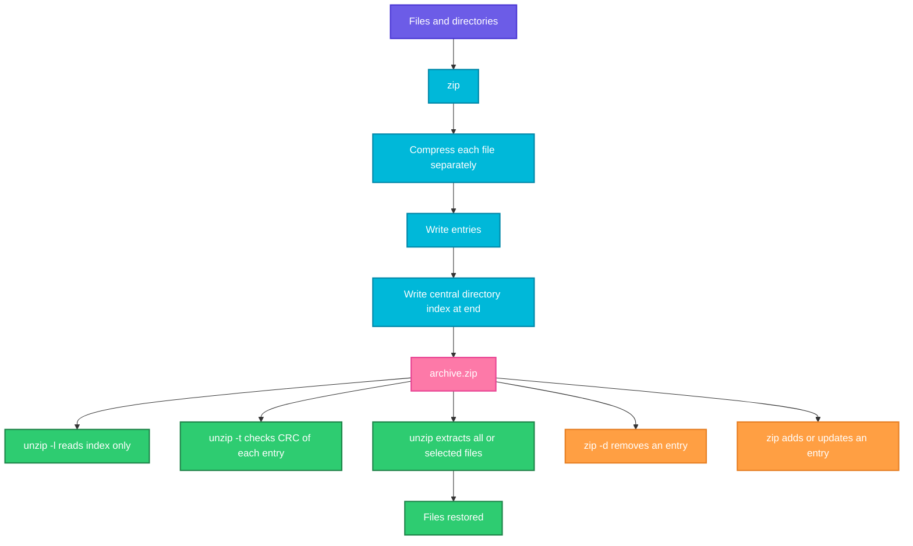

# zip and unzip

## What is it?
`zip` creates compressed archives in the ZIP format, and `unzip` extracts, lists and tests them. Unlike `tar`, a ZIP file compresses each file separately and stores an index of all files at the end of the archive, so you can read or extract one file without unpacking everything. ZIP is the standard format on Windows and macOS, in Java (`.jar`, `.war`), Python wheels, AWS Lambda packages and many CI artifact stores.

Related tools in the same package: `zipinfo` (detailed listing), `zipgrep` (search inside), `zipcloak` (encrypt), `zipnote` (edit comments) and `zipsplit` (split in parts).

Both usually need to be installed: `sudo apt install zip unzip`, `sudo dnf install zip unzip` or `apk add zip unzip`.

When to use which:

| Goal | Use |
|------|-----|
| Make an archive for Windows users or a Lambda upload | `zip -r` |
| Extract an archive | `unzip` |
| Look inside without extracting | `unzip -l` or `zipinfo` |
| Check an archive is not corrupt | `unzip -t` |
| Extract into another folder | `unzip -d` |
| Add or replace files in an existing archive | `zip` (same archive name) |
| Remove a file from an archive | `zip -d` |
| Protect with a password | `zip -e` |
| Keep file permissions and symlinks (Linux to Linux) | prefer `tar`, or use `zip -y` |

## Syntax
```bash
zip [OPTIONS] ARCHIVE.zip FILES...
unzip [OPTIONS] ARCHIVE.zip [MEMBERS...] [-x EXCLUDE...] [-d DIR]
```

## Visual Overview
> `zip` compresses each file on its own and writes it into the archive, followed by a central directory (the index). `unzip` reads the index first, so it can list, test or extract any single file quickly.



## Options/Flags

### zip options
| Flag | Description |
|------|-------------|
| `-r` | Recurse into directories |
| `-0` to `-9` | Compression level. `-0` store only, `-9` best, default is `-6` |
| `-e` | Encrypt with a password (prompts) |
| `-P PASS` | Give the password on the command line (insecure) |
| `-u` | Update: add new files and replace changed ones |
| `-f` | Freshen: replace only files already in the archive that changed |
| `-d` | Delete entries from the archive |
| `-m` | Move: delete the original files after adding |
| `-j` | Junk the paths: store only file names |
| `-x PATTERN` | Exclude files matching the pattern |
| `-i PATTERN` | Include only files matching the pattern |
| `-y` | Store symbolic links as links instead of following them |
| `-q` | Quiet |
| `-v` | Verbose (on its own: show version info) |
| `-T` | Test the archive after creating it |
| `-s SIZE` | Split into parts, for example `-s 100m` |
| `-z` | Add an archive comment |
| `-@` | Read the list of file names from stdin |
| `-FS` | File sync: make the archive match the file system (removes deleted files) |
| `-X` | Exclude extra file attributes (owners, timestamps) |
| `-D` | Do not add directory entries |
| `-g` | Grow: append to an existing archive |
| `-c` | Prompt for a comment per file |

### unzip options
| Flag | Description |
|------|-------------|
| `-l` | List files (short format) |
| `-v` | List files verbosely with compression ratio and CRC |
| `-t` | Test the integrity of the archive |
| `-d DIR` | Extract into this directory |
| `-o` | Overwrite existing files without asking |
| `-n` | Never overwrite existing files |
| `-j` | Junk paths: extract everything into one folder |
| `-x PATTERN` | Exclude files from extraction |
| `-p` | Extract to stdout (pipe) |
| `-q`, `-qq` | Quiet, very quiet |
| `-P PASS` | Password on the command line (insecure) |
| `-u` | Update: extract only newer files |
| `-f` | Freshen: update only files that already exist |
| `-a` | Convert text files line endings (Windows to Linux) |
| `-Z` | zipinfo mode |
| `-c` | Extract to stdout with file names |
| `-z` | Show the archive comment |

## Usage Examples

Let's say we have this directory `site/`:

**Input file** (`site/index.html`):
```text
<h1>Hello</h1>
```
**Input file** (`site/app.conf`):
```text
port=8080
```
**Input file** (`site/debug.log`):
```text
error: timeout
```
**Input file** (`site/assets/logo.txt`):
```text
LOGO
```
**Command:**
```bash
find site -type f
```
**Sample Output:**
```text
site/index.html
site/app.conf
site/debug.log
site/assets/logo.txt
```

### Example 1: Zip a single file
**Command:**
```bash
zip config.zip site/app.conf
```
**Sample Output:**
```text
  adding: site/app.conf (stored 0%)
```
Small files are stored without compression, so the ratio is 0%.

### Example 2: Zip a directory (`-r`)
**Command:**
```bash
zip -r site.zip site/
```
**Sample Output:**
```text
  adding: site/ (stored 0%)
  adding: site/index.html (stored 0%)
  adding: site/app.conf (stored 0%)
  adding: site/debug.log (stored 0%)
  adding: site/assets/ (stored 0%)
  adding: site/assets/logo.txt (stored 0%)
```
Without `-r`, only the empty directory entry is stored.

### Example 3: Quiet mode (`-q`)
**Command:**
```bash
zip -rq site.zip site/ && echo "created"
```
**Sample Output:**
```text
created
```

### Example 4: Choose a compression level (`-9`, `-0`)
**Command:**
```bash
zip -r -9 best.zip site/ -q
zip -r -0 store.zip site/ -q
ls -l best.zip store.zip
```
**Sample Output:**
```text
-rw-r--r-- 1 user user 1204 Oct  7 11:00 best.zip
-rw-r--r-- 1 user user 1204 Oct  7 11:00 store.zip
```
These sizes are close because the sample files are tiny. On real data `-9` is smaller and slower.

### Example 5: List contents (`unzip -l`)
**Command:**
```bash
unzip -l site.zip
```
**Sample Output:**
```text
Archive:  site.zip
  Length      Date    Time    Name
---------  ---------- -----   ----
        0  2026-10-07 11:00   site/
       15  2026-10-07 11:00   site/index.html
        9  2026-10-07 11:00   site/app.conf
       15  2026-10-07 11:00   site/debug.log
        0  2026-10-07 11:00   site/assets/
        5  2026-10-07 11:00   site/assets/logo.txt
---------                     -------
       44                     6 files
```

### Example 6: Verbose listing (`unzip -v`)
**Command:**
```bash
unzip -v site.zip
```
**Sample Output:**
```text
Archive:  site.zip
 Length   Method    Size  Cmpr    Date    Time   CRC-32   Name
--------  ------  ------- ---- ---------- ----- --------  ----
       0  Stored        0   0% 2026-10-07 11:00 00000000  site/
      15  Stored       15   0% 2026-10-07 11:00 a1b2c3d4  site/index.html
       9  Stored        9   0% 2026-10-07 11:00 e5f6a7b8  site/app.conf
--------          -------  ---                            -------
      44               44   0%                            6 files
```

### Example 7: Detailed listing (`zipinfo`)
**Command:**
```bash
zipinfo site.zip
```
**Sample Output:**
```text
Archive:  site.zip
Zip file size: 1204 bytes, number of entries: 6
drwxr-xr-x  3.0 unx        0 bx stor 26-Oct-07 11:00 site/
-rw-r--r--  3.0 unx       15 tx stor 26-Oct-07 11:00 site/index.html
-rw-r--r--  3.0 unx        9 tx stor 26-Oct-07 11:00 site/app.conf
6 files, 44 bytes uncompressed, 44 bytes compressed:  0.0%
```

### Example 8: Test an archive (`unzip -t`)
**Command:**
```bash
unzip -t site.zip
```
**Sample Output:**
```text
Archive:  site.zip
    testing: site/                    OK
    testing: site/index.html          OK
    testing: site/app.conf            OK
    testing: site/debug.log           OK
    testing: site/assets/             OK
    testing: site/assets/logo.txt     OK
No errors detected in compressed data of site.zip.
```

### Example 9: Extract here
**Command:**
```bash
mkdir /tmp/work && cp site.zip /tmp/work && cd /tmp/work
unzip site.zip
```
**Sample Output:**
```text
Archive:  site.zip
   creating: site/
  inflating: site/index.html
  inflating: site/app.conf
  inflating: site/debug.log
   creating: site/assets/
  inflating: site/assets/logo.txt
```

### Example 10: Extract to another directory (`-d`)
**Command:**
```bash
unzip -q site.zip -d /var/www/html
ls /var/www/html/site
```
**Sample Output:**
```text
app.conf  assets  debug.log  index.html
```

### Example 11: Extract only one file
**Command:**
```bash
unzip site.zip site/app.conf -d /tmp/one
cat /tmp/one/site/app.conf
```
**Sample Output:**
```text
Archive:  site.zip
  inflating: /tmp/one/site/app.conf
port=8080
```

### Example 12: Extract by wildcard (quote it!)
**Command:**
```bash
unzip -q site.zip '*.html' -d /tmp/html
find /tmp/html -type f
```
**Sample Output:**
```text
/tmp/html/site/index.html
```

### Example 13: Exclude while extracting (`-x`)
**Command:**
```bash
unzip -q site.zip -x '*.log' -d /tmp/nolog
find /tmp/nolog -type f
```
**Sample Output:**
```text
/tmp/nolog/site/index.html
/tmp/nolog/site/app.conf
/tmp/nolog/site/assets/logo.txt
```

### Example 14: Extract without folders (`-j`)
**Command:**
```bash
unzip -q -j site.zip -d /tmp/flat
ls /tmp/flat
```
**Sample Output:**
```text
app.conf  debug.log  index.html  logo.txt
```

### Example 15: Overwrite or skip existing files (`-o`, `-n`)
**Command:**
```bash
unzip -o site.zip -d /tmp/work
unzip -n site.zip -d /tmp/work
```
**Sample Output:**
```text
Archive:  site.zip
  inflating: /tmp/work/site/index.html
Archive:  site.zip
```
With `-n`, existing files are skipped silently. Without either option `unzip` asks `replace ...? [y]es, [n]o, [A]ll, [N]one, [r]ename:`, which hangs scripts.

### Example 16: Print a file to the screen (`-p`)
**Command:**
```bash
unzip -p site.zip site/app.conf
```
**Sample Output:**
```text
port=8080
```

### Example 17: Exclude files while zipping (`zip -x`)
**Command:**
```bash
zip -rq clean.zip site/ -x '*.log'
unzip -l clean.zip | tail -5
```
**Sample Output:**
```text
        9  2026-10-07 11:00   site/app.conf
        0  2026-10-07 11:00   site/assets/
        5  2026-10-07 11:00   site/assets/logo.txt
---------                     -------
       29                     5 files
```

### Example 18: Include only some files (`-i`)
**Command:**
```bash
zip -rq html.zip site/ -i '*.html'
unzip -l html.zip | tail -3
```
**Sample Output:**
```text
       15  2026-10-07 11:00   site/index.html
---------                     -------
       15                     1 file
```

### Example 19: Add a file to an existing archive
**Command:**
```bash
echo "v2" > site/version.txt
zip site.zip site/version.txt
```
**Sample Output:**
```text
  adding: site/version.txt (stored 0%)
```

### Example 20: Update changed files (`-u`)
**Command:**
```bash
echo "port=9090" > site/app.conf
zip -u site.zip site/app.conf
```
**Sample Output:**
```text
updating: site/app.conf (stored 0%)
```

### Example 21: Make the archive match the folder (`-FS`)
**Command:**
```bash
rm site/debug.log
zip -r -FS site.zip site/
```
**Sample Output:**
```text
deleting: site/debug.log
updating: site/app.conf (stored 0%)
```
`-FS` removes entries for files that no longer exist.

### Example 22: Delete a file from an archive (`-d`)
**Command:**
```bash
zip -d site.zip site/version.txt
```
**Sample Output:**
```text
deleting: site/version.txt
```

### Example 23: Password protect (`-e`)
**Command:**
```bash
zip -re secure.zip site/
```
**Sample Output:**
```text
Enter password:
Verify password:
  adding: site/ (stored 0%)
  adding: site/index.html (stored 0%)
```
Extract with `unzip secure.zip`, which prompts `[secure.zip] site/index.html password:`.

### Example 24: Store only file names (`-j`)
**Command:**
```bash
zip -j flat.zip site/index.html site/assets/logo.txt
unzip -l flat.zip | tail -4
```
**Sample Output:**
```text
  adding: index.html (stored 0%)
  adding: logo.txt (stored 0%)
       15  2026-10-07 11:00   index.html
        5  2026-10-07 11:00   logo.txt
```

### Example 25: Keep symbolic links (`-y`)
**Command:**
```bash
ln -s index.html site/home.html
zip -ry links.zip site/ -q
zipinfo links.zip | grep home
```
**Sample Output:**
```text
lrwxrwxrwx  3.0 unx       10 bx stor 26-Oct-07 11:05 site/home.html
```
Without `-y`, the link target is copied as a normal file.

### Example 26: Test the new archive (`-T`)
**Command:**
```bash
zip -rT checked.zip site/ -q && echo "archive verified"
```
**Sample Output:**
```text
test of checked.zip OK
archive verified
```

### Example 27: Split into parts (`-s`)
**Command:**
```bash
zip -r -s 100m big.zip /var/log -q
ls -lh big.z*
```
**Sample Output:**
```text
-rw-r--r-- 1 user user 100M Oct  7 11:10 big.z01
-rw-r--r-- 1 user user 100M Oct  7 11:10 big.z02
-rw-r--r-- 1 user user  35M Oct  7 11:10 big.zip
```
To extract, first join the parts: `zip -s 0 big.zip --out joined.zip`, then `unzip joined.zip`.

### Example 28: Zip a list of files from stdin (`-@`)
**Command:**
```bash
find site -name '*.conf' | zip -q conf-only.zip -@
unzip -l conf-only.zip | tail -3
```
**Sample Output:**
```text
        9  2026-10-07 11:00   site/app.conf
---------                     -------
        9                     1 file
```

### Example 29: Move files into an archive (`-m`)
**Command:**
```bash
zip -m old-logs.zip site/debug.log
ls site/debug.log
```
**Sample Output:**
```text
  adding: site/debug.log (stored 0%)
ls: cannot access 'site/debug.log': No such file or directory
```

### Example 30: Convert line endings (`-a`)
**Command:**
```bash
unzip -a windows-files.zip -d /tmp/win
file /tmp/win/readme.txt
```
**Sample Output:**
```text
/tmp/win/readme.txt: ASCII text
```

### Example 31: Search inside an archive (`zipgrep`)
**Command:**
```bash
zipgrep timeout site.zip
```
**Sample Output:**
```text
site/debug.log:error: timeout
```

### Example 32: Show the exit status
**Command:**
```bash
unzip -tq missing.zip; echo "exit code: $?"
```
**Sample Output:**
```text
unzip:  cannot find or open missing.zip, missing.zip.zip or missing.zip.ZIP.
exit code: 9
```
Exit code 0 is success, 1 is a warning, 2 and 3 are corrupt archives, 9 is file not found, 82 is a wrong password.

## Pitfalls / Gotchas
- `zip` does not recurse into folders without `-r`. A common mistake is `zip site.zip site/`, which stores only an empty folder.
- Zipping the folder `site/` stores paths as `site/...`. Zip from inside the folder (`cd site && zip -r ../site.zip .`) when you want the files at the top of the archive. This matters for AWS Lambda packages, where the handler file must be in the root.
- Quote wildcards when extracting: `unzip a.zip '*.log'`. Unquoted, the shell expands `*.log` first, and `unzip` thinks they are several archive names.
- `unzip` stops and asks when a file exists. Always pass `-o` or `-n` in scripts.
- ZIP does not store Linux owners, and permissions only reliably within Linux to Linux transfers. Use `tar` for backups where permissions and ownership matter.
- Zip's password protection (`-e`) uses a weak legacy cipher (ZipCrypto). Do not rely on it for sensitive data. Use `gpg` or `7z` with AES instead.
- Passwords given with `-P` are visible in `ps` output and shell history.
- Names are not UTF-8 safe on every system. File names with special characters can become garbled across OS.
- A 4 GB limit applies to old ZIP files. `zip` 3.0 supports Zip64 automatically for larger archives, but old tools on the other side may not read them.
- `zip` with an existing archive name updates it, it does not replace it. Delete the old archive first if you want a clean one, or use `-FS`.

## DevOps Use Cases

### Use Case 1: Package an AWS Lambda function
**Situation:** Lambda needs a ZIP with `lambda_function.py` at the root and dependencies next to it.

Let's say we have this file `lambda_function.py`:

**Input file** (`lambda_function.py`):
```python
def handler(event, context):
    return {"statusCode": 200, "body": "ok"}
```
**Command:**
```bash
zip -r function.zip lambda_function.py -q
aws lambda update-function-code --function-name demo --zip-file fileb://function.zip --query LastModified
```
**Output:**
```text
"2026-10-07T11:20:41.000+0000"
```

### Use Case 2: Package a Lambda with installed dependencies
**Situation:** Include Python packages installed in a local folder.

**Command:**
```bash
pip install -r requirements.txt -t package/ -q
(cd package && zip -rq ../function.zip .)
zip -g function.zip lambda_function.py
unzip -l function.zip | tail -2
```
**Output:**
```text
updating: lambda_function.py (deflated 24%)
---------                     -------
  8421377                     1503 files
```
`-g` adds to the existing archive. Lambda zips must be below 50 MB zipped when uploaded directly.

### Use Case 3: Collect and share logs
**Situation:** Zip logs while skipping very large or sensitive files.

**Command:**
```bash
zip -rq logs-$(date +%F).zip /var/log/app -x '*.gz' -x '*secret*'
unzip -l logs-2026-10-07.zip | tail -2
```
**Output:**
```text
---------                     -------
   384122                     7 files
```

### Use Case 4: Verify an uploaded artifact before deployment
**Situation:** A pipeline step receives `release.zip` and must stop if it is corrupt.

**Command:**
```bash
unzip -tq release.zip && echo "OK" || { echo "CORRUPT"; exit 1; }
```
**Output:**
```text
No errors detected in compressed data of release.zip.
OK
```

### Use Case 5: Deploy a static site
**Situation:** Unpack a build artifact into the web root, replacing old files.

**Command:**
```bash
sudo unzip -oq dist.zip -d /var/www/html
sudo chown -R www-data:www-data /var/www/html
ls /var/www/html | head -3
```
**Output:**
```text
assets
index.html
robots.txt
```

### Use Case 6: Inspect a JAR or WAR file
**Situation:** Check what a Java build contains. `.jar`, `.war` and `.ear` files are ZIP files.

**Command:**
```bash
unzip -l app.war | grep -E "WEB-INF/(web.xml|lib/spring-core)"
unzip -p app.war META-INF/MANIFEST.MF | head -3
```
**Output:**
```text
     2410  2026-10-07 09:40   WEB-INF/web.xml
  1430250  2026-10-07 09:40   WEB-INF/lib/spring-core-5.3.30.jar
Manifest-Version: 1.0
Created-By: Maven JAR Plugin 3.3.0
Build-Jdk-Spec: 17
```

### Use Case 7: Extract a single file from a large archive on a server
**Situation:** Read one config out of a 2 GB support bundle without unpacking all of it.

**Command:**
```bash
unzip -p support-bundle.zip etc/app/app.conf | grep -i port
```
**Output:**
```text
port=8080
```

### Use Case 8: Download and unpack a release
**Situation:** Install a binary distributed as a ZIP, for example Terraform.

**Command:**
```bash
curl -fsSLO https://releases.example.com/tool_1.0.0_linux_amd64.zip
unzip -o tool_1.0.0_linux_amd64.zip -d /tmp/tool
sudo install -m 0755 /tmp/tool/tool /usr/local/bin/tool
tool version
```
**Output:**
```text
Archive:  tool_1.0.0_linux_amd64.zip
  inflating: /tmp/tool/tool
tool v1.0.0
```

### Use Case 9: Keep the archive in sync with a folder
**Situation:** A nightly job refreshes a ZIP of a config directory so that deleted files disappear too.

**Command:**
```bash
zip -r -FS -q /backups/config.zip /etc/app
unzip -l /backups/config.zip | tail -1
```
**Output:**
```text
     8821                     14 files
```

### Use Case 10: Extract many ZIP files at once
**Situation:** A folder has one ZIP per day of logs.

**Command:**
```bash
for f in logs-*.zip; do unzip -oq "$f" -d "extracted/${f%.zip}"; done
ls extracted
```
**Output:**
```text
logs-2026-10-05  logs-2026-10-06  logs-2026-10-07
```

## Related Commands
- [tar](tar.md) - archives that keep Linux permissions and ownership, the usual choice for backups
- [apt](apt.md) / [dnf](dnf.md) / [apk](apk.md) - install `zip` and `unzip`
- [wget](../networking/wget.md) / [curl](../networking/curl.md) - download ZIP files
- [scp](../networking/scp.md) - copy archives to other servers
