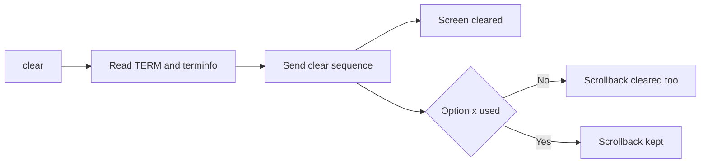

# clear

## What is it?
`clear` wipes the visible terminal screen and moves the prompt to the top. It does not delete your command history or any files.

## Syntax
```bash
clear [OPTIONS]
```

## Visual Overview
> `clear` looks up the terminal's clear sequence in the terminfo database and sends it to the terminal.



## Options/Flags
| Flag | Description |
|------|-------------|
| `-x` | Do not clear the scrollback buffer |
| `-T TERM` | Use the given terminal type instead of `$TERM` |
| `-V` | Print the version and exit |

## Usage Examples

### Example 1: Clear the screen
**Command:**
```bash
ls
clear
```
**Sample Output:**
```text
(the screen is empty and the prompt is at the top)
```

### Example 2: Keep the scrollback (`-x`)
After `clear -x` you can still scroll up in the terminal to see earlier output.

**Command:**
```bash
echo "old output"
clear -x
```
**Sample Output:**
```text
(the screen is empty; "old output" is still visible when you scroll up)
```

### Example 3: Specify the terminal type (`-T`)
**Command:**
```bash
clear -T xterm-256color
```
**Sample Output:**
```text
(the screen is empty and the prompt is at the top)
```

### Example 4: Show the version (`-V`)
**Command:**
```bash
clear -V
```
**Sample Output:**
```text
ncurses 6.3.20211021
```
(The version depends on your system.)

### Example 5: Keyboard shortcut
Press `Ctrl+L` in bash for the same effect without typing the command.

## Pitfalls / Gotchas
- `clear` only hides output. Commands, history and files remain untouched.
- Older versions of `clear` also erase scrollback; the `-x` flag is not available everywhere.
- If `$TERM` is not set (for example in cron), `clear` prints `TERM environment variable not set.`
- To reset a broken terminal after printing binary data, use `reset` instead.

## Related Commands
- [`history`](history.md) - command history, which `clear` does not erase
- `reset` - fully reinitialize the terminal
- `tput` - control terminal features
- `Ctrl+L` - shell shortcut for clearing the screen
