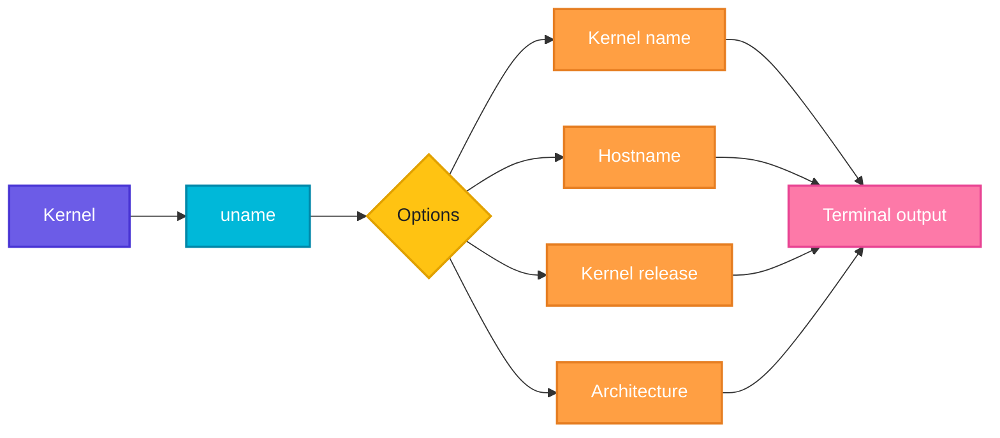

# uname

## What is it?
`uname` (unix name) prints basic information about the operating system and hardware: kernel name, kernel version, machine architecture and hostname.

## Syntax
```bash
uname [OPTIONS]
```

## Visual Overview
> `uname` asks the kernel for system identity data and prints the fields you select.



## Options/Flags
| Flag | Description |
|------|-------------|
| `-s` | Kernel name (default), e.g. `Linux` |
| `-n` | Network node hostname |
| `-r` | Kernel release, e.g. `5.15.0-91-generic` |
| `-v` | Kernel version (build info and date) |
| `-m` | Machine hardware name, e.g. `x86_64` |
| `-p` | Processor type (may print `unknown`) |
| `-o` | Operating system, e.g. `GNU/Linux` |
| `-a` | All of the above in one line |

## Usage Examples

The examples below were run on an Ubuntu server named `web01`.

### Example 1: Kernel name (default)
**Command:**
```bash
uname
```
**Sample Output:**
```text
Linux
```

### Example 2: Kernel name (`-s`)
**Command:**
```bash
uname -s
```
**Sample Output:**
```text
Linux
```

### Example 3: Hostname (`-n`)
**Command:**
```bash
uname -n
```
**Sample Output:**
```text
web01
```

### Example 4: Kernel release (`-r`)
**Command:**
```bash
uname -r
```
**Sample Output:**
```text
5.15.0-91-generic
```

### Example 5: Kernel version (`-v`)
**Command:**
```bash
uname -v
```
**Sample Output:**
```text
#101-Ubuntu SMP Tue Nov 14 13:30:08 UTC 2023
```

### Example 6: Architecture (`-m`)
**Command:**
```bash
uname -m
```
**Sample Output:**
```text
x86_64
```

### Example 7: Processor (`-p`)
**Command:**
```bash
uname -p
```
**Sample Output:**
```text
x86_64
```

### Example 8: Operating system (`-o`)
**Command:**
```bash
uname -o
```
**Sample Output:**
```text
GNU/Linux
```

### Example 9: Everything (`-a`)
**Command:**
```bash
uname -a
```
**Sample Output:**
```text
Linux web01 5.15.0-91-generic #101-Ubuntu SMP Tue Nov 14 13:30:08 UTC 2023 x86_64 x86_64 x86_64 GNU/Linux
```

## Pitfalls / Gotchas
- `uname` shows the kernel, not the distribution. Use `cat /etc/os-release` or `lsb_release -a` for the distro name.
- Inside a container, `uname -r` reports the host's kernel, because containers share it.
- `-p` and `-i` can print `unknown` on some distributions. Prefer `-m`.
- On Apple Silicon, `uname -m` prints `arm64`, while on Linux ARM it prints `aarch64`.

## DevOps Use Cases

### Use Case 1: Pick the right binary for the architecture
**Situation:** A download script must choose `amd64` or `arm64`.

**Command:**
```bash
case "$(uname -m)" in
  x86_64)  ARCH=amd64 ;;
  aarch64) ARCH=arm64 ;;
esac
echo "Downloading kubectl for linux/$ARCH"
```
**Output:**
```text
Downloading kubectl for linux/amd64
```

### Use Case 2: Build an OS-aware download URL
**Situation:** Install a tool whose release names contain the OS and CPU.

**Command:**
```bash
OS=$(uname -s | tr '[:upper:]' '[:lower:]')
echo "https://example.com/tool_${OS}_$(uname -m).tar.gz"
```
**Output:**
```text
https://example.com/tool_linux_x86_64.tar.gz
```

### Use Case 3: Check the kernel version before installing a driver or agent
**Situation:** An eBPF agent needs kernel 5.x or newer.

**Command:**
```bash
uname -r | cut -d. -f1
```
**Output:**
```text
5
```

### Use Case 4: Record host info in a CI log
**Situation:** Print the build agent details at the start of a pipeline.

**Command:**
```bash
echo "Build agent: $(uname -n) / $(uname -sr)"
```
**Output:**
```text
Build agent: web01 / Linux 5.15.0-91-generic
```

### Use Case 5: Collect kernel versions from many servers
**Situation:** Audit fleet kernels over SSH before patching.

**Input file** (`hosts.txt`):
```text
web01
web02
db01
```
**Command:**
```bash
for h in $(cat hosts.txt); do echo "$h: $(ssh $h uname -r)"; done
```
**Output:**
```text
web01: 5.15.0-91-generic
web02: 5.15.0-91-generic
db01: 5.4.0-170-generic
```

### Use Case 6: Detect that you are on Linux inside a script
**Situation:** A script supports Linux only and should stop on macOS.

**Command:**
```bash
[ "$(uname -s)" = "Linux" ] || { echo "Linux only"; exit 1; }
echo "OS check passed"
```
**Output:**
```text
OS check passed
```

### Use Case 7: Compare container and host kernel
**Situation:** Prove that a container uses the host kernel.

**Command:**
```bash
uname -r
docker run --rm alpine uname -r
```
**Output:**
```text
5.15.0-91-generic
5.15.0-91-generic
```

### Use Case 8: Find the installed kernel for a package name
**Situation:** Install headers that match the running kernel.

**Command:**
```bash
sudo apt install -y linux-headers-$(uname -r)
```
**Output:**
```text
linux-headers-5.15.0-91-generic is already the newest version (5.15.0-91.101).
```

## Related Commands
- [`whoami`](../user-management/whoami.md) - current user
- `hostname` - show or set the hostname
- `lsb_release -a` - distribution information
- `cat /etc/os-release` - distribution details
- `arch` - machine architecture
