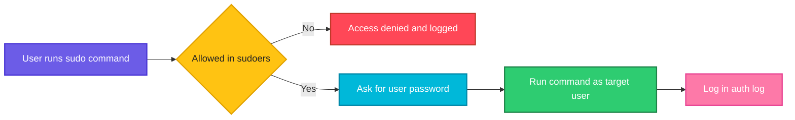

# sudo

## What is it?
`sudo` (superuser do) runs a command as another user, most often `root`, if the `sudoers` configuration allows it. It lets administrators run privileged commands without logging in as root.

## Syntax
```bash
sudo [OPTIONS] COMMAND
sudo -i
sudo -u USER COMMAND
```

## Visual Overview
> `sudo` checks `/etc/sudoers`, asks for your password if needed, runs the command as the target user and logs it.



## Options/Flags
| Flag | Description |
|------|-------------|
| `-u USER` | Run the command as `USER` instead of root |
| `-i` | Start a login shell as root (loads root's environment) |
| `-s` | Start a shell as root, keeping your environment |
| `-l` | List the commands you are allowed to run |
| `-v` | Refresh the cached password timeout |
| `-k` | Forget the cached password (next use asks again) |
| `-E` | Preserve your environment variables |

## Usage Examples

Let's say we have this file `/etc/shadow-demo.txt`, readable only by root:

**Input file** (`/etc/shadow-demo.txt`):
```text
secret=42
```
```text
-rw------- 1 root root 10 Oct  6 10:00 /etc/shadow-demo.txt
```

### Example 1: Run one command as root
**Command:**
```bash
cat /etc/shadow-demo.txt
sudo cat /etc/shadow-demo.txt
```
**Sample Output:**
```text
cat: /etc/shadow-demo.txt: Permission denied
[sudo] password for devops: 
secret=42
```

### Example 2: Run as another user (`-u`)
**Command:**
```bash
sudo -u postgres whoami
```
**Sample Output:**
```text
postgres
```

### Example 3: Root login shell (`-i`)
**Command:**
```bash
sudo -i
pwd
```
**Sample Output:**
```text
/root
```

### Example 4: Root shell with your environment (`-s`)
**Command:**
```bash
sudo -s
pwd
```
**Sample Output:**
```text
/home/devops
```

### Example 5: List allowed commands (`-l`)
**Command:**
```bash
sudo -l
```
**Sample Output:**
```text
Matching Defaults entries for devops on web01:
    env_reset, mail_badpass

User devops may run the following commands on web01:
    (ALL : ALL) ALL
```

### Example 6: Refresh the timeout (`-v`)
**Command:**
```bash
sudo -v
```
**Sample Output:**
```text
[sudo] password for devops: 
```
(No other output; sudo now remembers your password for about 15 minutes.)

### Example 7: Forget cached credentials (`-k`)
**Command:**
```bash
sudo -k
sudo ls /root
```
**Sample Output:**
```text
[sudo] password for devops: 
```
(You are asked for the password again before the command runs.)

### Example 8: Keep environment variables (`-E`)
**Command:**
```bash
export APP_ENV=prod
sudo -E sh -c 'echo $APP_ENV'
```
**Sample Output:**
```text
prod
```

## Pitfalls / Gotchas
- `sudo echo x > /root/file` fails, because the redirect runs as you, not as root. Use `echo x | sudo tee /root/file`.
- Edit `/etc/sudoers` only with `visudo`, which checks the syntax. A broken sudoers file can lock you out.
- `sudo` resets most environment variables for safety. Use `-E` only when you trust the command.
- Do not run everything as root. Use the least privilege that works.
- Every `sudo` use is logged (`/var/log/auth.log` on Debian, `/var/log/secure` on RHEL).

## DevOps Use Cases

### Use Case 1: Install packages in an automated job
**Situation:** A provisioning script installs nginx non-interactively.

**Command:**
```bash
sudo apt-get install -y nginx
```
**Output:**
```text
Setting up nginx (1.18.0-6ubuntu14.4) ...
```

### Use Case 2: Restart a service after a config change
**Situation:** Reload a service and confirm it is running.

**Command:**
```bash
sudo systemctl restart nginx && systemctl is-active nginx
```
**Output:**
```text
active
```

### Use Case 3: Write to a root-owned file from a pipe
**Situation:** Append a line to a protected file in a script.

**Input file** (`/etc/hosts`, before):
```text
127.0.0.1 localhost
```
**Command:**
```bash
echo "10.0.0.5 db01" | sudo tee -a /etc/hosts
```
**Output:**
```text
10.0.0.5 db01
```

### Use Case 4: Run a command as a service account
**Situation:** Run a database check as the `postgres` user.

**Command:**
```bash
sudo -u postgres psql -c "SELECT 1 AS ok;"
```
**Output:**
```text
 ok 
----
  1
(1 row)
```

### Use Case 5: Read protected logs during troubleshooting
**Situation:** See the last authentication failures.

**Command:**
```bash
sudo grep "Failed password" /var/log/auth.log | tail -2
```
**Output:**
```text
Oct  6 09:58:12 web01 sshd[3121]: Failed password for root from 203.0.113.9 port 51122 ssh2
Oct  6 09:58:15 web01 sshd[3121]: Failed password for root from 203.0.113.9 port 51122 ssh2
```

### Use Case 6: Allow a CI user to run only specific commands
**Situation:** Give the `jenkins` user passwordless access to restart one service only.

**Input file** (`/etc/sudoers.d/jenkins`):
```text
jenkins ALL=(root) NOPASSWD: /bin/systemctl restart myapp
```
**Command:**
```bash
sudo -u jenkins sudo -l
```
**Output:**
```text
User jenkins may run the following commands on web01:
    (root) NOPASSWD: /bin/systemctl restart myapp
```

### Use Case 7: Validate a sudoers change before saving
**Situation:** Check syntax of a drop-in file to avoid locking yourself out.

**Command:**
```bash
sudo visudo -cf /etc/sudoers.d/jenkins
```
**Output:**
```text
/etc/sudoers.d/jenkins: parsed OK
```

### Use Case 8: Audit who used sudo
**Situation:** Review recent sudo activity after an incident.

**Command:**
```bash
sudo grep "sudo:" /var/log/auth.log | grep COMMAND | tail -2
```
**Output:**
```text
Oct  6 10:01:44 web01 sudo:   devops : TTY=pts/0 ; PWD=/home/devops ; USER=root ; COMMAND=/usr/bin/systemctl restart nginx
Oct  6 10:03:10 web01 sudo:   devops : TTY=pts/0 ; PWD=/home/devops ; USER=root ; COMMAND=/usr/bin/cat /etc/shadow-demo.txt
```

## Related Commands
- [`whoami`](whoami.md) - check which user you are
- `su` - switch user
- `visudo` - safely edit the sudoers file
- `chmod` / `chown` - change permissions and ownership
- `id` - show user and group IDs
