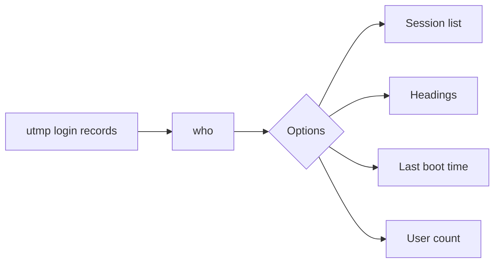

# who

## What is it?
`who` shows who is currently logged in to the system, with their terminal, login time and where they connected from.

## Syntax
```bash
who [OPTIONS]
who am i
```

## Visual Overview
> `who` reads the login records in `/var/run/utmp` and prints one line per session.



## Options/Flags
| Flag | Description |
|------|-------------|
| `-H` | Print a heading line |
| `-b` | Show the time of the last system boot |
| `-q` | Quick: list user names and a count |
| `-u` | Show idle time for each session |
| `-a` | Show all information |
| `am i` | Show only the current terminal session |

## Usage Examples

Let's say these sessions are active on the server:

**Input file** (login sessions, as seen by the system):
```text
devops logged in on pts/0 at 2026-10-06 09:12 from 192.168.1.10
admin  logged in on pts/1 at 2026-10-06 09:45 from 10.0.0.5
```
We are the user `devops` on `pts/0`.

### Example 1: List logged in users
**Command:**
```bash
who
```
**Sample Output:**
```text
devops   pts/0        2026-10-06 09:12 (192.168.1.10)
admin    pts/1        2026-10-06 09:45 (10.0.0.5)
```

### Example 2: With headings (`-H`)
**Command:**
```bash
who -H
```
**Sample Output:**
```text
NAME     LINE         TIME             COMMENT
devops   pts/0        2026-10-06 09:12 (192.168.1.10)
admin    pts/1        2026-10-06 09:45 (10.0.0.5)
```

### Example 3: Last boot time (`-b`)
**Command:**
```bash
who -b
```
**Sample Output:**
```text
         system boot  2026-10-01 07:30
```

### Example 4: Quick count (`-q`)
**Command:**
```bash
who -q
```
**Sample Output:**
```text
devops admin
# users=2
```

### Example 5: Idle time (`-u`)
**Command:**
```bash
who -u
```
**Sample Output:**
```text
devops   pts/0        2026-10-06 09:12   .          2210 (192.168.1.10)
admin    pts/1        2026-10-06 09:45 00:25        2340 (10.0.0.5)
```
(`.` means active in the last minute, `00:25` means idle for 25 minutes; the number is the process ID.)

### Example 6: All information (`-a`)
**Command:**
```bash
who -a
```
**Sample Output:**
```text
           system boot  2026-10-01 07:30
           run-level 5  2026-10-01 07:30
LOGIN      tty1         2026-10-01 07:31               812 id=tty1
devops   + pts/0        2026-10-06 09:12   .          2210 (192.168.1.10)
admin    + pts/1        2026-10-06 09:45 00:25        2340 (10.0.0.5)
```

### Example 7: Only my session (`am i`)
**Command:**
```bash
who am i
```
**Sample Output:**
```text
devops   pts/0        2026-10-06 09:12 (192.168.1.10)
```

## Pitfalls / Gotchas
- `who` only shows interactive logins that are recorded in utmp. Containers and some cron or systemd sessions do not appear.
- `who am i` prints nothing when there is no terminal, for example in a cron job.
- `w` is similar but also shows what each user is running.

## Related Commands
- [`whoami`](whoami.md) - current effective user
- `w` - who is logged in and what they are doing
- `last` - history of past logins
- `id` - user and group IDs
